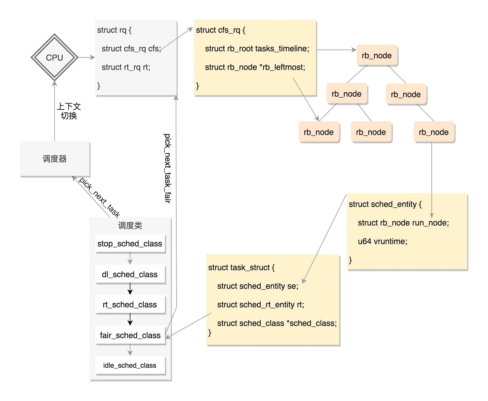

# 进程调度数据结构

这里介绍进程调度相关的数据结构的一些细节。

## 调度策略

Linux 中，通过 `task_struct` 结构体中通过 `policy` 成员变量来描述调度策略，定义如下：

```c
unsigned int policy;
```

上述策略值包括：

```c
#define SCHED_NORMAL    0
#define SCHED_FIFO    1
#define SCHED_RR    2
#define SCHED_BATCH    3
#define SCHED_IDLE    5
#define SCHED_DEADLINE    6
```

### 实时和普通调度策略

在 Linux 里面，进程大概可以分成两种：

- 实时进程：需要尽快执行返回结果的进程，这种进程优先级会比较高；
- 普通进程：大部分的进程其实都是普通进程，优先级就没实时进程这么高。

参考进程的分类，上述调度策略可分为两类：

- 实时调度策略：
  - `SCHED_FIFO` 优先级相同的进程遵循着先来先服务的原则，但高优先级的进程可以抢占低优先级的进程；
  - `SCHED_RR` 优先级相同的进程轮流调度，但高优先级的进程可以抢占低优先级的进程；
  - `SCHED_DEADLINE` 是按照任务的 deadline 进行调度的，当产生一个调度点的时候，`DL` 调度器总是选择其 deadline 距离当前时间点最近的那个任务，并调度它执行。

- 普通调度策略：
  - `SCHED_NORMAL` 表示普通的进程；
  - `SCHED_BATCH` 表示后台进程；
  - `SCHED_IDLE` 表示空闲时候才跑的进程。

### 调度优先级

配合调度策略的，还有我们刚才说的优先级，也在 `task_struct` 中，定义如下：

```c
int prio, static_prio, normal_prio;
unsigned int rt_priority;
```

优先级其实就是一个数值，对于实时进程，优先级的范围是 0～99，对于普通进程，优先级的范围是 100～139，数值越小，优先级越高。

## 调度类

调度类定义了不同调度策略的执行逻辑，封装在这 `task_struct` 中的 `sched_class` 下：

```c
const struct sched_class *sched_class;
```

调度类的定义如下：

```c
struct sched_class {
  const struct sched_class *next;


  void (*enqueue_task) (struct rq *rq, struct task_struct *p, int flags);
  void (*dequeue_task) (struct rq *rq, struct task_struct *p, int flags);
  void (*yield_task) (struct rq *rq);
  bool (*yield_to_task) (struct rq *rq, struct task_struct *p, bool preempt);


  void (*check_preempt_curr) (struct rq *rq, struct task_struct *p, int flags);


  struct task_struct * (*pick_next_task) (struct rq *rq,
            struct task_struct *prev,
            struct rq_flags *rf);
  void (*put_prev_task) (struct rq *rq, struct task_struct *p);


  void (*set_curr_task) (struct rq *rq);
  void (*task_tick) (struct rq *rq, struct task_struct *p, int queued);
  void (*task_fork) (struct task_struct *p);
  void (*task_dead) (struct task_struct *p);


  void (*switched_from) (struct rq *this_rq, struct task_struct *task);
  void (*switched_to) (struct rq *this_rq, struct task_struct *task);
  void (*prio_changed) (struct rq *this_rq, struct task_struct *task, int oldprio);
  unsigned int (*get_rr_interval) (struct rq *rq,
           struct task_struct *task);
  void (*update_curr) (struct rq *rq)
```

这个结构定义了很多种方法，用于在队列上操作任务，这里请大家注意第一个成员变量，是一个指针，指向下一个调度类。

`sched_class` 有几种实现：

- `stop_sched_class` 优先级最高的任务会使用这种策略，会中断所有其他线程，且不会被其他任务打断；
- `dl_sched_class` 对应 `SCHED_DEADLINE` 的调度策略；
- `rt_sched_class` 对应 `SCHED_FIFO` 或 `SCHED_RR` 的调度策略，具体由进程的 `task_struct->policy` 指定；
- `fair_sched_class` 对应 `SCHED_NORMAL` 的调度策略；
- `idle_sched_class` 对应 `SCHED_IDLE` 调度策略。

每个调度实现类里有执行下一个调度实现类的指针，这样就形成了一个**调度类责任链**。

## 调度实体

这里通过 CFS(Completely Fair Scheduling) 完全公平调度算法来介绍调度实体的实现。

在介绍调度实体时先介绍一个重要的概念，这个概念对于理解任务调度流程很重要，这个概念就是 **`vruntime`**。

CFS 会为每个进程一个安排一个虚拟运行时间 `vruntime`，随着进程的运行，`vruntime` 会不断增大，没有得到执行进程的 `vruntime` 不变。每次调度时选择 `vruntime` 小的进行调度。

> 注：`vruntime` 并不是指进程执行的物理时间，而是根据进程的优先级的到权重在和物理时间一起计算得到的结果，计算公式如下：
>
> ```
> 虚拟运行时间 vruntime += 实际运行时间 delta_exec * NICE_0_LOAD/ 权重
> ```

看来 CFS 需要一个数据结构来对 `vruntime` 进行排序，快速找出最小的那个，并且在 `vruntime` 变化时，能够迅速调整排列顺序。**能够平衡查询和更新速度的是树**，CFS 选择使用的是**红黑树**。


红黑树节点包括 `vruntime` 和一些其他信息，这里将这些节点称为**调度实体**。在 `task_struct` 中调度实体相关定义如下：

```c
struct sched_entity se;
struct sched_rt_entity rt;
struct sched_dl_entity dl;
```

不同的调度策略定义了不同的调度实体，对于普通进程的调度实体 `sched_entity` 定义如下，这里面包含了 `vruntime` 和权重 `load_weight`，以及对于运行时间的统计：

```c
struct sched_entity {
  struct load_weight    load;
  struct rb_node      run_node;
  struct list_head    group_node;
  unsigned int      on_rq;
  u64        exec_start;
  u64        sum_exec_runtime;
  u64        vruntime;
  u64        prev_sum_exec_runtime;
  u64        nr_migrations;
  struct sched_statistics    statistics;
......
};
```

## 调度队列

存放调度实体的容器就是调度队列，CFS 的调度队列就是上述描述的红黑树。

调度队列存放在 CPU 的 `rq` 结构体中，该结构体用来描述在此 CPU 上运行的所有进程，其包括一个实时进程队列 `rt_rq` 和一个 CFS 运行队列 `cfs_rq`，`rq` 定义如下：

```c
struct rq {
  /* runqueue lock: */
  raw_spinlock_t lock;
  unsigned int nr_running;
  unsigned long cpu_load[CPU_LOAD_IDX_MAX];
......
  struct load_weight load;
  unsigned long nr_load_updates;
  u64 nr_switches;


  struct cfs_rq cfs;
  struct rt_rq rt;
  struct dl_rq dl;
......
  struct task_struct *curr, *idle, *stop;
......
};
```

对于普通进程公平队列 `cfs_rq`，定义如下：

```c
/* CFS-related fields in a runqueue */
struct cfs_rq {
  struct load_weight load;
  unsigned int nr_running, h_nr_running;

  u64 exec_clock;
  u64 min_vruntime;
#ifndef CONFIG_64BIT
  u64 min_vruntime_copy;
#endif
  struct rb_root tasks_timeline;
  struct rb_node *rb_leftmost;

  struct sched_entity *curr, *next, *last, *skip;
......
};
```

这里面 `rb_root` 指向的就是红黑树的根节点，这个红黑树在 CPU 看起来就是一个队列，不断地取下一个应该运行的进程，`rb_leftmost` 指向的是最左面的节点。

## 获取下个任务

这里介绍下怎么通过 **CFS 调用类**获取到下个执行任务。

首先我们需要知道调度类封装了调度策略，根据调度策略不同，有不同的实现。并且这些调度实现类事先就按照调度的优先级形成了一个调度类责任链。优先级高的调度类先执行，没有获取到下个任务时才继续执行链中的下个调度类。

获取下个任务的入口代码如下所示：

```c
static inline struct task_struct *
pick_next_task(struct rq *rq, struct task_struct *prev, struct rq_flags *rf)
{
  const struct sched_class *class;
  struct task_struct *p;
  /*
   * Optimization: we know that if all tasks are in the fair class we can call that function directly, but only if the @prev task wasn't of a higher scheduling class, because otherwise those loose the opportunity to pull in more work from other CPUs.
   */
  if (likely((prev->sched_class == &idle_sched_class ||
        prev->sched_class == &fair_sched_class) &&
       rq->nr_running == rq->cfs.h_nr_running)) {
    p = fair_sched_class.pick_next_task(rq, prev, rf);
    if (unlikely(p == RETRY_TASK))
      goto again;
    /* Assumes fair_sched_class->next == idle_sched_class */
    if (unlikely(!p))
      p = idle_sched_class.pick_next_task(rq, prev, rf);
    return p;
  }
again:
  for_each_class(class) {
    p = class->pick_next_task(rq, prev, rf);
    if (p) {
      if (unlikely(p == RETRY_TASK))
        goto again;
      return p;
    }
  }
}
```

在 again 这里就是依次调用调度责任链中的调度类，但是这里有了一个优化，因为大部分进程是普通进程，所以大部分情况下会调用上面的逻辑。

接着就开始执行调度类里选择任务的函数了，不同的调度类有不同的实现，比如 `fair_sched_class` 的实现是 `pick_next_task_fair`，`rt_sched_class` 的实现是 `pick_next_task_rt`，这里以 `fair_sched_class.pick_next_task_fair` 为例，代码如下所示：

```c
static struct task_struct *
pick_next_task_fair(struct rq *rq, struct task_struct *prev, struct rq_flags *rf)
{
  struct cfs_rq *cfs_rq = &rq->cfs;
  struct sched_entity *se;
  struct task_struct *p;
  int new_tasks;
```

上述代码先表示从 CPU 的 `rq` 结构中取出任务队列 `cfs_rq`；

获取到任务队列后，会先从任务队列里获取当前线程的调度实体（`sched_entity`），主要了在当前任务被切换之前更新当前任务的 `vruntime`，代码如下所示：

```c
struct sched_entity *curr = cfs_rq->curr;
if (curr) {
    if (curr->on_rq)
        update_curr(cfs_rq);
    else
        curr = NULL;
    ......
}
se = pick_next_entity(cfs_rq, curr);
```

然后取出继任任务的调度实体，就是上述代码中的 `pick_next_entity`，该方法会从红黑树里面取出最左边的一个节点（`vruntime` 最小）。

取出下个任务调度实体后，通过 task_of 方法获取到任务实体对应的 `task_struct` ，代码如下所示：

```c
p = task_of(se);

if (prev != p) {
    struct sched_entity *pse = &prev->se;
    ......
    put_prev_entity(cfs_rq, pse);
    set_next_entity(cfs_rq, se);
}

return p
```

获取到 `task_struct` 后会和前任任务进行比较，如果不一样，就需要切换执行任务了。这时候会通过 `put_prev_entity` 将前任任务放回任务队列中，通过 `set_next_entity` 将继任者设为当前任务。

当选出的继任者后判断和当前线程是否相同，不相同就要进行**上下文切换**，继任者进程正式进入运行。

## 总结

本文进一步介绍了任务调度相关的数据结构，包括：

- 调度策略：调度策略在 `task_struct` 中就是一个枚举数值，用来区分不同类型线程的调度方式（实时线程或普通线程）；
- 调度类：调度类就是不同调度策略的实现逻辑，根据调度策略的不同，有不同的实现，调度类中维护了一个执行下个调度类的指针，这样不同的调度实现类就串联成了一个**调度类责任链**，调度类里多是操作任务队列的方法，最重要的就是从任务队列里获取下个执行任务；
- 调度实体：调度实体用来描述调度任务，不用的调度策略有不同的调度实体，CFS 调度算法对应的调度实体为 `sched_entity`，其内部有 `vruntime` 属性，来决定任务之间的调度顺序；
- 调度队列：调度队列就是存放调度实体的容器，一般要满足能够快速获取下个调度实体，并且在调度实体变化时能够快速更新队列里的实体的排列顺序，调度队列维护在 CPU `rq` 结构中，包括一个实时进程队列 `rt_rq` 和一个 CFS 运行队列 `cfs_rq`，`cfs_rq` 使用红黑树结构实现的。

本文还从代码角度介绍了调度类通过任务队列获取下个任务的流程，这里简单总结下相关步骤：

- 入口方法为 `pick_next_task` ，里面封装了调用调度类责任链的逻辑，并做了相关优化；
- 调用某个调度实现类的 `pick_next_task` 方法；
- 从任务队列里获取到下个任务的调度实体；
- 从任务队列获取当前任务调度实体，更新其 `vruntime`；
- 根据任务实体获取到对应的 `task_struct`，并和当前进程比较，如果不相同代表需要切换任务；
- 将当前任务实体放回到任务队列中，将继任者设为当前任务；
- 进程上下文切换，后继进程正式开始执行。

上述流程如下图所示：



> 图片来自：[调度（上）：如何制定项目管理流程？ (geekbang.org)](https://time.geekbang.org/column/article/93251)

本文是极客时间专栏《趣谈 Linux 操作系统》的学习笔记，原文链接：[调度（上）：如何制定项目管理流程？ (geekbang.org)](https://time.geekbang.org/column/article/93251)