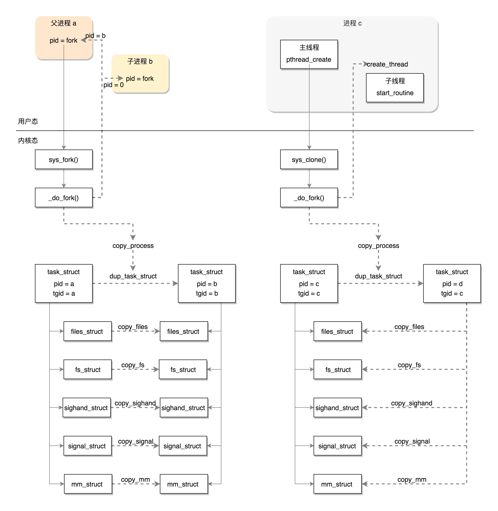

# 线程创建过程

我们知道，在用户态，不管是进程还是线程，在内核里都是任务，都用 `task_struct` 结构来表示。那么为什么进程和线程的编码方式差这么多呢？或者在内核了怎么来区分进程和线程呢？

其实，线程不是一个完全由内核实现的机制，它是由内核态和用户态合作完成的，在用户态创建线程栈，在内核态创建任务，然后再返回到用户态执行。

## 用户态创建进程

创建一个线程调用的是 `pthread_create`，它是 `Glibc` 库中的一个函数。代码如下所示：

```c
int __pthread_create_2_1 (pthread_t *newthread, const pthread_attr_t *attr, void *(*start_routine) (void *), void *arg)
{
......
}
versioned_symbol (libpthread, __pthread_create_2_1, pthread_create, GLIBC_2_1);
```

这个函数通过下面几个步骤来创建线程。

### 处理线程属性参数

这里会处理线程属性，根据用户传入的线程属性参数设置线程属性，没有传入就设置默认值。

```c
const struct pthread_attr *iattr = (struct pthread_attr *) attr;
struct pthread_attr default_attr;
if (iattr == NULL)
{
  ......
  iattr = &default_attr;
}
```

### 创建用户态线程结构

在内核态里，每个进程或线程都有一个 `task_struct` 结构，在用户态也有一个用于维护线程的结构，就是这个 `pthread` 结构。

```c
struct pthread *pd = NULL;
```

### 创建线程栈

```c
int err = ALLOCATE_STACK (iattr, &pd);
```

`ALLOCATE_STACK` 是一个宏函数，它主要做了以下这些事情：

- 如果你在线程属性里面设置过栈的大小，需要你把设置的值拿出来；
- 为了防止栈的访问越界，在栈的末尾会有一块空间 `guardsize`，一旦访问到这里就错误了；
- 线程栈的空间是在进程的堆里面分配的，如果一个进程不断地创建和删除线程，我们不可能不断地去申请和清除线程栈使用的内存块，这样就需要有一个缓存，`get_cached_stack` 就是根据计算出来的 size 大小，看一看已经有的缓存中，有没有已经能够满足条件的；
- 如果缓存里面没有，就需要调用 `__mmap` 创建一块新的；

- 线程栈也是自顶向下生长的，在最栈地位置（也就是地址最高位置）存放 `pthread` 结构；
- 计算出 `guard` 内存的位置，调用 `setup_stack_prot` 设置这块内存的是受保护的；

- 接下来，开始填充 `pthread` 这个结构里面的成员变量 `stackblock`、`stackblock_size`、`guardsize`、`specific`，这里的 `specific` 是用于存放 Thread Specific Data 的，也即属于线程的全局变量；
- 将这个线程栈放到 `stack_used` 链表中，其实管理线程栈总共有两个链表，一个是 `stack_used`，也就是这个栈正被使用；另一个是 `stack_cache`，就是上面说的，一旦线程结束，先缓存起来，不释放，等有其他的线程创建的时候，给其他的线程用。

## 内核态创建任务

在用户态创建好线程栈后，接下来就要解决用户态程序从哪里开始执行的问题。`pthread_create` 接下来的代码如下所示：

```c
pd->start_routine = start_routine;
pd->arg = arg;
pd->schedpolicy = self->schedpolicy;
pd->schedparam = self->schedparam;
/* Pass the descriptor to the caller.  */
*newthread = (pthread_t) pd;
atomic_increment (&__nptl_nthreads);
retval = create_thread (pd, iattr, &stopped_start, STACK_VARIABLES_ARGS, &thread_ran);
```

`start_routine` 就是我们给线程的执行的函数。并将 `start_routine` 函数、函数参数、和调度策略都赋值给 `pthread`。

接下来 `__nptl_nthreads` 加一，说明又多了一个线程。

真正创建线程的是接下来的 `create_thread` 函数，这个函数定义如下：

```c
static int
create_thread (struct pthread *pd, const struct pthread_attr *attr,
bool *stopped_start, STACK_VARIABLES_PARMS, bool *thread_ran)
{
  const int clone_flags = (CLONE_VM | CLONE_FS | CLONE_FILES | CLONE_SYSVSEM | CLONE_SIGHAND | CLONE_THREAD | CLONE_SETTLS | CLONE_PARENT_SETTID | CLONE_CHILD_CLEARTID | 0);
  ARCH_CLONE (&start_thread, STACK_VARIABLES_ARGS, clone_flags, pd, &pd->tid, tp, &pd->tid)；
  /* It's started now, so if we fail below, we'll have to cancel it
and let it clean itself up.  */
  *thread_ran = true;
}
```

上述函数定义了一个 `clone_flags` ，然后让其作为参数调用了 `ARCH_CLONE`，在这里进行系统调用。

如果在进程的主线程里面调用其他系统调用，当前用户态的栈是指向整个进程的栈，栈顶指针也是指向进程的栈，指令指针也是指向进程的主线程的代码。此时此刻执行到这里，调用 clone 的时候，用户态的栈、栈顶指针、指令指针和其他系统调用一样，都是指向主线程的。

但是对于线程来说，这些都要变。因为我们希望当 clone 这个系统调用成功的时候，除了内核里面有这个线程对应的 `task_struct`，当系统调用返回到用户态的时候，用户态的栈应该是线程的栈，栈顶指针应该指向线程的栈，指令指针应该指向线程将要执行的那个函数。

所以这些都需要我们自己做，将线程要执行的函数的参数和指令的位置都压到栈里面，当从内核返回，从栈里弹出来的时候，就从这个函数开始，带着这些参数执行下去。

接下来我们就要进入内核去创建线程对应的 `task_struct` 结构了，内核里面对于 clone 系统调用的定义是这样的：

```c
SYSCALL_DEFINE5(clone, unsigned long, clone_flags, unsigned long, newsp,
     int __user *, parent_tidptr,
     int __user *, child_tidptr,
     unsigned long, tls)
{
  return _do_fork(clone_flags, newsp, 0, parent_tidptr, child_tidptr, tls);
}
```

这里最终去调用 `_do_fork`，在创建进程时也是通过调用该方法去创建进程结构的，但在某些结构的创建、亲缘关系处理、信号处理上又和创建进程有所不同。

### 结构创建

- 对于 `copy_files`，原来是调用 `dup_fd` 复制一个 `files_struct` 的，`现在因为` CLONE_FILES 标识位变成将原来的 `files_struct` 引用计数加一；
- 对于 `copy_fs`，原来是调用 `copy_fs_struct` 复制一个 `fs_struct`，现在因为 `CLONE_FS` 标识位变成将原来的 `fs_struct` 的用户数加一；
- 对于 `copy_sighand`，原来是创建一个新的 `sighand_struct`，现在因为 `CLONE_SIGHAND` 标识位变成将原来的 `sighand_struct` 引用计数加一；
- 对于 `copy_signal`，原来是创建一个新的 `signal_struct`，现在因为 `CLONE_THREAD` 直接返回了；
- 对于 `copy_mm`，原来是调用 `dup_mm` 复制一个 `mm_struct`，现在因为 `CLONE_VM` 标识位而直接指向了原来的 `mm_struct`。

从这里可以看出，在创建进程时需要重新创建的结构，在创建线程时仅仅时修改引用计数或者直接返回，也就是说线程复用了进程的这些结构。

### 处理亲缘关系

对于亲缘关系，我们要识别出多个线程是不是属于同一个进程。

使用了 `CLONE_THREAD` 标识位之后，使得亲缘关系有了一定的变化：

- 如果是新进程，那这个进程的 `group_leader` 就是它自己，`tgid` 是它自己的 `pid`，如果是新线程，`group_leader` 是当前进程的 `group_leader`，`tgid` 是当前进程的 `tgid`，也就是当前进程的 `pid`，这个时候还是拜原来进程为老大；
- 如果是新进程，新进程的 `real_parent` 是当前的进程，如果是新线程，线程的 `real_parent` 是当前的进程的 `real_parent`，其实是平辈的。

### 处理信号

对于信号的处理，则需要控制信号的影响范围。例如，`kill` 一个进程，则所有线程都要被干掉，如果一个信号是发给一个线程的 `pthread_kill`，则应该只有线程能够收到。

在 `copy_process` 的主流程里面，无论是创建进程还是线程，都会初始化 `struct sigpending pending`，也就是每个 `task_struct`，都会有这样一个成员变量。这就是一个信号列表。如果这个 `task_struct` 是一个线程，这里面的信号就是发给这个线程的；如果这个 `task_struct` 是一个进程，这里面的信号是发给主线程的。

另外，上面 `copy_signal` 的时候，我们可以看到，在创建进程的过程中，会初始化 `signal_struct` 里面的 `struct sigpending shared_pending`。但是，在创建线程的过程中，连 `signal_struct` 都共享了。也就是说，整个进程里的所有线程共享一个 `shared_pending`，这也是一个信号列表，是发给整个进程的，哪个线程处理都一样。

## 用户态执行线程

在系统调用 `clone` 执行完毕后，线程的 `task_struct` 就被创建完毕，这时候要返回系统调用，回到用户态。

回到用户态也不是直接运行我们指定的那个函数（`start_routine`），而是一个通用的 `start_thread`，这是所有线程在用户态的统一入口。

```c
#define START_THREAD_DEFN \
  static int __attribute__ ((noreturn)) start_thread (void *arg)

START_THREAD_DEFN
{
    struct pthread *pd = START_THREAD_SELF;
    /* Run the code the user provided.  */
    THREAD_SETMEM (pd, result, pd->start_routine (pd->arg));
    /* Call destructors for the thread_local TLS variables.  */
    /* Run the destructor for the thread-local data.  */
    __nptl_deallocate_tsd ();
    if (__glibc_unlikely (atomic_decrement_and_test (&__nptl_nthreads)))
        /* This was the last thread.  */
        exit (0);
    __free_tcb (pd);
    __exit_thread ();
}
```

在 `start_thread` 入口函数中，才真正的调用用户提供的函数（`start_routine`），在用户的函数执行完毕之后，会释放这个线程相关的数据。

## 总结

本文介绍了线程的创建过程，线程不是一个完全由内核实现的机制，它是由内核态和用户态合作完成的，在用户态创建线程栈，在内核态创建任务，然后再返回到用户态执行。

进程和线程在内核里都是一个任务，用 `task_struct` 结构来表示，虽然是结构是相同的，但进程和线程 `task_struct` 在内核里创建的方式是不同的。

创建进程的话，调用的系统调用 `fork` 后，在 `copy_process` 函数里面，会将五大结构 `files_struct`、`fs_struct`、`sighand_struct`、`signal_struct`、`mm_struct` 都复制一遍，从此父进程和子进程各用各的数据结构，而创建线程的话，调用的是系统调用 `clone`，在 `copy_process` 函数里面， 五大结构仅仅是引用计数加一，也即线程共享进程的数据结构，进程和线程创建流程如下图所示：



本文是极客时间专栏《趣谈 Linux 操作系统》的学习笔记，原文链接：[线程的创建：如何执行一个新子项目？ (geekbang.org)](https://time.geekbang.org/column/article/94479)