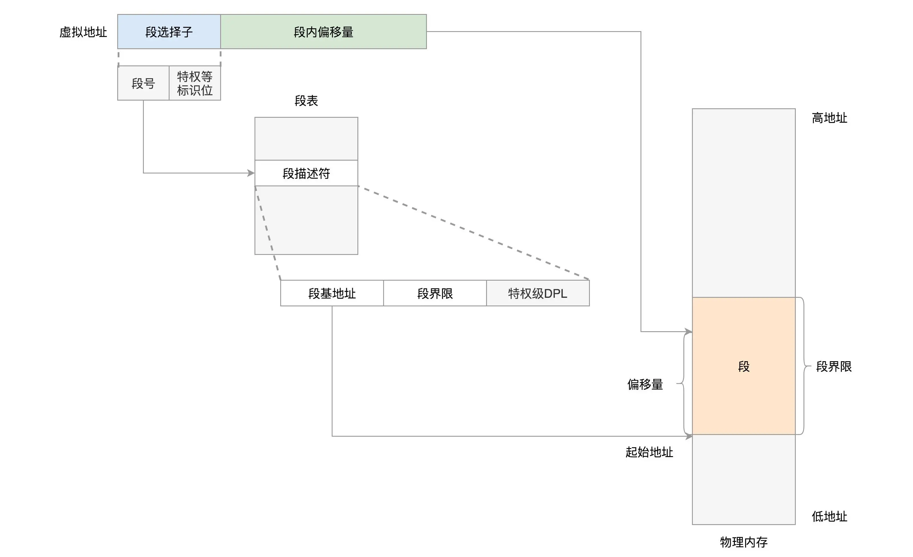
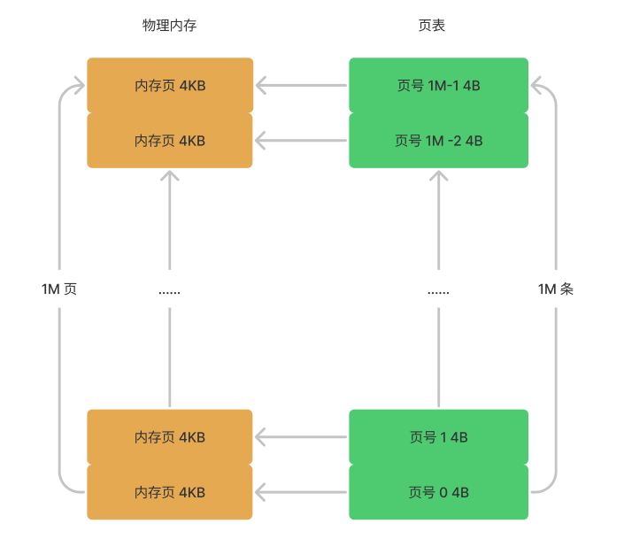
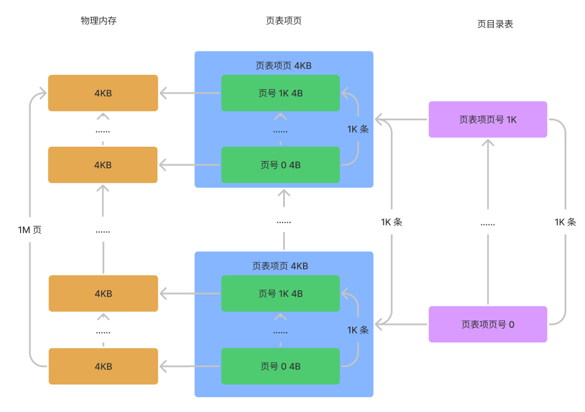

# 内存管理

每个进程都有自己的内存空间，彼此之间相互独立运行，数据相互隔离，这是操作系统提供的软件治理的能力。这里介绍下内存管理相关概念。

## 物理地址和虚拟地址

内存是一块有容量的连续的空间，其每个空间用从 0 开始的序号表示，这个序号就是内存的**物理地址**，需要注意的是内存的最小寻址单位为一个字节，即 8 位。

但每个程序的物理地址对于进程不可见，进程不能直接访问这个物理地址。为此操作系统会给进程分配一个**虚拟地址**，所有进程看到的这个地址都是一样的，里面的内存都是从 0 开始编号。

在程序里面，指令写入的地址是虚拟地址，实际这些指令或数据也是要存放在内存上的，自然也有一个物理地址。操作系统会提供一种机制，将不同进程的虚拟地址和不同内存的物理地址映射起来。当程序要访问虚拟地址的时候，由内核的数据结构进行转换，转换成不同的物理地址，这样不同的进程运行的时候，写入的是不同的物理地址，这样就不会冲突了。

这样一来每个进程从自己的视角去看，仿佛是自己独占了整个内存。

## 虚拟内存布局

首先，这么大的虚拟空间一切二，一部分用来放内核的东西，称为**内核空间**，一部分用来放进程的东西，称为**用户空间**。用户空间在地地址下，内核空间在高地址下，它们之间有一个分界线。对于 32 位系统，最大能够寻址 `2^32=4G`，其中用户态虚拟地址空间是 3G，内核态是 1G；对于 64 位系统，虚拟地址只使用了 48 位，用户态虚拟地址空间是 128T，内核态是 128T。

### 用户态布局

用户空间的虚拟内存，从低位到高位依次为：

- Text Segment：代码段，用来存放二进制可执行代码的位置；
- Data Segment：数据段，用来存放静态常量；
- BSS Segment：BSS 段，用来存放未初始化的静态变量
- Heap：堆段，用于存放进程运行中被**动态分配**的内存段，它的大小并不固定，可动态扩张或缩减；
- Memory Mapping Segment：内存映射段，这块地址可以用来把文件映射进内存用的，如果二进制的执行文件依赖于某个动态链接库，就是在这个区域里面将 so 文件映射到了内存中；
- Stack：栈段，函数调用的函数栈就是在这里。

每个进程有自己的用户空间，其只能看到自己用户空间的内容，不同的用户空间存放的内容也是不同的。

### 内核态布局

普通进程在用户空间下工作，且其是不能直接访问内核空间的，如果需要进行更高权限的工作，就需要调用系统调用，进入内核。

进程一旦进入了内核，就换了一种视角，无论是从哪个进程进来的，看到的都是同一个内核空间，看到的都是同一个进程列表。虽然内核栈是各用各的，但是如果想知道的话，还是能够知道每个进程的内核栈在哪里的。所以，如果要访问一些公共的数据结构，需要进行锁保护。

内核的代码访问内核的数据结构，大部分的情况下都是使用虚拟地址的，虽然内核代码权限很大，但是能够使用的虚拟地址范围也只能在内核空间，也即内核代码访问内核数据结构。在内核里面也会有内核的代码，同样有 Text Segment、Data Segment 和 BSS Segment 这些结构。

## 内存划分和虚拟地址

内存的划分方式有两种，基于分段和基于分页。

### 基于分段机制划分

- 首先将虚拟地址分成不同的段；
- 然后虚拟地址由**段选择子**和**段内偏移量**组成，段选择子存放在 CPU 的段寄存器中，段偏移量存放在 CPU 的指令指针寄存器中；
- 段选择子中最重要的是段号，通过段号可以在**段描述符表**中找到**段描述符**，段描述符里存放了该段的**基地址**（物理首地址）、**段的界限**和**权限**等信息；
- 如果段内偏移量是合法的，就将段基地址加上段内偏移量得到物理内存地址。

基于段的虚拟地址如下图所示：



> 图片来自：[内存管理（下）：为客户保密，项目组独享会议室封闭开发 (geekbang.org)](https://time.geekbang.org/column/article/95209)

### 基于内存分页划分

其实 Linux 倾向于另外一种从虚拟地址到物理地址的转换方式，称为**分页**（Paging）。

对于物理内存，操作系统把它分成一块一块大小相同的页（4KB），这样更方便管理。分页还有个好处就是有的内存页面长时间不用了，可以暂时写到硬盘上，称为换出，一旦需要的时候，再加载进来，叫做换入。这样可以扩大可用物理内存的大小，提高物理内存的利用率。

有了分页机制后，虚拟内存的地址就可以由**页号**和**页内偏移量（12 bit）**组成，页号指向页表项，页表项里存放该页起始的物理地址，这样通过起始地址和页内偏移量就可以拿到物理地址。

> 页内偏移量只需要 12 位即可，因为一个页的大小为 4 KB。

基于分页的虚拟内存地址如下图所示：



如果是 32 位操作系统，内存页的单位是一般为 4KB，32 位系统可寻址范围位 4GB，每 4KB 为一页，这样一共就有 1M 页。

页表项里存放的是页的起始物理地址，需要 32 位，即 4 个字节，这样页表就需要 `1M*4B=4MB` 的空间来存放表项，如果每个进程都有自己的页表，100 个进程就需要 400MB 的内存。对于内核来讲，有点大了 。


Linux 采用的做法是将页表项再分页，每 1K 个页表项存放到一页中（一个页表项 4 个字节，一个内存页刚好存下 1K 个页表项），这样就有 1K 个页表项页。然后对这 1K 个页表项页建一个**页目录表**进行管理。

这样虚拟地址就就有**页目录页号（10 bit）**、**页号（10 bit）**、和**页内偏移量（12 bit）**组成。通过页目录页号找到页表项页，再通过页号找到页表项页里的页表项，这样通过页表项里的页起始物理地址和页内偏移量就可以拿到物理地址。

所以对于 32 位操作系统，基于分页的虚拟内存地址如下图所示：



上图将页表分成两级，当需要定位一个物理地址时，首先页目录表全部都需要分配，大小为 `10bit*1K=1.25KB`，此外还需要分配一个页表项页，大小为 4KB，这样一共需要分配 5.25KB 的空间。如不将页表分级，则每次都需要分配完整的页表，即需要 4MB 的空间，相比之下分级之后需要的空间更小。


当然对于 64 位的系统，两级肯定不够了，就变成了四级目录，分别是：

- 全局页目录项 PGD（Page Global Directory）；
- 上层页目录项 PUD（Page Upper Directory）；
- 中间页目录项 PMD（Page Middle Directory）；
- 页表项 PTE（Page Table Entry）；

最后再通过每级的页号和页内偏移量就可以找到物理地址。

## 查看内存空间的布局

我们可以借助一些命令来查看某个进程内存空间的布局，如：

```bash
cat /proc/pid/maps

# 查看 mysql 使用的内存
pidof mysqld
pmap -x pid
```

## 总结

内存管理系统主要需要做到三件事情：

- 虚拟内存空间的管理，将虚拟内存分成大小相等的页；
- 物理内存的管理，将物理内存分成大小相等的页；
- 内存映射，将虚拟内存页和物理内存页映射起来，并且在内存紧张的时候可以换出到硬盘中。

本文是极客时间专栏《趣谈 Linux 操作系统》的学习笔记，原文链接：

- [内存管理（上）：为客户保密，规划进程内存空间布局 (geekbang.org)](https://time.geekbang.org/column/article/94926)
- [内存管理（下）：为客户保密，项目组独享会议室封闭开发 (geekbang.org)](https://time.geekbang.org/column/article/95209)


