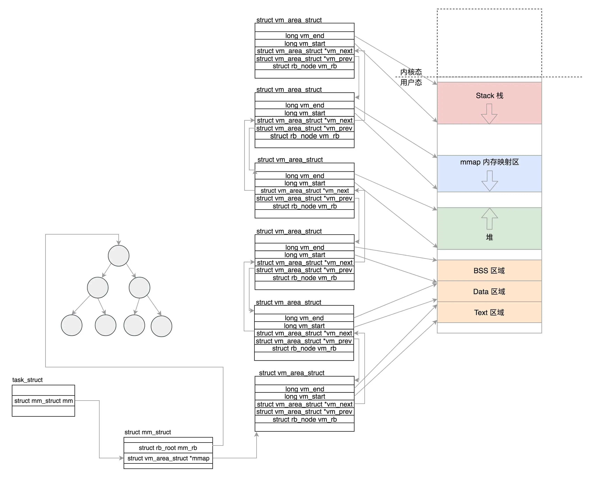
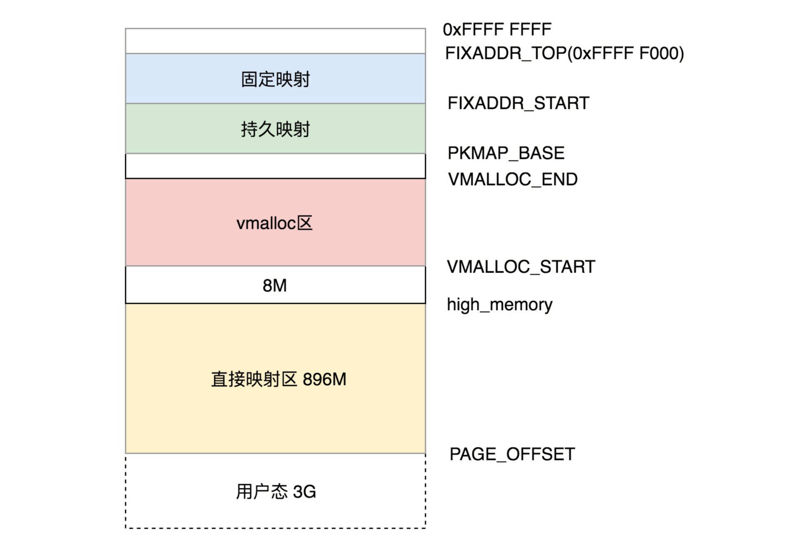

# 虚拟内存管理

进程是基于虚拟地址运行的，虚拟内存的管理即站在在进程的视角上看内存是怎么样的，以及进程该怎么样去是同虚拟内存。

## 用户态和内核态的划分

进程的虚拟地址空间，其实就是站在进程的角度来看内存。在进程的 `task_struct` 结构中，有一个 `struct mm_struct` 结构来管理内存。

虚拟内存分为用户空间和内核空间，是通过 `mm_struct` 里有个 `task_size` 变量来控制的。对于 32 位系统，最大能够寻址 `2^32=4G`，其中用户态虚拟地址空间是 3G，内核态是 1G；对于 64 位系统，虚拟地址只使用了 48 位，用户空间占 128T，内核空间也占 128T。

## 用户态内存布局

用户态将内存划分了多个区域，包括：

- Text Segment：代码段，用来存放二进制可执行代码的位置；
- Data Segment：数据段，用来存放静态常量；
- BSS Segment：BSS 段，用来存放未初始化的静态变量
- Heap：堆段，用于存放进程运行中被**动态分配**的内存段，它的大小并不固定，可动态扩张或缩减；
- Memory Mapping Segment：内存映射段，这块地址可以用来把文件映射进内存用的，如果二进制的执行文件依赖于某个动态链接库，就是在这个区域里面将 so 文件映射到了内存中；
- Stack：栈段，函数调用的函数栈就是在这里。

这些区域的起始和终止位置已经区域的数量都在 `mm_struct` 这个结构中维护，如：

```c
unsigned long mmap_base;  /* base of mmap area */
unsigned long total_vm;    /* Total pages mapped */
unsigned long locked_vm;  /* Pages that have PG_mlocked set */
unsigned long pinned_vm;  /* Refcount permanently increased */
unsigned long data_vm;    /* VM_WRITE & ~VM_SHARED & ~VM_STACK */
unsigned long exec_vm;    /* VM_EXEC & ~VM_WRITE & ~VM_STACK */
unsigned long stack_vm;    /* VM_STACK */
unsigned long start_code, end_code, start_data, end_data;
unsigned long start_brk, brk, start_stack;
unsigned long arg_start, arg_end, env_start, env_end;
```

其中：

- `total_vm` 表示总共映射的页的数目；
- `locked_vm` 表示被锁定不能换出页的数目；
- `pinned_vm` 表示不能换出，也不能移动的页的数目；
- `data_vm` 表示存放数据的页的数目；
- `exec_vm` 表示存放可执行文件的页的数目；
- `stack_vm` 表示栈所占的页的数目；
- `start_code` 和 `end_code` 表示可执行代码的开始和结束位置；
- `start_data` 和 `end_data` 表示已初始化数据的开始位置和结束位置；
- `start_brk` 是堆的起始位置，`brk` 是堆当前的结束位置；
- `start_stack` 是栈的起始位置，栈的结束位置在寄存器的栈顶指针中；
- `arg_start` 和 `arg_end` 是参数列表的位置；
- `env_start` 和 `env_end` 是环境变量的位置；
- `mmap_base` 表示虚拟地址空间中用于内存映射的起始地址。

### vm_area_struct

用户态里抽象了 `vm_area_struct` 结构，其可以指代用户态的某个区域的内存，其包含的属性如下：

```c
struct vm_area_struct {
  /* The first cache line has the info for VMA tree walking. */
  unsigned long vm_start;    /* Our start address within vm_mm. */
  unsigned long vm_end;    /* The first byte after our end address within vm_mm. */
  /* linked list of VM areas per task, sorted by address */
  struct vm_area_struct *vm_next, *vm_prev;
  struct rb_node vm_rb;
  struct mm_struct *vm_mm;  /* The address space we belong to. */
  struct list_head anon_vma_chain; /* Serialized by mmap_sem &
            * page_table_lock */
  struct anon_vma *anon_vma;  /* Serialized by page_table_lock */
  /* Function pointers to deal with this struct. */
  const struct vm_operations_struct *vm_ops;
  struct file * vm_file;    /* File we map to (can be NULL). */
  void * vm_private_data;    /* was vm_pte (shared mem) */
} __randomize_layout;
```

其中：

- `vm_start` 和 `vm_end` 指定了该区域在用户空间中的起始和结束地址；
- `vm_next` 和 `vm_prev` 将这个区域串在链表上；
- `vm_rb` 将这个区域放在红黑树上，使用红黑树方便区域的查找和修改；
- `vm_ops` 里面是对这个内存区域可以做的操作的定义；
- 虚拟内存区域可以映射到物理内存，也可以映射到文件，`anon_vma` 表示映射的物理内存，`vm_file` 表示映射的文件。

每个区域的 `vm_area_struct`  通过链表串联起来，代表了虚拟内存的不同区域，如下图所示：



## 内核态内存布局

内核态的虚拟空间和某一个进程没有关系，所有进程通过系统调用进入到内核之后，看到的虚拟地址空间都是一样的。

32 位内核态虚拟内存布局如下如所示：



如上图所示，内核态虚拟内存可分为：

- 直接映射区（896M）：所谓的直接映射区，就是这一块空间是连续的，和物理内存是非常简单的映射关系，其实就是虚拟内存地址减去 3G，就得到物理内存的位置（按照这个逻辑，直接内存只能访问物理内存 0~896M 区域），直接映射区包含内核的代码段、数据段、BSS 段，新创建进程的 `task_struct` 和内核栈也在这里分配；
- 直接映射区 896M 以上的地址称为**高端地址**，用来作为一些特殊内存映射：
  - `vmalloc` 区：核动态映射空间，动态分配内存，映射放在内核页表中；
  - 持久内存映射：储存物理页信息；
  - 固定内存映射：主要用于满足特殊需求；
  - 临时内核映射，用来映射到物理内存的其他位置，使得内核可以访问。

## 总结

用户态和内核态总的虚拟内存分布如下图所示：


本文是极客时间专栏《趣谈 Linux 操作系统》的学习笔记，原文链接：[进程空间管理：项目组还可以自行布置会议室 (geekbang.org)](https://time.geekbang.org/column/article/95715)