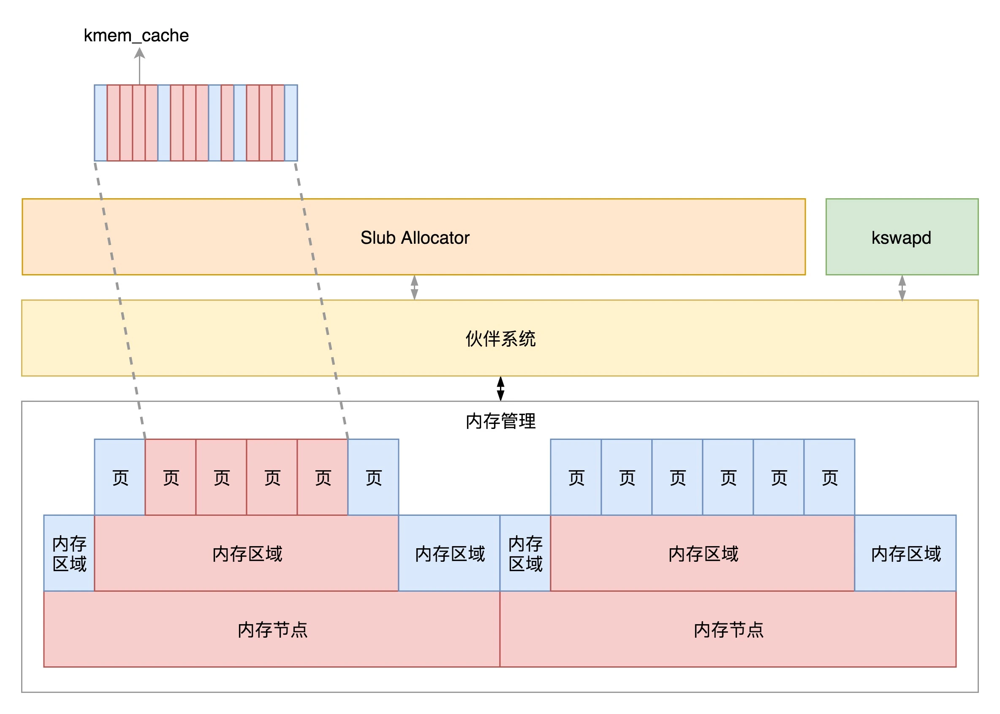

# 物理内存管理

物理内存管理。

## 物理内存的组织方式

CPU 访问物理内存的方式有多种：

- 平坦内存模型（Flat Memory Model）：物理内存从 0 开始编号，内存页也是连续的，因而对于任何一个地址，只要直接除一下每页的大小，很容易直接算出在哪一页；
- 对称多处理器模型（SMP, Symmetric multiprocessing）：所有的 CPU 访问内存都要过总线，而且距离都是一样的，这样总线容易形成瓶颈；
- 非一致内存访问模型（NUMA, Non-uniform memory access）：内存分成多个节点，作为 CPU 的本地内存，CPU 和内存节点一起被称为 NUMA 节点，一个 NUMA 节点中的 CPU 直接访问本地内存，不用通过总线，但是，在本地内存不足的情况下，每个 CPU 都可以去另外的 NUMA 节点申请内存，这个时候访问延时就会比较长；

- 稀疏内存模型：基于支持热插拔的内存技术实现。

## NUMA

NUMA 模型物理内存的组织形式如下所示：

物理内存的组织形为：

- 如果有多个 CPU，那就有多个 NUMA 节点，每个节点用 `struct pglist_data` 表示，放在一个数组里面；

- 每个节点分为多个区域，每个区域用 `struct zone` 表示，也放在一个数组里面，这些区域分别为：

  - ZONE_DMA：可用于作 DMA（Direct Memory Access，直接内存存取）的内存；

    > DMA 是这样一种机制：要把外设的数据读入内存或把内存的数据传送到外设，原来都要通过 CPU 控制完成，但是这会占用 CPU，影响 CPU 处理其他事情，所以有了 DMA 模式。CPU 只需向 DMA 控制器下达指令，让 DMA 控制器来处理数据的传送，数据传送完毕再把信息反馈给 CPU，这样就可以解放 CPU。

  - ZONE_DMA32：对于 64 位系统，有两个 DMA 区域，除了ZONE_DMA，还有 ZONE_DMA32；

  - ZONE_NORMAL：直接映射区；

  - ZONE_HIGHMEM：高端内存区；对于 32 位系统来说超过 896M 的地方；

  - ZONE_MOVABLE：通过将物理内存划分为可移动分配区域和不可移动分配区域来避免内存碎片。

- 每个区域分为多个页，这些页通过 `per_cpu_pageset` 来区分冷热页，一个页被加载到 CPU 高速缓存里面，这就是一个热页（Hot Page），CPU 读起来速度会快很多，如果没有就是冷页（Cold Page）；

- 页是组成物理内存的基本单位，为了方便分配，空闲页放在 `struct free_area` 里面，使用**伙伴系统**进行管理和分配，每一页用 `struct page` 表示。

  > 伙伴系统（Buddy System）
  >
  > Linux 中的内存管理的“页”大小为 4KB。把所有的空闲页分组为 11 个页块链表，每个块链表分别包含了多个不同数量（1、2、4、8、16、32、64、128、256、512 、1024）连续页的页块。
  >
  > 伙伴系统用来每次给内核分配满足需求的最小的内存块（内存块包含 2 的方幂个连续内存页，最多为 1024），主要有拆分和合并两个步骤：
  >
  > - 拆分内存块：当内核请求一块内存时，如果找不到想要的块（满足需求的最小的块），一个大块会被分成两部分，这两部分彼此就成为伙伴，将其中一半被用来分配，而另一半则空闲，这些块在以后分配的过程中会继续被二分直至产生一个所需大小的块。
  >
  > - 合并内存块：当一个块被最终释放时，其伙伴将被检测出来，如果伙伴也空闲则合并两者。

## 页面换出

物理内存管理必须要处理的事情就是，页面换出。

每个进程都有自己的虚拟地址空间，无论是 32 位还是 64 位，虚拟地址空间都非常大，物理内存不可能有这么多的空间放得下。所以，一般情况下，页面只有在被使用的时候，才会放在物理内存中。如果过了一段时间不被使用，即便用户进程并没有释放它，物理内存管理也有责任做一定的干预。例如，将这些物理内存中的页面换出到硬盘上去；将空出的物理内存，交给活跃的进程去使用。

页面换出的时机有两个，最常见的情况是，在分配内存时发现内存页不够用了，试图回收内存页。比如在解析申请一个页面的时候，会调用 `get_page_from_freelist`，接下来的调用链为 `get_page_from_freelist->node_reclaim->__node_reclaim->shrink_node`，通过这个调用链可以看出，是页面换出也是以内存节点为单位的。

还有一种情况就是使用内核线程 `kswapd`，在内存紧张时，主动检查一下内存，看看是否需要换出一些内存页。

内存页总共分两类，一类是**匿名页**，和虚拟地址空间进行关联；一类是内存映射，不但和虚拟地址空间关联，还和文件管理关联。页面换出时，对于匿名页来讲，需要分配 `swap`，将内存页写入文件系统；对于内存映射关联了文件的，我们需要将在内存中对于文件的修改写回到文件中。

## 总结

对于物理内存来讲，从下层到上层的关系及分配模式如下：

- 物理内存分 NUMA 节点，分别进行管理；
- 每个 NUMA 节点分成多个内存区域；
- 每个内存区域分成多个物理页面；
- 伙伴系统将多个连续的页面作为一个大的内存块分配给上层；
- `kswapd` 负责物理页面的换入换出；
- Slub Allocator 将从伙伴系统申请的大内存块切成小块，分配给其他系统。

物理内存管理结构如下图所示：

本文是极客时间专栏《趣谈 Linux 操作系统》的学习笔记，原文链接：

- [物理内存管理（上）：会议室管理员如何分配会议室？ (geekbang.org)](https://time.geekbang.org/column/article/96103)

- [物理内存管理（下）：会议室管理员如何分配会议室？ (geekbang.org)](https://time.geekbang.org/column/article/96623)