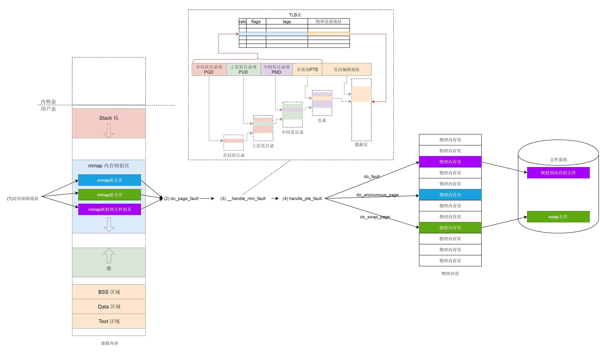

# 内存映射

内存映射。

## 用户态内存映射

首先看下虚拟地址在用户态是什么样的。

用户态抽象了 `vm_area_struct` 结构，用来指代虚拟地址空间的不同的内存块，其定义在 `task_struct` 里 `mm_struct` 中，代码如下：

```c
struct task_struct {
    struct mm_struct                *mm;
	struct mm_struct                *active_mm;
}

struct mm_struct {
  struct vm_area_struct *mmap;    /* list of VMAs */
......
}

struct vm_area_struct {
  /*
   * For areas with an address space and backing store,
   * linkage into the address_space->i_mmap interval tree.
   */
  struct {
    struct rb_node rb;
    unsigned long rb_subtree_last;
  } shared;

  /*
   * A file's MAP_PRIVATE vma can be in both i_mmap tree and anon_vma
   * list, after a COW of one of the file pages.  A MAP_SHARED vma
   * can only be in the i_mmap tree.  An anonymous MAP_PRIVATE, stack
   * or brk vma (with NULL file) can only be in an anon_vma list.
   */
  struct list_head anon_vma_chain; /* Serialized by mmap_sem &
            * page_table_lock */
  struct anon_vma *anon_vma;  /* Serialized by page_table_lock */


  /* Function pointers to deal with this struct. */
  const struct vm_operations_struct *vm_ops;
  /* Information about our backing store: */
  unsigned long vm_pgoff;    /* Offset (within vm_file) in PAGE_SIZE
             units */
  struct file * vm_file;    /* File we map to (can be NULL). */
  void * vm_private_data;    /* was vm_pte (shared mem) */
```

如上述代码所示每个进程都有一个 `vm_area_struct` 链表，指向虚拟地址空间的不同的内存块。

### mmap 原理

如果申请一大块内存，就要用 `mmap`。对于堆的申请来讲，`mmap` 是映射内存空间到物理内存。另外，如果一个进程想映射一个文件到自己的虚拟内存空间，也要通过 `mmap` 系统调用，这个时候 `mmap` 是映射内存空间到物理内存再到文件。可见 `mmap` 系统调用是内存映射的核心。

mmap 系统调用过程如下：

- 首先发起 mmap 系统调用；
- 调用 `vm_mmap_pgoff->do_mmap_pgoff->do_mmap`，在 `do_mmap` 里主要干了两件事情：
  - 调用 `get_unmapped_area` 找到一个没有映射的区域；
    - 如果是匿名映射，调用 `mm_struct` 里面的 `get_unmapped_area` 函数获取没有映射的内存区域；
    - 如果是映射到文件，通过文件的 `struct file` 结构里的 `file_operations` 调用到 `get_unmapped_area` 函数获取没有映射的内存区域；
  - 调用 `mmap_region` 映射这个区域；
    - 通过上一步得到的 `vm_area_struct` 判断, 能否基于现有的块扩展（调用 `vma_merge`）；
    - 若不能，调用 `kmem_cache_alloc` 在 `slub` 中得到一个 `vm_area_struct` 并进行设置起始和结束位置，将它加入队列；
    - 若是文件映射:，则调用 `file_operations` 的 `mmap` 函数将 `vm_area_struct` 的内存操作设置为文件系统对应操作（读写内存就是读写文件系统）；
    - 通过 `vma_link` 将 `vm_area_struct` 插入红黑树，如果若是文件映射，还需要调用 `__vma_link_file` 建立文件到内存的反映射。

这时候内存映射的前置工作就做完了，但是还没有和物理内存建立联系，物理内存要等到使用的时候才回去分配。

### 用户态缺页异常

一旦开始访问虚拟内存的某个地址，如果发现，并没有对应的物理页，那就触发缺页中断，调用 `do_page_fault`。

`do_page_fault` 调用过程如下：

- 在 `__do_page_fault` 里面，先要判断缺页中断是否发生在内核，如果发生在内核则调用 `vmalloc_fault`，在内核内存的 `vmalloc` 区域里将内核页表映射到物理页；
- 如果是在用户空间，找到你访问的那个地址所在的区域 `vm_area_struct`，然后调用 `handle_mm_fault` 来映射这个区域；
- `__handle_mm_fault` 调用 `pud_alloc` 和 `pmd_alloc`，来创建相应的页目录项，最后调用 `handle_pte_fault` 来创建页表项，这里面有三种情况：
  - 调用 `do_anonymous_page` 映射到物理页；
    - 通过 pte_alloc 分配一个页表项；
    - 通过 `alloc_zeroed_user_highpage_movable` 分配一个页；
    - 调用 `alloc_pages_vma-> __alloc_pages_nodemask` 分配物理页，并维护好表项；
  - 调用 `do_fault` 映射到文件；
    - 调用了 s`truct vm_operations_struct vm_ops` 的 `fault` 函数；
    - 调用 `filemap_fault`；
    -  调用 `find_get_page` 读取文件缓存页（对于文件映射来说，一般这个文件会在物理内存里面有页面作为它的缓存）；
    - 如果找到了，就调用 `do_async_mmap_readahead`，预读一些数据到内存里面；
    - 如果没有，就跳到 `no_cached_page`，调用 `page_cache_read` 分配缓存页；
    - 然后在 `address_space` 中调用 `address_space_operations` 的 `readpage` 函数，将文件内容读到物理内存中;
    - 调用 `kmap_atomic`，为了读取文件数据到物理内存页，建立临时映射，读取完毕后，取消这个临时映射 `kunmap_atomic`；
  - 调用 `do_swap_page` 将换出的页换回来；
    - 先查找 `swap` 文件有没有缓存页，如果没有，就调用 `swapin_readahead`，将 `swap` 文件读到内存中来，形成物理内存页；

此外，为了提高映射速度，操作系统引入了 TLB（Translation Lookaside Buffer），我们经常称为**快表**，专门用来做地址映射的硬件设备。它不在内存中，可存储的数据比较少，但是比内存要快。所以，我们可以想象，TLB 就是页表的 Cache，其中存储了当前最可能被访问到的页表项，其内容是部分页表项的一个副本。

## 内核态内存映射

内核态内存映射。

### 内核页表

和用户态页表不同，在系统初始化的时候，就要创建内核页表了。

`swapper_pg_dir` 指向内核最顶级的目录 `pgd`。

### 内存映射函数

内核态内存映射函数有两个：

- `vmalloc`

  在内核的虚拟地址空间 `vmalloc` 区域用于映射。

- `kmap_atomic` 临时映射

  - 32 位，调用 `set_pte` 通过内核页表临时映射；
  - 64 位，调用 `page_address→lowmem_page_address` 进行映射。

### 内核态缺页异常

`kmap_atomic` 直接创建页表进行映射；

`vmalloc` 只分配内核虚拟地址，访问时触发缺页中断，调用 `do_page_fault→vmalloc_fault` 用于关联内核页表项。

## 总结

用户态内存映射简要过程：

- 用户态内存映射函数 mmap，包括用它来做匿名映射和文件映射；
- 用户态的页表结构，存储位置在 `mm_struct` 中；
- 在用户态访问没有映射的内存会引发缺页异常，分配物理页表、补齐页表：
  - 如果是匿名映射则分配物理内存；
  - 如果是 swap，则将 swap 文件读入到物理内存页；
  - 如果是文件映射，则将文件内容读入物理内存页。

用户态内存映射过程如下图所示：



[用户态内存映射：如何找到正确的会议室？ (geekbang.org)](https://time.geekbang.org/column/article/97030)

[内核态内存映射：如何找到正确的会议室？ (geekbang.org)](https://time.geekbang.org/column/article/97463)