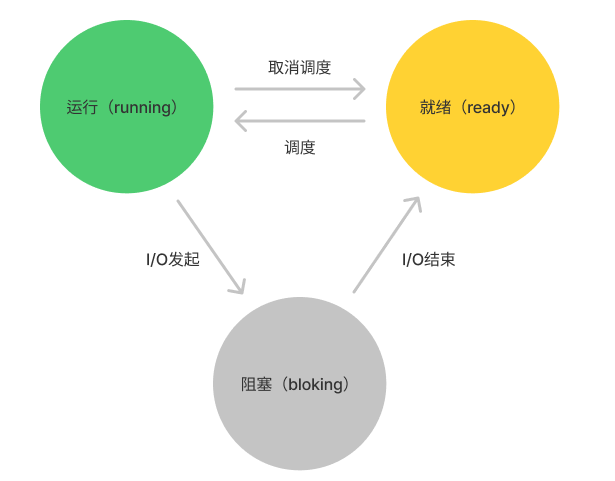

# 进程

进程运行中的程序，程序本身是没有生命周期的，它只是存在磁盘上的一些指令，是操作系统让这些字节运行起来，让程序发挥作用。

## 虚拟化 CPU

虽然我们电脑上只有有限个 CPU，但一段时间内可以运行多个程序，就好像有无数个 CPU 可用一样。

**操作系统是如何提供有许多 CPU 可用的假象的？**

操作系统通过虚拟化 CPU 来提供这种假象。通过让一个进程只运行一个**时间片**，然后切换到其他进程，这样这段时间内就可以并发运行多个进程，这就是**时分共享**（time sharing）CPU 技术。潜在的开销就是性能损失，需要额外处理一些进程切换的工作，且因为 CPU 时间上是共享的，每个进程的运行就会慢一点。

操作系统使用**时分共享的机制**和**进程调度策略**来实现 CPU 虚拟化。

时分共享机制：时分共享（time sharing）是操作系统共享资源所使用的最基本的技术之一。其将 CPU 执行时间切分成多个时间片，通过允许资源由一个实体使用一小段时间，然后由另一个实体使用一小段时间，如此下去，资源就可以被许多人共享。

## 进程的概念

进程的机器状态是指程序在运行时可以读取或更新的内容，包括：

- 进程的内存空间：存放进程的指令和读取和写入的数据；
- 寄存器：
  - 程序计数器（Program Counter, PC）：存放程序正在执行指令的地址，所以有时候又叫指令指针寄存器（Instruction Pointer, IP）;
  - 栈寄存器。

## 进程创建

操作系统如何启动并运行一个程序？进程创建实际如何进行？

进程的创建包括加载、初始化、启动任务三个步骤。

### 加载

运行程序的第一步需要将程序代码和数据加载从磁盘加载到进程的内存空间中；

在早期的操作系统中，加载过程需要尽早完成，即在程序运行前全部完成；现代操作系统则采用懒加载的方式，即在程序运行期间仅加载需要的代码和数据，要真正理解懒加载的过程，需要了解内存的分页和交换机制，这里暂不展开。

### 初始化

将代码和静态数据加载到内存后，操作系统在运行此进程之前还需要执行其他一些操作，包括：

- 为程序的运行时栈分配一些内存；

- 为程序的堆分配一些内存；

- 执行一些初始化任务，特别是输入输出。

### 启动任务

通过将代码和静态数据加载到内存中，通过创建和初始化栈和堆以及执行与 I/O 设置相关的其他工作，接下来就可以启动程序了。

OS 将指令跳转到执行入口（main 函数入口），把 CPU 的控制权转移到新创建的进程中，从而程序开始执行。

## 进程的状态

简而言之，进程分为三个状态：

- **运行**（running）：在运行状态下，进程正在处理器上运行。这意味着它正在执行指令；
- **就绪**（ready）：在就绪状态下，进程已准备好运行，但由于某种原因，操作系统选择不在此时运行；

- **阻塞**（bloking）：在阻塞状态下，一个进程执行了某种操作，直到发生其他事件时才会准备运行，一个常见的例子是，当进程向磁盘发起I/O请求时，它会被阻塞，因此其他进程可以使用处理器。

进程的状态转换图如下所示：



## 进程数据结构

操作系统是一个程序，和其他程序一样，它有一些关键的数据结构来跟踪各种相关的信息。

[xv6](https://github.com/mit-pdos/xv6-public) 操作系统中的进程结构定义如下：

```c
struct context {
  uint edi;
  uint esi;
  uint ebx;
  uint ebp;
  uint eip;
};

enum procstate { UNUSED, EMBRYO, SLEEPING, RUNNABLE, RUNNING, ZOMBIE };

// Per-process state
struct proc {
  uint sz;                     // Size of process memory (bytes)
  pde_t* pgdir;                // Page table
  char *kstack;                // Bottom of kernel stack for this process
  enum procstate state;        // Process state
  int pid;                     // Process ID
  struct proc *parent;         // Parent process
  struct trapframe *tf;        // Trap frame for current syscall
  struct context *context;     // swtch() here to run process
  void *chan;                  // If non-zero, sleeping on chan
  int killed;                  // If non-zero, have been killed
  struct file *ofile[NOFILE];  // Open files
  struct inode *cwd;           // Current directory
  char name[16];               // Process name (debugging)
};
```

从上述 `procstate` 枚举可以看出，处理就绪、运行和阻塞状态外，进程还有一些其他状态，其中有一个僵尸状态（ZOMBIE），表示一个进程可以处于已退出但尚未清理的最终状态，这个最终状态非常有用，因为它允许其他进程（通常是创建进程的父进程）检查进程的返回代码，并查看刚刚完成的进程是否成功执行。然后，父进程可以调用 wait 方法，判断子进程是否执行完成，并告诉操作系统它可以清理这个正在结束的进程的所有相关数据结构。

## 总结

本文是《[操作系统导论](https://weread.qq.com/web/reader/db8329d071cc7f70db8a479kc81322c012c81e728d9d180)》（英文名：《Operating Systems: three easy pieces》）第 4 章学习笔记。