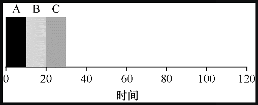
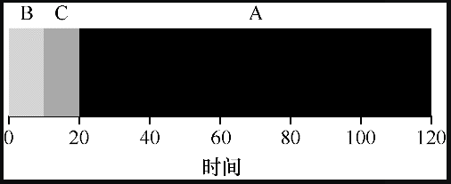
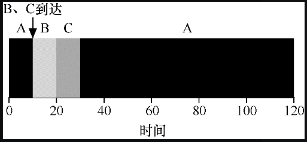
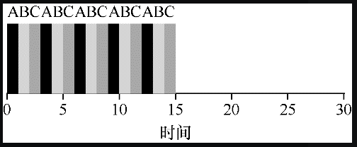
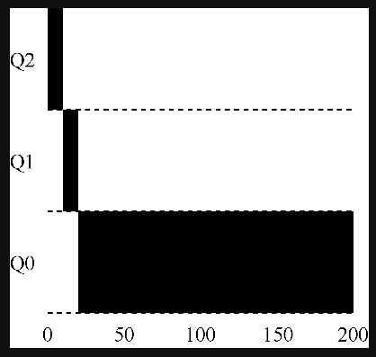
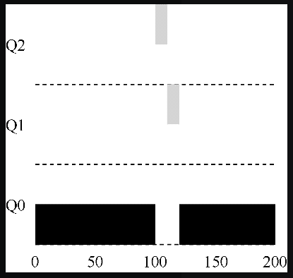
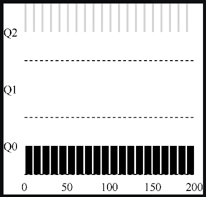
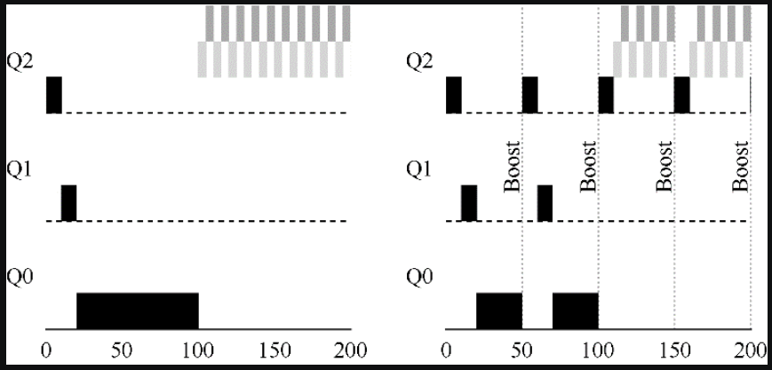
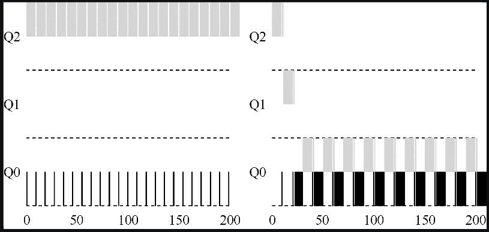

# 进程调度

如何设计调度策略

我们该如何开发一个考虑调度策略的基本框架？什么是关键假设？哪些指标非常重要？哪些基本方法已经在早期的系统中使用？

## 工作负载假设

我们对操作系统中运行的进程（有时也叫工作任务）做出如下的假设：

1. 每一个工作运行相同的时间；
2. 所有的工作同时到达；
3. 一旦开始，每个工作保持运行直到完成；
4. 所有的工作只是用 CPU（即它们不执行 IO 操作）；
5. 每个工作的运行时间是已知。

先别担心这些假设听起来不切实际，我们会逐步地放宽这些假设，从而一步一步得到优秀的调度策略。

> 先提出假设，再放宽假设，一步一步得到我们想要的结果。这是一个好的解决问题的办法（由简单到复杂，由抽象到具体），也是一个好的学习方式（提出假设，求证结论，有利于明确学习的输入和输出）。

## 调度指标

衡量调度策略的指标：

- **周转时间**：任务完成时间减去任务到达时间。
- **公平**：性能和公平在在调度系统中往往是矛盾的。调度程序可以优化性能，但代价是以阻止一些任务运行，这就降低了公平。
- **响应时间**：响应时间定义为从任务到达系统到首次运行的时间。

## 先进先出（FIFO）

先来的任务先服务。

先进先出调度策略的平均周转时间

3 个工作 A、B 和 C 在大致相同的时间（T 到达时间 = 0）到达系统。因为 FIFO 必须将某个工作放在前面，假设任务的执行顺序为 `A->B->C`。假设每个工作运行 `10s`。这些工作的平均周转时间（average turnaround time）是多少？



工作 A 的周转时间：`10s`

工作 B 的周转时间：`20s`

工作 C 的周转时间：`30s`

所以平均工作周转时间为 `(10+20+30)/3=20s`


放宽工作负载假设 1，任务运行的时间不同，比如任务 A、B 和 C 运行时间分别为 `5s`、`10s` 和 `15s`，这时候平均周转时间是多少？

工作 A 的周转时间：`5s`

工作 B 的周转时间：`15s`

工作 C 的周转时间：`30s`

所以平均工作周转时间为 `(5+15+30)/3=50/3s`


如果任务 A、B 和 C 运行时间分别为 `15s`、`10s` 和 `5s`，这时候平均周转时间是多少？

工作 A 的周转时间：`15s`  

工作 B 的周转时间：`25s`

工作 C 的周转时间：`30s`

所以平均工作周转时间为 `(15+25+30)/3=70/3s`

可见，当任务执行时间不同时，平均周转的时间和任务执行的顺序有关，运行时间越短的任务越先执行，平均周转时间就越少，越后执行，平均周转时间就越多。

这个问题通常被称为**护航效应**（convoy effect），一些耗时较少的潜在资源消费者被排在重量级的资源消费者之后，会导致整体的运转时间变长。

## 最短任务优先（SJF）

对于同时到达的任务先运行最短的任务，然后是次短的任务，如此下去。

最短任务有限，在任务同时到达时，能够得到最优的平均调度时间。

这时候如果放宽作负载假设 2，即任务到达的时间不同。

假设 A 在 `t=0` 时到达，需要运行`100s`，B 和 C 在 `t=10` 到达，需要运行 `10s`。



这时候的平均周转时间为：`100+(110−10)+(120−10))/3=103.33s`

使用 `SJF` 调度策略，即使 B 和 C 在 A 之后不久到达，它们仍然被迫等到 A 完成（不能抢占），从而遭遇同样的护航问题。

## 最短完成时间优先（STCF）

为了解决这个问题，需要放宽工作负载假设条件（工作必须保持运行直到完成），这就意味着可以发生抢占。

**每当新工作进入到达时**，它就会确定剩余工作和新工作中，谁的剩余时间最少，然后调度该工作。

还是上述情况，假设 A 在 `t=0` 时到达，需要运行`100s`，B 和 C 在 `t=10` 到达，需要运行 `10s`。



这时候任务 A 的周转时间为：`10+10+10+90=120s`

任务 B 的周转时间：`10s`

任务 C 的周转时间：`20s`

平均周转时间为：`(120+10+20)/3=50s`

## 轮转（RR）

如果我们知道任务长度，而且任务只使用 CPU，而我们唯一的衡量是周转时间，STCF 将是一个很好的策略。

但是有时候我们更关心响应时间这个指标，那么用上面的例子，假设 A 在 `t=0` 时到达，需要运行`100s`，B 和 C 在 `t=10` 到达，需要运行 `10s`。

这时候任务平均响应时间为 `0+0+10/3=3.33s`。

可以看出 STCF 和相关方法在响应时间上并不是很好。如果 3 个工作同时到达，第三个工作必须等待前两个工作全部运行后才能运行。这种方法虽然有很好的周转时间，但对于响应时间和交互性是相当糟糕的。


为了解决这个问题，我们将介绍一种新的调度算法，通常被称为轮转（Round-Robin, RR）。

RR 在一个时间片（time slice，有时称为调度量子）内运行一个工作，然后切换到运行队列中的下一个任务，而不是运行一个任务直到结束。它反复执行，直到所有任务完成。因此，RR 有时被称为时间切片（time-slicing）。

> 注意：时间片长度必须是时钟中断周期的倍数。如果时钟中断是每 10ms 中断一次，则时间片可以是 10ms、20ms 或 10ms 的任何其他倍数。

还是举个例子，假设 3 个任务A、B 和 C 在系统中同时到达，都需要运行 5s，使用 SJF 或者 STCF 的平均响应时间为 `(0+5+10)/3=5s` 。



如果采用 RR，假设时间片为 `1s`，平均响应时间就为 `(0+1+2)/3=1s`，假设时间片为 `0.1s`，平均响应时间就为 `(0+0.1+0.2)/3=0.1s`。

可见，RR 可以有效的降低响应时间，并且时间片的长度于 RR 是至关重要的，长度越短，RR 在响应时间上的表现就越好。

然而，时间片太短是有问题的，时间片越短，任务切换的频率就越高，切换的成本将影响整体性能。因此，系统设计者需要权衡时间片的长度，使其足够长，以便摊销（amortize）上下文切换成本，而又不会使系统不及时响应。

> 摊销可以减少成本
>
> 当系统某些操作有固定成本时，通常会使用摊销技术（amortization）。通过减少成本的频度（即执行较少次的操作），系统的总成本就会降低。
>
> 例如，如果时间片设置为 10ms，并且上下文切换时间为 1ms，那么浪费大约 10% 的时间用于上下文切换。如果要摊销这个成本，可以把时间片增加到100ms。在这种情况下，不到 1% 的时间用于上下文切换，因此时间片带来的成本就被摊销了。


这时候如果我们来看 RR 的平均周转时间，发现其表现的很糟糕。因为周转时间只关心任务何时完成，RR 则是将 CPU 的时间拆分并公平的分配给各个活动的进程，让每个任务更快地被响应。

更一般地说，任何公平的策略，即在小规模的时间内将 CPU 均匀分配到活动进程之间，在周转时间这类指标上表现不佳。如果你愿意不公平，你可以运行较短的工作直到完成，但是要以响应时间为代价。如果你重视公平性，则响应时间会较短，但会以周转时间为代价。这种权衡在系统中很常见。

## 结合 I/O

这里先放宽工作负载假设 4，即任务会执行 I/O 操作。考虑到 I/O 时，我们可以通过重叠来提高利用率。

调度程序需要要在工作发起 I/O 请求时做出决定，**因为当前正在运行的作业在 I/O 期间不会使用 CPU**，任务进入阻塞状态，这时调度程序应该在 CPU 上安排另一项工作。

调度程序还必须在 I/O 完成时做出决定，操作系统需要通知阻塞的进程回来继续工作。

## 多级反馈队列（MLFQ）

事实上，每个执行的任务的长度时**无法预估**的，所以上述的工作负载假设 5 基本上不会成立。

那么这个时候该怎么构建调度策略？

这里将介绍一种著名的调度策略——**多级反馈队列**（Multi-level Feedback Queue，MLFQ）。

多级反馈队列需要解决两方面的问题：

- 首先，MLFQ 要优化周转时间，关于周转时间，STCF 和 SJF 可以达到最优，但任务长度不确定时，将无法使用；
- 其次，MLFQ 要优化响应时间，然而，像轮转这样的算法虽然降低了响应时间，周转时间却很差。

**那么，在不知道任务长度的情况下，如何设计一个能够降低周转时间和响应时间的调度程序？**

答案就是使用历史预测未来。

> 多级反馈队列是用历史经验预测未来的一个典型的例子，操作系统中有很多地方采用了这种技术（同样存在于计算机科学领域的很多其他地方，比如硬件的分支预测及缓存算法）。如果工作有明显的阶段性行为，因此可以预测，那么这种方式会很有效。当然，必须十分小心地使用这种技术，因为它可能出错，让系统做出比一无所知的时候更糟的决定。

### MLFQ 基本规则

MLFQ 中有许多独立的队列，每个队列有不同的优先级。

任何时刻，一个工作只能存在于一个队列中，MLFQ 总是优先执行较高优先级的工作（即在较高级队列中的工作）。

当然，每个队列中可能会有多个工作，因此具有同样的优先级，在这种情况下，我们就对这些工作采用轮转调度。

MLFQ 调度策略的关键在于如何设置优先级。

MLFQ 没有为每个任务设置一成不变的优先级，而是根据观察到的行为动态地进行调整。比如，如果一个工作不断放弃 CPU 去等待键盘输入，这是交互型进程的可能行为，MLFQ 因此会让它保持高优先级（尽快的被响应）。相反，如果一个工作长时间地占用 CPU，MLFQ 会降低其优先级。

可见，MLFQ 在进程运行过程中学习其行为，从而利用工作的历史来预测它未来的行为。

至此，我们得到了 MLFQ 的两条基本规则：

- 规则 1：如果 A 的优先级大于 B 的优先级，运行 A；
- 规则 2：如果 A 的优先级等于 B 的优先级，轮转运行 A 和 B。

### 改变优先级

要做到这一点，我们必须记得工作负载：既有运行时间很短、频繁放弃 CPU 的交互型工作，也有需要很多 CPU 时间、响应时间却不重要的计算密集型工作。

MLFQ 改变任务优先级规则如下：

- 规则 3：工作进入系统时，放在最高优先级（最上层队列）；
- 规则 4a：工作用完整个时间片后，降低其优先级（移入下一个队列）；
- 规则 4b：如果工作在其时间片以内主动释放 CPU，则优先级不变。

#### 长任务

如果是运行单个长时间的工作，任务的优先级随着时间的变化如下图所示：



从上图可以看出，工作先进入优先级最高的任务队列（Q2），执行一个 10ms 的时间片后，调度程序的优先级减一，进入 Q2。在 Q1 执行完一个时间片后，进入 Q0，而后一直留在那里。

#### 交互型任务

如果在运行一个长时间工作时，来了一个短任务，这时候任务的优先级随时间的变化如下图所示：



如上图所示，任务 A（用黑色表示） 是一个 CPU 密集型的长工作，运行一段时间后，一直留在最低优先级的队列里。

任务 B（用灰色表示）是一个短工作，在时间 `T=100` 时到达，并被加入最高级的队列执行，由于它的运行时间很短（只有 20ms），经过两个时间片，在被移入最低优先级队列之前，B 执行完毕。然后 A 继续运行。

通过这个例子，你大概可以体会到这个算法的一个主要目标：如果不知道工作是短工作还是长工作，那么就在开始的时候假设其是短工作，并赋予最高优先级。如果确实是短工作，则很快会执行完毕，否则将被慢慢移入低优先级队列，而这时该工作也被认为是长工作了。通过这种方式，MLFQ 近似于 SJF。

#### 混合任务

如果在运行一个长任务的时候有一个 I/O 密集型任务，这时候任务的优先级随着时间的变化如下图所示：



如上图所示，任务 A（用黑色表示）是一个 CPU 密集型的长工作，运行一段时间后，一直留在最低优先级的队列里。

任务 B（用灰色表示）一个有着大量 I/O 操作的任务，每执行 1ms 就需要进行 I/O 操作，任务 B 会一直在最高优先级队列中，运行 1ms 后让出 CPU 进行 I/O 操作，这时候任务 A 会接着执行，如此循环往复。

#### 当前 MLFQ 的一些问题

**饥饿问题**，如果当前系统又太多的交互性工作，就会不断地占用 CPU，导致长工作无法得到 CPU（饿死了）。即使在这种情况下，我们希望这些长工作也能有所进展。

**愚弄问题**，进程在时间片用完之前，调用一个无关的 I/O 操作（比如访问一个无关的文件），从而主动释放 CPU。如此便可以保持在高优先级，占用更多的 CPU 时间。

最后，一个程序可能在不同时间表现不同。一个计算密集的进程可能在某段时间表现为一个交互型的进程。用我们目前的方法，它不会享受系统中其他交互型工作的待遇。

### 提升优先级

- 规则 5：经过一段时间 S，就将系统中所有工作重新加入最高优先级队列。

新规则一下解决了两个问题。首先，进程不会饿死——在最高优先级队列中，它会以轮转的方式，与其他高优先级工作分享 CPU，从而最终获得执行。其次，如果一个 CPU 密集型工作变成了交互型，当它优先级提升时，调度程序会正确对待它。

比如有长工作与两个交互型短工作竞争 CPU 时，在使用规则 5 和不使用规则 5 优先级变化如下所示：



如上图所示，左边没有优先级提升，长工作在两个短工作到达后被饿死。右边每 50ms 就有一次优先级提升，因此至少保证长工作会有一些进展，每过 50ms 就被提升到最高优先级，从而定期获得执行。

这时候时间段 S 值地设置就成为了一个研究课题，如果 S 设置得太高，长工作会饥饿；如果设置得太低，交互型工作又得不到合适的 CPU 时间比例。

### 占用配额

这时候还有愚弄问题没有解决，可以看出产生这个问题的主要原因是规则 4a 和 4b，程序可以刻意地在时间片使用完毕前主动释放 CPU，从而一直有高的优先级。

为了解决这个问题，MLFQ 的每层队列提供更完善的 CPU 计时方式（accounting）。调度程序应该记录一个进程在某一层中消耗的总时间，而不是在调度时重新计时。只要进程用完了自己的配额，就将它降到低一优先级的队列中去。不论它是一次用完的，还是拆成很多次用完。

这里需要重新定义规则 4a 和 4b。

- 规则 4：一旦工作用完了其在某一层中的时间配额（无论中间主动放弃了多少次 CPU），就降低其优先级（移入低一级队列）。

下图展示了使用规则 4 和不使用规则 4 任务优先级随着时间的变化：



没有规则 4 的保护时，进程可以在每个时间片结束前发起一次 I/O 操作，从而垄断 CPU 时间。有了这样的保护后，不论进程的 I/O 行为如何，都会慢慢地降低优先级，因而无法获得超过公平的 CPU 时间比例。

### MLFQ 调优

关于 MLFQ 调度算法有一个大问题是如何配置一个调度程序：

- 配置多少队列？
- 每一层队列的时间片配置多大？
- 为了避免饥饿问题以及进程行为改变，应该多久提升一次进程的优先级？

如何配置之所以成为一个问题，是因为配置在大多数情况下并不是显而易见的。并且根据不同的应用场景，最优的配置也是不同的。因此只有利用对工作负载的经验，以及后续对调度程序的调优，才会导致令人满意的平衡。

大多数的 MLFQ 变体都支持不同队列可变的时间片长度。高优先级队列通常只有较短的时间片（比如 10ms 或者更少），因而这一层的交互工作可以更快地切换。相反，低优先级队列中更多的是 CPU 密集型工作，配置更长的时间片会取得更好的效果。

> 避免巫毒常量（Ousterhout 定律）
>
> 尽可能避免巫毒常量是个好主意。然而，从上面的例子可以看出，这通常很难。当然，我们也可以让系统自己去学习出一个优化的值，但这同样也不容易。因此，通常我们会有一个写满各种参数值默认值的配置文件，使得系统管理员可以方便地进行修改调整。然而，大多数使用者并不会去修改这些默认值，这时就寄希望于默认值合适了。这个提示是由资深的 OS 教授 John Ousterhout 提出的，因此称为 Ousterhout 定律（Ousterhout’s Law）。

### MLFQ 规则

这里总结一下 MLFQ 的规则：

- 规则 1：如果 A 的优先级大于 B 的优先级，运行 A；
- 规则 2：如果 A 的优先级等于 B 的优先级，轮转运行 A 和 B；
- 规则 3：工作进入系统时，放在最高优先级（最上层队列）；
- 规则 4：一旦工作用完了其在某一层中的时间配额（无论中间主动放弃了多少次 CPU），就降低其优先级（移入低一级队列）；
- 规则 5：经过一段时间 S，就将系统中所有工作重新加入最高优先级队列。

MLFQ 的优势是：它不需要对工作的运行方式有先验知识，而是通过观察工作的运行来给出对应的优先级。通过这种方式，MLFQ 可以同时满足各种工作的需求：对于短时间运行的交互型工作，获得类似于 SJF/STCF 的很好的全局性能，同时对长时间运行的 CPU 密集型负载也可以公平地、不断地稳步向前。

## 比例份额

**比例份额**（proportional-share）是一个调度策略，有时候也称为**公平份额**。

比例份额算法基于一个简单的想法：调度程序的最终目标，是确保每个工作获得一定比例的 CPU 时间，而不是优化周转时间和响应时间。

关键问题是，如何按比例分配 CPU？


比例份额调度有一个很优秀的例子——彩票调度，顾名思义，就是让进程像彩票一样分配占用时间，哪个进程中奖就能获得更多的占用 CPU 时间，更越活越的进程，也就得到更多的抽奖机会。

### 份额表示

彩票调度背后是一个非常基本的概念：**彩票数（ticket）代表了进程（或用户或其他）占有某个资源的份额**。一个进程拥有的彩票数占总彩票数的百分比，就是进程被调度的概率。

举个例子，假设有两个进程 A 和 B，一共有 100 张彩票，A 拥有 75 张彩票（0~74），B 拥有 25 张彩票（75~99）。每隔一段时间就去这 100 张彩票里抽取，抽取到 A 的彩票有运行 A，抽取到 B 的彩票就运行 B。

彩票调度最精彩的地方在于利用了**随机性**（randomness）。当你需要做出决定时，采用随机的方式常常是既可靠又简单的选择。

> 随机方法相对于传统的决策方式，至少有 3 点优势：
>
> - 第一，随机方法常常可以避免奇怪的边角情况，较传统的算法可能在处理这些情况时遇到麻烦。
> - 第二，随机方法很轻量，几乎不需要记录任何状态。在传统的公平份额调度算法中，记录每个进程已经获得了多少的 CPU 时间，需要对每个进程计时，这必须在每次运行结束后更新。而采用随机方式后每个进程只需要非常少的状态（即每个进程拥有的彩票号码）。
> - 第三，随机方法很快。只要能很快地产生随机数，做出决策就很快a因此，随机方式在对运行速度要求高的场景非常适用。当然，越是需要快的计算速度，随机就会越倾向于伪随机。

### 彩票机制

彩票调度还提供了一些机制，以不同且有效的方式来调度彩票：

- **彩票货币**：这种方式允许拥有一组彩票的用户以他们喜欢的某种货币，将彩票分给自己的不同工作。之后操作系统再自动将这种货币兑换为正确的全局彩票。

- **彩票转让**：通过转让，一个进程可以临时将自己的彩票交给另一个进程。这种机制在客户端/服务端交互的场景中尤其有用，在这种场景中，客户端进程向服务端发送消息，请求其按自己的需求执行工作，为了加速服务端的执行，客户端可以将自己的彩票转让给服务端，从而尽可能加速服务端执行自己请求的速度。服务端执行结束后会将这部分彩票归还给客户端。
- **彩票膨胀**：通过转让，一个进程可以临时将自己的彩票交给另一个进程。这种机制在客户端/服务端交互的场景中尤其有用，在这种场景中，客户端进程向服务端发送消息，请求其按自己的需求执行工作，为了加速服务端的执行，客户端可以将自己的彩票转让给服务端，从而尽可能加速服务端执行自己请求的速度。服务端执行结束后会将这部分彩票归还给客户端。

### 彩票调度实现

彩票调度中最不可思议的，或许就是实现简单。只需要一个不错的随机数生成器来选择中奖彩票和一个记录系统中所有进程的数据结构（一个列表），以及所有彩票的总数。

比如以下代码：

```c
#include <stdio.h>
#include <stdlib.h>
#include <string.h>
#include <assert.h>

// global ticket count
int gtickets = 0;

struct node_t {
    int            tickets;
    struct node_t *next;
};

struct node_t *head = NULL;

void insert(int tickets) {
    struct node_t *tmp = malloc(sizeof(struct node_t));
    assert(tmp != NULL);
    tmp->tickets = tickets;
    tmp->next    = head;
    head         = tmp;
    gtickets    += tickets;
}

void print_list() {
    struct node_t *curr = head;
    printf("List: ");
    while (curr) {
	printf("[%d] ", curr->tickets);
	curr = curr->next;
    }
    printf("\n");
}

int
main(int argc, char *argv[])
{
    if (argc != 3) {
	fprintf(stderr, "usage: lottery <seed> <loops>\n");
	exit(1);
    }
    int seed  = atoi(argv[1]);
    int loops = atoi(argv[2]);
    srandom(seed);

    // populate list with some number of jobs, each
    // with some number of tickets
    insert(50);
    insert(100);
    insert(25);

    print_list();
    
    int i;
    for (i = 0; i < loops; i++) {
	int counter            = 0;
	int winner             = random() % gtickets; // get winner
	struct node_t *current = head;

	// loop until the sum of ticket values is > the winner
	while (current) {
	    counter = counter + current->tickets;
	    if (counter > winner)
		break; // found the winner
	    current = current->next;
	}
	// current is the winner: schedule it...
	print_list();
	printf("winner: %d %d\n\n", winner, current->tickets);

    }
    return 0;
}
```

如上述代码所示，用一个链表表示进程，进程节点中包含了拥有彩票的份额，假设链表从头到尾有 A、B 和 C 三个进程，彩票份额分别为 50、100 和 25。

从彩票总数里取出一个随机数，当随机数落在 0~50 内，调度进程 A，当随机数落在 50~150 内调度进程 B，当随机数落在 150 ~175 之间调度进程 C。

要让这个过程更有效率，建议将列表项按照彩票数递减排序。这个顺序并不会影响算法的正确性，但能保证用最小的迭代次数找到需要的节点，尤其当大多数彩票被少数进程掌握时。

### 步长调度

虽然随机方式可以使得调度程序的实现简单（且大致正确），但偶尔并不能产生正确的比例。随机方式将进程的调度变成了一个概率问题，调度的次数越多，越能接近我们预期的结果，调度的次数越少，调度的效果可能会偏离预期。

由于这个原因，Waldspurger 提出了**步长调度**（stride scheduling），一个确定性的公平分配算法，它是彩票调度的变种。

步长调度思路如下：

- 系统中的每个工作都有自己的步长，这个值与票数值成反比。比如 A、B、C 这 3 个工作的票数分别是100、50 和 250，我们通过用一个大数分别除以他们的票数来获得每个进程的步长（比如用 10000 除以这些票数值，得到了 3 个进程的步长分别为 100、200 和 40）；
- 每次进程运行后，我们会让它的计数器增加它的步长，得到行程值，记录进程的总体进展；
- 当需要进行调度时，选择目前拥有最小行程值的进程，并且在运行之后将该进程的行程值增加一个步长。

如此在运行一段时间后，进程 A、B、C 的执行次数是符合预期的。

彩票调度算法只能一段时间后，在概率上实现比例，而步长调度算法可以在每个调度周期后做到完全正确，那么为什么还需要彩票调度算法呢？

彩票调度有一个步长调度没有的优势——**不需要全局状态**。假如一个新的进程在上面的步长调度执行过程中加入系统，根据步长调度，这个步长值无法确认，如果设置为 0，它就独占 CPU 了。而彩票调度算法不需要对每个进程记录全局状态，只需要用新进程的票数更新全局的总票数就可以了。因此彩票调度算法能够更合理地处理新加入的进程。


虽然彩票调度和步长调度很有意思，但并没有作为 CPU 调度程序被广泛使用。一个原因是这两种方式都不能很好地适合 I/O，另一个原因是没办法给进程分配合理的彩票数。结果，比例份额调度程序只有在这些问题可以相对容易解决的领域更有用（例如**容易确定份额比例**）。例如在虚拟数据中心中，你可能会希望分配 1/4的 CPU 周期给 Windows 虚拟机，剩余的给 Linux 系统，比例分配的方式可以更简单高效。

## 总结

本文总结了 CPU 的调度策略，包括：

- 先进先出（FIFO）：最先来的进程先调度，调度的平均周转时间和调度的次序相关，工作时长越短的任务排序越靠前，整体的调度时间越优；

- 最短任务优先（SJF）：同时有多个任务到来时，优先调度工作时长最短的任务，但不会抢占已经运行的任务，如果任务时间长的工作先来，同样会面临和 FIFO 一样的调度次序问题；

- 最短完成时间优先（STCF）：每当新工作进入到达时，它就会确定剩余工作和新工作中，谁的剩余时间最少，然后调度该工作，STCF 允许抢占，可以让时间短的任务优先执行，保证最优的平均周转时间；

- 轮转（RR）：轮转规定一个时间切片（轮转子），轮流调度不同的进程，直到任务完成，轮转解决了 SJF 或 STCF 响应时间的问题，进程可以尽快地被调度执行；

- 多级反馈队列（MLFQ）：上述的调度算法都以任务的执行周期确定为前提，但实际上操作系统无法确定任务的执行时间，MLFQ 通过历史经验来预测未来，通过多个优先级不同的队列和一些规则实现了类似于上述调度算法的能力，既可以保证调度时间，也可以保证响应时间；

  关于 MLFQ 最大的问题就是无法提前规划好最优的配置，当然，我们也可以让系统自己去学习出一个优化的值，但这同样也不容易，关于最优的配置，只能通过不断调优和测试去确认。

- 彩票调度：用彩票数量表示进程占用资源的配额，一个进程拥有的彩票数占总彩票数的百分比，就是进程被调度的概率，彩票调度最精彩的地方在于利用了随机性，有时候当你需要做出决定时，利用随机性，往往是最简单和可靠的选择；

- 步长调度：彩票调度在调度次数较少时，可能会达不到预期的调度效果，这时候可以基于步长调度，到达确定的调度概率，不管是彩票调度和步长调度，彩票数是不好确认的，这也是彩票调度和步长调度没有被广泛使用的原因。

本文是《[操作系统导论](https://weread.qq.com/web/reader/db8329d071cc7f70db8a479kc81322c012c81e728d9d180)》（英文名：《Operating Systems: three easy pieces》）第 7、8、9 章学习笔记。

