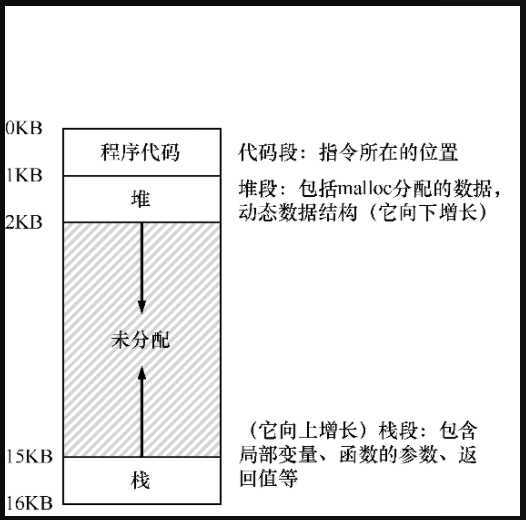

# 地址空间

关于内存，操作系统的发展：

- 早期系统：从内存来看，早期系统并没有提供多少抽象给用户。

  操作系统运行在物理内存的一部分空间中，当前程序运行在物理内存剩下的空间中，内存几乎没有抽象，可用空间也很少，用户对操作系统的要求也不多。

- 多道程序：过了一段时间，由于机器昂贵，人们开始在机器上运行多个程序。这时候多个进程在给定的时间里准备运行，并会在进程不使用 CPU 时（比如等待 I/O 操作）切换到其他进程。

- 分时系统：但很快，人们对操作系统要求更高，分时系统的时代诞生了。具体来说，许多人意识到批量计算的局限性，尤其是程序员本身。他们厌倦了长时间的（因此也是低效率的）编程—调试循环。交互性（interactivity）变得很重要，因为许多用户可能同时在使用机器，每个人都在等待（或希望）他们执行的任务得到及时响应。

  一种实现分时的方法是，是让一个进程单独占用全部内存运行一小段时间，然后停止它，并将它所有的状态信息保存在磁盘上（包含所有的物理内存），并从磁盘上加载其他进程的状态信息，让其他进程运行一段时间。

- 共享内存：但这样有个问题，太慢了，特别是当内存增长的时候。虽然保存和恢复寄存器级的状态信息（程序计数器、通用寄存器等）相对较快，但将全部的内存信息保存到磁盘就太慢了。因此，在进程切换的时候，我们仍然将进程信息放在内存中，这样操作系统可以更有效率地实现时分共享。

- 内存保护：随着时分共享变得更流行，人们对操作系统又有了新的要求。特别是多个程序同时驻留在内存中，使保护（protection）成为重要问题。人们不希望一个进程可以读取其他进程的内存。

## 地址空间

考虑到用户易用性这一关键需求，操作系统提供了一个易用的内存抽象，这个抽象叫作**地址空间**（address space），是运行的程序看到的系统中的内存。

理解这个基本的操作系统内存抽象，是了解内存虚拟化的关键。


有一个进程的地址空间包含了运行程序所有的内存状态，比如：

- 程序的代码（指令）必须在内存中，因此它们在进程的地址空间里；

- 栈用来保存当前的函数调用信息，分配空间给局部变量，传递参数和函数返回值；

- 堆用于管理动态分配的、用户管理的内存，就像你从 C 语言中调用 `malloc()` 或面向对象语言中 new  一个对象获得内存；

  > 当然，还有其他的东西（例如，静态初始化的变量），但现在假设只有这 3 个部分：代码、栈和堆。

比如我们有一个 16K 的地址空间，按照上述的划分，进程地址空间可以如下分配：



如上图所示，程序代码位于地址空间的顶部，从 0 开始到 1KB 结束。代码是静态的，我们可以提前直到其需要占用的空间大小，因此很容易放在内存中，且程序运行的同时，不需要再为代码分配其他的空间。

接下来，在程序运行时，有两个空间可能会增长或收缩，它们就是堆和栈。堆和栈分别在未分配内存的两端（堆在上面），这样布局是为了堆和栈方便的进行扩容和收缩。比如，堆在需要扩容时，可以向下增长，栈需要扩容时可以向上增长。

堆栈和堆的这种放置方法只是一种约定，如果你愿意，可以用不同的方式安排地址空间。

当然，当我们描述地址空间时，所描述的是操作系统提供给运行程序的抽象。程序不在物理地址 0~16KB 的内存中，而是加载在任意的物理地址。


**关键问题是如何虚拟化内存？**

操作系统在单一的物理内存上为多个运行的进程（所有进程共享内存）构建一个私有的、看似独有的地址空间的抽象。

当操作系统这样做时，我们说操作系统在虚拟化内存。比如进程 A 尝试在地址 0（虚拟地址）执行加载操作时，在操作系统硬件的支持下，必须确保不是加载到物理地址 0，而是一个其他的物理内存地址（比如 320KB）。这是内存虚拟化的关键，这是世界上每一个现代计算机系统的基础。


隔离原则

隔离是建立可靠系统的关键原则。如果两个实体相互隔离，这意味着一个实体的失败不会影响另一个实体。操作系统力求让进程彼此隔离，从而防止相互造成伤害。通过内存隔离，操作系统进一步确保运行程序不会影响底层操作系统的操作。

一些现代操作系统通过将某些部分与操作系统的其他部分分离，实现进一步的隔离。这样的微内核可以比整体内核提供更大的可靠性。

### 虚拟内存的目标

虚拟内存（VM）系统的一个主要目标是透明。

虚拟内存（VM）系统的一个主要目标是透明（transparency）[2]。操作系统实现虚拟内存的方式，应该让运行的程序看不见。因此，程序不应该感知到内存被虚拟化的事实，相反，程序的行为就好像它拥有自己的私有物理内存。

在幕后，操作系统（和硬件）完成了所有的工作，让不同的工作复用内存，从而实现这个假象。


虚拟内存的另一个目标是效率（efficiency）。

操作系统应该追求虚拟化尽可能高效，包括时间上（不会使程序运行得更慢）和空间上（不需要太多额外的内存来支持虚拟化）。

在实现高效率虚拟化时，操作系统将不得不依靠硬件支持，包括 TLB 这样的硬件功能。


虚拟内存第三个目标是保护（protection）。

操作系统应确保进程受到保护，不会受其他进程影响，包括操作系统本身。

当一个进程执行加载、存储或指令提取时，它不应该以任何方式访问或影响它地址空间之外的内容，这样就不会影响到其他进程和操作系统本身。

保护让我们能够在进程之间提供隔离的特性，每个进程都应该在自己的独立环境中运行，避免其他出错或恶意进程的影响。


你所看到的地址都是虚拟地址。

你可以使用一些编程语言打印一个变量的内存地址，这个地址是一个虚拟地址。

实际上，作为用户级程序的程序员，可以看到的任何地址都是虚拟地址。只有操作系统，通过精妙的虚拟化内存技术，知道这些指令和数据所在的物理内存的位置。

所以永远不要忘记：如果你在一个程序中打印出一个地址，那就是一个虚拟的地址。虚拟地址只是提供地址如何在内存中分布的假象，只有操作系统（和硬件）才知道物理地址。

这里有一个小程序，打印出 main 函数地址，由 malloc 返回的堆空间分配地址，以及栈上一个变量的地址：

```c
#include <stdio.h>
#include <stdlib.h>

int main(int argc, char *argv[]) {
    printf("location of code : %p\n", main);
    printf("location of heap : %p\n", malloc(100e6));
    int x = 3;
    printf("location of stack: %p\n", &x);
    return 0;
}
```

编译运行上述代码，你可以看到类似于下面的输出结果：

```
location of code : 0x40055d
location of heap : 0x7f9c38fbf010
location of stack: 0x7fffd943a12c
```

## 总结

我们介绍了操作系统的一个重要子系统：虚拟内存。

虚拟内存系统负责为程序提供一个巨大的、稀疏的、私有的地址空间的假象，其中保存了程序的所有指令和数据。

操作系统在专门硬件的帮助下，通过每一个虚拟内存的索引，将其转换为物理地址，物理内存根据获得的物理地址去获取所需的信息。

操作系统会同时对许多进程执行此操作，并且确保程序之间互相不会受到影响，也不会影响操作系统。

要实现上述描述的功能需要大量的机制（很多底层机制）和一些关键的策略。

本文是《[操作系统导论](https://weread.qq.com/web/reader/db8329d071cc7f70db8a479kc81322c012c81e728d9d180)》（英文名：《Operating Systems: three easy pieces》）第 13 章学习笔记。

