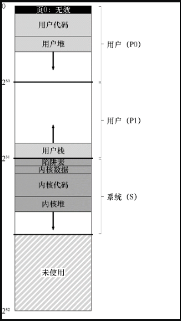

# VAX/VMS 虚拟内存系统

VAX/VMS 操作系统的内存管理器十分干净漂亮，这里将介绍 VAX/VMS 的内存管理器，并结合前面介绍的内存管理相关概念。

## 背景

数字设备公司（DEC）在 20 世纪 70 年代末推出了 VAX-11 小型机体系结构。该系统的操作系统被称为 VAX/VMS（或者 VMS），其主要架构师之一是 Dave Cutler，他后来领导开发了微软 Windows NT。

VMS 面临通用性的问题，即它将运行在各种机器上，包括一些便宜的机器和同一架构系列中极高端和强大的机器。因此，操作系统必须具有一些机制和策略，适用于这一系列广泛的系统（并且运行良好）。

## 地址空间

VMS 进程的地址空间如下所示：



首先 VMS 为每个进程提供了 32 位的虚拟地址空间，每页的大小为 512 字节。因此虚拟地址由 23 位的 VPN 和 9 位的便宜量组成。

然后 VMS 将这个地址空间分成大小相等的两个部分，上部分为用户空间（P），下部分为系统空间（S）。

用户空间由下面几个部分组成（从上到下，从低地址到高地址）：

- P0：
  - 第 0 页，无效页；
  - 用户代码；
  - 用户堆（向下增长）；
  - 空闲区域；
- P1：
  - 空闲区域；
  - 用户栈（向上增长）。

系统（内核）空间由下面几个部分组成：

- 陷阱表（中断向量表）；
- 内核数据；
- 内核代码；
- 内核堆（向下增长）；
- 空闲区域。

### 页表多，内存压力大

VMS 页的大小为 512 个字节，页的数量很多，系统通过两种方式减少了页表对内存的压力：

- 将用户区分为二（P0 和 P1），每个区域对应一张页表。因此，栈和堆之间未使用的地址空间部分不需要页表空间。基址和界限寄存器的使用与你期望的一样。一个基址寄存器保存该段的页表的地址，界限寄存器保存其大小（即页表项的数量）。
- 将用户页表放到内核虚拟内存中。因此，在分配或增长页表时，内核会在段 S 中分配空间。如果内存受到严重压力，内核可以将这些页表的页面交换到磁盘，从而使物理内存可以用于其他用途。

### 页 0 的作用

在编写代码时如果我们访问一个空引用，会得到一个空指针异常，比如下面代码：

```c
int *p = NULL; // set p = 0
*p = 10; // try to store 10 to virtual addr 0
```

一个空引用会执行地址空间的第 0 页，该页是无效的。

硬件试图在 TLB 中查找 VPN=0，TLB 未命中，然后去查询页表，并且发现 VPN=0 的条目被标记为无效。当遇到无效的页访问，将控制权交给操作系统，操作系统会判断是否要终止进程（在 UNIX 系统上，会向进程发出一个信号，让它们对这样的错误做出反应，但是如果信号未被捕获，则会终止进程）。

### 内核空间进程共享

内核虚拟地址空间（即其数据结构和代码）是每个用户地址空间的一部分，即被每个进程共享。具体来讲，在上下文切换时，操作系统改变 P0 和 P1 寄存器以指向即将运行的进程的页表。但是，它不会更改 S 基址和界限寄存器，并因此将“相同的”内核结构映射到每个用户的地址空间。

内核映射到每个地址空间，这种结构使得内核的运转更轻松。如果内核被赋予了自己的地址空间，那么在用户应用程序和内核之间移动数据将再次变得复杂和痛苦。通过这种构造，内核几乎就像应用程序库一样，尽管是受保护的。

### 保护

显然，操作系统不希望用户应用程序读取或写入操作系统数据或代码。因此，硬件必须支持页面的不同保护级别才能启用该功能。VAX 通过在页表中的保护位中指定 CPU 访问特定页面所需的特权级别来实现此目的。

因此，系统数据和代码被设置为比用户数据和代码更高的保护级别。试图从用户代码访问这些信息，将会在操作系统中产生一个陷阱，并且可能会终止违规进程。

## 页替换

VMS 的 PTE 由一个有效位、一个保护字段（4 位）、一个修改位（脏位），为 OS 保留的字段（5 位）、和 PFN 组成。这里没有引用位，在页交换的时候介绍过，引用位用来辅助在页交换时判断那些页最应该被换出。

那么 VMS 是怎么在没有引用位的前提下进行页替换呢？

并且存在一些程序会频繁使用某些内存（这种情况一般发生在循环程序中），导致其他程序难以将需要的页换入内存，进行运行。很多策略都会受到这种内存访问的影响，比如 LRU，它不会在进程之间公平分享内存。

### 分段 FIFO

VMS 为了解决上面存在的两个问题，开发人员提出了分段的 FIFO 替换策略。

想法很简单：每个进程都有一个可以保存在内存中的最大页数，称为**驻留集大小**（Resident Set Size，RSS）。每个页都保存在 FIFO 列表中。当一个进程超过其RSS 时，“先入”的页被驱逐，FIFO 显然不需要硬件的任何支持，因此很容易实现。

我们知道纯粹的 FIFO 替换策略表现不是很好，因为其无法保证一个重要的页（经常被访问）不会被换出。为了提高 FIFO 的性能，VMS 引入了两个**二次机会列表**（second-chance list），页在从内存中被踢出之前被放在其中。

具体来讲，这两个二次机会列表为全局干净空闲页列表和全局脏页列表，当一个进程 P 使用的页超过 RSS 时，会将该进程最先进入的页表移出，如果是脏页，就放到全局脏页列表末尾，如果不是脏页，就放到全局空闲页列表末尾。

如果另一个进程 Q 需要一个空闲页，它会从全局干净列表中取出第一个空闲页。但是，如果原来的进程 P 在回收之前在该页上出现页错误，则 P 会从空闲（或脏）列表中回收，从而避免昂贵的磁盘访问。这些全局二次机会列表越大，分段的 FIFO 算法越接近 LRU。

## 页聚集

VMS 采用的另一个优化也有助于克服 VMS 中的小页面问题。具体来说，对于这样的小页面，交换过程中的硬盘 I/O 可能效率非常低，因为硬盘在大型传输中效果更好。为了让交换 I/O 更有效，VMS 提出了页聚集的概念。通过聚集，VMS将大批量的页从全局脏列表中分组到一起，并将它们一举写入磁盘（从而使它们变干净）。聚集用于大多数现代系统，因为可以在交换空间的任意位置放置页，所以操作系统对页分组，执行更少和更大的写入，可以提高性能。

## 惰性优化

VMS 有另外两个现在成为标准的技巧：**按需置零**和**写入时复制**。我们现在描述这些**惰性（lazy）优化**。

> **惰性（延迟处理）**
>
> 惰性可以使得工作推迟，但出于多种原因，这在操作系统中是有益的，因为其将某些操作延迟到需要做的时候再做，从而避免了一开始的不必要操作。首先，推迟工作可能会减少当前操作的延迟，从而提高响应能力。例如，操作系统通常会报告立即写入文件成功，只是稍后在后台将其写入硬盘。其次，更重要的是，惰性有时会完全避免完成这项工作。例如，延迟写入直到文件被删除，根本不需要写入。
>
> 一些事情（代价比较高），先通过一些代价的处理保证可用，将高代价的操作延迟的必要时进行（保证语义正确），从而避免了“白做了”这种情况，这便是惰性（延迟）处理带来的好处。

### 按需置零

当进程需要在空间中添加一个页，操作系统响应一个请求，在物理内存中找到页，将该页添加到你的堆中，并将其置零，然后将其映射到你的地址空间。安全起见，置零是必须的，否则，你可以看到其他进程使用该页时的内容。

但将一页全部置零十分低效，特别是该页没有进程使用时。

利用按需置零，当页添加到你的地址空间时，操作系统的工作很少。首先操作系统不会立马将页空间全部置零，而是会在页表中放入一个标记页不可访问的条目。如果进程读取或写入页，则会向操作系统发送陷阱。在处理陷阱时，操作系统注意到（通常通过页表项中“保留的操作系统字段”部分标记的一些位），这实际上是一个按需置零页。此时，操作系统会将它置零，并映射到进程的地址空间。如果该进程从不访问该页，则所有这些工作都可以避免，从而体现按需置零的好处。

### 写入时复制

VMS 有另一个很酷的优化，写时复制（COW, Copy on write）。

它很简单：如果操作系统需要将一个页面从一个地址空间复制到另一个地址空间，首先不是真正复制它，而是将其映射到目标地址空间，并在两个地址空间中将其标记为只读。如果两个地址空间都只读取页面，则不会采取进一步的操作，因此操作系统已经实现了不移动任何数据的前提下复制数据。

但是，如果其中一个地址空间尝试写入页面，就会陷入操作系统。操作系统会注意到该页面是一个 COW 页面，因此（惰性地）分配一个新页，填充数据，并将这个新页映射到错误处理的地址空间。该进程然后继续，现在有了该页的私人副本。


COW 有用有一些原因，还是在于惰性，或者叫做延迟处理。复制数据时，先通过地址映射和标记只读来实现，这样不用复搬运数据，十分高效。然后将复制延迟到写入的时候进行，从而避免了不必要的复制，并且也保证了复制语义的准确性。

## 总结

VAX/VMS 这样的较早论文中看到的经典理念，仍然影响着现代操作系统的构建方式。这也是软件开发的魅力所在。

本文是《[操作系统导论](https://weread.qq.com/web/reader/db8329d071cc7f70db8a479kc81322c012c81e728d9d180)》（英文名：《Operating Systems: three easy pieces》）第 23 章学习笔记。


