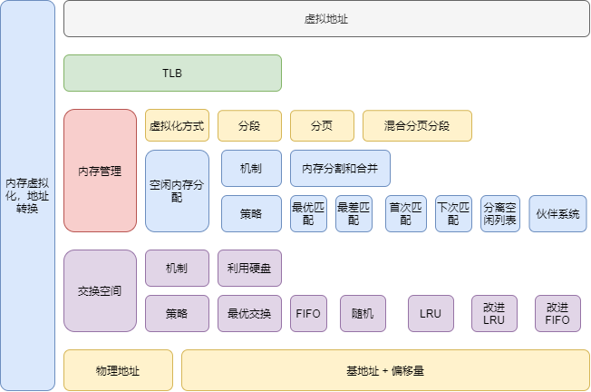

# 内存虚拟化总结

首先我们要知道我们编写程序看到的地址都是虚拟地址。虚拟地址是操作系统提供的一层抽象，主要目的是为了让内存变得更加容易使用。

## 地址转换

既然是虚拟内存地址，那么就要经过地址转换的过程得到物理地址，才能够获取到程序需要的代码或数据。

那么地址转换的过程是怎么样的？

这里先提出一点，最终的物理地址都是由基地址加上偏移量组成，不同的内存管理方式，侧重表现在获取基地址的方式不同。

### 基于分段

考虑到分段地址怎么转换？分段有什么样的缺陷？

首先一个进程的地址空间可简单的分为代码段、堆段、栈段，当然实际情况会比现在复杂。

然后通过硬件，基地址寄存器和界限寄存器得到对应段的基地址（起始物理地址）和偏移量，这样就可以计算出实际的物理地址。

分段存在内存碎片的问题，且不好解决。

### 基于分页

考虑到分页（线性页表）怎么转换？

页表就是一种数据结构，用于将虚拟地址（或者实际上，是虚拟页号）映射到物理地址（物理帧号）。因此，任何数据结构都可以采用。最简单的形式称为线性页表，就是一个数组。线性页表地址转换过程如下（考虑 TLB 和交换空间）：

- 进程正在生成一个虚拟内存引用（访问指令或读取数据），硬件需要将这个虚拟地址转换成实际存放指令或者数据的物理地址；
- 硬件先从虚拟地址里获取虚拟页号（VPN）；
- 通过这个虚拟页号检查 TLB 是否命中，如果命中直接获得物理地址，这一过程速度很快，因为不需要额外的内存访问；
- 如果 TLB 未命中，在硬件中查找页表（页表基地址寄存器）；
- 通过 VPN 找到页表中的页表项（PTE）;
- 如果页有效且存在于物理内存中，则硬件从 PTE 中取出物理页帧号（PFN），并将其插入到 TLB 中，然后重试该指令，这次 TLB 就可以命中了。

分页机制是一种很好的内存管理方案，其不会导致内存碎片，但有两个关键问题需要解决。

第一个是分页每次地址转换都需要经过两次内存访问，第一次是访问物理内存中的页表，第二次是访问物理内存中的指令或数据，存在效率问题。

第二个是如果分页的数量很多，页表占用的内存空间就很大，而且页表还是一个 per-process 结构，进程一多，占用的空间就更多了。

为了解决第一个问题，可以采用 TLB，TLB 就相当于一个虚拟页号到物理页帧号的高速缓存，在 TLB 命中时，可以快速地进行地址转换。

对于第二个问题，解决地方案有多种。

- 增大每页的大小，这样页表项地数量就会减少，占用地空间也会减少。但大的分页容易操作内部内存碎片地问题，大的分页适合用在数据库管理系统这种每次需要很大内存地系统中。

  增加页的大小带来的更重要的一个好处是可以提高 TLB 的命中率。

- 混合分段和分页，进程的地址空间的每个逻辑段都对应一张页表，借助于分段基址寄存器和界限寄存器，仅为有效的页表项分配内存空间，以此来节省内存；

- 多级页表，将对页表项进行分页，如果一个页表项页中的所有页表项均无效，则在页目录里标记改页表项页无效即可，而不用分配内存；

- 反向页表，反向页表不再是 per-process 结构，而是被多个进程共享，以此来节省内存。

## TLB

TLB 是一个内存管理系统中非常关键的部分，为系统提供了一个地址转换的小硬件缓存。页表通常相当大，因此放在大而慢的内存中。没有 TLB，程序运行速度肯定会慢得多。TLB 似乎真的让虚拟内存成为可能。我无法想象构建一个没有 TLB 的系统。

## 交换区

操作系统提供了可以使用比物理内存大的地址空间的假象。

从硬盘交换是 I/O 操作，速度很慢，频繁的交换自然会影响到程序的运行效率，所以一块大的内存是有用了，它降低了交换的频率。

其实可以把交换区看作程序代码和数页存放的位置，将内存看作页的缓存，这时候页替换可以理解为缓存淘汰，也可以利用类似于缓存命中率的概念来衡量一个替换策略的好坏。

## 总结

关于内存虚拟化，下面画了一个图进行总结：

