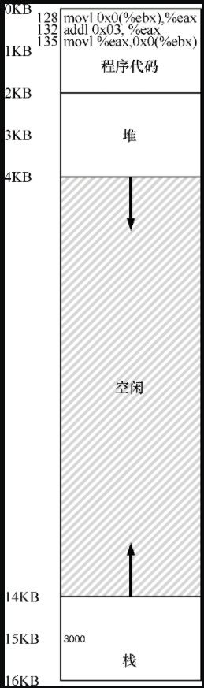
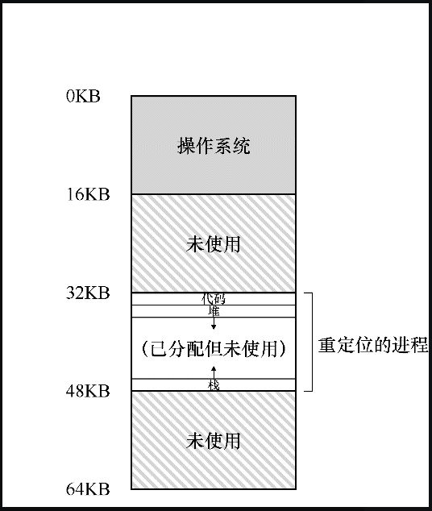
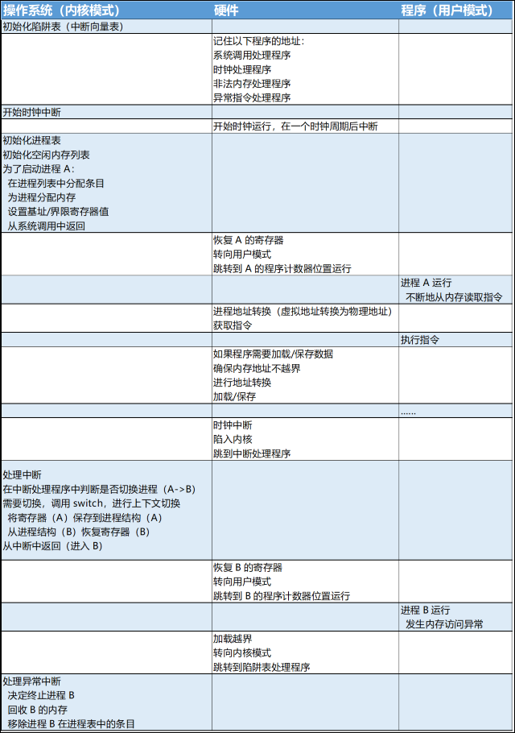

# 地址转换

和虚拟化 CPU 一样，虚拟内存同样要做到高效和控制。

高效决定了我们要利用硬件的支持，这些支持有的初级，但会变得相当复杂。控制意味着操作系统要确保应用程序只能访问它自己的内存空间。因此，要保护应用程序不会相互影响，也不会影响操作系统。此外虚拟内存还有一点要求，即灵活性。具体来说，我们希望程序能以任何方式访问它自己的地址空间，从而让系统更容易编程。


我们利用了一种通用技术，有时被称为基于硬件的地址转换，简称为地址转换（address translation）。它可以看成是受限直接执行这种一般方法的补充。

利用地址转换，硬件对每次内存访问进行处理（即指令获取、数据读取或写入），将指令中的虚拟地址转换为数据实际存储的物理地址。

## 内存使用假设

1. 假设用户的地址空间必须连续地放在物理内存中；
2. 假设用户需要的地址空间不是很大，具体来说，小于物理内存的大小；
3. 假设用户每个地址空间的大小完全一样。

别担心这些假设听起来不切实际，我们会逐步地放宽这些假设，从而得到现实的内存虚拟化。

> 先提出假设，再放宽假设，一步一步得到我们想要的结果。这是一个好的解决问题的办法（由简单到复杂，由抽象到具体），也是一个好的学习方式（提出假设，求证结论，有利于明确学习的输入和输出）。

## 一个例子

为了更好地理解实现地址转换需要什么，以及为什么需要，我们先来看一个简单的例子：

```c
void func() {
    int x;
    x = x+3; // this is the line of code we are interested in.
}
```

上述代码它内存中加载一个值，对它加 3，然后将它存回内存。

编译器将这行代码转化为汇编语句，可能像下面这样（`x86` 汇编）：

```assembly
128: movl 0x0(%ebx), %eax  ;load 0+ebx int eax
132: addl $0x03, %eax      ;add 3 to eax register
135: movl %eax, 0x0(%ebx)  ;store eax back to mem
```

这段代码相对简单：

- 它假定x的地址已经存入寄存器 `ebx`，之后通过 `movl` 指令将这个地址的值加载到通用寄存器 `eax`（长字移动）；

- 下一条指令对 `eax` 的内容加 3；

- 最后一条指令将 `eax` 中的值写回到内存的同一位置。

如果我们从进程的角度去看内存的使用，它应该是这个样子：



如果这 3 条指令执行，从进程的角度来看，发生了以下几次内存访问：

- 从地址 128 获取指令；
- 执行指令（从地址 `15KB` 加载数据）；
-  从地址 132 获取命令；
- 执行命令（没有内存访问）；
- 从地址 135 获取指令；
- 执行指令（新值存入地址 `15KB` ）。

从程序的角度来看，它的地址空间（address space）从 0 开始到 `16KB` 结束。它包含的所有内存引用都应该在这个范围内。然而，对虚拟内存来说，操作系统希望将这个进程地址空间放在物理内存的其他位置，并不一定从地址 0 开始。下面一图展示了单个进程地址空间被放入物理内存后可能的样子：



## 动态重定位（基于硬件）

在 20 世纪 50 年代后期，动态重定位在首次出现的时分机器中引入，那时只是一个简单的思想，称为**基址加界限机制**（base and bound），有时又称为**动态重定位**（dynamic relocation）。

具体来说，每个 CPU 需要两个硬件寄存器：**基址**（base）寄存器和**界限**（bound）寄存器（有时称为限制（limit）寄存器）。

这组基址和界限寄存器，让我们能够将地址空间放在物理内存的任何位置，同时又能确保进程只能访问自己的地址空间。怎么做到这一点呢？

在编写和编译程序时假设地址空间从零开始，并将程序访问的虚拟地址放到界限寄存器中；当程序真正执行时，操作系统会决定其在物理内存中的实际加载地址，并将起始地址记录在基址寄存器中。这时候虚拟地址和物理地址的对应关系就为：

```
physical address = virtual address + base 
```

上述公式具体来讲，进程中使用的内存引用都是虚拟地址（virtual address），硬件接下来将虚拟地址加上基址寄存器中的内容，得到物理地址（physical address），再发给内存系统。

>静态重定位（基于软件）
>
>在早期，在硬件支持重定位之前，一些系统曾经采用纯软件的重定位方式，被成为静态重定位（static relocation）。
>
>其基本原理为由程序运行前由一个名为加载程序（loader）的软件接手将要运行的可执行程序，将它的地址重写到物理内存中期望的偏移位置。
>
>比如程序中有一条指令是从虚拟地址 1000 加载到寄存器（`movl 1000，%eax`），当整个程序的物理地址空间从 3000 开始，加载程序会重写指令中的地址（`movl 4000, %eax`），从而完成简单的静态重定位。
>
>静态重定位有许多问题，其中最重要的是没有实现对内存的保护（一般来说要硬件的支持来实现访问保护），进程中的错误地址可能导致对其他进程或操作系统内存的非法访问。此外静态重定位的另一个缺点是一旦完成，稍后很难将内存空间重定位到其他位置 。


还是看上面的例子，进程的起始物理地址从 `32KB` 开始，这时候从操作系统系统角度来看，发生了以下几次内存访问：

- 程序计数器（PC）首先被设置为 128，当硬件需要获取这条指令时，它先将这个值加上基址寄存器中的 `32KB`（32768），得到实际的物理地址 32896，然后从这个物理地址获取指令；
- 执行指令（从地址 `15KB` 加载数据），处理器同样将虚拟地址加上基址寄存器内容（`32KB`），得到最终的物理地址 `47KB`，从而获得需要的数据；
-  从地址 132 获取命令，处理器实际从物理地址 32900 处加载指令；
- 执行命令（没有内存访问）；
- 从地址 135 获取指令 处理器实际从物理地址 32903 处加载指令；
- 执行指令（新值存入地址 `15KB`，在处理器的处理下，实际写入了物理内存 `47KB` 处 ）。


将虚拟地址转换为物理地址，这正是所谓的**地址转换**（address translation）技术。也就是说，硬件取得进程认为它要访问的地址，将它转换成数据实际位于的物理地址。由于这种重定位是在运行时发生的，而且我们可以在进程开始运行后改变其地址空间，这种技术一般被称为动态重定位（dynamic relocation）。


经过上面的描述，地址转换的工作中涉及到硬件的寄存器有：

- 程序寄存器（PC）：存放下条指行指令的地址（虚拟地址）；
- 基址寄存器：存放程序在物理内存的起始地址。

地址转换就是将程序寄存器里的虚拟地址和基址寄存器里的起始物理地址相加得到物理地址的过程。这似乎没有涉及到我们最开始提到的界限寄存器。

其实基址寄存器和界限寄存器在每个 CPU 结构中是成对出现的，界限寄存器被设置了进程内存空间总的大小（上述例子为 `16KB`），其提供了对内存访问的保护。

在计算物理地址的时候其实先判断程序寄存器里的虚拟地址是否超过了界限寄存器中的地址上限，如果超过了或者虚拟地址为负数，CPU 将触发异常，进程最终可能被终止。

由于基址寄存器和界限寄存器在 CPU 中是成对出现的，有时我们将 CPU 中负责地址转换的部分统称为内存管理单元（Memory Management Unit，MMU）。随着我们开发更复杂的内存管理技术，MMU 也将有更复杂的电路和功能。

> 注意：关于界限寄存器再补充一点，它通常有两种使用方式：
>
> - 在一种方式中（像上面那样），它记录地址空间的大小，硬件在将虚拟地址与基址寄存器内容求和前，就检查这个界限；
> - 另一种方式是界限寄存器中记录地址空间结束的物理地址，硬件在转化虚拟地址到物理地址之后才去检查这个界限。
>
> 这两种方式在逻辑上是等价的。简单起见，我们这里假设采用第一种方式。

## 硬件需求

这里总结下实现内存虚拟化，目前需要的硬件上的支持，或者说是实现内存虚拟化的需求分析。

- 两种模式：对于内存的访问需要在内核模式下进程，防止用户模式下程序直接访问对系统造成破坏；
- 基址/界限寄存器：每个 CPU 需要一对寄存器来支持地址转换和越界判断；
- 能够进程地址转换和越界判断：电路（硬件）来完成地址转换和越界判断；
- 修改基址/界限寄存器的内核指令：硬件应该提供一些特殊的指令，用于修改基址寄存器和界限寄存器，允许操作系统在切换进程时改变它们；
- 注册异常处理程序的内核指令：操作系统能告诉硬件，如果异常发生，那么执行那些代码；
- 能够触发异常：如果用户程序企图使用内核指令或者访问越界，CPU 应该阻止用户程序的执行，并安排操作系统的“越界”异常处理程序去处理，CPU 还必须提供一种方法，来通知操作系统这些处理程序的位置，因此又需要另一些特权指令。

## 操作系统需求

为了支持动态重定位，硬件添加了新的功能，使得操作系统有了一些必须处理的新问题。硬件支持和操作系统管理结合在一起，实现了一个简单的虚拟内存。

具体来说，在一些关键的时刻操作系统需要介入，以实现基址和界限方式的虚拟内存：

- 第一，在进程创建时，操作系统必须采取行动，为进程的地址空间找到可用的内存空间，这意味着操作系统需要一个数据结构来记录物理内存的使用状态。

  由于我们假设每个进程的地址空间小于物理内存的大小，并且大小相同，这对操作系统来说很容易。它可以把整个物理内存看作一组槽块，标记了空闲或已用。当新进程创建时，操作系统检索这个数据结构（常被称为空闲列表，free list），为新地址空间找到位置，并将其标记为已用。

  > 空闲列表：操作系统必须记录哪些空闲内存没有使用，以便能够为进程分配内存。很多不同的数据结构可以用于这项任务，其中最简单的是空闲列表（free list）。它就是一个列表，记录当前没有使用的物理内存的范围。

- 第二，在进程终止时，操作系统也必须做一些工作，回收它的所有内存，给其他进程或者操作系统使用。

  在进程终止时，操作系统会将这些内存放回到空闲列表，并根据需要清除相关的数据结构。

- 第三，在上下文切换时，操作系统也必须执行一些额外的操作。

  每个 CPU 毕竟只有一个基址寄存器和一个界限寄存器，而 CPU 会被多个进程使用，每个进程在寄存器中的值是不同的。因此，在切换进程时，操作系统必须保存和恢复基础和界限寄存器。具体来说，当操作系统决定中止当前的运行进程时，它必须将当前基址和界限寄存器中的内容保存在内存中，放在某种每个进程都有的结构中，如进程结构（process structure）或进程控制块（Process Control Block，PCB）中。

- 第四，操作系统必须提供异常处理程序。

  操作系统在启动时加载这些处理程序，当一个进程试图越界访问内存时，CPU 会触发异常，操作系统这时候必须准备采取行动去处理。

所以虚拟内存对操作系统提出的需求为：

- 内存管理：需要为新进程分配内存，需要回收终止进程使用的内存，一般通过空闲列表来管理内存；
- 基址/界限寄存器管理：必须在进程上下文切换时正确的处理寄存器里的值，保持旧的值到进程结构中，从切换进程结构中加载新的值到寄存器中；
- 异常处理，当异常发生时需要执行的代码，可能是终止犯错的进程。

## 总结

本文通过虚拟内存使用的一种特殊机制，即地址转换，扩展了受限直接访问的概念。

利用地址转换，操作系统可以控制进程的所有内存访问，确保访问在地址空间的界限内。这个技术高效的关键是硬件支持，硬件快速地将所有内存访问操作中的虚拟地址（进程自己看到的内存位置）转换为物理地址（实际位置）。所有的这一切对进程来说都是透明的，进程并不知道自己使用的内存引用已经被重定位，制造了独享内存这一美妙的假象。

此外本文还提到了动态重定位这一内存虚拟化方式（策略），其通过基址加界限来实现地址转换和保护。这种虚拟化方式十分高效，因为只需要很少的硬件逻辑，就可以将虚拟地址和基址寄存器加起来得到物理内存地址，并可以检查进程产生的地址有没有越界。

考虑到动态重定位，受限制直接访问协议下，硬件、操作系统、用户进程之间的交互流程如下表所示：



本文是《[操作系统导论](https://weread.qq.com/web/reader/db8329d071cc7f70db8a479kc81322c012c81e728d9d180)》（英文名：《Operating Systems: three easy pieces》）第 15 章学习笔记。

