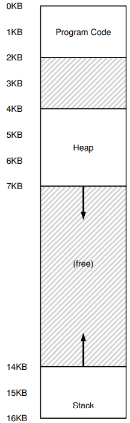
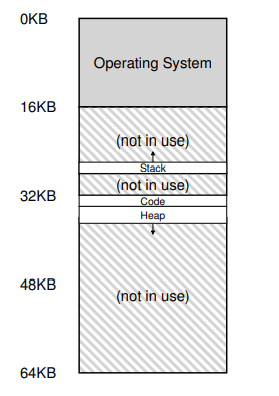
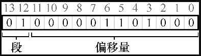
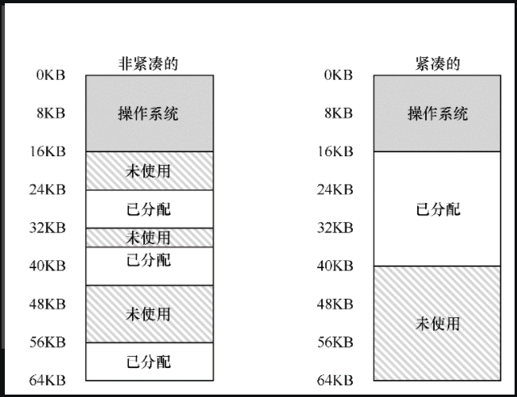

# 分段

基于**动态重定位**的地址转换，有一个假设是将进程的地址空间完整地加载到内存中。虚拟地址从 0 开始，此时的虚拟地址就是偏移量，和基地址（在物理内存中的首地址）相加就可以得到实际存储的物理地址。

但动态重定位有两个缺陷：

- 虽然进程申请了这么多内存空间，但是不是所有的空间都会马上用到，一次加载全部到内存，会造成内存上的浪费；
- 另外，如果剩余物理内存无法提供连续区域来放置完整的地址空间，进程便无法运行。

可以看出，这种基址加界限的方式并不像我们期望的那样灵活，而且当一个进程需要的连续空间越大，这种缺陷就越明显。

为了解决上述问题，提出了**分段**（segmentation）的概念。

## 分段：泛化的基址/界限

分段也是基于基址/界限机制，只是让其更加通用和灵活。

这个想法很简单，在 MMU 中引入多对基址和界限寄存器，分配给地址空间内的每个逻辑段（segment）。

逻辑段，简称为段，一个段是地址空间里的一个连续定长的区域，在典型的地址空间里有 3 个逻辑不同的段：代码、栈和堆。

分段的机制使得操作系统能够将不同的段放到不同的物理内存区域，从而避免了虚拟地址空间中的未使用部分占用物理内存。

比如，我们从进程的角度看内存空间是这个样子：



实际上，在物理空间中的分布是这样的：



从上图可以看出，只有已用的内存才会在物理内存中分配，因此可以处理需要很大内存空间（但不是立即分配所有）的进程，其中包含大量未使用的地址空间（这种包含了空白的地址空间有时又称为**稀疏地址空间**，sparse address spaces）。

硬件上支持分段，需要三对基址/界限寄存器，硬件视图如下表所示：

| 段     | 基地址 | 界限 |
| ------ | ------ | ---- |
| 代码段 | 32KB   | 2KB  |
| 堆     | 34KB   | 3KB  |
| 栈     | 28KB   | 2KB  |

我们先来看一个代码段地址转换的例子，比如现要引用代码段 100 位置的地址，代码段的虚拟地址是从 0 开始的，此时的虚拟地址就是物理地址的偏移量，MMU 将基地址加上 100 就能得到物理地址。

在来看一个堆中地址转换的例子，比如程序需要使用堆中 4200 处的地址，首先应该减去堆在虚拟地址的起始位置（4KB）得到在物理内存中的偏移量为 104，再用偏移量加上堆的基地址（34KB）得到物理地址 34920。

最后看下栈中地址转换的例子。

首先需要说明的一点是上述表格中栈的基地址是栈在物理内存中截止位置的地址，比如栈在物理内存中从 26KB~28KB，基地址为 28KB。之所以会这样，是因为在地址空间章节介绍过，栈内存在进程运行时会向上动态地扩容或收缩，即栈在物理内存中的起始地址会动态变化，所以这里让不会变化的结束地址作为栈的基地址，方便维护。

比如假设要访问栈中 15KB 的虚拟地址，需要使用减去栈的截止虚拟地址（16KB）得到**反向偏移量**为  -1KB ，在和基地址（28KB）相加得物理内存地址为 27KB。

> 注意：上述在地址转换过程中，偏移量由虚拟地址减去虚拟地址的起始（正向偏移量）或截止位置（反向偏移量）得到。
>
> 实际上从硬件视图上看，硬件在处理地址转换时，知道的有虚拟地址、基地址和界限，是不知道虚拟地址的起始或截止位置的，偏移量的计算需要通过其他机制得到（下面会介绍）。
>
> 这里提出计算偏移量的方式只是为了方便说明物理地址是由偏移量和基地址得到的。

## 引用那个段

给任意一个虚拟地址，需要结合对应段的基地址和界限才能够转换为物理地址。现有多对段寄存器，那么在只有一个虚拟地址的情况下，怎么知道这个虚拟地址引用的是那个段的呢？


一种常见的方式（显式方式）就是用虚拟地址的前几位来标识不同的段。比如我们有 14 位的虚拟地址，用前两位来表示段（如果为 00 就表示为代码段的地址，如果为 01 就表示为堆内的地址），用后 12 位来表示段内偏移量。

这时候我们来看 4200 这个虚拟地址是怎么转换为物理地址的。

4200 地址转换为二进制的形式如下所示：



前两位为 01，表示是堆，后 12 为偏移量，其值为 104，这样将偏移量和堆的基址相加，就得到物理地址。

实际上，上述过程硬件代码如下所示：

```
// get top 2 bits of 14-bit VA
Segment = (VirtualAddress & SEG_MASK) >> SEG_SHIFT
// now get offset
Offset = VirtualAddress & OFFSET_MASK 
if (Offset >= Bounds[Segment]) 
	RaiseException(PROTECTION_FAULT) 
else 
	PhysAddr = Base[Segment] + Offset
Register = AccessMemory(PhysAddr)
```

上述代码，`SEG_MASK`为 `0x3000`，`SEG_SHIFT` 为 12，`OFFSET_MASK` 为 `0xFFF`。


硬件还可以通过隐式方式来区分虚拟地址的段。在这种方式中，硬件通过地址产生的方式来确定段，例如，如果地址由程序计数器产生（即它是指令获取），那么地址在代码段。如果基于栈或基址指针，它一定在栈段。其他地址则在堆段。


如果是栈地址，该怎么转换。

栈地址和堆地址不同，栈地址是反向增长的，且基地址为栈空间在物理内存的截止位置。

和堆地址加正向偏移量不同，对于栈，我们需要根据虚拟内存计算出**反向偏移量**和基地址相加才能得到正确的物理地址。

因此为了支持反向增长，硬件还需要知道段的增长方向，需要用一位来区分段的增长方向（1 正向增长，0 反向增长），硬件视图如下所示：

| 段           | 基地址 | 界限（最大为 4K） | 是否正向增长 |
| ------------ | ------ | ----------------- | ------------ |
| 代码段（00） | 32KB   | 2KB               | 1            |
| 堆（01）     | 34KB   | 3KB               | 1            |
| 栈（11）     | 28KB   | 2KB               | 0            |

还是举个例子说明，栈地址的转换过程。假设要访问虚拟地址为 15KB，该虚拟地址的二进制形式是：11 1100 0000 0000。

前两位 11 表示为栈段，后 12 位表示偏移量，值为 3KB。但是这个 3KB 不是我们想要的反向偏移量（其实这个 3KB 表示正向偏移量，而且是相对于最小的栈起始位置而言（这里为 12KB））。

为了得到反向偏移量，我们用正向偏移量（3KB）减去**段最大大小**（这里为 4KB）就可以得到反向偏移量为 -1KB，最后再和栈的基地址（28KB）相加就可以得到物理地址为 27KB。

## 支持共享

随着分段机制的不断改进，系统设计人员很快意识到，通过再多一点的硬件支持，就能实现新的效率提升。具体来说，要节省内存，有时候在地址空间之间共享（share）某些内存段是有用的。尤其是，代码共享很常见，今天的系统仍然在使用。

为了支持共享，需要一些额外的硬件支持，这就是保护位（为每个段增加了几个位，标识程序是否能够读写该段，或执行其中的代码）。

比如通过将代码段标记为只读，同样的代码就可以被多个进程共享，而不用担心破坏隔离。

增加了保护位后，硬件视图就如下所示：

| 段     | 基地址 | 界限 | 是否正向增长 | 保护位  |
| ------ | ------ | ---- | ------------ | ------- |
| 代码段 | 32KB   | 2KB  | 1            | 读/执行 |
| 堆     | 34KB   | 3KB  | 1            | 读/写   |
| 栈     | 28KB   | 2KB  | 0            | 读/写   |

有了保护位，前面描述的硬件算法也必须改变。除了检查虚拟地址是否越界，硬件还需要检查特定访问是否允许。如果用户进程试图写入只读段，或从非执行段执行指令，硬件会触发异常，让操作系统来处理出错进程。

## 操作系统的支持

上述主要介绍了，硬件对分段地址转换的支持。

系统运行时，地址空间中的不同段被重定位到物理内存中。与我们之前介绍的整个地址空间只有一个基址/界限寄存器对的方式相比，大量节省了物理内存（没有使用的内存不会立即分配）。

  

对于分段，操作系统也做出以下支持：

- 第一，操作系统在上下文切换时应该将各个段寄存器中的内容必须正确地保存和恢复；
- 第二，需要管理物理内存的空闲空间，新的地址空间被创建时，操作系统需要在物理内存中为它的段找到可用空间。


考虑到上述操作系统的支持，分段存在**内存碎片**的问题。段的大小不固定，且创建的时间和基地址的位置都具有随机性，随着不断地申请和释放内存，物理内存很快充满了许多空闲空间的小洞，因而很难分配给新的段，或扩大已有的段。

对于内存碎片的解决办法有多种：

一种办法是紧凑（compact）物理内存：重新安排原有的段，使其分布连续。

具体做法是，操作系统先终止运行的进程，将它们的数据复制到连续的内存区域中去，改变它们的段寄存器中的值，指向新的物理地址，从而得到了足够大的连续空闲空间。

内存紧凑成本很高，因为拷贝段是内存密集型的，一般会占用大量的处理器时间。下图展示了内存碎片问题和紧凑后的物理内存：




另一种办法是利用空闲列表管理算法，试图保留大的内存块用于分配。

相关的算法可能有成百上千种，包括传统的最优匹配（best-fit，从空闲链表中找最接近需要分配空间的空闲块返回）、最坏匹配（worst-fit）、首次匹配（first-fit）以及像伙伴算法（buddy algorithm）这样更复杂的内存分配算法。

但遗憾的是，无论算法多么精妙，都无法完全消除外部碎片，因此，好的算法只是试图减小它。

> 提示：如果有一千个解决方案，就没有特别好的
>
> 存在如此多不同的算法来尝试减少外部碎片，正说明了解决这个问题没有最好的办法。因此我们满足于找到一个合理的足够好的方案。唯一真正的解决办法就是完全避免这个问题，永远不要分配不同大小的内存块。


分段还有一个问题就是，分段还是不足以支持更一般化的稀疏地址空间。例如，如果有一个很大但是稀疏的堆，都在一个逻辑段中，整个堆仍然必须完整地加载到内存中。换言之，如果使用地址空间的方式不能很好地匹配底层分段的设计目标，分段就不能很好地工作。

## 总结

分段解决了一些问题，帮助我们实现了更高效的虚拟内存。不只是动态重定位，通过避免地址空间的逻辑段之间的大量潜在的内存浪费，分段能更好地支持稀疏地址空间。它还很快，因为分段要求的算法很容易，很适合硬件完成，地址转换的开销极小。分段还有一个附加的好处：代码共享。如果代码放在独立的段中，这样的段就可能被多个运行的程序共享。

但在内存中分配不同大小的段会导致内存碎片。虽然解决内存碎片的办法有很多，但却没有最好的解决办法。

分段没有支持更一般化的稀疏地址空间。如果有一个很大但是稀疏的堆，都在一个逻辑段中，整个堆仍然必须完整地加载到内存中。

为此我们需要找到新的解决方案。

本文是《[操作系统导论](https://weread.qq.com/web/reader/db8329d071cc7f70db8a479kc81322c012c81e728d9d180)》（英文名：《Operating Systems: three easy pieces》）第 16 章学习笔记。


