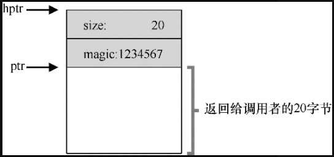

# 空闲空间管理

先抛开其他的地址转换机制不谈，这里先讨论内存管理系统必备的功能——**空闲内存管理**。

从字面意思上讲，空闲空间管理就是管理物理内存可用的空间，在分配内存时从可用空间进行分割内存，在回收时将回收的内存和其他内存合并，以保证有更多的连续空间可以分配。

空闲内存管理面临着诸多挑战，比如满足变长的内存分配需求，如何保证内存碎片最小化，不同方法的时间和空间开销如何？


## 空闲内存管理假设

假定内存的申请和释放就像 `malloc` 和 `free` 提供的那样：

```c
void *malloc(size_t size);
void free(void *ptr);
```

`malloc` 传入一个 size，表示要申请内存的大小，返回指向这块内存首地址的指针；

`free` 接受一个指针，回收这块指针指向的内存，不需要告知待回收内存的大小。

`malloc` 和 `free` 管理的内存为堆，在堆上管理空闲空间的数据结构通常称为**空闲列表**（free list）。该结构包含了管理内存区域中所有空闲块的引用。当然，该数据结构不一定真的是列表，而只是某种可以追踪空闲空间的数据结构。


假设空闲内存管理关心的为**外部碎片**，即物理内存中的碎片。

分配程序也可能有**内部碎片**（internal fragmentation）的问题。如果分配程序给出的内存块超出请求的大小，在这种块中超出请求的空间（因此而未使用）就被认为是内部碎片（因为浪费发生在已分配单元的内部），这是另一种形式的空间浪费。


假设内存一旦分配给用户，就不可以被重新定位到其他位置，直到调用释放函数将内存归还。


假设分配程序所管理的是连续的一块字节区域，分配的区域在整个生命周期内大小固定。

## 底层机制

在深入空闲内存管理细节之前，我们先来介绍大多数分配程序采用的通用机制。

首先，探讨空间**分割与合并**的基本知识。其次，讨论如何利用空闲区域的内部空间维护一个简单的列表，来**追踪空闲和已分配的空间**。

### 分割与合并

一般来讲，空闲列表由一组元素组成，元素记录了堆中哪些内存还没有分配。元素一般包含起始地址空闲空间长度两个属性，来表示这块空闲从哪里开始的，一共有多大。比如，一个简单的空闲列表如下所示：

```
head -> (addr:0 len:10) -> (addr:20 len:10) -> NULL
```

上述空闲列表中有两个元素，表示了两块空闲空间，第一个元素表示一个空闲空间为地址 0~9，第二个空闲空间为地址 20~29。


基于上面的例子，我们来看下分割和合并的过程。

假设我们只申请 1 个字节的内存，这种情况下，分配程序会执行所谓的**分割**（splitting）动作：它找到一块可以满足请求的空闲空间，将其分割，第一块返回给用户，第二块留在空闲列表中。

比如分配程序将上述第二块空闲空间起始的一个字节分配给程序，这时候空闲列表就变为：

```
head -> (addr:0 len:10) -> (addr:21 len:10) -> NULL
```

可以看到第二块空闲空间地址变为 21~29。


还是这个例子，如果这时候程序调用 `free(10)`，归还上述中间地址空间，这时候分配程序会判断归还空间连续的两边是否有空闲内存空间，如果有则**合并**这些内存，合并后的空闲列表如下：

```
head -> (addr:0 len:30)-> NULL
```

可以看到，空闲列表中只有一个元素，即回到了堆未分配内存前的样子。

### 追踪分配空间的大小

你可以注意到，内存回收函数 `void free(void *ptr)`，回收的入参只是指向回收内存的一个指针，并没有包含回收内存的大小。

为了内存分配库可以很快确定要释放空间的大小，大多数分配程序都会在头块（header）中保存一点额外的信息，它在内存中，通常就在返回的内存块之前，如下图所示：



一个简单的头块一般包括分配空间的大小和一个魔数（来提供内存完整性检查），其结构如下：

```c
typeof struct header_t {
    int size;
    int magic;
} header_t;
```

库可以通过简单的指针运算，得到头块指针的地址：

```c
void free(void *ptr) {
   header_t *hptr = (void *) ptr - sizeof(header_t);
}
```

获得头块指针后，库函数就可以得到 magic 来校验是否符合预期的值，得到 size 来计算要释放内存的大小。

## 基本策略

下面介绍下空闲内存管理的基本策略，这些策略或侧重于分配效率，或侧重于内存碎片最小化，但都不完美。

### 最优匹配

最优匹配（best fit）策略非常简单：首先遍历整个空闲列表，找到和请求大小一样或更大的空闲块，然后返回这组候选者中最小的一块。

最优匹配侧重于追求最小的内存碎片：选择最接近用户请求大小的块，从而尽量避免空间浪费。然而，简单的实现在遍历查找正确的空闲块时，要付出较高的性能代价。

### 最差匹配

最差匹配（worst fit）方法与最优匹配相反，它尝试找最大的空闲块，分割并满足用户需求后，将剩余的块（很大）加入空闲列表。

最差匹配尝试在空闲列表中保留较大的块，而不是向最优匹配那样可能剩下很多难以利用的小块。但是，最差匹配同样需要遍历整个空闲列表。更糟糕的是，大多数研究表明它的表现非常差，导致过量的碎片，同时还有很高的开销。

### 首次匹配

首次匹配（first fit）策略就是找到第一个足够大的块，将请求的空间返回给用户，剩余的空闲空间留给后续请求。

首次匹配有速度优势（不需要遍历所有空闲块），但有时会让空闲列表开头的部分有很多小块。

因此，分配程序如何管理空闲列表的顺序就变得很重要，比如是按照空闲内存从小到达匹配，那么首次匹配的结果就和最优匹配一样，如果是按照空闲空间从大到小排序，那么匹配结果就和最差匹配一致。

一种方式是基于地址排序（address-based ordering）。通过保持空闲块按内存地址有序，合并操作会很容易，从而减少了内存碎片。

### 下次匹配

不同于首次匹配每次都从列表的开始查找，下次匹配（next fit）算法多维护一个指针，指向上一次查找结束的位置。其想法是将对空闲空间的查找操作扩散到整个列表中去，避免对列表开头频繁的分割。这种策略的性能与首次匹配很接近，同样避免了遍历查找。

### 分离空闲列表

一直以来有一种很有趣的方式叫作分离空闲列表（segregated list）。基本想法很简单：如果某个应用程序经常申请一种（或几种）大小的内存空间，那就用一个独立的列表，只管理这样大小的对象。其他大小的请求都交给更通用的内存分配程序。

这种方法的好处显而易见。通过拿出一部分内存专门满足某种大小的请求，碎片就不再是问题了。而且，由于没有复杂的列表查找过程，这种特定大小的内存分配和释放都很快。

就像所有好主意一样，这种方式也为系统引入了新的复杂性。例如，应该拿出多少内存来专门为某种大小的请求服务，而将剩余的用来满足一般请求？

Jeff Bonwick 为 Solaris 系统内核设计的**厚块分配程序**（slab allocator），很优雅地处理了这个问题。

具体来说，在内核启动时，它为可能频繁请求的内核对象创建一些对象缓存，如锁和文件系统 inode 等。

这些的对象缓存每个分离了特定大小的空闲列表，因此能够很快地响应内存请求和释放。如果某个缓存中的空闲空间快耗尽时，它就向通用内存分配程序申请一些内存厚块（slab）（总量是页大小和对象大小的公倍数）。

相反，如果给定厚块中对象的引用计数变为0，通用的内存分配程序可以从专门的分配程序中回收这些空间，这通常发生在虚拟内存系统需要更多的空间的时候。

### 伙伴系统

因为合并对分配程序很关键，所以人们设计了一些方法，让合并变得简单，一个好例子就是**二分伙伴分配程序**。

在这种系统中，空闲空间首先从概念上被看成大小为 2^N 的大空间。当有一个内存分配请求时，空闲空间被递归地一分为二，直到刚好可以满足请求的大小。

伙伴系统最优秀的地方在于，块被释放时，其可以快速检测其伙伴内存（一起一分为二的另一块内存）是否空闲，如果空闲就合并，这个合并的过程递归进行，，直到合并整个内存区域，或者某一个块的伙伴还没有被释放。

## 总结

本文介绍了虚拟内存空间管理的问题。

这里以分配内存大小不统一为前提，提出了多种内存分配策略。

这些策略要么侧重分配效率，要么侧重保证内存碎片最小化，但这两者不能同时保证完美。根本原因是因为分配内存大小不统一造成的。后面会介绍基于统一内存大小的内存分配。

本文是《[操作系统导论](https://weread.qq.com/web/reader/db8329d071cc7f70db8a479kc81322c012c81e728d9d180)》（英文名：《Operating Systems: three easy pieces》）第 17 章学习笔记。