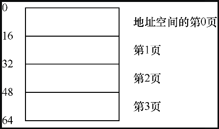
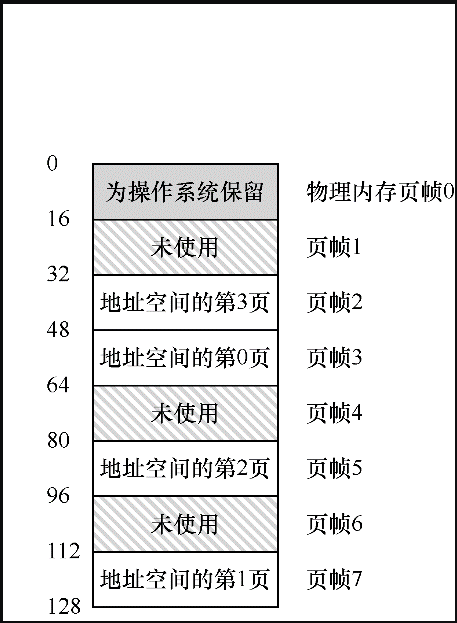
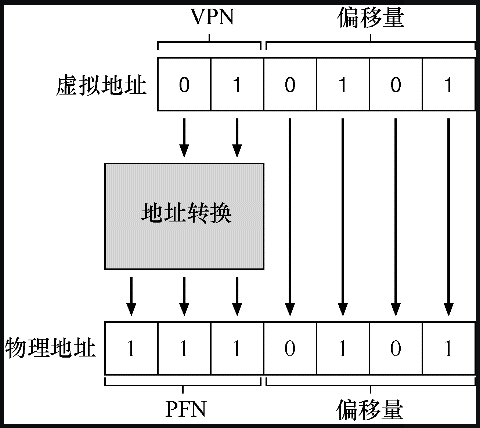
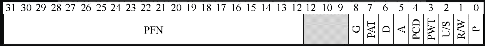

# 分页

一般来讲，操作系统有两种方法来解决内存管理问题。

第一个方法就是将空间分割成不同长度的分片，就像虚拟内存管理中的**分段**。遗憾的是分段存在内存碎片的问题，且不好解决。

第二个方法则是将空间分割成固定长度的分片，在虚拟内存中，我们称这种思想为**分页**。

接下来我们主要关注的问题就是如何通过页来实现虚拟内存，分页是如何避免了分段内存碎片的问题的？

## 一个例子

我们先通过一个例子，直观的了解分页的处理方式。

一个大小为 64 字节的虚拟地址空间，分页如下所示：



其对应在 128 字节的物理内存中的分布如下所示：



可以看出，虚拟地址空间一共分成了 4 个页，每页的大小为 16 个字节。物理内存一共有 8 个页帧，每个这样的页帧包含一个虚拟内存页。

操作系统将地址空间的虚拟页 0 放在物理页帧 3，虚拟页 1 放在物理页帧 7，虚拟页 2 放在物理页帧 5，虚拟页 3 放在物理页帧 2。

为了记录地址空间的每个虚拟页放在物理内存中的位置，操作系统通常为每个进程保存一个数据结构，称为**页表**（page table）。页表的主要作用是存放页号和对应页在物理内存中的起始位置，称之为页表格条目（PTE）。

> 需要注意的是，这个页表是每个进程一个（per-process）的数据结构。


下面来说明一个基于分页地址转换的例子。假设有一个进程在一个小地址空间（64 字节）里访问内存。

这个地址空间分成了 4 个页，每页 16 个字节。

为了转换虚拟地址，我们需要把虚拟地址分成两个部分，虚拟页面号（VPN, virtual page number）和偏移量（offset）。

对于这个例子，由于地址空间为 64 个字节，因此虚拟地址一共有 6 位。地址一共分成了 4 页，所以让地址的前两位表示页号，后 4 位标识页内偏移量（每页的大小位 16 个字节，因此用 4 位能够表示页内全部偏移量）。


这时候假设，程序加载的地址是 21。

将 21 转换为二进制格式为 01 0101，根据上述规定，页号 1，偏移量为 5。

这时候我们可以检索页表，得到页号对应物理页对应的帧号 PFN（有时也称为物理页号（PPN, physical page number）），这里为 7；

因此，我们可以通过用 PFN 替换 VPN 来转换此虚拟地址，偏移量不变，这样就可以得到物理内存为 117。

上述地址转换的过程如下所示：



## 页表内容

页表中究竟有什么内容？

页表就是一种数据结构，用于将虚拟地址（或者实际上，是虚拟页号）映射到物理地址（物理帧号）。

因此，任何数据结构都可以采用。最简单的形式称为线性页表（linear page table），就是一个数组。操作系统通过虚拟页号（VPN）检索该数组，并在该索引处查找页表项（PTE），以便找到期望的物理帧号（PFN）。


至于每个 PTE 的内容，我们在其中有许多不同的位，其中包括：

- 有效位（validbit）通常用于指示特定地址转换是否有效；
- 保护位（protection bit），表明页是否可以读取、写入或执行；
- 存在位（present bit），表示该页是在物理存储器还是在磁盘上（当我们研究如何将部分地址空间交换（swap）到磁盘，从而支持大于物理内存的地址空间时，我们将进一步理解这一机制）；
- 脏位（dirty bit）也很常见，表明页面被带入内存后是否被修改过；
- 参考位（reference bit，也被称为访问位，accessed bit）有时用于追踪页是否被访问，也用于确定哪些页很受欢迎，因此应该保留在内存中。
- .....
- PFN，物理帧号。

下图展示了 x86架构页表项结构：



## 分页占用空间问题

页表应该存放到哪里呢？

首先我们需要知道页表可以很大，对于 32 位的操作系统来说，每个页的大小为 4KB，那么一共就有 2^20 个页（大约一百万），虚拟地址需要用 20 存放 VPN，然后用 12 为存放偏移量。

每个页表格条目（PTE）需要 4 个字节来保存物理地址转换和任何其他有用的东西，这一个一个完整的页表需要 2^22 字节（4MB）的大小。

上述我们简单介绍页表是一个 per-process 结构，这意味着，每个进程都要维护一个 4MB 大的页表，可见页表是很占空间的。

由于页表如此之大，我们没有在 MMU 中利用任何特殊的片上硬件，来存储当前正在运行的进程的页表，而是将每个进程的页表存储在内存中，但不是存放全部页表，这个下面将会介绍。

## 分页效率问题

内存中的页表，我们已经知道它们可能太大了。事实证明，它们也会让内存访问速度变慢。

这里从硬件的角度看一下地址转换的处理逻辑：

```
// 获取到页号
VPN = (VirtualAddress & VPN_MASK) >> SHIFT
// 根据内存页表起始地址和页号得到页表项地址
PTEAddr = PTBR + (VPN * sizeof(PTE))
// 从页表项中获取到物理页帧起始地址
PTE = AccessMemory(PTEAddr)

// 检测进程是否能够访问该页
if (PTE.Valid == False)
  RaiseException(SEGMENTATION_FAULT)
else if (CanAccess(PTE.ProtectBits) == False)
  RaiseException(PROTECTION_FAULT)
else
// 检查通过，更加虚拟地址计算偏移量
offset = VirtualAddress & OFFSET_MASK
// 将偏移量和页帧起始地址相加的实际物理地址
PhysAddr = (PTE.PFN << PFN_SHIFT) | offset
// 从内存中获取所需的数据并将其放入寄存器 eax
Register = AccessMemory(PhysAddr)
```

相比于分段直接从基址寄存器里获取首地址，分页需要从内存中的页表里获取首地址，这样会多一次内存访问的操作（内存引用）。额外的内存引用开销很大，在这种情况下，可能会使进程减慢两倍或更多。

## 总计

本文介绍了分页机制，与以前的方法（如分段）相比，分页有许多优点。首先，它不会导致外部碎片，因为分页（按设计）将内存划分为固定大小的单元。其次，它非常灵活，支持稀疏虚拟地址空间。

但也留下了两个需要去解决的问题，第一个是分页地址转换效率的问题，使用分页每次都需要从内存中的页表获取页表项，增加了内存引用开销。

其次页表会占用比比较大的内存空间。


本文是《[操作系统导论](https://weread.qq.com/web/reader/db8329d071cc7f70db8a479kc81322c012c81e728d9d180)》（英文名：《Operating Systems: three easy pieces》）第 18 章学习笔记。


