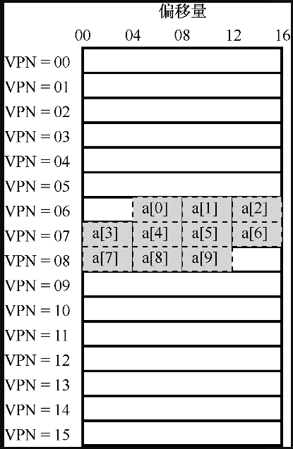
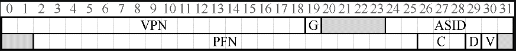

# 快速地址转换（TLB）

使用分页作为核心机制来实现虚拟内存，可能会带来较高的性能开销。

因为记录分页地址信息的页表存放在物理内存上，所以在转换虚拟地址时，分页逻辑上需要一次额外的内存访问（第一次访问页表，第二次从内存获取需要的数据）。

那么如何才能加速虚拟地址转换，尽量避免额外的内存访问？

为了加速地址转换，我们需要硬件上的支持，增加**地址转换旁路缓冲存储器**（TLB, translation-lookaside buffer），它相当于虚拟地址到物理地址的缓存，对每次内存访问，硬件先检查 TLB，看看其中是否有期望的转换映射，如果有就完成转换，不用访问页表。所以有时候又叫它地址转换缓存（address-translation cache）。

## TLB 基本算法

下面从硬件的角度展示了有 TLB 后地址转换的过程。

```
1 VPN = (VirtualAddress & VPN_MASK) >> SHIFT
2 (Success, TlbEntry) = TLB_Lookup(VPN)
3 if (Success == True) // TLB Hit
4 	if (CanAccess(TlbEntry.ProtectBits) == True)
5 		Offset = VirtualAddress & OFFSET_MASK
6 		PhysAddr = (TlbEntry.PFN << SHIFT) | Offset
7 		Register = AccessMemory(PhysAddr)
8 	else
9 		RaiseException(PROTECTION_FAULT)
10 else // TLB Miss
11 	PTEAddr = PTBR + (VPN * sizeof(PTE))
12 	PTE = AccessMemory(PTEAddr)
13 	if (PTE.Valid == False)
14 		RaiseException(SEGMENTATION_FAULT)
15 	else if (CanAccess(PTE.ProtectBits) == False)
16		RaiseException(PROTECTION_FAULT)
17 	else
18 		TLB_Insert(VPN, PTE.PFN, PTE.ProtectBits)
19 		RetryInstruction()
```

硬件算法的大体流程如下：

- 从虚拟地址中提取页号（VPN）；
- 检查 TLB 中是否有该 VPN 的转换映射；
- 如果有（TLB 命中），进行保护检查，检查通过后就从相关的 TLB 项中取出页帧号（PFN），与原来虚拟地址中的偏移量组合形成期望的物理地址（PA），并访问内存，如果没有就触发异常；
- 如果 TLB 中没有 VPN 转换映射（TLB 没有命中），硬件就需要访问物理内存中的页表，获取页帧号，进保护检查，检查通过后将页帧号更新至 TLB，当 TLB更新成功后，系统会重新尝试该指令。


下面通过一个访问数组的例子，来说明使用 TLB 后内存的访问情况。

 这里假设进程可用虚拟空间为 256B，每页的大小为 16B，一共 16 页。虚拟地址一共 8 位，我们用前 4 位表示虚拟页号，后 4 位表示页内偏移量。

考虑下面的代码：

```c
int a[10] = {0};
int sum = 0;
for (i = 0; i < 10; i++) {
	sum += a[i];
}
for (i = 0; i < 10; i++) {
	sum += a[i];
}
```

这里有一个长度为 10 的 int 数组，并假设这个数组起始的虚拟地址为 100，然后代码里在循环里访问数组中的元素，并做累加操作。

下图展示了这个数组在虚拟空间中的分布情况：



从上如可以看出，数组分布在虚拟内存的 6、7、8 页。

简单起见，我们假装循环产生的内存访问只是针对数组（忽略指令和变量），访问情况如下：

- 访问 a[0] 时，CPU 会看到载入虚存地址 100，硬件从中提取 VPN（VPN=06），然后用它来检查 TLB，寻找有效的转换映射，假设这里是程序第一次访问该数组，所以 TLB 未命中，然后去页表查询 PTE，并更新 TLB；
- 访问 a[1] 时，虚拟地址为 104，VPN 仍然为 6，此时检查 TLB，TLB 命中；
- 访问 a[2] 时，虚拟地址为 108，VPN 也为 6，TLB 命中；
- 访问 a[3] 时，虚拟地址为 112，VPN 为 7，TLB 未命中；
- ....

总得来讲，访问数组 TLB 的命中情况为：未命中、命中、命中、未命中、命中、命中、命中、未命中、命中、命中。

这样算下来 TLB 的命中率为 70%。

如果我们再次循环访问数组元素，这时候会发现 TLB 会全部命中。


TLB 可以看作是虚拟页号到 PTE 的高速缓存，缓存最重要的一个指标就是缓存的命中率，命中率越高，越能发挥缓存的优势。

高缓存命中率背后的思想是指令和数据引用的局部性，分为**空间局部性**和**时间局部性**。

所谓空间局部性，就是指当程序访问内存地址 x 时，可能很快会访问邻近 x 的内存。比如上述例子中，在同一个页中的元素只需要访问一次页表，后面的 TLB 都会命中。

所谓的时间局部性，最近访问过的指令或数据项可能很快会再次访问。比如上述例子中，我们再次循环访问数组时，TLB 会全部命中。

## 处理 TLB 未命中

当 TLB 没有命中时，谁来处理呢？

答案可能有两个，硬件或软件（操作系统）。

如果硬件处理，硬件必须知道页表在内存中的确切位置（通过页表基址寄存器），和页表的确切格式，发生未命中时，硬件会“遍历”页表，找到正确的页表项，取出想要的转换映射，用它更新 TLB，并重试该指令。


如果是软件处理，发生 TLB 未命中时，硬件系统会抛出一个异常，这会暂停当前的指令流，将特权级提升至内核模式，跳转至陷阱处理程序（trap handler），这段程序里会查找页表中的转换映射，然后用特别的“特权”指令更新 TLB，并从陷阱返回。

需要注意的是，这里的从陷阱返回指令稍稍不同于之前提到的服务于系统调用的从陷阱返回。系统调用返回会接着执行陷入操作系统之后那条指令，就像从函数调用返回后，会继续执行此次调用之后的语句。但这次的 TLB 未命中中断返回，硬件必须从导致陷阱的指令继续执行，重新访问 TLB。


软件管理的方法，主要优势是灵活性：操作系统可以用任意数据结构来实现页表，不需要改变硬件。另一个优势是硬件会变得简单，越简单，就越开放。

> RISC 与 CISC
>
> 关于 CPU 指令设计有两种模式，一种是 CISC，即复杂指令集计算（Complex Instruction Set Computing），另一方是 RISC，即精简指令集计算（Reduced Instruction Set Computing）。
>
> CISC 指令集倾向于拥有许多指令，每条指令比较强大。
>
> RISC 指令集恰恰相反。RISC 背后的关键观点是，指令集实际上是编译器的最终目标，所有编译器实际上需要少量简单的原语，可以用于生成高性能的代码。因此，RISC倡导者们主张，尽可能从硬件中拿掉不必要的东西（尤其是微代码），让剩下的东西简单、统一、快速。	


## TLB 的内容

TLB 缓存的是地址转换映射，一条 TLB 项内容可能像下面这样：

```
VPN | PFN | 其他位
```

其他位中通常会有一个有效位，用来标识该项是不是有效地转换映射。

需要注意的是 TLB 项的有效位不同于 PTE（页表项）的有效位。PTE 无效表示就意味着该页并没有被进程申请使用，正常运行的程序不应该访问该地址。

TLB 的有效位不同，只是指出 TLB 项是不是有效的地址映射。例如，系统启动时，所有的 TLB 项通常被初始化为无效状态，因为还没有地址转换映射被缓存在这里。一旦启用虚拟内存，当程序开始运行，访问自己的虚拟地址，TLB 就会慢慢地被填满，因此有效的项很快会充满 TLB。

TLB 有效位在系统上下文切换时起到了很重要的作用。通过将所有 TLB 项设置为无效，系统可以确保将要运行的进程不会错误地使用前一个进程的虚拟到物理地址转换映射。

## 上下文切换时对 TLB 的处理

由于每个进程都有自己独立的虚拟地址空间，所以 TLB 中包含的虚拟到物理的地址映射只对当前进程有效，对其他进程是没有意义的。

因此发生进程切换时，硬件或操作系统必须注意确保即将运行的进程不要误读了之前进程的地址映射。


比如当一个进程 P1 正在运行时，假设 P1 的 10 号虚拟页映射到了 100 号物理帧。

操作系统不久后决定进行一次上下文切换，运行 P2，这里假定 P2 的 10 号虚拟页映射到 170 号物理帧。

这时候 TLB 的内容如下所示：

| VPN  | PFN  | 有效位 | 保护位 |
| ---- | ---- | ------ | ------ |
| 10   | 100  | 1      | rwx    |
| -    | -    | 0      | -      |
| 10   | 170  | 1      | rwx    |
| -    | -    | 0      | -      |

在上面的 TLB 中，很明显有一个问题：VPN 10 被转换成了 PFN 100（P1）和PFN170（P2），但硬件分不清哪个项属于哪个进程。所以我们还需要做一些工作，让 TLB 正确而高效地支持跨多进程的虚拟化。


那么在进程切换时如何管理 TLB 里的内容，以保证不同进程的 TLB 项不会相互干扰呢？

一种方案就是，在进程上下文切换时简单地清空 TLB。

具体来讲，如果是软件管理 TLB，可以通过在发生上下文切换时，通过一条显式的（特权）指令来清空 TLB。如果是硬件管理 TLB，则可以在页表基址寄存器内容发生变化时清空 TLB。清空 TLB 操作可以通过上述提到了有效位来完成，即把全部 TLB 项的有效位全部置为 0。

上下文切换的时候清空 TLB，这是一个可行的解决方案，进程不会再读到错误的地址映射。但是这个方案有一定的开销，每次进程运行，当它访问数据和代码页时，都会触发 TLB 未命中。如果操作系统频繁地切换进程，这种开销会很高。


为了减少这种开销，一些系统增加了硬件支持，实现跨上下文切换的 TLB 共享。比如有的系统在 TLB 中添加了一个地址空间标识符（Address Space Identifier，ASID）。可以把 ASID 看作是进程标识符（Process Identifier，PID），用来区分不同的进程，但通常比 PID 位数少（PID 一般 32 位，ASID 一般是 8 位）。添加了 ASID 后，TLB 的内容如下所示：

| VPN  | PFN  | 有效位 | 保护位 | ASID |
| ---- | ---- | ------ | ------ | ---- |
| 10   | 100  | 1      | rwx    | 1    |
| -    | -    | 0      | -      | -    |
| 10   | 170  | 1      | rwx    | 2    |
| -    | -    | 0      | -      | -    |

有了地址空间标识符来标识不同的进程，这样就不会发生冲突。

当然，硬件也需要知道当前是哪个进程正在运行，以便进行地址转换，因此操作系统在上下文切换时，必须将某个特权寄存器设置为当前进程的 ASID。


这里补充一种情况，就是不同的进程可能会引用了同一块物理内存，下面的表格就展示了这种情况：

| VPN  | PFN  | 有效位 | 保护位 | ASID |
| ---- | ---- | ------ | ------ | ---- |
| 10   | 101  | 1      | r-x    | 1    |
| -    | -    | 0      | -      | -    |
| 50   | 101  | 1      | r-x    | 2    |
| -    | -    | 0      | -      | -    |

这种情况是可能发生的，比如两个进程共享了代码页，这是有用的，因为它减少了物理页的使用，从而减少了内存开销。

## TLB 替换

TLB 和其他缓存一样，还有一个问题要考虑，即缓存替换（cachereplacement），或者叫缓存淘汰，毕竟缓存的空间是有限且宝贵的。

那么如何设计替换策略，即在向 TLB 添加新项时，应该替换哪个旧项，并保持 TLB 高命中率？

这里列举几个典型的淘汰策略：

 一种是替换**最近最少使用（least-recently-used，LRU）**的项。LRU 尝试利用内存引用流中的局部性，假定最近没有用过的项，可能是好的换出候选项。

另一种典型策略就是**随机（random）策略**，即随机选择一项换出去。这种策略很简单，并且可以避免一种极端情况。例如，一个程序循环访问 n+1个页，但 TLB大小只能存放 n 个页。这时之前看似“合理”的 LRU 策略就会表现得不可理喻，因为每次访问内存都会触发 TLB 未命中，而随机策略在这种情况下就好很多。

## TLB 实际结构

最后，我们简单看一下真实的 TLB 的结构，这个例子来自 MIPS R4000，它是一种现代的系统，采用软件管理 TLB。下图展示了 MIPS TLB 项（稍微简化）：



MIPS R4000 支持 32 位的地址空间，页大小为 4KB。所以在典型的虚拟地址中，预期会看到 20 位（2^32/4K）的 VPN 和 12 位的偏移量。但是，你可以在 TLB 中看到，只有 19 位的VPN。事实上，用户地址只占地址空间的一半（剩下的留给内核），所以只需要 19 位的 VPN。

VPN 转换成最大 24 位的物理帧号（PFN），因此可以支持最多有 64GB 物理内存（224 个 4KB 内存页）的系统。

MIPS TLB 还有一些有趣的标识位。比如全局位（Global, G），用来指示这个页是不是所有进程全局共享的。因此，如果全局位置为 1，就会忽略 ASID。

MIPS TLB 用 8 位存放 AISD，用它来区分进程空间。

有三位的一致性位（Coherence, C），决定硬件如何缓存该页。

脏位（Dirty, D），表示该页是否被写入新数据（后面会介绍用法）。

有效位（Valid, V），告诉硬件该项的地址映射是否有效。


MIPS 的 TLB 通常有 32 项或 64 项，大多数提供给用户进程使用，也有一小部分留给操作系统使用。操作系统可以设置一个被监听的寄存器，告诉硬件需要为自己预留多少 TLB 槽。这些保留的转换映射，被操作系统用于关键时候它要使用的代码和数据。

由于 MIPS 的 TLB 是软件管理的，所以系统需要提供一些更新 TLB 的指令。MIPS 提供了 4 个这样的指令：

- TLBP，用来查找指定的转换映射是否在TLB中；
- TLBR，用来将TLB中的内容读取到指定寄存器中；
- TLBWI，用来替换指定的TLB项；
- TLBWR，用来随机替换一个TLB项。

操作系统可以用这些指令管理 TLB 的内容，当然这些指令都是特权指令。

## 总结

我们了解了硬件如何让地址转换更快的方法。通过增加一个小的、芯片内的 TLB 作为地址转换的缓存，大多数内存引用就不用访问内存中的页表了。因此，在大多数情况下，程序的性能就像内存没有虚拟化一样，这是操作系统的杰出成就，当然对现代操作系统中的分页非常必要。

由于 TLB 会带来良好内存访问性能提升，所以当 TLB 失效时或未命中性能会下降的比较明显。

但是，TLB 也不能满足所有的程序需求：

- 超出 TLB 覆盖范围（TLB coverage）：一个程序短时间内访问的页数超过了TLB中的页数，就会产生大量的 TLB 未命中，运行速度就会变慢。

  解决这个问题的一种方案是支持更大的页，把关键数据结构放在程序地址空间的某些区域，这些区域被映射到更大的页，使 TLB 的有效覆盖率增加。对更大页的支持通常被数据库管理系统（Database Management System，DBMS）这样的程序利用，它们的数据结构比较大，而且是随机访问。

- 访问 TLB 很容易成为 CPU 流水线的瓶颈（还是不够快），尤其是有所谓的物理地址索引缓存（physically-indexed cache）。有了这种缓存，地址转换（通过 TLB）必须发生在访问该缓存之前，这会让访问高速缓存的操作变慢。为了解决这个潜在的问题，人们研究了各种巧妙的方法，用虚拟地址直接访问缓存，从而在缓存命中时避免昂贵的地址转换步骤。

