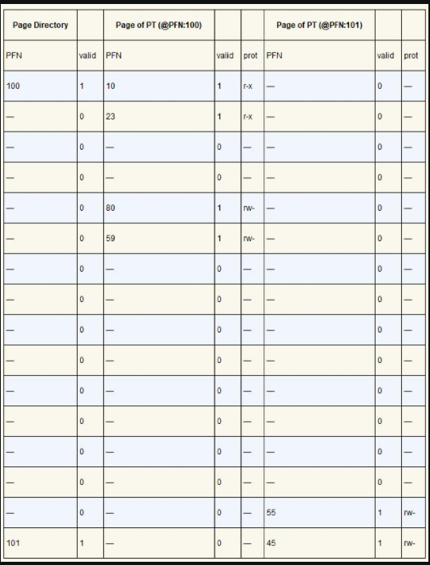
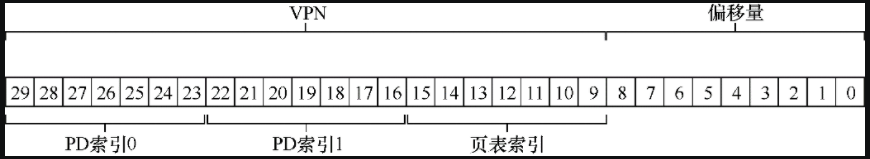

# 多级页表

如果分页的数量过多，那么就需要比较大的空间来存储页表，而且页表还是一个 per-process 结构，会占用很多内存空间。

比如 32 位的操作系统，每页大小位 4KB，那么一共可分为 2^20 个页，每个页表表项占用 4 个字节，这样整个页表就会占用 4MB 的空间。

如果此时有 100 个活动的进程，这意味着需要怕 400MB 的空闲来容纳页表，可见占用的内存很大。

那么如何让页表变小，关键的思路是什么？变小的页表结构，对地址转换的效率有没有影响？

## 更大的页

一个简单的方法是每页分配更大的空间，这样页的总数就会变少，页表就会变小。

比如 32 位的操作系统，每页 16KB，这样一共可分成 2^18 个页，这时候整个页表的大小为 1MB，缩减为原来（每页 4KB）的 1/4。

然而这种方法的主要问题在于，大内存页会导致每页内的浪费，这被称为**内部碎片**（internal fragmentation）问题（因为浪费在分配单元内部）。

比如应用程序会分配大的内存页，但只用每页的一小部分。

> 另外请注意，许多体系结构（例如 MIPS、SPARC、x86-64）现在都支持多种页大小。
>
> 这些操作系统通常使用一个小的（4KB 或 8KB）页大小，并支持为某个程序分配更大的内存页。这种类型的大页在数据库管理系统和其他高端商业应用程序中很常见。
>
> **然而，多种页面大小的主要原因并不仅是为了节省页表空间，而是为了提高 TLB 的命中率**。
>
> 然而，采用多种页大小，使操作系统虚拟内存管理程序显得更复杂，因此，有时只需向应用程序暴露一个新接口，让它们直接请求大内存页，这样最容易。

## 混合分段和分页

我们知道，分页的页数如果很多，页表占用的内存就会很大。重要的一点是，虽然给页表分配了这么大的内存，但不是所有页表项都能用到，这就造成了空间上的浪费。

比如，这里有一个 16KB 的地址空间，每页 1KB，虚拟地址空间页号和物理内存页帧号如下图所示：


那么这个页表的结构如下所示：

| PFN  | valid | prot | present | dirty |
| ---- | ----- | ---- | ------- | ----- |
| 10   | 1     | r-x  | 1       | 0     |
| -    | 0     | -    | -       | -     |
| -    | 0     | -    | -       | -     |
| -    | 0     | -    | -       | -     |
| 23   | 1     | rw-  | 1       | 1     |
| -    | 0     | -    | -       | -     |
| -    | 0     | -    | -       | -     |
| -    | 0     | -    | -       | -     |
| -    | 0     | -    | -       | -     |
| -    | 0     | -    | -       | -     |
| -    | 0     | -    | -       | -     |
| -    | 0     | -    | -       | -     |
| -    | 0     | -    | -       | -     |
| -    | 0     | -    | -       | -     |
| 28   | 1     | rw-  | 1       | 1     |
| 4    | 1     | rw-  | 1       | 1     |

可以看到上述页表中存在大量的无效项，这还只是一个微小的 16KB 地址空间，如果空间更大，浪费的空间会更多。


为了解决上述问题，我们采用分段和分页混合的方式。

分段和分页混合的方式不是为进程的整个地址空间提供单个页表，而是为每个逻辑分段提供一个，然后让每个段基址寄存器存放该段的页表的物理地址（不在存放段本身起始地址），段界限寄存器存放该段一共有多少页（不在存放段的大小）。

假设 32 位虚拟地址空间包含 4KB 页面，并且地址空间分为 4 个段，要确定地址引用哪个段，我们会用地址空间的前两位。假设 00 是未使用的段，01 是代码段，10 是堆段，11 是栈段。因此，虚拟地址如下所示：


在 TLB 未命中时（假设硬件管理的 TLB，即硬件负责处理 TLB 未命中），硬件使用分段位（SN）来确定要用哪个基址和界限对。然后硬件将其中的物理地址与VPN 结合起来，形成页表项（PTE）的地址：

```
SN  = (VirtualAddress & SEG_MASK) >> SN_SHIFT
VPN = (VirtualAddress & VPN_MASK) >> VPN_SHIFT

AddressOfPTE = Base[SN] + (VPN * sizeof(PTE))
```

混合方案的关键区别在于，每个分段都有界限寄存器，每个界限寄存器保存了段中最大有效页的值。这样，给每个段分配其最大有效页的页表项空间即可，例如，如果代码段使用它的前 3 个页（0、1 和 2），则代码段页表将只有 3 个项分配给它，并且界限寄存器将被设置为 3。内存访问超出段的末尾将产生一个异常，并可能导致进程终止。以这种方式，与线性页表相比，混合方法实现了显著的内存节省。栈和堆之间未分配的页不再占用页表中的空间（仅将其标记为无效）。


但是，你可能会注意到，这种方法并非没有问题。首先，它仍然要求使用分段。正如我们讨论的那样，分段并不像我们需要的那样灵活，因为它假定地址空间有一定的使用模式。例如，如果有一个大而稀疏的堆（堆内部有空白空间未使用），仍然可能导致大量的页表浪费。

其次，这种杂合导致外部碎片再次出现。尽管大部分内存是以页面大小单位管理的，但页表现在可以是任意大小（每个段由若干个页组成，是 PTE 的倍数），因此，在内存中为它们寻找自由空间更为复杂。

## 多级页表

多级页表也试图解决相同的问题：如何去掉页表中的所有无效区域，而不是将它们全部保留在内存中？多级页表是怎么做到这一点的呢？

多级页表的基本思想很简单。

首先，将页表分成页大小的单元（页表页）。

然后，如果整页的页表项（PTE）无效，就完全不分配该页的页表。

为了追踪页表的页是否有效，使用了名为**页目录**（page directory）的新结构。页目录由多个**页目录项**组成（PDE），每个 PDE 至少拥有有效位和物理页帧号（PFN）组成。这里的有效位是指zh'gezhge

页目录因此可以告诉你页表项的页在哪里，或者页表的整个页不包含有效页。

下图展示了线性和多级页表对同样大小地址空间的管理：


如上图所示，线性页表中存在大量的无效的页表项，线性页表需要为这些无效页表项分配空间。

可以看出多级页表不在用线性结构来存储页表项，而是利用一种类似于树状的结构来存储。

多级页表将页表项拆分成页，并用页目录来记录页表项页的位置。如果整个页表项页里的页表项都是无效的，那么在页目录里记录整个页表项页无效即可，而不用分配空间（比如上述的线性页表中的 PFN202 和 PFN203 在线性页表中需要分配空间，而在页目录里值只标记成无效即可）。从这里就可以看出，多级页表比线性页表更加节省空间。


除此之外，一个线性页表如果是按照 VPN 索引 PTE 的数组这样的结构，那么这个页表需要很大一块连续物理内存来存放。有了多级结构，我们增加了一个间接层，使用了页目录，它指向页表的各个部分。这种间接方式，让我们能够将页表页放在物理内存的任何地方。


应该指出，多级页表是有成本的。

在 TLB 未命中时，定位 PTE 需要两次内存访问，才能从页表中获取正确的地址转换信息（一次用于页目录定位到页表项页，另一次用于页表项页定位到页表项）；另一个明显的缺点是复杂性，无论是硬件还是操作系统来处理页表查找（在 TLB 未命中时），这样做无疑都比简单的线性页表查找更复杂。通常我们愿意增加复杂性以提高性能或降低管理费用。在多级表的情况下，为了节省宝贵的内存，页表查找变得更加复杂。

> 理解时空折中
>
> 在构建数据结构时应该始终考虑时间和空间的折中，通常如果你想更快地访问特定的数据结构，就必须为改数据结构付出空间的代价。

> 对复杂性表示怀疑
>
> 系统设计者应该谨慎对待让系统增加复杂性。最好的做法是，实现最小复杂性系统来完成手上的任务。
>
> 例如，如果磁盘空间非常大，则不应该设计一个尽可能少使用字节的文件系统，如果 CPU 的处理速度很快，建议在操作系统中编写一个干净、易于理解的模块，而不是 CPU 优化，手写汇编的代码。
>
> 注意过早的优化代码或者以其他形式为系统增不必要的系统复杂性，这些方法会让系统变得难以理解、调试和维护。
>
> 正如 Antoine de Saint-Exupery 的名言，完美非不可增，乃不可减。

### 两级页表示例

下面通过一个例子来说明多级页表的地址空间转换。

设想一个大小为 16KB 的小地址空间，每页 64B，这样一共可分为  2^8 个页，这样虚拟地址一共为 14 位，VPN 有 8 位，偏移量有 6 位。

在这个例子中，虚拟页 0 和 1 用于代码，虚拟页 4 和 5 用于堆，虚拟页 254 和 255 用于栈。地址空间的其余页未被使用。


要构建一个两级页表，我们会先从完整的线性页表开始，这里例子中，线性页表一共有 256 个页，每页 64 个字节。

这时候我们需要构建第二级页表，即将页表项进行拆分，放到一个内存页中。

假设每个页表项为 4 个字节，那么一页可存放 64/4=16 个页表项，那么这 256 个页表项可以分成 16 组。

然后我们创建页目录，页目录存放页目录项（PDE），指向这 16 个页表项页，至此两级页表就构建完成。


然后给定一个虚拟地址（14 位），依然是用前前 8 位表示 VPN，后 6 位表示偏移量，不过前 8 位中的前 4 位要用来表示目录索引（`PDIndex`），后 4 位表示页表索引（`PTIndex`），虚拟地址结构如下图所示：


这样我们就可以页目录索引得到页目录项（PDE）的物理地址：`PDEAddr = PageDirBase +(PDIndex * sizeof(PDE))`；

获取到 PDE 后，先判断页目录项的有效位是否有效，如果不有效，引发异常，如果有效，则需要通过页目录项指向的页表项页中获取页表项（PTE）的地址：

`PTEAddr = (PDE.PFN << SHIFT) + (PTIndex * sizeof(PTE))`。


比如上述例子中页目录和页表结构如下表所示：



上述表格表示这个多级页表中有两个有效的页目录项（第一个和最后一个），其执指向的页表项页的物理帧号分别为 100 和 101。这个两个页中存放了 16 个页表项，100 对应的页表项分布对应上述的 3、4、5 列，101 对应的页表项分布对应上述的 6、7、8 列。


比如此时我们有一个 14 为的虚拟地址为 `1111 1110 0000 00`，通过前 8 位中的前 4 位我们可以得到页目录索引为 15，即上述表格中最后一个页目录项。

通过前 8 为中的后 4 为，我们得到页表索引为 14，即对应上述表格中的第 6 列和倒数第 2 行。

这样我们就得到了页表项对应的 PFN 为 55，再通过 `PhysAddr =（PTE.PFN << SHIFT）+ offset = 00 1101 1100 0000 = 0x0DC0` 就得到了物理地址。

### 超过两级

到目前为止，我们介绍了两级页表，实际上超过两级的页表是存在的，并且确实需要。

这里通过一个假设来说明为什么要多级页表。假设我们要求页目录有且只能有一些，即要求页目录只能通过一页的空间就存放全部的页目录项。


如果这个时候假设我们有一个 30 位的虚拟地址空间，每页大小为 512 个字节。这样虚拟页号占 21 位，偏移量占 9 位。

假设一个页表项的大小位 4 个字节，这时候一页里可以存放 128 个页表项。那么一共会有 `2^21/2^7=2^14` 个页表项页，也就是这里有 2^14 个页目录项，显然没有办法放到一个页里。因此我们假设用一页大小来规划页目录的目标就失败了。

为了解决这个问题，可以再页目录项进行分级，将页目录本身拆成多个页，然后在其上添加另一个页目录，指向页目录的页。我们可以按如下方式分割虚拟地址：



这样一来将 VPN 分隔成了三个部分，前 7 位用于从顶级页目录中获取页目录项，如果有效，则通过组合来自顶级 PDE 的物理帧号和 VPN 的下一部分（中间 7 位）来查阅页目录的第二级。最后，如果有效，则可以通过使用与第二级 PDE 的地址组合的页表索引来形成 PTE 地址。

### 地址转换过程

下面还是以硬件的角度看下地址的转换流程（考虑 TLB）：

```
1 VPN = (VirtualAddress & VPN_MASK) >> SHIFT
2 (Success, TlbEntry) = TLB_Lookup(VPN)
3 if (Success == True) // TLB Hit
4 	if (CanAccess(TlbEntry.ProtectBits) == True)
5 		Offset = VirtualAddress & OFFSET_MASK
6 		PhysAddr = (TlbEntry.PFN << SHIFT) | Offset
7 		Register = AccessMemory(PhysAddr)
8 	else
9 		RaiseException(PROTECTION_FAULT)
10 else // TLB Miss
11 	// first, get page directory entry
12 	PDIndex = (VPN & PD_MASK) >> PD_SHIFT
13 	PDEAddr = PDBR + (PDIndex * sizeof(PDE))
14 	PDE = AccessMemory(PDEAddr)
15  if (PDE.Valid == False)
16		RaiseException(SEGMENTATION_FAULT)
17 	else
18 		// PDE is valid: now fetch PTE from page table
19 		PTIndex = (VPN & PT_MASK) >> PT_SHIFT
20 		PTEAddr = (PDE.PFN << SHIFT) + (PTIndex * sizeof(PTE))
21 		PTE = AccessMemory(PTEAddr)
22 		if (PTE.Valid == False)
23 			RaiseException(SEGMENTATION_FAULT)
24 		else if (CanAccess(PTE.ProtectBits) == False)
25 			RaiseException(PROTECTION_FAULT)
26 		else
27 			TLB_Insert(VPN, PTE.PFN, PTE.ProtectBits)
28 			RetryInstruction()

```

## 反向页表

反向页表的原理是，建立一个页表，但页表项代表系统的每个物理页，这时候的页表不在是 per-process 结构，而是被所有进程共享。因此页表项告诉我们哪个进程正在使用此页，以及该进程的哪个虚拟页映射到此物理页。

现在，要找到正确的项，就是要搜索这个数据结构。线性扫描是昂贵的，因此通常在此基础结构上建立散列表，以加速查找。

## 将页表交换到磁盘

到目前为止，我们一直假设页表位于内核拥有的物理内存中。即使我们有很多技巧来减小页表的大小，但是它仍然有可能是太大而无法一次装入内存。

这里我们放宽一下这个假设，一些系统将这样的页表放入内核虚拟内存（kernel virtual memory），从而允许系统在内存压力较大时，将这些页表中的一部分交换（swap）到磁盘。

## 总结

基于分页的内存管理，在地址转换的过程中需要关注的有两个核心问题：

- 增加提高地址转换的效率（TLB）;
- 怎样节省页表占用的内存空间。

对于第一个问题，我们可以使用 TLB 来解决。

本文则主要讨论了第二个问题的解决方案，主要有以下几个：

- 使用更大的页，这样页表的数目会减少，占用空间就会减少；
- 混合分段和分页，进程的地址空间的每个逻辑段都对应一张页表，借助于分段基址寄存器和界限寄存器，仅为有效的页表项分配内存空间，以此来节省内存；
- 多级页表，将对页表项进行分页，如果一个页表项页中的所有页表项均无效，则在页目录里标记改页表项页无效即可，而不用分配内存；
- 反向页表，反向页表不再是 per-process 结构，而是被多个进程共享，以此来节省内存。

本文是《[操作系统导论](https://weread.qq.com/web/reader/db8329d071cc7f70db8a479kc81322c012c81e728d9d180)》（英文名：《Operating Systems: three easy pieces》）第 20 章学习笔记。


