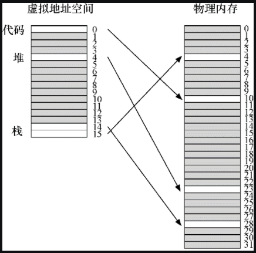
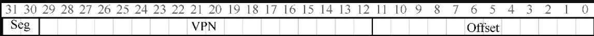
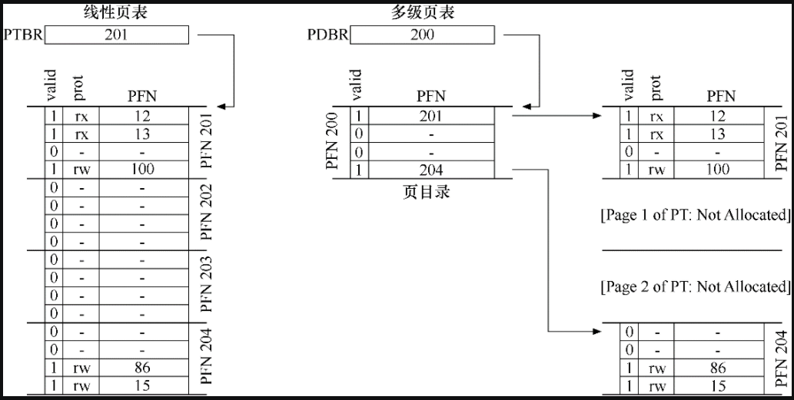
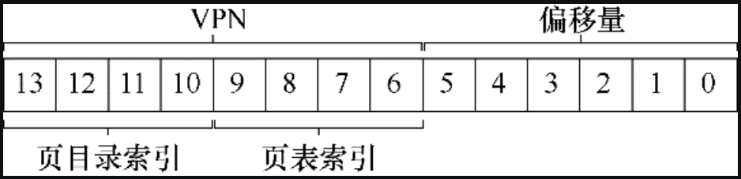

# 多级页表

如果分页的数量过多，那么就需要比较大的空间来存储页表，而且页表还是一个 per-process 结构，会占用很多内存空间。

比如 32 位的操作系统，每页大小位 4KB，那么一共可分为 2^20 个页，每个页表表项占用 4 个字节，这样整个页表就会占用 4MB 的空间。

如果此时有 100 个活动的进程，这意味着需要怕 400MB 的空闲来容纳页表，占用的内存很大。

那么如何让页表变小，关键的思路是什么？变小的页表结构，对地址转换的效率有没有影响？

## 更大的页

一个简单的方法是每页分配更大的空间，这样页的总数就会变少，页表就会变小。

比如 32 位的操作系统，每页 16KB，这样一共可分成 2^18 个页，这时候整个页表的大小为 1MB，缩减为原来（每页 4KB）的 1/4。

然而这种方法的主要问题在于，大内存页会导致每页内的浪费，这被称为**内部碎片**（internal fragmentation）问题（因为浪费在分配单元内部）。

比如应用程序会分配大的内存页，但只用每页的一小部分。

> 另外请注意，许多体系结构（例如 MIPS、SPARC、x86-64）现在都支持多种页大小。
>
> 这些操作系统通常使用一个小的（4KB 或 8KB）页大小，并支持为某个程序分配更大的内存页。这种类型的大页在数据库管理系统和其他高端商业应用程序中很常见。
>
> 然而，多种页面大小的主要原因并不是为了节省页表空间。这是为了减少 TLB 的压力，让程序能够访问更多的地址空间而不会遭受太多的 TLB 未命中之苦。
>
> 然而，采用多种页大小，使操作系统虚拟内存管理程序显得更复杂，因此，有时只需向应用程序暴露一个新接口，让它们直接请求大内存页，这样最容易。

## 混合分段和分页

我们知道，分页的页数很多的化，页表占用的内存就会很大。并且虽然给页表分配了这么大的内存，但不是所有页表项都能用到，这就造成了空间上的浪费。

比如，这里有一个 16KB 的地址空间，每页 1KB，虚拟地址空间页号和物理内存页帧号如下图所示：



那么这个页表的结构如下所示：

| PFN  | valid | prot | present | dirty |
| ---- | ----- | ---- | ------- | ----- |
| 10   | 1     | r-x  | 1       | 0     |
| -    | 0     | -    | -       | -     |
| -    | 0     | -    | -       | -     |
| -    | 0     | -    | -       | -     |
| 23   | 1     | rw-  | 1       | 1     |
| -    | 0     | -    | -       | -     |
| -    | 0     | -    | -       | -     |
| -    | 0     | -    | -       | -     |
| -    | 0     | -    | -       | -     |
| -    | 0     | -    | -       | -     |
| -    | 0     | -    | -       | -     |
| -    | 0     | -    | -       | -     |
| -    | 0     | -    | -       | -     |
| -    | 0     | -    | -       | -     |
| 28   | 1     | rw-  | 1       | 1     |
| 4    | 1     | rw-  | 1       | 1     |

可以看到上述页表中存在大量的无效项，这还只是一个微小的 16KB 地址空间，如果空间更大，浪费的空间会更多。


为了解决上述问题，我们采用分段和分页混合的方式。

分段和分页混合的方式不是为进程的整个地址空间提供单个页表，而是为每个逻辑分段提供一个，然后让每个段基址寄存器存放该段的页表的物理地址（不在存放段本身起始地址），段界限寄存器存放该段一共有多少页（不在存放段的大小）。

假设 32 位虚拟地址空间包含 4KB 页面，并且地址空间分为 4 个段，要确定地址引用哪个段，我们会用地址空间的前两位。假设 00 是未使用的段，01 是代码段，10 是堆段，11 是栈段。因此，虚拟地址如下所示：



在 TLB 未命中时（假设硬件管理的 TLB，即硬件负责处理 TLB 未命中），硬件使用分段位（SN）来确定要用哪个基址和界限对。然后硬件将其中的物理地址与VPN 结合起来，形成页表项（PTE）的地址：

```
SN  = (VirtualAddress & SEG_MASK) >> SN_SHIFT
VPN = (VirtualAddress & VPN_MASK) >> VPN_SHIFT

AddressOfPTE = Base[SN] + (VPN * sizeof(PTE))
```

混合方案的关键区别在于，每个分段都有界限寄存器，每个界限寄存器保存了段中最大有效页的值。这样，给每个段分配其最大有效页的页表项空间即可，例如，如果代码段使用它的前 3 个页（0、1 和 2），则代码段页表将只有 3 个项分配给它，并且界限寄存器将被设置为 3。内存访问超出段的末尾将产生一个异常，并可能导致进程终止。以这种方式，与线性页表相比，混合方法实现了显著的内存节省。栈和堆之间未分配的页不再占用页表中的空间（仅将其标记为无效）。


但是，你可能会注意到，这种方法并非没有问题。首先，它仍然要求使用分段。正如我们讨论的那样，分段并不像我们需要的那样灵活，因为它假定地址空间有一定的使用模式。例如，如果有一个大而稀疏的堆（堆内部有空白空间未使用），仍然可能导致大量的页表浪费。

其次，这种杂合导致外部碎片再次出现。尽管大部分内存是以页面大小单位管理的，但页表现在可以是任意大小（每个段由若干个页组成，是 PTE 的倍数），因此，在内存中为它们寻找自由空间更为复杂。

## 多级页表

多级页表也试图解决相同的问题：如何去掉页表中的所有无效区域，而不是将它们全部保留在内存中？多级页表是怎么做到这一点的呢？

多级页表的基本思想很简单。

首先，将页表分成页大小的单元（页表页）。

然后，如果整页的页表项（PTE）无效，就完全不分配该页的页表。

为了追踪页表的页是否有效，使用了名为**页目录**（page directory）的新结构。页目录因此可以告诉你页表的页在哪里，或者页表的整个页不包含有效页。

下图展示了线性和多级页表对同样大小地址空间的管理：



如上图所示，线性页表中存在大量的无效的页表项，线性页表需要为这些页表项分配空间。

可以看出多级页表不在用线性结构来存储页表项，而是利用一种类似于树状的结构来存储。

多级页表将页表项拆分成页，并用页目录来记录页表项页的位置。如果整个页表项页里的页表项都是无效的，那么在页目录里记录整个页表项页无效即可，而不用分配空间（比如上述的线性页表中的 PFN202 和 PFN203 在线性页表中需要分配空间，而在页目录里值只标记成无效即可）。从这里就可以看出，多级页表比线性页表更加节省空间。


除此之外，一个线性页表如果是按照 VPN 缩影 PTE 的数组结构，那么这个页表需要很大一块内存来存放。有了多级结构，我们增加了一个间接层，使用了页目录，它指向页表的各个部分。这种间接方式，让我们能够将页表页放在物理内存的任何地方。


应该指出，多级页表是有成本的。

在 TLB 未命中时，定位 PTE 需要两次内存访问，才能从页表中获取正确的地址转换信息（一次用于页目录，另一次用于页表项页），

另一个明显的缺点是复杂性。无论是硬件还是操作系统来处理页表查找（在 TLB 未命中时），这样做无疑都比简单的线性页表查找更复杂。通常我们愿意增加复杂性以提高性能或降低管理费用。在多级表的情况下，为了节省宝贵的内存，我们使页表查找更加复杂。


### 多级页表示例

下面通过一个例子来说明多级页表的地址空间转换。

设想一个大小为 16KB 的小地址空间，每页 64B，这样一共可分为  2^8 个页，这样虚拟地址一共为 14 位，VPN 有 8 位，偏移量有 6 位。

在这个例子中，虚拟页 0 和 1 用于代码，虚拟页 4 和 5 用于堆，虚拟页 254 和 255 用于栈。地址空间的其余页未被使用。


要构建一个两级页表，我们会先从完整的线性页表开始，上面页说过，这里例子中，线性页表一共有 256 个页，每页 64 个字节。

这时候我们需要构建第二级页表，即将页表项进行拆分，放到一个内存页中。

假设每个页表项为 4 个字节，那么一页可存放 64/4=16 个页表项，那么这 256 个页表项可以分成 16 组。

然后我们创建页目录，页目录存放页目录项（PDE），指向这 16 个页表项页，至此两级页表就构建完成。


然后给定一个虚拟地址（14 位），依然是用前前 8 位表示 VPN，后 6 位表示偏移量，不过前 8 位中的前 4 位要用来表示目录索引（PDIndex），我们就可以页目录索引得到页目录项（PDE）的地址：`PDEAddr = PageDirBase +(PDIndex * sizeof(PDE))`。虚拟地址结构如下图所示：




获取到 PDE（页目录项） 后，先判断页目录项的有效位是否有效，如果不有效，引发异常，如果有效，则需要通过页目录项指向的页表项页中获取页表项（PTE）。


