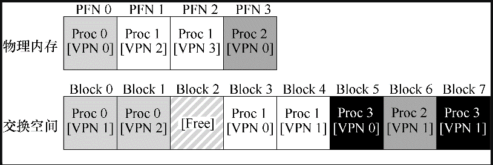

# 交换区

到目前位置，我们都假设进程所需的地址空间非常小，以至于每个正在运行的进程所需要的页都常驻在物理内存中。

这里我们放宽假设，假设进程运行需要巨大的地址空间，极端情况下，需要的地址空间会超过物理内存的大小。为了支持这种进程的运行，这时候操作系统就需要在内存层级上在加上一层，操作系统需要把当前没有在用的那部分地址空间找个地方存储起来，当需要的时候在从这个空间加载到内存。这样的空间被成为**交换空间**，首先这个地址空间不是内存，且具有很大的容量。在现代系统中，硬盘通常能够满足这个需求，但需要注意的是硬盘的读写速度要远小于内存的读写速度。

那么现在的问题是，操作系统如何利用大而慢的设备，透明地提供巨大虚拟地址空间的假象？

其实解决的办法比较简单，就是在硬盘上开辟交换空间用于物理页的移入和移出，用硬盘的空间来弥补内存空间的不足。

## 交换空间

我们要做的第一件事情就是，在硬盘上开辟一部分空间用于物理页的移入和移出。在操作系统中，这样的空间叫做交换空间。

因此操作系统能够以页大小为单元读取或者写入交换空间，为了达到这个目的，操作系统需要记住给定页的硬盘地址。

交换空间的大小是十分重要的，因为它决定了系统在某一时刻能够使用的最大内存页数。

比如下面有一个 4 页大小的物理内存和 8 页大小的交换空间：



在这个例子中，3个进程（进程 0、进程 1 和进程 2）主动共享物理内存，但 3 进程个中的每一个，都只有一部分有效页在内存中，剩下的在硬盘的交换空间中。

进程 3 则是全部的页都在交换空间中，这也表明进程 3 此时没有在运行。这个例子虽然很简单，但可以体现出交换空间让系统假装可以使用的内存空间比物理内存更大。

## 存在位

现在我们在硬盘上有一些空间，需要在系统中增加一些更高级的机制，来支持从硬盘交换页。

这里先称述下地址转换的过程（假设有 TLB，使用的是线性页表记录页表项）：

1. 进程正在生成一个虚拟内存引用（访问指令或读取数据），硬件需要将这个虚拟地址转换成实际存放指令或者数据的物理地址；
2. 硬件先从虚拟地址里获取虚拟页号（VPN）；
3. 通过这个虚拟页号检查 TLB 是否命中，如果命中直接获得物理地址，这一过程速度很快，因为不需要额外的内存访问；
4. 如果 TLB 未命中，在硬件中查找页表（页表基地址寄存器）；
5. 通过 VPN 找到页表中的页表项（PTE）;
6. 如果页有效且存在于物理内存中，则硬件从 PTE 中取出物理页帧号（PFN），并将其插入到 TLB 中，然后重试该指令，这次 TLB 就可以命中了。

上述是一般的地址转换过程，如果需要页交换到硬盘，还需要添加更多的机制。具体来说，在上述的第 6 不，当硬件通过 PTE 查找物理页的时候，可能会发现页不在物理内存中。在页表项中会有一个存在位，如果为 1 表示该页在物理内存中，可以按照上述流程执行，如果该值为 0，表示进程要访问的页不在物理内存中，而在硬盘上，这时候会产生页错误（页缺失）。

在页错误时，操作系统会被唤醒来处理页错误，一段称为“页错误处理程序（page-fault handler）”的代码会执行。

## 页错误

几乎所有的操作系统都使用软件来处理页错误，如果一个页不存在，它被交换到硬盘中，在处理页错误的时候操作系统需要将它重新加载到内存。

那么操作系统时如何知道硬盘中页的位置？一个简单的解决方案是操作系统可以使用 PTE 中的某些位来存放硬盘地址，当发生页错误时，操作系统就可以根据这些地址，将请求发送到硬盘，将页读取到内存中。

当硬盘 I/O 完成时，操作系统会更新页表，将此页标记位存在，更新页表项中 PFN 字段，并重试该指令。这层重试 TLB 依然是未命中的，但存在位已经被标识为 1，下次重试时就会命中 TLB，获取到物理地址。

需要注意的一点是，当 I/O 操作运行时，进程将处于阻塞状态。因此操作系统再次期间可以自由的执行其他进程。 因为 I/O 操作是昂贵的，一个进程进行 I/O（页错误）时会执行另一个进程，这种交叠是多道程序系统充分利用硬件的一种方式。

## 页换出

也错误需要经页换入时，还需要考虑内存中是否还有空间来支持页的换入，如果内存已经满了（或者接近满了），操作系统会先换出部分不在使用的页，为即将换入的页预留空间。选择那些页缓存的过程被成为**页交换策略**，这里先不详细谈具体的交换流程。

## 页错误处理流程

这里再考虑到页错误处理后，看下内存转换的流程：

```
1 VPN = (VirtualAddress & VPN_MASK) >> SHIFT
2 (Success, TlbEntry) = TLB_Lookup(VPN)
3 if (Success == True) // TLB Hit
4 	if (CanAccess(TlbEntry.ProtectBits) == True)
5 		Offset = VirtualAddress & OFFSET_MASK
6		PhysAddr = (TlbEntry.PFN << SHIFT) | Offset
7 		Register = AccessMemory(PhysAddr)
8 	else
9		RaiseException(PROTECTION_FAULT)
10 else // TLB Miss
11 	PTEAddr = PTBR + (VPN * sizeof(PTE))
12 	PTE = AccessMemory(PTEAddr)
13 	if (PTE.Valid == False)
14 		RaiseException(SEGMENTATION_FAULT)
15 	else
16 		if (CanAccess(PTE.ProtectBits) == False)
17 			RaiseException(PROTECTION_FAULT)
18 		else if (PTE.Present == True)
19 			// assuming hardware-managed TLB
20			TLB_Insert(VPN, PTE.PFN, PTE.ProtectBits)
21 			RetryInstruction()
22 		else if (PTE.Present == False)
23 			RaiseException(PAGE_FAULT)

```

页错误处理流程如下（软件）：

```
1 PFN = FindFreePhysicalPage()
2 if (PFN == -1) // no free page found
3 	PFN = EvictPage() // run replacement algorithm
4 DiskRead(PTE.DiskAddr, PFN) // sleep (waiting for I/O)
5 PTE.present = True // update page table with present
6 PTE.PFN = PFN // bit and translation (PFN)
7 RetryInstruction() // retry instruction
```

## 页换出时机

实际上并不时在页错误处理流程时当物理内存满了或者快满了时候才进行页换出，操作系统可以更主动地预留一小部分空闲内存。

为了保证有少量的空闲内存，大多数操作系统会设置高水位线（High Watermark，HW）和低水位线（Low Watermark，LW），来帮助决定何时从内存中清除页。

原理是这样：当操作系统发现有少于 LW 个页可用时，后台负责释放内存的线程会开始运行，直到有 HW 个可用的物理页。这个后台线程有时称为交换守护进程（swap daemon）或页守护进程（page daemon），它然后会很开心地进入休眠状态，因为它毕竟为操作系统释放了一些内存。

通过同时执行多个交换过程，我们可以进行一些性能优化。例如，许多系统会把多个要写入的页聚集（cluster）或分组（group），同时写入到交换区间，从而提高硬盘的效率。这种合并操作减少了硬盘的寻道和旋转开销，从而显著提高了性能。

## 总结

交换空间使得操作系统可以支持超过物理内存大小的内存分配，为了表示页是否存在，需要在页表项中添加一个存在位，来告诉页是不是在内存中。

页换入时，考虑到内存空间已经满了（或快满了），操作系统会有交换守护进程，将一些页换出，为后面页的换入预留空间。

本文是《[操作系统导论](https://weread.qq.com/web/reader/db8329d071cc7f70db8a479kc81322c012c81e728d9d180)》（英文名：《Operating Systems: three easy pieces》）第 21 章学习笔记。
