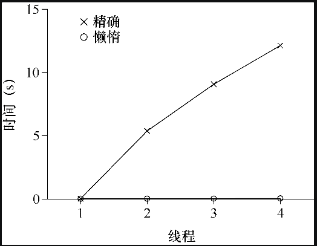

# 基于锁的并发数据结构

这里我们将讨论如何在常见的数据结构中使用锁，保证数据结构线程安全。

## 并发计数器

计数器是最简单的一种数据结构，使用广泛而且接口简单。

下面定义了一个非并发的计数器：

```c
typedef struct __counter_t {
    int value;
} counter_t;

void init(counter_t *c) {
    c->value = 0;
}

void increment(counter_t *c) {
    c->value++;
}

void decrement(counter_t *c) {
    c->value--;
}

int get(counter_t *c) {
    return c->value;
}
```

为了是并发器在多线程条件下安全的工作，一个解决办法就是给计数器的每个操作都加上锁：

```c
typedef struct __counter_t {
    int value;
    pthread_mutex_t lock;
} counter_t;

void init(counter_t *c) {
    c->value = 0;
    Pthread_mutex_init(&c->lock, NULL);
}

void increment(counter_t *c) {
    Pthread_mutex_lock(&c->lock);
    c->value++;
    Pthread_mutex_unlock(&c->lock);
}

void decrement(counter_t *c) {
    Pthread_mutex_lock(&c->lock);
    c->value--;
    Pthread_mutex_unlock(&c->lock);
}

int get(counter_t *c) {
    Pthread_mutex_lock(&c->lock);
    int rc = c->value;
    Pthread_mutex_unlock(&c->lock);
    return rc;
}
```

这个并发计数器简单、正确。实际上，它遵循了最简单、最基本的并发数据结构中常见的数据模式：它只是加了一把锁，在调用函数操作该数据结构时获取锁，从调用返回时释放锁。

问题是这个并发计数的性能并不是很好，如下图所示：



随着线程数的增加，因为锁造成的性能损耗就会越大。

理想情况下，你会看到多处理上运行的多线程就像单线程一样快。达到这种状态称为完美扩展（perfect scaling）。虽然总工作量增多，但是并行执行后，完成任务的时间并没有增加。

### 懒惰计数器

懒惰计数器通过多个局部计数器和一个全局计数器来实现一个逻辑计数器，其中每个 CPU 核心有一个局部计数器。具体来说，在 4 个 CPU 的机器上，有 4 个局部计数器和 1 个全局计数器。除了这些计数器，还有锁：每个局部计数器有一个锁，全局计数器有一个。

懒惰计数器的基本思想是这样的。如果一个核心上的线程想增加计数器，那就增加它的局部计数器，访问这个局部计数器是通过对应的局部锁同步的。因为每个CPU 有自己的局部计数器，不同 CPU 上的线程不会竞争，所以计数器的更新操作效率很高。

但为了读取到正确的计数器值，局部值会定期转移给全局计数器，方法是获取全局锁，让全局计数器加上局部计数器的值，然后将局部计数器置零。

这种局部转全局的频度，取决于一个阈值，这里称为 S。S 越小，懒惰计数器则越趋近于非扩展的计数器。S 越大，扩展性越强（性能越高），但是全局计数器与实际计数的偏差越大。

## 并发链表

同样地，我们可以简单的通多锁来实现一个并发链表，代码如下：

```c
void List_Init(list_t *L) {
    L->head = NULL;
    pthread_mutex_init(&L->lock, NULL);
}

void List_Insert(list_t *L, int key) {
    // synchronization not needed
    node_t *new = malloc(sizeof(node_t));
    if (new == NULL) {
        perror("malloc");
        return;
    }
    new->key = key;

    // just lock critical section
    pthread_mutex_lock(&L->lock);
    new->next = L->head;
    L->head = new;
    pthread_mutex_unlock(&L->lock);
}

int List_Lookup(list_t *L, int key) {
    int rv = -1;
    pthread_mutex_lock(&L->lock);
    node_t *curr = L->head;
    while (curr) {
        if (curr->key == key) {
            rv = 0;
            break;
        }
        curr = curr->next;
    }
    pthread_mutex_unlock(&L->lock);
    return rv; // now both success and failure
}
```

同样地，基于锁的并发链表同样存在性能问题。研究人员发现的增加链表并发的技术中，有一种叫作过手锁（hand-over-hand locking，也叫作锁耦合，lock coupling）。

原理也很简单。每个节点都有一个锁，替代之前整个链表一个锁。遍历链表的时候，首先抢占下一个节点的锁，然后释放当前节点的锁。

从概念上说，过手锁链表有点道理，它增加了链表操作的并发程度。但是实际上，在遍历的时候，每个节点获取锁、释放锁的开销巨大，很难比单锁的方法快。即使有大量的线程和很大的链表，这种并发的方案也不一定会比单锁的方案快。也许某种杂合的方案（一定数量的节点用一个锁）值得去研究。


## 并发队列

你现在知道了，总有一个标准的方法来创建一个并发数据结构：添加一把大锁，对于队列同样如此，但这里不在介绍。

我们来看看 Michael 和 Scott 设计的、更并发的队列：

```c
typedef struct __node_t {
    int value;
    struct __node_t *next;
} node_t;

typedef struct __queue_t {
    node_t *head;
    node_t *tail;
    pthread_mutex_t head_lock, tail_lock;
} queue_t;

void Queue_Init(queue_t *q) {
    node_t *tmp = malloc(sizeof(node_t));
    tmp->next = NULL;
    q->head = q->tail = tmp;
    pthread_mutex_init(&q->head_lock, NULL);
    pthread_mutex_init(&q->tail_lock, NULL);
}

void Queue_Enqueue(queue_t *q, int value) {
    node_t *tmp = malloc(sizeof(node_t));
    assert(tmp != NULL);
    tmp->value = value;
    tmp->next = NULL;

    pthread_mutex_lock(&q->tail_lock);
    q->tail->next = tmp;
    q->tail = tmp;
    pthread_mutex_unlock(&q->tail_lock);
}

int Queue_Dequeue(queue_t *q, int *value) {
    pthread_mutex_lock(&q->head_lock);
    node_t *tmp = q->head;
    node_t *new_head = tmp->next;
    if (new_head == NULL) {
        pthread_mutex_unlock(&q->head_lock);
        return -1; // queue was empty
    }
    *value = new_head->value;
    q->head = new_head;
    pthread_mutex_unlock(&q->head_lock);
    free(tmp);
    return 0;
}
```

仔细研究这段代码，你会发现有两个锁，一个负责队列头，另一个负责队列尾。这两个锁使得入队列操作和出队列操作可以并发执行，因为入队列只访问 tail 锁，而出队列只访问 head 锁。

Michael 和 Scott 使用了一个技巧，添加了一个假节点（在队列初始化的代码里分配的），该假节点分开了头和尾操作。

## 并发散列表

这里的散列表不考虑扩容。

```c
#define BUCKETS (101)

typedef struct __hash_t {
    list_t lists[BUCKETS];
} hash_t;

void Hash_Init(hash_t *H) {
    int i;
    for (i = 0; i < BUCKETS; i++)
        List_Init(&H->lists[i]);
}

int Hash_Insert(hash_t *H, int key) {
    return List_Insert(&H->lists[key % BUCKETS], key);
}

int Hash_Lookup(hash_t *H, int key) {
    return List_Lookup(&H->lists[key % BUCKETS], key);
}
```

本例的散列表使用我们之前实现的并发链表，性能特别好。每个散列桶（每个桶都是一个链表）都有一个锁，而不是整个散列表只有一个锁，从而支持许多并发操作。

## 总结

> 避免不成熟的优化（Knuth定律）
>
> 实现并发数据结构时，先从最简单的方案开始，也就是加一把大锁来同步。这样做，你很可能构建了正确的锁。如果发现性能问题，那么就改进方法，只要优化到满足需要即可。
>
> 正如 Knuth 的著名说法“不成熟的优化是所有坏事的根源。”
>
> 许多操作系统，在最初过渡到多处理器时都是用一把大锁，包括 Sun 和 Linux。在 Linux 中，这个锁甚至有个名字，叫作 BKL（大内核锁，big kernel lock）。这个方案在很多年里都很有效，直到多 CPU 系统普及，内核只允许一个线程活动成为性能瓶颈。终于到了为这些系统优化并发性能的时候了。Linux采用了简单的方案，把一个锁换成多个。Sun 则更为激进，实现了一个最开始就能并发的新系统，Solaris。

本文是《[操作系统导论](https://weread.qq.com/web/reader/db8329d071cc7f70db8a479kc81322c012c81e728d9d180)》（英文名：《Operating Systems: three easy pieces》）第 29 章学习笔记。