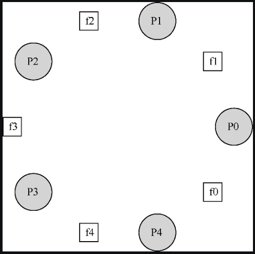

# 信号量

简单来讲信号量有一个数值对象，围绕着这个数值对象有两个操作，在 POSIX 标准中，是 `sem_wait` 和 `sem_post`。

当 `sem_wait` 被调用时，数值减一，若这时候发现值已经小于 0 了，线程就会被挂起（进入等待队列）。

当 `sem_post` 被调用时，数值加一，如果有等待线程，唤醒其中一个。

因为信号量的初始值能够决定其行为，所以首先要初始化信号量，才能调用其他函数与之交互，初始方式如下：

```c
# include <semaphore.h>
sem_t s;
sem_init(&s, 0, 1);
```

初始化方法一共有三个参数，第一个参数表示声明的信号量；第二个参数一般设置为 0，表示信号量是在同一个进程，多个线程中共享的。

第三个参数表示信号量初始化的值，这里为 1。


信号量作为和所有同步工作有关的单一原语，其可以作为锁和条件变量去使用。

## 作为锁

信号量的初始化值决定了信号量的行为。当信号量的值初始化为 1，这时候的信号量也叫做二值信号量，二值信号量可以作为锁来使用，比如：

```
sem_t m;
sem_init(&m, 0, 1);

sem_wait(&m);
// 临界区
sem_post(&m);
```

比如有两个线程，线程 0 在调用 `sem_wait` 时将值减为 0，因为值不小于 0，线程 0 可以进入临界区，线程 0 在执行完临界区的代码后调用 `sem_post` 将值加一。如果在线程 0 持有锁（执行临界区代码期间），发生中断，切换到线程 1，线程 1 调用 `sem_wait` 将值减为 -1，这时候发现信号量的值小于 0，便会进入等待队列，直到线程 0 重新执行，调用完 `sem_post` 后被唤醒。可以看出使用二值信号量，我们实现了锁的基本特性，互斥。

## 作为条件变量

信号量也可以用在一个线程暂停执行，等待某一条件成立的场景，比如我们想要主线程等待子线程执行完毕后再执行，我们可以通过下面代码实现：

```c
sem_t s;

void *child(void *arg) {
    printf("child\n");
    sem_post(&s); // signal here: child is done
    return NULL;
}

int main(int argc, char *argv[]) {
    sem_init(&s, 0, 0); 
    printf("parent: begin\n");
    pthread_t c;
    Pthread_create(&c, NULL, child, NULL);
    sem_wait(&s); 
    printf("parent: end\n");
    return 0;
}
```

需要注意的是，在这种使用场景下，信号量的初始值被设置为 0。

其实上述代码有两种运行情况，第一种是子线程会先执行，这时候会调用 `sem_post` 方法将值加为 1，然后主线程执行，将值减为 0，值不小于 0 ，继续执行；第二种情况是，主线程先执行，将值减为 -1，会被挂起，当子线程执行完毕后，将值加 1，唤醒等待的主线程。

### 生产者/消费者问题

信号量既然可以作为条件变量使用，那么其也可以用来解决生产者/消费者问题。

首先我们的解决方案为：

```c
int buffer[MAX];
int fill = 0;
int use = 0;

void put(int value) {
    buffer[fill] = value; 	 // Line F1
    fill = (fill + 1) % MAX; // Line F2
}

int get() {
    int tmp = buffer[use]; // Line G1
    use = (use + 1) % MAX; // Line G2
    return tmp;
}
```

```c
sem_t empty;
sem_t full;

void *producer(void *arg) {
    int i;
    for (i = 0; i < loops; i++) {
        sem_wait(&empty); // Line P1
        put(i); // Line P2
        sem_post(&full); // Line P3
    }
}

void *consumer(void *arg) {
    int tmp = 0;
    while (tmp != -1) {
        sem_wait(&full); // Line C1
        tmp = get(); // Line C2
        sem_post(&empty); // Line C3
        printf("%d\n", tmp);
    }
}

int main(int argc, char *argv[]) {
    // ...
    sem_init(&empty, 0, MAX); // MAX are empty
    sem_init(&full, 0, 0);    // 0 are full
    // ...
}
```

上述代码在 MAX 的值为 1 的时候，是可以正常工作的，并且符合我们的预期。代当 MAX 大于 1 时会出现问题。

因为在 MAX 大于 1 时，put 和 get 方法都有可能同时被多个线程执行，从而产生竞态条件，导致 put 时值被覆盖，get 时重复消费一个值。

此时我们可以使用再增加一个锁去避免这种竞态条件的发生。

```c
void *producer(void *arg) {
    int i;
    for (i = 0; i < loops; i++) {
        sem_wait(&mutex); // Line P0 (NEW LINE)
        sem_wait(&empty); // Line P1
        put(i); // Line P2
        sem_post(&full); // Line P3
        sem_post(&mutex); // Line P4 (NEW LINE)
    }
}

void *consumer(void *arg) {
    int i;
    for (i = 0; i < loops; i++) {
        sem_wait(&mutex); // Line C0 (NEW LINE)
        sem_wait(&full); // Line C1
        int tmp = get(); // Line C2
        sem_post(&empty); // Line C3
        sem_post(&mutex); // Line C4 (NEW LINE)
        printf("%d\n", tmp);
    }
}
```

这里我们再 get 和 put 方法上增加了一把锁，就解决了 get 和 put 竞态条件的问题，上述代码依然存在问题。

比如如果此时缓冲区为空，消费者线程先执行，获取到锁，然后发现缓冲区为空，便进入等待队列，但这时候是没有释放锁的；如果这时候生产者线程执行，由于锁已经被消费者线程持有了，便不能继续执行，进行生产操作；这样一来就出现了一个循环等待，消费者持有互斥量，等待在 full 信号量上。生产者可以发送 full信号，却在等待互斥量。因此，生产者和消费者互相等待对方，这就是死锁问题。


其实上述代码区解决死锁很简单，缩小锁的范围即可，所以最终可行方案为：

```c
void *producer(void *arg) {
    int i;
    for (i = 0; i < loops; i++) {
        sem_wait(&empty); // Line P1
        sem_wait(&mutex); // Line P1.5 (MUTEX HERE)
        put(i); // Line P2
        sem_post(&mutex); // Line P2.5 (AND HERE)
        sem_post(&full); // Line P3
    }
}

void *consumer(void *arg) {
    int i;
    for (i = 0; i < loops; i++) {
        sem_wait(&full); // Line C1
        sem_wait(&mutex); // Line C1.5 (MUTEX HERE)
        int tmp = get(); // Line C2
        sem_post(&mutex); // Line C2.5 (AND HERE)
        sem_post(&empty); // Line C3
        printf("%d\n", tmp);
    }
}
```

### 读写锁

另一个经典问题源于对更加灵活的锁定原语的渴望，它意识到不同的数据结构访问可能需要不同类型的锁。例如，一个并发链表有很多插入和查找操作。插入操作会修改链表的状态（产生竞态条件），而查找操作只是读取该结构，只要没有进行插入操作，我们可以并发的执行多个查找操作。读者—写者锁（reader-writer lock）就是用来完成这种操作的。读写锁代码如下所示（使用信号量实现）：

```c
typedef struct _rwlock_t {
    sem_t lock; // binary semaphore (basic lock)
    sem_t writelock; // allow ONE writer/MANY readers
    int readers; // #readers in critical section
} rwlock_t;

void rwlock_init(rwlock_t *rw) {
    rw->readers = 0;
    sem_init(&rw->lock, 0, 1);
    sem_init(&rw->writelock, 0, 1);
}

void rwlock_acquire_readlock(rwlock_t *rw) {
    sem_wait(&rw->lock);
    rw->readers++;
    if (rw->readers == 1) // first reader gets writelock
        sem_wait(&rw->writelock);
    sem_post(&rw->lock);
}

void rwlock_release_readlock(rwlock_t *rw) {
    sem_wait(&rw->lock);
    rw->readers--;
    if (rw->readers == 0) // last reader lets it go
        sem_post(&rw->writelock);
    sem_post(&rw->lock);
}

void rwlock_acquire_writelock(rwlock_t *rw) {
    sem_wait(&rw->writelock);
}

void rwlock_release_writelock(rwlock_t *rw) {
    sem_post(&rw->writelock);
}
```

如上述代码所示，如果某个线程要更新数据结构，需要调用 `rwlock_acquire_writelock` 获得写锁，调用 `rwlock_release_writelock` 释放锁。内部通过一个`writelock` 的信号量保证只有一个写者能获得锁进入临界区，从而更新数据结构。

如果某个线程需要读取数据结构里的数据是，先调用 `rwlock_acquire_readlock`，再调用 `rwlock_release_readlock`，这两个方法里面会通过一个锁来保证对读者数量的正确维护。然后有意思的地方出现了，获取锁时，当读者数为 1 时（表示为第一个读者）会去获取写锁，释放锁时，如果读者数量为 0（表示最后一个读者），会释放写锁。

这样一来，一旦一个读者获得了读锁，其他的读者也可以获取这个读锁，但是，想要获取写锁的线程，就必须等到所有的读者都结束。

>简单的笨办法可能更好（Hill定律）
>
>我们不能小看一个概念，即简单的笨办法可能最好。某些时候简单的自旋锁反而是最有效的，因为它容易实现而且高效。虽然读者—写者锁听起来很酷，但是却很复杂，复杂可能意味着慢。因此，总是优先尝试简单的笨办法。这种受简单吸引的思想，在多个地方都能发现。

### 哲学家就餐问题

哲学家就餐问题（dining philosopher’s problem）是一个著名的并发问题，它由 Dijkstra 提出来并解决。

这个问题的基本情况是：假定有 5 位哲学家围着一个圆桌，每两位哲学家之间有一把餐叉（一共 5 把），如下图所示：



哲学家有时要思考一会，不需要餐叉，有时又要就餐。而一位哲学家只有同时拿到了左手边和右手边的两把餐叉，才能吃到东西。关于餐叉的竞争以及随之而来的同步问题，就是我们在并发编程中研究它的原因。

下面是每个哲学家的基本行为：

```c
while(1) {
    think();
    getforks();
    eat();
    putforks();
}
```

关键的挑战就是如何实现 `getforks` 和 `putforks` 函数，保证没有死锁，没有哲学家饿死，并且并发度更高（尽可能让更多哲学家同时吃东西）。

根据 Downey 的解决方案，我们会用一些辅助函数，帮助构建解决方案。它们是：

```c
int left(int p) {
    return p;
}

int right(int p) {
    return (p + 1) % 5;
}
```

如果哲学家 p 希望用左手边的叉子，他们就调用 `left(p)`。类似地，右手边的叉子就用 `right(p)`。模运算解决了最后一个哲学家（p=4）右手边叉子的编号问题，就是餐叉 0。

我们需要一些信号量来解决这个问题。假设需要 5 个，每个餐叉一个：`sem_t forks[5]`。

这时候我们可以这么实现 `getforks` 和 `putforks`：

```c
void get_forks(int p) {
    sem_wait(&forks[left(p)]);
    sem_wait(&forks[right(p)]);
}

void put_forks(int p) {
    sem_post(&forks[left(p)]);
    em_post(&forks[right(p)]);
}
```

看起来好像没问题，其实上述代码是由死锁问题的。

具体来讲，再某个情况下，每个哲学家都同时获得左手边得餐叉，即 `p0-f0`、`p1-f1`、`p2-f2`、`p3-f3`、`p4-f4`，这时候当任何一个哲学家去获取右手变得餐叉时，都会发现餐叉已经被其右边得哲学家持有了。所以这种方案行不通。

解决上述问题最简单的方法，就是修改某个或者某些哲学家的取餐叉顺序。事实上，Dijkstra 自己也是这样解决的。具体来说，假定哲学家 4 取餐叉的顺序和其他哲学家不同，这样就打破了循环等待。相应的代码如下：

```c
void get_forks(int p) {
    if (p == 4) {
        sem_wait(&forks[right(p)]);
        sem_wait(&forks[left(p)]);
    } else {
        sem_wait(&forks[left(p)]);
        sem_wait(&forks[right(p)]);
    }
}
```

因为最后一个哲学家会尝试先拿右手边的餐叉，然后拿左手边，所以不会出现每个哲学家都拿着一个餐叉，卡住等待另一个的情况，等待循环被打破了。

## 如何实现信号量

我们可以使用锁和条件变量来实现信号量（`Zemaphore` ），代码如下：

```c
typedef struct __Zem_t {
    int value;
    pthread_cond_t cond;
    pthread_mutex_t lock;
} Zem_t;

// only one thread can call this
void Zem_init(Zem_t *s, int value) {
    s->value = value;
    Cond_init(&s->cond);
    Mutex_init(&s->lock);
}

void Zem_wait(Zem_t *s) {
    Mutex_lock(&s->lock);
    while (s->value <= 0)
        Cond_wait(&s->cond, &s->lock);
    s->value--;
    Mutex_unlock(&s->lock);
}

void Zem_post(Zem_t *s) {
    Mutex_lock(&s->lock);
    s->value++;
    Cond_signal(&s->cond);
    Mutex_unlock(&s->lock);
}
```

我们实现的 `Zemaphore` 和 Dijkstra 定义的信号量有一点细微区别，就是我们没有保持当信号量的值为负数时，让它反映出等待的线程数。事实上，该值永远不会小于0 。这一行为更容易实现，并符合现有的 Linux 实现。

> 小心泛化
>
> 在系统设计中，泛化的抽象技术是很有用处的。一个好的想法稍微扩展之后，就可以解决更大一类问题。然而，泛化时要小心。
>
> 比如我们可以把信号量当作锁和条件变量的泛化。但这种泛化有必要吗？考虑基于信号量去实现条件变量的难度，可能这种泛化并没有你想的那么通用。


## 总结

信号量是编写并发程序的强大而灵活的原语。有程序员会因为简单实用，只用信号量，不用锁和条件变量。

本文是《[操作系统导论](https://weread.qq.com/web/reader/db8329d071cc7f70db8a479kc81322c012c81e728d9d180)》（英文名：《Operating Systems: three easy pieces》）第 31 章学习笔记。


