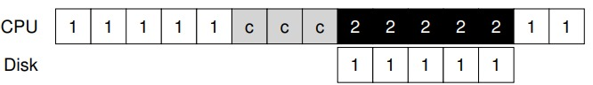

# I/O 设备

在深入讲解持久性部分的主要内容之前，我们先介绍输入/输入（I/O）设备的概念，并展示操作系统如何与它们交互。输入和输出是计算机开放性的体现，其将计算机的计算这一能力扩展应和用到各个方面。

I/O 既然如此重要，那么 I/O 应该如何集成进系统中？其中的一般机制是什么？如何让它们变得高效？


## 系统架构

这里我们先看下典型的计算机体系架构，如下图所示：


其中 CPU 通过内存总线和内存相连；图像或者其他高性能设备通过通用 I/O 总线相连；其他最慢的外部设备，如鼠标、键盘通过外设 I/O 总线相连。

你可能会问：为什么要用这样的分层架构？

简单回答：因为物理布局及造价成本。

越快的总线越短，因此高性能的内存总线没有足够的空间连接太多设备。另外，在工程上高性能总线的造价非常高。所以，系统的设计采用了这种分层的方式，这样可以让要求高性能的设备（比如显卡）离CPU更近一些，低性能的设备离CPU远一些。将磁盘和其他低速设备连到外围总线的好处很多，其中较为突出的好处就是你可以在外围总线上连接大量的设备。

## 标准设备

这里的标准设备指硬件设备的通用抽象，通过它来帮助我们更好地理解设备交互的机制。

标准设备的结构如下图所示：


标准设备由两个部分组成，一部分是向系统其他部分展现的硬件接口（interface）。同软件一样，硬件也需要一些接口，让系统软件来控制它的操作。因此，所有设备都有自己的特定接口以及典型交互的协议。

另一部分是设备的内部结构，这部分包含设备相关的特定实现，负责具体实现设备展示给系统的抽象接口。非常简单的设备通常用一个或几个芯片来实现它们的功能。更复杂的设备会包含简单的CPU、一些通用内存、设备相关的特定芯片，来完成它们的工作。

## 标准协议

在上述描述的标准设备中，一个简化的设备接口需要三个寄存器，一个状态寄存器，可以通过它来读取并查看设备的当前状态；一个命令寄存器，用于通知设备执行某个具体的任务；一个数据寄存器，将数据传递给设备或从设备接收数据。

操作系统通过读取设置这些寄存器来控制设备的行为。

我们现在来描述操作系统与该设备的典型交互，以便让设备为它做某事。协议如下：

```
While (STATUS == BUSY)
; // wait until device is not busy
Write data to DATA register
Write command to COMMAND register
(starts the device and executes the command)
While (STATUS == BUSY)
; // wait until device is done with your request
```

该标准协议包含 4 个步骤：

- 第一步，操作系统通过反复读取状态寄存器，等待设备进入可以接收命令的就绪状态，我们称这一过程为轮询设备；
- 第二步，操作系统下发数据到数据寄存器；
- 第三步，操作系统将命令写入到寄存器，这样设备就知道数据已经准备好了，它应该开始执行命令；
- 第四步，操作系统再次通过不断轮询设备，等待并判断设备是否执行完毕。

这个简单的协议好处是足够简单并且有效。但是难免会有一些低效和不方便。我们注意到这个协议存在的第一个问题就是轮询过程比较低效，在等待设备执行完成命令时浪费大量 CPU 时间，如果此时操作系统可以切换执行下一个就绪进程，就可以大大提高 CPU 的利用率。

## 利用中断减少 CPU 的开销

多年前，工程师们发明了我们目前已经很常见的中断（interrupt）来减少 CPU 开销。

有了中断后，CPU 不再需要不断轮询设备，而是向设备发出一个请求，然后就可以让对应进程睡眠，切换执行其他任务。

当设备完成了自身操作，会抛出一个硬件中断，引发 CPU 跳转执行操作系统预先定义好的中断服务例程（InterruptService Routine，ISR），或叫中断处理程序（interrupt handler）。中断处理程序是一小段操作系统代码，它会结束之前的请求（比如从设备读取到了数据或者错误码）并且唤醒等待 I/O 的进程继续执行。

中断允许计算和 I/O 重叠，这一点是提高 CPU 利用率的关键，下面两个图将说明这一点。


其中，进程 1 在 CPU 上运行一段时间（对应 CPU 那一行上重复的 1），然后发出一个读取数据的 I/O 请求给磁盘。如果没有中断，那么操作系统就会简单自旋，不断轮询设备状态，直到设备完成 I/O 操作（对应其中的 p）。当设备完成请求的操作后，进程 1 又可以继续运行。


当中断和 I/O 重叠后，在磁盘处理进程 1 的请求时，操作系统在 CPU 上运行进程 2。磁盘处理完成后，触发一个中断，然后操作系统唤醒进程 1 继续运行。这样，在这段时间，无论 CPU 还是磁盘都可以有效地利用。

注意，使用中断并非总是最佳方案。假如有一个非常高性能的设备，它处理请求很快：通常在 CPU 第一次轮询时就可以返回结果。此时如果使用中断，反而会使系统变慢：切换到其他进程，处理中断，再切换回之前的进程代价不小。因此，如果设备非常快，那么最好的办法反而是轮询。如果设备比较慢，那么采用允许发生重叠的中断更好。如果设备的速度未知，或者时快时慢，可以考虑使用混合（hybrid）策略，先尝试轮询一小段时间，如果设备没有完成操作，此时再使用中断。这种两阶段（two-phased）的办法可以实现两种方法的好处。

另一个最好不要使用中断的场景是网络。网络端收到大量数据包，如果每一个包都发生一次中断，那么有可能导致操作系统发生活锁（livelock），即不断处理中断而无法处理用户层的请求。

另一个基于中断的优化就是合并（coalescing）。设备在抛出中断之前往往会等待一小段时间，在此期间，其他请求可能很快完成，因此多次中断可以合并为一次中断抛出，从而降低处理中断的代价。

## 利用 DMA 实现更高效的数据传送

标准协议还有一点需要我们注意。具体来说，如果使用编程的 I/O（PIO，Programmed IO，CPU 参数数据移动）将一大块数据传给设备，CPU又会因为琐碎的任务而变得负载很重，浪费了时间和算力，如下图所示：



那么如何将数据移动这块控制从 CPU 中分离出去，从而提高 CPU 的利用率呢？

解决方案就是使用 DMA（Direct Memory Access）。DMA 引擎是系统中的一个特殊设备，它可以协调完成内存和设备间的数据传递，不需要 CPU 介入。

DMA 工作过程如下。为了能够将数据传送给设备，操作系统会通过编程告诉 DMA 引擎数据在内存的位置，要拷贝的大小以及要拷贝到哪个设备。在此之后，操作系统就可以处理其他请求了。当 DMA 的任务完成后，DMA 控制器会抛出一个中断来告诉操作系统自己已经完成数据传输。有了 DMA，数据移动就由 DMA 来完成，CPU 就可以处理更多的计算任务了，如下图所示：


## 与设备交互的方法

那么操作系统应该怎样和这些设备交互？

随着技术的不断发展，主要有两种方式来实现与设备的交互。第一种办法相对老一些，就是用明确的 I/O 指令。这些指令规定了操作系统将数据发送到特定设备寄存器的方法。这些指令都是特权指令，只有操作系统能够直接调用。

第二种方法是内存映射 I/O（memory- mapped I/O）。通过这种方式，硬件将设备寄存器作为内存地址提供。当需要访问设备寄存器时，操作系统读取或者写入到该内存地址；然后硬件会将装载/存入转移到设备上，而不是物理内存。

两种方法没有一种具备极大的优势。内存映射 I/O 的好处是不需要引入新指令来实现设备交互，但两种方法今天都在使用。

## 设备驱动程序

每个设备都有非常具体的接口，如何将它们纳入操作系统，而我们希望操作系统尽可能通用。例如文件系统，我们希望开发一个文件系统可以工作在 SCSI 硬盘、IDE 硬盘、USB 钥匙串设备等设备之上，并且希望这个文件系统不那么清楚对这些不同设备发出读写请求的全部细节。因此，我们的问题如下。

那么如何保持操作系统的大部分与设备无关，从而对操作系统的主要子系统隐藏设备交互的细节？

这个问题可以通过古老的抽象（abstraction）技术来解决。在最底层，操作系统的一部分软件清楚地知道设备如何工作，我们将这部分软件称为**设备驱动程序**（device driver），所有设备交互的细节都封装在其中。

我们来看看Linux文件系统栈，理解抽象技术如何应用于操作系统的设计和实现。


可以看出，文件系统（当然也包括在其之上的应用程序）完全不清楚它使用的是什么类型的磁盘。它只需要简单地向通用块设备层发送读写请求即可，块设备层会将这些请求路由给对应的设备驱动，然后设备驱动来完成真正的底层操作。

注意，这种封装也有不足的地方。例如，如果有一个设备可以提供很多特殊的功能，但为了兼容大多数操作系统它不得不提供一个通用的接口，这样就使得自身的特殊功能无法使用。

## 总结

至此你应该对操作系统如何与设备交互有了非常基本的理解。本章介绍了两种技术，中断和 DMA，用于提高 CPU 利用率。我们还介绍了访问设备寄存器的两种方式，I/O 指令和内存映射 I/O。最后，我们介绍了设备驱动程序的概念，展示了操作系统本身如何封装底层细节，从而更容易以设备无关的方式构建操作系统的其余部分。

是《[操作系统导论](https://weread.qq.com/web/reader/db8329d071cc7f70db8a479kc81322c012c81e728d9d180)》（英文名：《Operating Systems: three easy pieces》）第 36 章学习笔记。