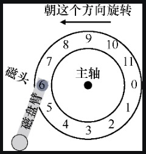
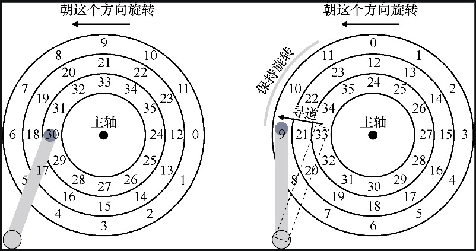

# 磁盘驱动器

这里我们将介绍磁盘的基本结构和如何访问磁盘上的数据，以及当又多个 I/O 请求时，操作系统该怎么调度以保证最优的 I/O 响应时间？

## 磁盘结构

这里将介绍磁盘的一些组件，先从一个**盘片**（platter）开始。一个盘片由一些硬质材料制成，其有两个圆形表面，在每个表面涂上薄薄的磁性层，通过引入磁性变化来永久存储数据。

磁盘可能有一个或多个盘片，每个盘片都是围绕着主轴固定在一起，主轴连接到一个电机，以一个固定的速度旋转盘片。旋转速率通常以每分钟转数（Rotations Per Minute，RPM）来测量，我们经常会对单次旋转的时间感兴趣，例如，以 10000 RPM 旋转的驱动器意味着一次旋转需要大约 6ms。

数据在盘片表面的每个同心圆中被编码，我们称这样的同心圆为一个磁道（track），一个表面包含数以千计的磁道，并紧密地排在一起。

一个磁道可划分称多个**扇区**，每个扇区为 512 个字节，我们将这些扇区从 0 到 n-1 进行编号，这些编号就是磁盘的地址空间。这也意味着磁盘的寻址单位为 512 个字节，即一个扇区。实时上，磁盘驱动器制造商会保证对磁盘扇区的读取或写入操作是原子的。

要从表面进行读写操作，我们需要一种机制，使我们能够感应（即读取）磁盘上的磁性图案，或者让它们发生变化（即写入）。磁盘的**磁头**就用来做到这一点，读写过程由磁头完成；驱动器的每个表面有一个这样的磁头，磁头连接到单个**磁盘臂**上，磁盘臂在表面上移动，将磁头定位在期望的磁道上。

下图展示了有单个磁道磁盘结构：

## 磁盘驱动器

在了解了磁盘的基本结构后，我们来看下磁盘是如何工作的，即如何调度来访问磁盘上扇区？

### 单磁道磁盘

这里我们先从简单的单磁道磁盘来入手。

单磁道磁盘结构如上图所示，要理解如何在简单的单道磁盘上处理请求，请想象我们现在收到读取块 0 的请求，磁盘应如何处理该请求？

在我们的简单磁道磁盘中，磁盘不必做太多工作。具体来说，它只需等待期望的扇区旋转到磁头下，然后读写数据即可。这种等待在现代驱动器中经常发生，并且是 I/O 服务时间的重要组成部分，它有一个特殊的名称：**旋转延迟**。

在这个例子中（如上图），如果完整的旋转延迟是 R，那么磁盘会产生大概 R/2 的延迟等待磁盘 0 来到磁头下面。对这个单一磁道，最坏情况的请求是第 5 扇区，会导致接近完整的旋转延迟，才能服务这种请求。

### 多磁道磁盘

这里我们增加磁盘的磁道，然后来看磁盘访问指定扇区发生了那些变化？

下图展示了多磁道磁盘的结构：

如上图所示，上述磁盘由三个磁道组成，目前磁头指向 30 这个个扇区，如果这时候我们要访问 11 这个扇区（它和 30 这个扇区不在同一个磁道上），这时候该怎么做？

为了服务这个读取请求，驱动器必须首先将磁盘臂移动到正确的磁道上，通过一个所谓的**寻道**（seek）过程，寻道过程中花费的时间称为**寻道时间**。

在寻道的过程，磁盘依然保持旋转，寻道并旋转，这磁盘最昂贵的操作之一。

应该指出的是，寻道有许多阶段：

- 首先是磁盘臂移动时的加速阶段；
- 然后随着磁盘臂全速移动而惯性滑动；
- 然后随着磁盘臂减速而减速；
- 最后，在磁头小心地放置在正确的磁道上时停下来。

如上图所示，磁盘在完成寻道操作后，会落到 9 这个扇区，然后经过旋转（旋转延迟），落到 11 这个扇区下，开始 I/O 操作的最后阶段传输数据。

因此，我们得到了完整的 I/O 时间图，寻道时间加上旋转延迟加上传输时间。

下面介绍下磁盘寻址一些细节上的优化。

第一个是**磁道偏斜**。

从上面多磁道磁盘结构图中我们可以看出，上面三个磁道上分布着相同数量的扇区，我们从最外的磁道开始给扇区编号，这些扇区编号就是磁盘的地址，比如上述磁盘结构中，在最外层磁道分布着 0~11 号扇区，在中间磁道分布着 12 ~ 23 号扇区，在最内层磁道分布着 24~35 号扇区。

所以逻辑上连续的两个扇区在物理上分布可能不是连续的，如上述的第 11 号和第 12 号扇区就分布在了不同的磁道上。为了保证从 11 号扇区到 12 号扇区这种连续访问能够尽可能块，在扇区分布时（逻辑上）采取了磁道偏斜，比如上述的磁道偏斜为 2。有了这种偏斜后，在磁盘寻道时（保持旋转），能够直接从 11 号扇区到 12 号扇区，从而节约了旋转延迟时间。

另一个事实是，外圈磁道通常比内圈磁道具有更多扇区，这是几何结构的结果，那里空间更多。

这些磁道通常被称为多区域磁盘驱动器，其中磁盘被组织成多个区域，区域是表面上连续的一组磁道。每个区域每个磁道具有相同的扇区数量，并且外圈区域具有比内圈区域更多的扇区。

最后，任何现代磁盘驱动器都有一个重要组成部分，即它的缓存，由于历史原因有时称为磁道缓冲区。该缓存使用少量的内存（通常大约 8MB 或 16MB），驱动器可以使用这些内存来保存从磁盘读取或写入磁盘的数据，这样做可以让驱动器快速响应所有后续对同一磁道的请求。

有了缓存后，在写入时，驱动器面临一个选择：它应该在将数据放入其内存之后，还是写入实际写入磁盘之后，回报写入完成？

前者被称为后写缓存，后者则称为直写。后写缓存有时会使驱动器看起来“更快”，但可能有危险。

## 磁盘调度

由于磁盘 I/O 的高成本，操作系统在磁盘调度上尽可能地给出最优地调度策略。

关键问题是当同时又多个磁盘 I/O 请求时，操作系统该如果调度这些请求以保证最少的 I/O 时间？

与任务调度不同，每个任务的长度通常是不知道的，对于磁盘调度，我们可以很好地猜测磁盘请求需要多长时间（通过估计请求的查找和可能的旋转延迟，磁盘调度程序可以知道每个请求将花费多长时间）。磁盘调度会有限选择调度服务花费最少时间的请求，即遵循 SJF（最短任务优先）的原则。

### SSTF：最短寻道时间优先

一种早期的磁盘调度方法被称为最短寻道时间优先（Shortest-Seek-Time-First，SSTF）。

SSTF 按磁道对 I/O 请求队列排序，选择在最近磁道上的请求先完成。例如，假设磁头当前位置在内圈磁道上，并且我们请求扇区 21（中间磁道）和 2（外圈磁道），那么我们会首先发出对 21 的请求，等待它完成，然后发出对 2 的请求。

SSTF 存在这饥饿问题，饥饿问题是任何调度策略必须要考虑的一个问题。比如，在我们上面的例子中，是否有对磁头当前所在位置的内圈磁道有稳定的请求然后，纯粹的 SSTF 方法将完全忽略对其他磁道的请求，造成饥饿。

### 电梯算法（又称 SCAN 或 C-SCAN）

当磁头正在自里向外移动时，SCAN 算法所考虑的下一个调度对象，应是其欲访问的磁道既在当前磁道之外，又是距离最近的。

这样自里向外地访问，直至再无更外的磁道需要访问时，才将磁臂换向为自外向里移动。这时，同样也是每次选择这样的进程来调度，即要访问的磁道在当前位置内距离最近者，这样，磁头又逐步地从外向里移动，直至再无更里面的磁道要访问，从而避免了出现“饥饿”现象。

由于在这种算法中磁头移动的规律颇似电梯的运行，因而又常称之为电梯调度算法。

SCAN算法既能获得较好的寻道性能，又能防止“饥饿”现象，故被广泛用于大、中、小型机器和网络中的磁盘调度。

但 SCAN 也存在这样的问题：当磁头刚从里向外移动而越过了某一磁道时，恰好又有一进程请求访问此磁道，这时，该进程必须等待，待磁头继续从里向外，然后再从外向里扫描完所有要访问的磁道后，才处理该进程的请求，致使该进程的请求被大大地推迟。

为了减少这种延迟，C-SCAN 算法规定磁头单向移动，例如，只是自里向外移动，当磁头移到最外的磁道并访问后，磁头立即返回到最里的欲访问的磁道，即将最小磁道号紧接着最大磁道号构成循环，进行循环扫描。

### 总结

本文是《[操作系统导论](https://weread.qq.com/web/reader/db8329d071cc7f70db8a479kc81322c012c81e728d9d180)》（英文名：《Operating Systems: three easy pieces》）第 37 章学习笔记。

