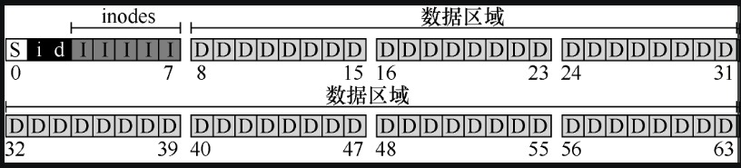
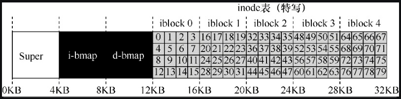
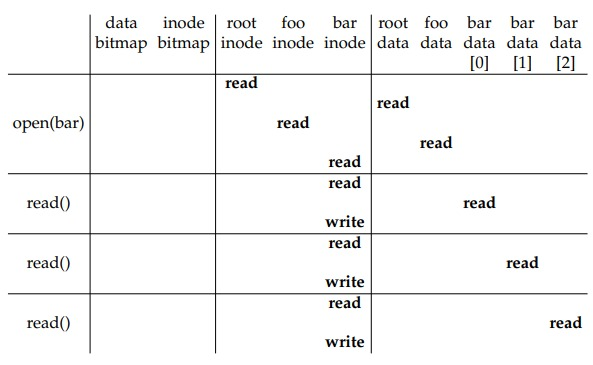

# 文件系统实现

本章将介绍一个简单的文件系统实现，称为 VSFS（Very Simple File System，简单文件系统）。它是典型 UNIX 文件系统的简化版本，因此可用于介绍一些基本磁盘结构、访问方法和各种策略，你可以在当今许多文件系统中看到。

考虑文件系统时，我们通常建议考虑它们的两个不同方面。如果你理解了这两个方面，可能就理解了文件系统基本工作原理。

第一个方面是文件系统的数据结构（data structure）。

换言之，文件系统在磁盘上使用哪些类型的结构来组织其数据和元数据？

第二个方面是访问方法（access method）。

如何将进程发出的调用，如 `open`、`read`、`write` 等，映射到它的结构上？在执行特定系统调用期间读取哪些结构？改写哪些结构？所有这些步骤的执行效率如何？

> 文件系统心智模型
>
> 正如我们之前讨论的那样，心智模型就是你在学习系统时真正想要了解的东西。
>
> 对于文件系统，你的心智模型最终应该包含以下问题的答案：磁盘上的哪些结构存储文件系统的数据和元数据？当一个进程打开一个文件时会发生什么？在读取或写入期间访问哪些磁盘结构？
>
> 通过研究和改进心智模型，你可以对发生的事情有一个抽象的理解，而不是试图理解某些文件系统代码的细节（当然这也是有用的）。

## 整体组织

我们先来开发 VSFS 文件系统在磁盘上数据结构的整体组织。我们要做的第一件事情就是将磁盘分块，每块 4KB。

这里我们假设我们有 64 个磁盘块，这些磁盘块的地址从 0 到 63，我们称之为磁盘地址。我们在磁盘块的不同位置，存放不同的数据，如下图所示：



这里我们从后往前看磁盘块分别存放的数据：

- 在 8~63 这 56 个块里（对应图中的 D），我们来存放用户的数据，这些区域我们称为数据区域（data region）；

- 然后我使用 3~7 这 5 个块（对应图中的 I）来存放 inode 数据结构，这些区域我们称为 inode 表（inode table），inode 结构用来保存文件的元信息，包括文件的大小、访问的权限等;

  inode 结构一般不大，只有 128 或者 256 个字节，这里假设为 256 字节，那么一个磁盘块（4KB）就可以容纳 16 个 inode 结构，而整个 inode 表里一共有 80 个 inode 结构；

  inode 结构和文件一一对应，这意味着上述的磁盘最多能够容纳 80 个文件，但是请注意，建立在更大磁盘上的相同文件系统可以简单地分配更大的 inode 表，从而容纳更多文件；

- 然后我们使用 2 这个块（对应图中的 d）来记录数据数据块的分配信息，里面使用位图（bitmap）这种数据结构来表示磁盘块是否分配，我们使用 1 这个块（对应图中的 i）来记录 inode 的分配，同样会使用位图来表示 inode 是否已经分配；

- 最后我们使用第一个磁盘块（对应图中的 S），我们称这个块为超级块，它用来存放该文件系统的信息，比如文件系统中有多少个 inode 和数据块，inode 表的起始位置，它可能还包括一些幻数，来标识文件系统类型。

  因此，在挂载文件系统时，操作系统将首先读取超级块，初始化各种参数，然后将该卷添加到文件系统树中。当卷中的文件被访问时，系统就会知道在哪里查找所需的磁盘上的结构。

## inode 数据结构

文件系统最重要的磁盘结构之一是 inode，几乎所有的文件系统都有类似的结构。

inode 是 index node（索引节点）的缩写，它是由 UNIX 开发人员 KenThompson 给出的历史性名称，因为这些节点最初放在一个数组中，在访问特定 inode 时会用到该数组的索引。

每个 inode 都由一个数字隐式引用，我们之前称之为文件的低级名称（low-level name）。下面我们来看，怎么通过一个 inode 号来找到 inode 在磁盘上的位置。

这里我们细化一下 inode 表的结构，如下所示：



比如我们已知一个 inode 号为 32，那么怎么通过这个数字得到 inode 在磁盘上的位置呢？

首先我们要先计算这个 inode 在 inode 表中的偏移量即 `32*256=8192`；

然后根据偏移量和 inode 表的起始位置（12KB）我们就可以得到 inode 在磁盘中的位置，即 `12KB+8192B=20KB`；

不同于内存按字节进行寻址，磁盘是按照扇区进行寻址的，一个扇区为 512 个字节，因此文件系统将向节点（即 40，`20KB/512B=40`）发出一个读取请求，取得期望的 inode 块。


在每个 inode 中，实际上是所有关于文件的信息，或者叫做文件元数据：文件类型（例如，常规文件、目录等）、大小、分配给它的块数、保护信息（如谁拥有该文件以及谁可以访问它）、一些时间信息（包括文件创建、修改或上次访问的时间文件下），以及有关其数据块驻留在磁盘上的位置的信息（如某种类型的指针）。

设计 inode 时，最重要的决定之一是它如何引用数据块的位置，即我们怎么通过一个 inode 块来找到实际文件在磁盘中的位置。

一种简单的方法是在 inode 中有一个或若干个直接指针（磁盘地址），每个指针指向属于该文件的一个磁盘块。单这样的做法是又缺陷的，比如假设 inode 里维护的直接指针数量有限，当一个文件很大，占用了很多个磁盘块，会存在直接指针不够用的情况。

### 多级索引

为了支持更大的文件，文件系统设计者必须在 inode 中引入不同的结构。一个常见的思路是有一个称为间接指针的特殊指针。它不是指向包含用户数据的块，而是指向包含更多直接指针的块，每个直接指针指向用户数据。

因此，inode 可以有一些固定数量（12 个）的直接指针和一个间接指针。如果文件变得足够大，则会分配一个间接块（来自磁盘的数据块区域），并将 inode 的间接指针指向它。

如果一个间接指针还不足以满足文件的大小，这时候可以采用双重间接指针，该指针指的是一个包含间接块指针的块，每个间接块都包含指向数据块的直接指针。

这种不平衡树被称为指向文件块的多级索引。

## 目录组织

在 VSFS 中（像许多文件系统一样），目录的组织很简单，这一点和文件的 inode 不同。一个目录包含了若干个二元组（条目名称，inode 号）。

例如，假设目录 dir（inode 号是 5）中有 3 个文件（foo、bar 和 foobar），它们的 inode 号分别为 12、13 和 24。dir 在磁盘上的数据可能如下所示：

```
inum | reclen | strlen | name
5      4       2        .
2      4       3        ..
12     4       4        foo
13     4       4        bar
24     8       7        foobar
```

每个条目都有一个 inode 号，记录长度（名称的总字节数加上所有的剩余空间），字符串长度（名称的实际长度），最后是条目的名称。

## 空闲空间管理

文件系统必须记录哪些 inode 和数据块是空闲的，哪些不是，这样在分配新文件或目录时，就可以为它找到空间。

在 VSFS 中，我们用两个简单的位图来完成这个任务。

例如，当我们创建一个文件时，我们必须为该文件分配一个 inode。文件系统将通过位图搜索一个空闲的内容，并将其分配给该文件。同时文件系统必须将 inode 标记为已使用（1），并最终用正确的信息更新磁盘上的位图。分配数据块时类似。

## 访问路径

现在我们已经知道文件和目录如何存储在磁盘上，我们应该能够明白读取或写入文件的操作过程。

然而我们在实际操作文件时是通过一个文件路径，而不是 inode 号，理解这个访问路径（access path）上发生的事情，是开发人员理解文件系统如何工作的第二个关键。

对于下面的例子，我们假设文件系统已经挂载，因此超级块已经在内存中。其他所有内容（如 inode、目录）仍在磁盘上。

### 从磁盘读取文件

这里我们来看一个简单的例子，比如我们只想打开一个文件，文件路径为 `/foo/bar`，假设文件大小只有 4KB（一个磁盘块的大小）。

当你发出一个 `open("/foo/bar", O_RDONLY)` 调用时，文件系统首先需要找到文件 bar 的 inode，从而获取关于该文件的一些基本信息。为此，文件系统必须有一种通过文件路径找到 inode 号的机制，过程如下：

- 文件系统的做法是从根目录开始遍历，根目录的 inode 号是文件系统已知的（在大多数 UNIX 文件系统中，根的 inode 号为 2），因此，要开始遍历过程，文件系统会读入 inode 为 2 的块；

- 一旦 inode 被读入，文件系统可以在其中查找指向数据块的指针，数据块包含根目录的内容；

- 然后在这个数据块里找到 foo 目录对应的 inode 号，这里假设为 44；

- 下一步是递归遍历路径名，直到找到所需 bar 文件的 inode；

- 最后，将 bar 的 inode 读入内存，然后文件系统进行最后的权限检查，在每个进程的打开文件表中，为此进程分配一个文件描述符，并将它返回给用户。

打开一个文件后，程序可以发出 `read` 系统调用，从文件中读取数据。第一次将在文件的第一个块中读取，查阅 inode 以查找这个块的位置；读取过程中也会伴随着用新的最后访问时间更新 inode，更新文件偏移量，以便下一次读取会读取第二个文件块等操作。

下面这个表格描述了读取文件这一过程：



### 写入磁盘

写入文件是一个类似的过程。首先，文件必须打开（如上所述）；其次，应用程序可以发出 `write` 调用以用新内容更新文件；最后，关闭该文件。

与读取不同，写入文件也可能会分配（allocate）一个块（除非块被覆写）。

当写入一个新文件时，每次写入操作不仅需要将数据写入磁盘，还必须首先决定将哪个块分配给文件，从而相应地更新磁盘的其他结构。

因此，每次写入文件在逻辑上会导致 5个 I/O：

- 一个读取数据位图（然后更新以标记新分配的块被使用）；
- 一个写入位图（将它的新状态存入磁盘）；
- 一次是读取 inode；
- 一次是写 inode（为了更新块的位置）；
- 最后一次写入真正的数据块本身。


## 缓存和缓冲

如上面的例子所示，读取和写入文件可能是昂贵的，会导致磁盘的许多 I/O。这显然是一个巨大的性能问题，为了弥补，大多数文件系统积极使用系统内存（DRAM）来缓存重要的块。

想象一下，没有缓存，每个打开的文件都需要对目录层次结构中的每个级别至少进行两次读取（一次读取相关目录的 inode，并且至少有一次读取其数据）。比如对于一个长路径名的文件（例如，`/1/2/3/…/100/file.txt`），文件系统只是为了打开文件，就要执行数百次读取。


早期的文件系统因此引入了一个固定大小的缓存来保存常用的块。这个固定大小的缓存通常会在启动时分配，大约占总内存的 10%。然而，这种静态的内存划分可能导致浪费，因为有时候我们不需要 10% 的内存用来缓存。

所以，现代系统采用动态划分方法。具体来说，许多现代操作系统将虚拟内存页面和文件系统页面集成到统一页面缓存中。通过这种方式，可以在虚拟内存和文件系统之间更灵活地分配内存，具体取决于在给定时间哪种内存需要更多的内存。


我们也考虑一下缓存对写入的影响。尽管可以通过足够大的缓存完全避免读取 I/O，但写入流量必须进入磁盘，才能实现持久。因此，高速缓存不能减少写入流量。

但写入缓冲，很准确应该称为写缓冲，又很多其他优点。

首先，通过延迟写入，文件系统可以将一些更新编成一批，放入一组较小的 I/O 中，减少 I/O 次数；

其次，通过将一些写入缓冲在内存中，系统可以调度后续的 I/O，从而提高性能；

最后，一些写入可以通过延迟写入来完全避免，例如，如果应用程序创建文件并将其删除，则将文件创建延迟写入磁盘，可以完全避免（avoid）写入。


由于上述原因，大多数现代文件系统将写入在内存中缓冲 5～30s，这代表了一种权衡：如果系统在更新传递到磁盘之前崩溃，更新就会丢失。但是，将内存写入时间延长，则可以通过批处理、调度甚至避免写入，提高性能。

然而，某些应用程序（如数据库）不喜欢这种延迟写入。因此，为了避免由于写入缓冲导致的意外数据丢失，它们就强制写入磁盘，通过调用 `fsync`，使用绕过缓存的直接 I/O（接口。虽然大多数应用程序能接受文件系统的折中，但是如果默认设置不能令人满意，那么有足够的控制可以让系统按照你的要求进行操作。

> 存储系统可靠性/性能折中
>
> 存储系统通常会向用户提供可靠性/性能折中。
>
> 如果用户希望写入的数据立即持久，则系统必须尽全力将新写入的数据提交到磁盘，因此写入速度很慢（但是安全）。
>
> 但是，如果用户可以容忍丢失少量数据，系统可以缓冲内存中的写入一段时间，然后将其写入磁盘（在后台）。这样做可以使写入快速完成，从而提高感受到的性能。但是，如果发生崩溃，尚未提交到磁盘的写入操作将丢失，因此需要进行折中。
>
> 要理解如何正确地进行这种折中，最好了解使用存储系统的应用程序需要什么。例如，虽然丢失网络浏览器下载的最后几张图像可以忍受，但丢失部分数据库交易、让你的银行账户不能增加资金，这不能忍。

## 总结

我们已经看到了构建文件系统所需的基本机制。需要有关于每个文件（元数据）的一些信息，这通常存储在名为 inode 的结构中。每个 inode 结构对应着一个 inode 号，通过 inode 号我们可以找到 inode 数据结构在磁盘中的位置。有了 inode 数据结构后，我们就可以利用结构中保持的数据指针访问到文件在磁盘中的数据块。


是《[操作系统导论](https://weread.qq.com/web/reader/db8329d071cc7f70db8a479kc81322c012c81e728d9d180)》（英文名：《Operating Systems: three easy pieces》）第 40 章学习笔记。

