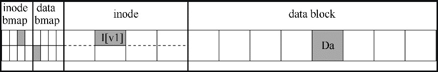
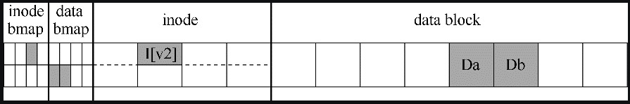
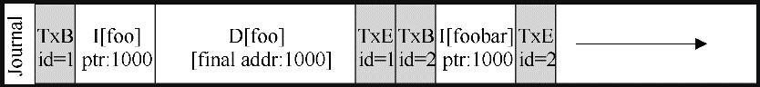

# 崩溃一致性问题

至此我们看到，文件系统管理一组数据结构以实现预期的抽象：文件、目录，以及所有其他元数据，它们支持我们期望从文件系统获得的基本抽象。

与大多数数据结构不同，文件系统数据结构必须持久，即它们必须长期存在，存储在断电也能保留数据的设备上。

为了实现这种持久性，文件系统面临的一个主要挑战在于，如何在出现断电（power loss）或系统崩溃（system crash）的情况下，更新持久数据结构。（system crash）的情况下，更新持久数据结构。

具体来说，如果在更新磁盘结构的过程中，有人绊到电源线并且机器断电，会发生什么？或者操作系统遇到错误并崩溃？

由于断电和崩溃，更新持久性数据结构可能非常棘手，并导致了文件系统实现中一个有趣的新问题，称为**崩溃一致性问题**（crash-consistency problem）。

这个问题很容易理解。想象一下，为了完成特定操作，你必须更新两个磁盘上的结构 A 和 B。由于磁盘一次只为一个请求提供服务，因此其中一个请求将首先到达磁盘（A 或 B）。如果在一次写入完成后系统崩溃或断电，则磁盘上的结构将处于和预期更新不一致的状态。

所以关键问题是：考虑到崩溃，如何更新磁盘？

系统可能在任何两次写入之间崩溃或断电，因此磁盘上状态可能仅部分地更新。崩溃后，系统启动并希望再次挂载文件系统（以便访问文件等）。鉴于崩溃可能发生在任意时间点，如何确保文件系统将磁盘上的映像保持在合理的状态？

## 崩溃场景

为了更好的说明文件系统怎么来解决崩溃一致性问题，这里我们构建一个文件崩溃的细化场景。

这里我们假设文件系统是前面介绍的简单文件系统，在某个时刻，文件系统的视图如下：



如上图所示，整个文件系统由一个 inode 位图（8 位）、数据位图（8 位），8 个 inode 块和 8 个数据块组成。此时，文件系统中分配了一个文件，inode 号为 1（对应上图的 `I[v1]`），其文件数据存放在编号为  4 的数据块中（对应上图中的 Da），这时候 inode 数据结构的内容如下所示：

```
owner : remzi
permissions : read-write
size : 1
pointer : 4
pointer : null
pointer : null
pointer : null
```

如果某个时刻我们需要将文件里追加内容，并且需要分配一个新的数据块来存放追加内容。这时候文件系统需要将该文件相关的磁盘结构进行更新，分别包括：

- 数据位图，修改新分配数据块对应位的标识；
- 文件的 inode 结构需要更新；
- 新分配的数据块 Db。

更新后，文件系统视图如下所示：



如上图所示，更新后由于文件追加了一个数据块，所以数据位图增加了一个为 1 的标志位，并且 inode 数据结构也发生了变化（对应上图中的 `I[v2]`），在数据区域也增加了数据块（上图中的 Db），这时候文件 inode 结构内容如下所示：

```
owner : remzi
permissions : read-write
size : 2
pointer : 4
pointer : 5
pointer : null
pointer : null
```

好了，现在我们有了一个文件写入的实际场景，然后接下来我们分别讨论在上述磁盘上的结构更新时如果发生了崩溃，会对更新产生怎么样的影响，以及我们该怎么去避免或者解决这些影响。

### 场景示例

为了更好地理解这个问题，让我们看一些崩溃情景示例。在上述描述的例子红，向文件的数据追加过程中，会涉及到三次磁盘写入，假设这三次次写入中只有一次写入成功：

- **只将数据块（Db）写入磁盘**

  在这种情况下，数据在磁盘上，但是没有指向它的 inode，也没有表示块已分配的位图。因此，就好像写入从未发生过一样。从文件系统崩溃一致性的角度来看，这种情况不会产生什么不良的影响。

- **只有更新的 inode（I[v2]）写入了磁盘**

  在这种情况下，inode 指向磁盘地址中的 5 号数据块 ，但对应的数据块 Db 并没有写入磁盘。因此，如果我们信任该指针，我们将从磁盘读取垃圾数据（磁盘地址 5 的旧内容）。

  此外，遇到了一个新问题，我们将它称为**文件系统不一致**。磁盘上的位图告诉我们数据块 5 尚未分配，但是 inode 说它已经分配了。要使用文件系统，我们必须以某种方式解决这个问题。

- **只有更新后的位图（B[v2]）写入了磁盘**

  只有更新后的位图（B[v2]）写入了磁盘。在这种情况下，位图指示已分配块 5，但没有指向它的 inode。因此文件系统再次不一致。如果不解决，这种写入将导致空间泄露。

然后我们假设三次磁盘写入，中间的某两次写入失败，一次成功：

- **inode（I[v2]）和位图（B[v2]）写入了磁盘，但没有写入数据（Db）**

  这种情况下，文件系统元数据是一致的，inode 数据结构和位图都正确，但确没有分配数据，指向的是垃圾数据。

- **写入了 inode（I[v2]）和数据块（Db），但没有写入位图（B[v2]）**

  inode 指向了磁盘上的正确数据，但 inode 和数据位图存在不一致的情况。

- **写入了位图（B[v2]）和数据块（Db），但没有写入 inode（I[v2]）**

​		这种情况下，inode 和数据位图之间再次存在不一致。但是，即使写入块并且位图指示其使用，我们也不知道它属于哪个文件，因为没有 inode 指向该块。

### 崩溃一致性问题

从上面的崩溃场景我们可以看出，崩溃会导致磁盘文件系统出现很多问题，比如在文件系统数据结构中可能存在不一致性，可能有空间泄露，可能将垃圾数据返回给用户，等等。

理想情况下是将文件系统从一个一致状态原子地转移到另一个状态。然而，做到这一点并不容易，因为磁盘一次只能提交一次写入，而在每次更新写入之间可能会发生崩溃和断电。我们将这个一般问题称为崩溃一致性问题。

## 解决方案

下面我们就来看崩溃一致性的解决方案。

### 文件系统检查程序

早期的文件系统采用了一种简单的方法来处理崩溃一致性。

基本思想是，它们觉得让不一致的情况先发生，然后设法修复它们。这一方法可以在一个 UNIX 工具 fsck 中体现，fsck 用于查找这些不一致并修复它们。

fsck 会从多个方面对文件系统进行检查并修复，以保证文件系统的一致性，但 fsck 存在着一下几个问题，这也是其他工具同样存在的问题：

- 构建有效工作的 fsck 需要复杂的文件系统知识，确保这样的代码在所有情况下都能正常工作可能具有挑战性；

- fsck 存在性能问题，对于非常大的磁盘卷，扫描整个磁盘，以查找所有已分配的块并读取整个目录树，可能需要几分钟或几小时；

- 在更高的层面上，fsck 的基本前提似乎有点不合理，考虑上面的示例，其中只有 3 个块写入磁盘，fsck 却要扫描整个磁盘，仅修复更新 3 个块期间出现的问题，这是非常昂贵的。

  这种情况类似于将你的钥匙放在卧室的地板上，然后从地下室开始，搜遍每个房间，执行搜索整个房子找钥匙的恢复算法，它有效，但很浪费。

### 预写日志

对于一致更新问题，最流行的解决方案可能是从数据库管理系统的世界中借鉴的一个想法。这种名为**预写日志**（write-ahead logging）的想法，是为了解决这类问题而发明的。

基于日志解决崩溃一致性问题的思路如下：

在更新磁盘结构前，先写日志（在磁盘的其他位置，且是众所周知的），日志成功写入后再更新磁盘。

日志记录了某些磁盘操作，中系统崩溃后我们可以通过日志来准确的知道需要修复的内容，而不必要扫描整个磁盘。因此，通过设计，日志功能在更新期间增加了一些工作量，从而大大减少了恢复期间所需的工作量。

我们现在将描述 Linux ext3（一种流行的日志文件系统）如何将日志记录到文件系统中。

在 ext3 下，一次磁盘更新对应的日志格式如下所示：


可以看出，日志由 5 个部分组成，分别为：

- TxB：事务开始标记，包含事务标识，TID；

- I[v2]、B[v2]、Db：对文件系统即将进行的更新的相关信息，这三块包含了文件更新本身确切的内容，也被称为**物理日志**；

  除了物理日志外，还有一种**逻辑日志**，在日志中放置更紧凑的更新逻辑表示，例如，“这次更新希望将数据块 Db 追加到文件 X”，这有点复杂，但可以节省日志中的空间，并可能提高性能；

- TxE：事务结束标记，包含事务标识，TID。

一旦这个事务安全地存在于磁盘上，我们就可以覆写文件系统中的旧结构了，这个过程称为**加检查点**（check pointing）。因此，为了对文件系统加检查点，即让它与日志中即将进行的更新一致，我们将 I[v2]、B[v2]、Db 写入磁盘对应的位置，如果这些写入成功完成，我们已成功地为文件系统加上了检查点。

这里总结一下，目前我们更新磁盘的步骤如下：

- **日志写入**：将事务（包括事务开始块，所有即将写入的数据和元数据更新以及事务结束块）写入日志，等待这些写入完成；
- **加检查点**：将待处理的元数据和数据更新写入文件系统中的最终位置。

如果我们考虑在写入日志期间发生崩溃时，事情将变得有点棘手。为了解决这个问题，保证日志的可靠性，文件系统将日志分**两阶段写入**。

首先，它将除 TxE 块之外的所有块写入日志，并同时发出这些写入。当这些写入完成时，日志将看起来像这样：


当这些写入完成时，文件系统会发出 TxE 块的写入，从而使日志处于最终的安全状态：


此过程的一个重要方面是磁盘提供的原子性保证。事实证明，磁盘保证任何 512 字节写入都会发生或不发生。因此，为了确保 TxE 的写入是原子的，应该使它成为一个 512 字节的块，考虑到日志文件崩溃后，文件写入过程如下：

- **日志写入**：将事务的内容（包括 TxB、元数据和数据）写入日志，等待这些写入完成；
- **日志提交**：将事务提交块（包括 TxE）写入日志，等待写完成，事务被认为已提交（committed）；
- **加检查点**：将更新内容（元数据和数据）写入其最终的磁盘位置。


然后在上述更新序列下，我们在来了解文件系统如何利用日志内容从崩溃中恢复。

在这个更新序列期间，任何时候都可能发生崩溃。

如果崩溃发生在事务被安全地写入日志之前（在上面的步骤 2 完成之前），那么我们的工作很简单：简单地跳过待执行的更新。

如果在事务已提交到日志之后但在加检查点完成之前发生崩溃，则文件系统可以按如下方式恢复更新。

系统引导时，文件系统恢复过程将扫描日志，并查找已提交到磁盘的事务。然后，这些事务被重放，文件系统再次尝试将事务中的块写入它们最终的磁盘位置。这种形式的日志是最简单的形式之一，称为**重做日志**（redo logging）。通过在日志中恢复已提交的事务，文件系统确保磁盘上的结构是一致的，因此可以继续工作，挂载文件系统并为新请求做好准备。

请注意，即使在某些更新写入块的最终位置之后，在加检查点期间的任何时刻发生崩溃，都没问题。在最坏的情况下，其中一些更新只是在恢复期间再次执行。因为恢复是一种罕见的操作（仅在系统意外崩溃之后发生），所以几次冗余写入无须担心。

#### 批处理日志更新

对于每次磁盘更新都会先记录日志，为了减少磁盘流量，一些文件系统不会一次一个地向磁盘提交每个更新，与此不同，可以将所有更新缓冲到全局事务中。

在上面的示例中，当创建两个文件时，文件系统只将内存中的 inode 位图、文件的 inode、目录数据和目录 inode 标记为脏，并将它们添加到块列表中，形成当前的事务。当最后应该将这些块写入磁盘时，会提交包含上述所有更新的单个全局事务。因此，通过缓冲更新，文件系统在许多情况下可以避免对磁盘的过多的写入流量。

#### 日志容量有限

一般来讲，存储日志信息的容量是有限的，如果不断向它添加事务，它将很快填满。

日志满时会出现两个问题。第一个问题是：日志越大，恢复时间越长，因为恢复过程必须重放日志中的所有事务（按顺序）才能恢复。第二个问题更重要：当日志已满（或接近满）时，不能向磁盘提交进一步的事务，从而使文件系统“不太有用”。

为了解决这些问题，日志文件系统将日志视为循环数据结构，一遍又一遍地重复使用，这就是为什么日志有时被称为**循环日志**。

为此，文件系统必须在加检查点之后的某个时间执行操作。具体来说，一旦事务被加检查点，文件系统应释放它在日志中占用的空间，允许重用日志空间。	

有很多方法可以达到这个目的。例如，你只需在日志超级块（journal superblock）中标记日志中最旧和最新的事务。这时候文件写入步骤如下：

- **日志写入**：将事务的内容（包括TxB和更新内容）写入日志，等待这些写入完成；
- **日志提交**：将事务提交块（包括 TxE）写入日志，等待写完成，事务被认为已提交（committed）；
- **加检查点**：将更新内容写入其最终的磁盘位置；
- **释放**：一段时间后，通过更新日志超级块，在日志中标记该事务为空闲。

因此，我们得到了最终的数据日志协议。但仍然存在一个问题：我们将每个数据块写入磁盘两次，这是沉重的成本，特别是为了系统崩溃这样罕见的事情。你能找到一种方法来保持一致性，而无须两次写入数据吗？

### 元数据日志

数据日志存在着一个问题，其会将实际要更新到磁盘的数据写入磁盘两次，尤其当用户数据非常大时，这种方式会有比较高的代价，仅仅为了解决可能不会出现的崩溃一致性问题。

并且我们发现磁盘写入的数据中元数据部分是比较小的，用户数据有时候很大，那么一个解决办法就是，在日志记录是仅仅写入元数据，而不考虑用户数据，这时候日志格式就变为：


然后对于用户数据我们一开始就写入文件系统从而避免重复写入，这时候文件写入过程为：

- **数据写入**：将数据写入最终位置，等待完成（等待是可选的）；
- **日志元数据写入**：将开始块和元数据写入日志，等待写入完成；
- **日志提交**：将事务提交块（包括 TxE）写入日志，等待写完成，现在认为事务（包括数据）已提交（committed）；
- **加检查点元数据**：将元数据更新的内容写入文件系统中的最终位置；
- **释放**：稍后，在日志超级块中将事务标记为空闲。

事实证明，用户数据写入的顺序对于元数据日志很重要，如果我们在事务完成后写入用户数据，就有可能发生文件系统是一致的，但可能最终指向垃圾数据的问题。所以通过强制先写入数据，文件系统可以保证指针永远不会指向垃圾。

### 块复用

一些有趣的特殊情况让日志更加棘手，因此值得讨论。其中一些与块复用有关。

假设你有一个名为 foo 的目录，用户向 foo 添加一个条目（例如通过创建文件），foo 的内容（**因为目录被认为是元数据**）被写入日志。假设foo目录数据的位置是块 1000。然后用户删除了目录的所有内容和目录的本身，所以 1000 这个块有可用了，此时用户创建了一个新的文件 bar，并复用了 1000 这个块，真个过程日志格式如下：



这时候假设系统崩溃了，在系统恢复后会重放上述日志恢复文件系统。这时候有意思的一点发生了，foobar 这个文件数据会指向以及被删除了 foo 目录的数据，在阅读文件 foobar 时，用户会感到惊讶。

为了解决上述块复用问题，Linux ext3 的做法是将新类型的记录添加到日志中，称为**撤销记录**。在上面的情况中，删除目录时将撤销记录写入日志。在重放日志时，系统首先扫描这样的重新记录。任何此类被撤销的数据都不会被重放，从而避免了上述问题。

## 总结

我们介绍了崩溃一致性的问题，并讨论了处理这个问题的各种方法。构建文件系统检查程序的旧方法有效，但在现代系统上恢复可能太慢。因此，许多文件系统现在使用日志。日志可将恢复时间从 `O(size-of-the-disk-volume)` 减少到 `O(size-of-the-log)`，从而在崩溃和重新启动后大大加快恢复速度。因此，许多现代文件系统都使用日志。我们还看到日志可以有多种形式。最常用的是有序元数据日志，它可以减少日志流量，同时仍然保证文件系统元数据和用户数据的合理一致性。


是《[操作系统导论](https://weread.qq.com/web/reader/db8329d071cc7f70db8a479kc81322c012c81e728d9d180)》（英文名：《Operating Systems: three easy pieces》）第 42 章学习笔记。
