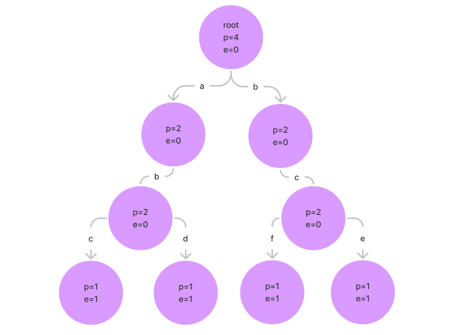

# 前缀树

定义一种树结构（前缀树（`trie`）），满足以下需求：

- 单个字符串中，将字符串中的每个字符从前到后加到一棵多叉树上；
- 要求字符放在路径上，树的节点存放通过该节点的数量 pass 和以该节点结尾的数量 end；
- 所有的样本字符串都这样添加，如果没有路径就创建，有路径就复用；
- 沿途节点的 pass 增加 1，每个字符串结束时来到的节点的 end 加一。

比如有以下字符串  `["abc", "abd", "bce", "bcf"]`，那么用前缀树存储，结构如下所示：



## 前缀树的实现

前缀树的实现有两种方式，分别是基于数组实现和基于哈希表实现。

### 基于数组实现

基于数组实现，代码如下所示：

```java
public class Trie {

    private final Node root;

    public Trie() {
        this.root = new Node();
    }

    public void insert(String word) {
        if (word == null) {
            return;
        }
        root.pass++;

        final char[] chars = word.toCharArray();
        Node node = root;
        for (char aChar : chars) {
            int index = aChar - 'a';
            if (node.nextNodes[index] == null) {
                node.nextNodes[index] = new Node();
            }
            node = node.nextNodes[index];
            node.pass++;
        }
        node.end++;
    }

    public void delete(String word) {
        if (search(word) != 0) {
            final char[] chars = word.toCharArray();
            Node node = root;
            for (char aChar : chars) {
                int index = aChar - 'a';
                if (--node.nextNodes[index].pass == 0) {
                    node.nextNodes[index] = null;
                    return;
                }
                node = node.nextNodes[index];
            }
            node.end--;
        }
    }

    public int search(String word) {
        if (word == null) {
            return 0;
        }
        final char[] chars = word.toCharArray();
        Node node = root;
        for (char aChar : chars) {
            int index = aChar - 'a';
            Node next = node.nextNodes[index];
            if (next == null) {
                return 0;
            }
            node = next;
        }
        return node.end;
    }

    public int prefixNumber(String pre) {
        if (pre == null) {
            return 0;
        }
        final char[] chars = pre.toCharArray();
        Node node = root;
        for (char aChar : chars) {
            int index = aChar - 'a';
            Node next = node.nextNodes[index];
            if (next == null) {
                return 0;
            }
            node = next;
        }
        return node.pass;
    }

    /**
     * 前缀树节点
     */
    static class Node {

        private int pass;
        private int end;
        private final Node[] nextNodes;

        public Node() {
            this.pass = 0;
            this.end = 0;
            // 26 表示 26 个小写字母，这里假设存放的字符串只由 26 个小写字母组成
            // 0 代表路径 a
            // 1 代表路径 b
            // ......
            // 25 代表路径 z
            this.nextNodes = new Node[26];
        }
    }
}
```

如上述代码所示，在定义前缀树的节点时，定义了一个长度为 26 的数组作为下级节点，数组下标分别代表 a~z 这 26 个小写字母的路径，所以这个前缀树不支持字符串包含除了小写字母以外的字符。

### 基于哈希表实现

我们知道基于数组实现，支持的字符有数量限制，为了支持任意数量的字符，可以借助哈希表实现，修改的代码如下所示：

```java
public class Trie {

    private final Node root;

    public Trie() {
        this.root = new Node();
    }

    public void insert(String word) {
        if (word == null) {
            return;
        }
        root.pass++;

        final char[] chars = word.toCharArray();
        Node node = root;
        for (char aChar : chars) {
            int index = aChar - 'a';
            node = node.nextNodes.computeIfAbsent(index, k -> new Node());
            node.pass++;
        }
        node.end++;
    }

    public void delete(String word) {
        if (search(word) != 0) {
            final char[] chars = word.toCharArray();
            Node node = root;
            for (char aChar : chars) {
                int index = aChar - 'a';
                if (--node.nextNodes.get(index).pass == 0) {
                    node.nextNodes.remove(index);
                    return;
                }
                node = node.nextNodes.get(index);
            }
            node.end--;
        }
    }

    public int search(String word) {
        if (word == null) {
            return 0;
        }
        final char[] chars = word.toCharArray();
        Node node = root;
        for (char aChar : chars) {
            int index = aChar - 'a';
            final Node next = node.nextNodes.get(index);
            if (next == null) {
                return 0;
            }
            node = next;
        }
        return node.end;
    }

    public int prefixNumber(String pre) {
        if (pre == null) {
            return 0;
        }
        final char[] chars = pre.toCharArray();
        Node node = root;
        for (char aChar : chars) {
            int index = aChar - 'a';
            final Node next = node.nextNodes.get(index);
            if (next == null) {
                return 0;
            }
            node = next;
        }
        return node.pass;
    }

    /**
     * 前缀树节点
     */
    static class Node {

        private int pass;
        private int end;
        private final Map<Integer, Node> nextNodes;

        public Node() {
            this.pass = 0;
            this.end = 0;
            // key 表示路径，value 表示路径指向的下个节点
            this.nextNodes = new HashMap<>();
        }
    }
}
```

这里不再用数组来存储下级节点和用下标表示存储路径，而是将存储路径用 Map 的 key 来表示，路径指向的下级节点用 value 来表示，这样就支持了更多的字符。

## 总结

上述笔记总结自：

- [左程云_算法与数据结构基础班【马士兵教育】-学习视频教程-腾讯课堂 (qq.com)](https://ke.qq.com/course/2145184?tuin=b09cbb87) 第五课

