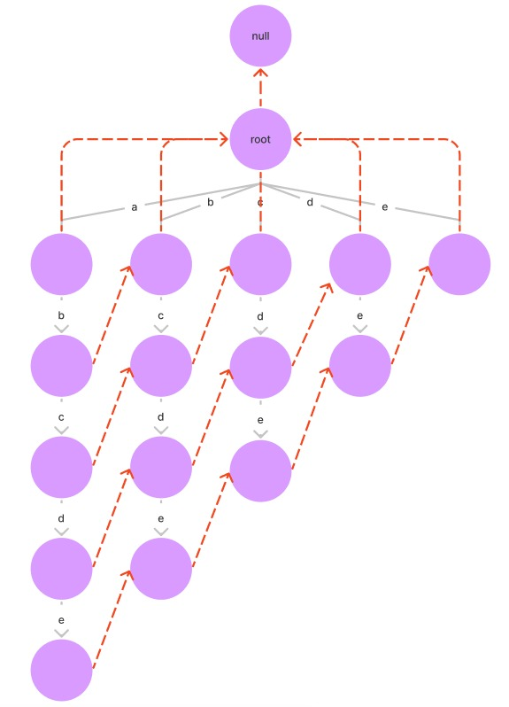

# AC 自动机

我们有一个敏感词汇表，现在有一篇文章，找到文章中的全部敏感词汇，这个就可以使用 AC 自动机的使用场景。

首先敏感词是用前缀树来存储的。我们知道利用前缀树这种结构，我们可以用 O(K) 的时间复杂度统计某个字符串或以某个字符串为前缀的字符串的数量。

AC 自动机就是在前缀树的基础上增加了 fail 指针。

## AC 自动机构建

我们直到 AC 自动机是前缀树的增强，主要是给每个节点增加了 fail 指针，每个节点 fail 指针指向节点满足下面规则：

- 首先对于规定对于头节点，其 fail 指针指向 null；

- 头节点下一级节点 fail 指针指向头节点；

- 对于其他节点（记为 x）的 fail 指针，考察其父节点，并假设父节点指向 x 节点的路径上的字符为 b；

  此时看父节点的 fail 指针指向的节点（记为 pf）有没有经过字符 b 的路径，如果没有继续考察 pf 节点 fail 指针指向的节点，直到 fail 指针指向空或者其指向的节点找到经过字符 b 的路径。

  如果最后 fail 指针为 null 时都没找到经过字符 b 的路径，那么就将 x 指针的 fail 指针指向头节点；如果找到了经过字符 b 的路径，就将 x 的 fail 指针指向路径指向的节点。

比如对于 "abcde"、"bcde"、"cde"、"de"、"e"，前缀树和 fail 指针的指向如下图所示：




从上图可以看出，一个节点 x 的 fail 指针本质是（记 fail 指针指向的节点为 y），x 节点所在路径从头节点到 x 节点所有字符构成的字符串 str1，和 y 节点所在路径从头节点到 y 节点所构成的字符串 str2，str1 的后缀串和 str2 的前缀串存在相等的情况，且长度是所有分支中最长的。

AC 自动机器的构建代码如下所示：

```java
// 前缀树节点结构
static class Node {
    /**
      * 表示节点是否为前缀树上的结尾节点
      * 如果不为 null，表示这个节点是某个字符串的结尾，且 end 的值就是这个字符串，如果 end 为 null，则表示这个节点不是结尾节点
      */
    public String end;
    /**
      * 表示结尾节点是否已经使用过，在匹配铭感词时可以避免重复匹配
      */
    public boolean endUse;
    public Node fail;
    public Node[] nexts;

    public Node() {
        endUse = false;
        end = null;
        fail = null;
        nexts = new Node[26];
    }
}
// 构建前缀树
public void insert(String s) {
    char[] str = s.toCharArray();
    Node cur = root;
    int index;
    for (int i = 0; i < str.length; i++) {
        index = str[i] - 'a';
        if (cur.nexts[index] == null) {
            cur.nexts[index] = new Node();
        }
        cur = cur.nexts[index];
    }
    cur.end = s;
}
// 维护 fail 指针
public void build() {
    Queue<Node> queue = new LinkedList<>();
    queue.add(root);
    while (!queue.isEmpty()) {
        // cur 为父节点，依次考察其下的每个子节点，并维护好 fail 指针
        Node cur = queue.poll();
        for (int i = 0; i < 26; i++) {
            if (cur.nexts[i] != null) {
                cur.nexts[i].fail = root;
                Node cfail = cur.fail;
                while (cfail != null) {
                    if (cfail.nexts[i] != null) {
                        cur.nexts[i].fail = cfail.nexts[i];
                        break;
                    }
                    cfail = cfail.fail;
                }
                queue.add(cur.nexts[i]);
            }
        }
    }
}
```

## 铭感词的查找

有了 AC 自动机的结构后，接下来看怎么利用这种结构来查找一篇文章中包含的铭感词汇。

代码如下：

```java
/**
  * 匹配敏感词
  *
  * @param content 文章内容
  * @return 文章中包含的铭感词列表
  */
public List<String> containWords(String content) {
    char[] str = content.toCharArray();
    Node cur = root;
    int index;
    List<String> ans = new ArrayList<>();
    for (int i = 0; i < str.length; i++) {
        index = str[i] - 'a';
        // 如果当前字符在这条路上没配出来，就随着 fail 方向走向下条路径
        while (cur.nexts[index] == null && cur != root) {
            cur = cur.fail;
        }
        // 1) 现在来到的路径，是可以继续匹配的
        // 2) 现在来到的节点，就是前缀树的根节点
        cur = cur.nexts[index] != null ? cur.nexts[index] : root;

        Node follow = cur;
        while (follow != root) {
            if (follow.endUse) {
                break;
            }
            // 不同的需求，在这一段之间修改
            if (follow.end != null) {
                ans.add(follow.end);
                follow.endUse = true;
            }
            // 不同的需求，在这一段之间修改
            follow = follow.fail;
        }
    }
    return ans;
}
```


