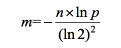
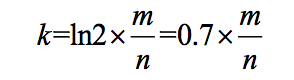
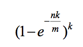

# 哈希函数

一个哈希函数形如：`out=hash(in)`。其具有以下特征：

- 哈希函数的输入 in 范围时无穷的，输出 out 往往是一个很大的数值，但范围是有限的，那么不同的输入可能得到同样的输出，这一现象叫做**哈希碰撞**；

- 哈希函数不具有随机性，即对于同样的输入在任何时候都能得到一样的输出；

- 哈希函数的输出结果是**离散且均匀**的，即使输入十分接近。

  怎么理解均匀性，假设一组数量较多的随机样本输出的结果分布在数轴上，那么我们用固定长度的范围去框数轴上的数，在不同位置框住的数的个数是近似的。

## 哈希表

哈希表基于哈希函数实现，其存储了一组键值对，可以让我们用常数时间通过 key 从哈希表里找到 value。

哈希表经典实现是桶加链表的方式。

桶一般用数组实现，一开始有确定的长度，桶的每个位置对应着一个单链表（用来应对哈希碰撞问题）。

在向哈希表里存放元素的过程如下：

- 对于任意一个 key，会先用哈希函数取得哈希值，并模上桶的长度，得到该 key 在桶上的位置；

- 得到位置后创建一个链表节点，将该节点连接到链表的尾部。

从哈希表里用 key 获得 value 的步骤如下：

- 获得 key 的哈希值，取模得到 key 在桶中的位置；
- 遍历链表，取得和当前 key 相同的 value，没有则返回 null。


可以看出在查询时某个位置的链表长度过长，会影响到单次查询的效率。

因此当链表长度到达某个限制或者哈希表中的元素数量到达某个上限后，需要将哈希表进行扩容，一般会将哈希表桶的长度变为原 2 倍。桶扩容时需要重新将 key 哈希值取模，放到对应位置的链表上。


桶的某个位置的链表长度过长时，我们可以使用红黑树优化，减少单次查询的常数时间。

## 布隆过滤器

布隆过滤器可以用来解决海量数据的过滤问题，其用若干位来表示数据是否存在，因此其很节省空间。

比如我有 100 亿个黑名单 url，每当一个 url 来到时需要判断这个 url 是否在 url 内。

使用布隆过滤器的做法是：

- 申请一个长为 m 的位数组；
- 将黑名单里的每个 url 用 k 个不同的哈希函数求得该 url 的哈希值，用得到的哈希值与 m 取模，这样我们可以得到 k 个位置，并将这些位置标 1；
- 当一个 url 来到时，用同样的哈希函数求得哈希值，取模后从位数组中拿出对应位置的值，如果值全为 1 则表示该 url 在黑名单中，如果有一个不为 1 则表明不在黑名单中。

布隆过滤器一定存在失误率，这个失误率用上面的例子讲就是对于在黑名单里的 url 一定不会判断错，对于不在黑名单里的 url 其有一定的失误率判断其为黑名单里的 url。

### 布隆过滤器的三个公式

从上面可以看出，在使用布隆过滤器的时候，我们有两个重要的参数需要确定。

一个是位数组的长度 m，一个是哈希函数的个数 k。

样本数量 n 和失误率 p 则有业务场景确定。


布隆过滤器的失误率和字节数组的长度有关，如果 m 很小失误率就越高，m 越大，失误率越低，但占用的空间就越多。

那么在实际使用的过程中，我们一般知道样本的数量和需要的失误率，根据这两个量可以计算出 m 的大小（向上取整），计算公式如下：



当有了 m 后，我们可以使用下面公式计算 k 的值（向上取整）：



得到了计算后的 m 和 k 后，我们可以适当的修正 m 和 k，向上取整就是一种修正，然后用修正的值代入下面公式，计算出实际的失误率：



这里还有一个问题，计算出 k 后，我们有那么多的哈希函数可以用吗？

实质上我用两个不同的哈希函数，就可以组合出任意个哈希函数来使用。

比如我们有两个哈希函数 hash1 和 hash2，我们需要 13 个哈希函数，那么我们可以这么组合：

```
h1 = hash1 + hash2
h2 = 2 * hash1 + hash2
h3 = 3 * hash1 + hash2 
...
h13 = 13 * hash1 + hash2
```

### 使用场景

这里总结一下布隆过滤器的使用场景。

1. 使用 Redis，在某种情况下，可能会出现缓存穿透（大量请求访问时，Redis没有命中数据，导致请求绕过了 Redis 缓存，直接去访问数据库了，数据库难以承受大量的请求）。
   这时候就可以使用布隆过滤器来解决，请求到来时，先用布隆过滤器判断数据是否有效，布隆过滤器可以判断元素一定不存在和可能存在，对于一定不存在的数据，则可以直接丢弃请求。对可能存在的请求，再去访问 Redis 获取数据，Redis 没有时，再去访问数据库。
2. 过滤：邮箱的垃圾邮件过滤、黑名单；
3. 去重：URL 去重。

## 一致性哈希

业务上我们有分布式的需求，来应对高负载和低容错的业务场景。

比如我们在存储数据时，如果数据量特别大，单个数据库容易出现性能上的瓶颈，这时候我们就需要分库。

分库简单来说，我们有多个数据库，存储数据的时候会根据数据通过分片键将其存放到不同的库里。

一种常用的分片方法是求数据的哈希值，并通过模运算将其存放到对应得数据库中。**分片优劣的衡量标准于是否能够把整体的数据均匀的分布到各个节点上，如果选则哈希分片，需要结合业务考虑怎么使用哈希函数让分片仅可能的均匀**。

现在有个问题是，如果我们一开始有 3 个数据库，后序随着业务的增长发现需要增加 1 个，这个时候我们需要对存量数据重启求哈希值取模，存在数据迁移的过程。

一致性哈希解决的就是在增加节点后，怎么样减少数据的迁移。


哈希环

哈希函数的返回值的范围想象成一个顺时针分布的环。

使用能够表示机器信息比如 IP 地址或 MAC 地址，求哈希值，将其投放到这个环上；

然后对于要存放的数据，计算出其哈希值，顺时针移动，将数据存放到第一个遇到的机器上。

比如一开始我们有 A、B、C 三台机器在环上如下分布：

```
        A                                    A
       / \                                  / \
      /   \       --增加机器 D-->           /    \
     /     \                             /       \
    C-------B                           C----D----B 
```

哈希值在 A~B 之间的数据存放到 B 上，B~C 之间的数据存放到 C 上，C~A 之间的数据会存放到 A 上；

然后我们增加一台机器 D，比如在 C 和 B 之间，我们仅仅需要将 B~D 范围内原本在 C 机器上的数据迁移至 D 即可；

如果 D 机器下线了，我们在将 B~D 范围的数据迁移至 C 即可；

可以看出增加或减少机器，数据不需要全部迁移。


> 数据来了，怎么顺时针找机器？
>
> 比如三台机器的对应的哈希值位 2、1002、3010，将这三个数值从小到大放到数组中；然后来了一个数据哈希值位 78，顺时针找机器的过程就变成了在数组中找大于 78 的最左侧节点（大于 78 的最小值），这一过程可以使用二分法，所以能很快找到。

### 虚拟节点

怎么让机器的哈希值均匀分环，而且在增加或减少机器时，也能够保持这种均分性？

虚拟节点技术，利用哈希函数离散均匀的特性。

给机器 A 分配 1000 个虚拟节点（可以用字符串表示比如 a1~a1000）；

给机器 B 分配 1000 个虚拟节点（可以用字符串表示比如 b1~b1000）；

给机器 C 分配 1000 个虚拟节点（可以用字符串表示比如 c1~c1000）；

然后不在用机器的 IP 或 MAC 地址求哈希值在环中占位置，而是用虚拟节点的哈希值去环上占位置，然后数据同样按顺时针第一个相遇原则决定自己在那台机器上，比如第一个遇到了 c99，那么该数据就应该存放到机器 C 上。当给每个节点虚拟出多个节点后，利用哈希函数的均匀性，便可以让 A、B、C 三台机器均匀使用环上的位置。

然后新增机器 D，同样地也给其分配 1000 个虚拟节点（可以用字符串表示比如 d1~d1000），然后用这 1000 个虚拟节点的哈希值去环上占位置。

此时 D 的虚拟节点会均匀地从 A、B、C 三个机器各拿出近似 1/12 的数据，然后将这 1/4 的数据迁移到 D 机器上。

使用虚拟节点的技术，增大样本量，充分利用了哈希函数的均匀性，解决了均匀分配的问题。

## 资源限制类问题解决思路

- 布隆过滤器可以用来解决海量数据的过滤问题，其用若干位来表示数据是否存在，因此其很节省空间；

- 一致性哈希解决数据服务器的负载管理问题（通过虚拟节点技术在增加和减少节点时也能均匀分配）；

- 利用并查集结构做岛问题的并行计算；

- 哈希函数可以把数据**按照种类均匀分流**，分批统计，再合并结果；

- 位图解决某一范围上数字的出现情况（是否出现、出现次数），并可以节省大间；

- 利用分段统计、词频排除的思想，可以一步一步缩小范围，找到答案；

  比如有 0~100 范围内若干的随机数，若将 1~100 范围分成 1~10、11~20、... 91~100 这10 个段，让每个数除以 10，用得到的商就能将这些数划分到不同的段里；

- 利用堆、外排序来做多个处理单元的结果合并。

**资源限制类的问题首先要清除资源限制的条件有那些，清楚了限制条件后才能够有针对性地选择上述解决问题的思路去设计解决方案**。

### 出现次数最多的数

32 位无符号整数的范围是 0~4,294,967,295，现在有一个正好包含 40 亿个无符号整数的文件，可以使用最多 1GB 的内存，怎么找到出现次数最多的数？

如果基于数组去统计，数组存放这 40 亿个数，一共需要 160 亿字节的空间，大概需要 15GB 的内存空间，不符合题目要求。

我们可以使用哈希表去存储，统计每个数字出现的数量，其中 key 为数字，value 为数字出现的数量，一条记录需要 8 个字节的内存区存储。但若这 40 亿个数中每个数都不相同，那么哈希表就需要 40 亿条记录来存储，占用的空间就更多了。那么该怎么做呢？

- 首先我们估计一下 1GB 内存用哈希表来存储，最多可以存放多少条记录；

  1GB/8B=134,217,728 个数，考虑哈希表其他内存使用情况，我们就假设 1GB 内存能够容纳 1000 万条记录，40 亿则有 400 个 1000 万。

- 然后读取文件，求数字的哈希值，模上 400，根据模的结果将数字存放到不同文件中，我们会得到 400 个文件；

  > **相同的数字一定在同一个文件中**，同一个文件最多有 1000 万种不同的数字；

- 依次读取这 400 个文件，使用哈希表统计每个文件出现次数最多的数；

- 最后在汇总这 400 条记录，统计出整个文件出现次数最多的数。

### 找到没有出现过的数

32 位无符号整数的范围是 0~4,294,967,295，现在有一个正好包含 40 亿个无符号整数的文件，所以在整个范围中必然存在没出现过的数。
可以使用最多 1GB 的内存，怎么找到所有未出现过的数？内存限制为 3KB，怎么找到一个没出现过的数？

如果最多使用 1GB 的内存，我们可以使用位图去找未出现过的数。

具体做法为申请一个长度为 2^32 的位数组 arr，每一位表示下标对应的数是否出现（1 出现，0 未出现）。读取文件，依次将文件出现过的数字对应的位置设置为 1，数组 arr 种为 0 的下标就表示没有出现过的数。

> 有些语言没有位数组怎么办呢，比如 Java？
>
> 没有位数组，我们可以使用字节数组或 int 数组去替代，这里用 int 数组举例。
>
> 我们知道 Java 中一个 int 占 32 位，那么对于一个长度位 2^32 的位数组，我们申请一个 2^27 长度的 int 数组即可。
>
> 然后对于一个数 k，我们先用 k/32 得改数在 int 数组哪个位置，然后 k%32 找到这个数字在一个 int（32 位）中的位置，将这位置置为 1 即可。
>
> 将某位置为 1 可以使用按位与运算，比如我们需要将 32 位中的第 5 位变成 1，可以 `1<<4 | 0` 。
>
> 如果我们想知道 32 位中某一位是否为 0，可以使用按位与运算，比如我们想知道 32 位中的第 5 位是否位 0，可以 `1 << 4 & a`，如果值为 0，则表示第 5 位为 1。

使用 3KB 的内存，怎么找到一个没有出现过的数？

这时候我们可以使用分段统计的思想。

首先 `3KB=3*2^10B`，如果我们需要在 3KB 中申请 int 数组，数组的长度最多为 `3*2^10/4=3*2^8`，小于这个数且是 2 的幂的数为 2^9，我们选择这个长度来创建 int 数组。

32 无符号整数范围从 0~2^32-1，我们将这些数分成 2^9 个等分区间，每个区间包含 2^23 个数。

用上面申请的数组来记录对应区间中数字出现的个数，比如数组的 5 号元素就表示 `4*2^23 ~ 5*2^23-1` 这个范围内出现数字的个数。

这时候我们就可以依次读取文件里的数（记为 k），k/2^23 就可以知道该数在 int 数组的那个位置（并存放到不同文件中），将对应位置上的数累加 1，这样读取完文件后，每个区间数字出现的数量我们就统计出来了。

因为文件中有 40 亿个数，小于 32 为整型最多能表示的数，所以数组中一定存在值小于 2^23 的元素，就代表该位置表示的区间中间有数字没有出现在文件中，然后我们可以单独处理这个区间和区间对应的文件

> 若数组中的元素值大于或等于 2^23，也不代表其代表的区间中所有的数都出现在了文件了，因为可能有重复的数。

如果发现区间里的数字仍然很多，继续通过上述划分区间的方式，找到个数不足的区间，这样缩小到一定范围后，可以使用位图去找到没有出现过的数。


同时我们发现，通过不断地**分段统计**，找数量（词频）不足的区间，这个过程使用二分就能实现。因此如果上述问题仅要求我们只能使用有限几个变量找到第一个不存在的数。

### 出现了两次的数

32 位无符号整数的范围是 0~4294967295，现在有 40 亿个无符号整数，可以使用最多 1GB 的内存，找出所有出现了两次的数。

这个可以使用位图去实现。

但这个时候不是用位图的 1 位来表示某个数字是否出现，而是用连续的两位来表示数字出现的个数。比如用 00 表示数字出现了 0 次，01 表示数字出现了 1 次，10 表示数字出现了 2 次，11 表示数字出现了 3 次及以上。

那么读取文件，维护好这个位图后，对于位置为 10 代表的数字就出现了两次。

然后我们考虑下 1GB 内存是否能容纳上面的位图。

首先我们需要 2^33 位来创建位图，1GB=2^33 位，刚好可以容纳。

### 找中位数

32 位无符号整数的范围是 0~4294967295，现在有 40 亿个无符号整数，可以使用最多 3KB 的内存，怎么找到这 40 亿个整数的中位数？

这个题可以利用分段统计、词频排除的方法。

具体做法为将 42 亿分层若干段，统计每当数字出现的数量。统计的数量用一个 int 数组存储，所以段的数量不能过多以至于数组容量超过 3KB。

依次考察每个段里的词频，如果小于 20 亿，则加上后序分段的词频，直到达到 20 亿或超过 20 亿。

那么我们就找到了中位数所在的分段，继续考察这个分段，找到我们需要的数。

### 海量数据去重

有一个包含 100 亿个 URL 的大文件，假设每个 URL 占用 64B，请找出其中所有重复的 URL。

对于去重可以使用布隆过滤器，但存在失误率。

如果不允许有失误率，可以求每个 URL 的哈希值，取模分配到不同的小文件中去。相同的 URL 因为其哈希值相同，所以一定会被分配到同一个文件中。

那么就可以在子文件中进行去重处理，如果子文件还是太大，使用其他的哈希函数继续分配，然后再去重。

### 有限空间排序

32 位无符号整数的范围是 0~4294967295，有一个 10G 大小的文件，每一行都装着这种类型的数字。整个文件是无序的，给你 5G 的内存空间，
请你输出一个 10G 大小的文件，就是原文件所有数字排序的结果。

这个问题可以使用堆来解决，利用堆来建立门槛。

创建一个大根堆，大根堆的容量在要求内存的范围内，堆里存放数字和数字出现的次数，堆按数字的值进行组织。

依次读取文件里的数，将其放到大根堆中，过程如下：

- 如果堆不满且堆中没有该数字，将该数字入堆，并将计数加一；
- 如果堆里有该数字，将计数加一；
- 如果堆满了且堆里没有这个数字，跳过。

这样在一次遍历完毕后，使用堆可以将文件中的前一部分数字排序好。

记录堆顶的元素，清空堆，进行下一次遍历。

第二次遍历的时候步骤和第一次遍历类似，但是遍历时如果发现遍历的值小于上次堆顶的值，直接跳过，否则按照第一次遍历的步骤进行处理。

这样每一次遍历，我们可以将文件的部分数据排好顺序。直到某次遍历结束，发现堆没有被填满，说明文件里的数已经全部被处理过，最后将堆里元素处理好，整个文件的排序就完成了。

### 海量数据 Top K

某搜索公司一天的用户搜索词汇是海量的（百亿数据量），请设计一种求出每天热门 Top 100 词汇的可行办法。

首先利用哈希离散均匀的特性，将搜索词汇通过哈希值取模的方法分流到不同的文件中。

统计每个子文件搜索词汇的搜索次数，用大根堆排列好每个文件的 Top 100，然后在这些 Top 100 中选出 Top 100。

这时候可以使用外排序，每次查看所有堆顶的元素，找出这 100 个中最大的，并从该堆中弹出，重复前面过程，直到弹出 100 个数为止。

也可以再建立一个堆，将每个堆堆顶元素放入堆中，弹出堆顶最大元素的同时将弹出元素来自堆的下个元素入堆，重复前面过程，直到弹出 100 个数为止。


