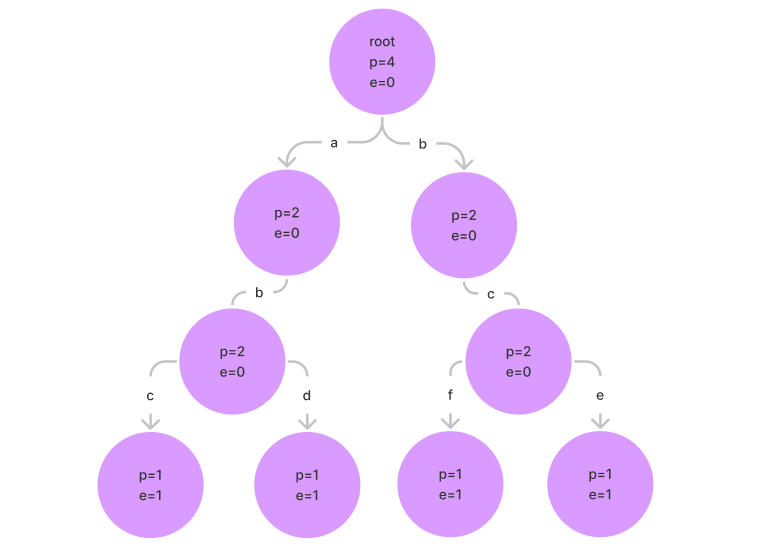

# 前缀树

定义一种树结构（前缀树（`trie`）），满足以下需求：

- 单个字符串中，将字符串中的每个字符从前到后加到一棵多叉树上，要求字符放在路径上，树的节点存放通过该节点的字符串数量 pass 和以该节点结尾的字符串数量 end；
- 首先前缀树有一个 root 节点，所有的样本字符串都从 root 开始找路径，如果没有路径就创建，有路径就复用；
- 沿途节点的 pass 增加 1，每个字符串结束时来到的节点的 end 加一。

比如有以下字符串  `["abc", "abd", "bce", "bcf"]`，那么用前缀树存储，结构如下所示：



有了上述结构后，我们可以方便的查询在字符串数组中，以某个字符串为前缀的字符串数量（pass）或某个字符串出现的次数（end），时间复杂度为 O(K)，K 为字符串或字符串前缀的字符数量。

## 前缀树的实现

前缀树一定有且仅有一个根节点，从根节点出发有多个通向下级节点的路径。前缀树每个字符在路径上，节点上存放一些辅助信息，来区分样本。前缀树的实现有两种方式，分别是基于数组实现和基于哈希表实现。本质上要解决的问题都是如何表达路径和路径下方节点的连接关系。

如果是数组，一般使用数组的下标表示路径，其对应位置上的元素就是路径通向的节点。

如果是哈希表，哈希表的 key 表示路径，value 表示路径通向的节点。

### 基于数组实现

基于数组实现，代码如下所示：

```java
public class Trie {

    private final Node root;

    public Trie() {
        this.root = new Node();
    }

    public void insert(String word) {
        if (word == null) {
            return;
        }
        root.pass++;

        final char[] chars = word.toCharArray();
        Node node = root;
        for (char aChar : chars) {
            int index = aChar - 'a';
            if (node.nextNodes[index] == null) {
                node.nextNodes[index] = new Node();
            }
            node = node.nextNodes[index];
            node.pass++;
        }
        node.end++;
    }

    public void delete(String word) {
        if (search(word) != 0) {
            final char[] chars = word.toCharArray();
            Node node = root;
            for (char aChar : chars) {
                int index = aChar - 'a';
                if (--node.nextNodes[index].pass == 0) {
                    node.nextNodes[index] = null;
                    return;
                }
                node = node.nextNodes[index];
            }
            node.end--;
        }
    }

    public int search(String word) {
        if (word == null) {
            return 0;
        }
        final char[] chars = word.toCharArray();
        Node node = root;
        for (char aChar : chars) {
            int index = aChar - 'a';
            Node next = node.nextNodes[index];
            if (next == null) {
                return 0;
            }
            node = next;
        }
        return node.end;
    }

    public int prefixNumber(String pre) {
        if (pre == null) {
            return 0;
        }
        final char[] chars = pre.toCharArray();
        Node node = root;
        for (char aChar : chars) {
            int index = aChar - 'a';
            Node next = node.nextNodes[index];
            if (next == null) {
                return 0;
            }
            node = next;
        }
        return node.pass;
    }

    /**
     * 前缀树节点
     */
    static class Node {

        private int pass;
        private int end;
        private final Node[] nextNodes;

        public Node() {
            this.pass = 0;
            this.end = 0;
            // 26 表示 26 个小写字母，这里假设存放的字符串只由 26 个小写字母组成
            // 0 代表路径 a
            // 1 代表路径 b
            // ......
            // 25 代表路径 z
            this.nextNodes = new Node[26];
        }
    }
}
```

如上述代码所示，在定义前缀树的节点时，定义了一个长度为 26 的数组作为下级节点，数组下标分别代表 a~z 这 26 个小写字母的路径，所以这个前缀树不支持字符串包含除了小写字母以外的字符。

### 基于哈希表实现

我们知道基于数组实现，支持的字符有数量限制，为了支持任意数量的字符，可以借助哈希表实现，修改的代码如下所示：

```java
public class Trie {

    private final Node root;

    public Trie() {
        this.root = new Node();
    }

    public void insert(String word) {
        if (word == null) {
            return;
        }
        root.pass++;

        final char[] chars = word.toCharArray();
        Node node = root;
        for (char aChar : chars) {
            int index = aChar - 'a';
            node = node.nextNodes.computeIfAbsent(index, k -> new Node());
            node.pass++;
        }
        node.end++;
    }

    public void delete(String word) {
        if (search(word) != 0) {
            final char[] chars = word.toCharArray();
            Node node = root;
            for (char aChar : chars) {
                int index = aChar - 'a';
                if (--node.nextNodes.get(index).pass == 0) {
                    node.nextNodes.remove(index);
                    return;
                }
                node = node.nextNodes.get(index);
            }
            node.end--;
        }
    }

    public int search(String word) {
        if (word == null) {
            return 0;
        }
        final char[] chars = word.toCharArray();
        Node node = root;
        for (char aChar : chars) {
            int index = aChar - 'a';
            final Node next = node.nextNodes.get(index);
            if (next == null) {
                return 0;
            }
            node = next;
        }
        return node.end;
    }

    public int prefixNumber(String pre) {
        if (pre == null) {
            return 0;
        }
        final char[] chars = pre.toCharArray();
        Node node = root;
        for (char aChar : chars) {
            int index = aChar - 'a';
            final Node next = node.nextNodes.get(index);
            if (next == null) {
                return 0;
            }
            node = next;
        }
        return node.pass;
    }

    /**
     * 前缀树节点
     */
    static class Node {

        private int pass;
        private int end;
        private final Map<Integer, Node> nextNodes;

        public Node() {
            this.pass = 0;
            this.end = 0;
            // key 表示路径，value 表示路径指向的下个节点
            this.nextNodes = new HashMap<>();
        }
    }
}
```

这里不再用数组来存储下级节点和用下标表示存储路径，而是将存储路径用 Map 的 key 来表示，路径指向的下级节点用 value 来表示，这样就支持了更多的字符。

## 前缀树的应用

### 检索字符串

#### 点名

给你 n 个名字串，然后进行 m 次点名，每次你需要回答“名字不存在”、“第一次点到这个名字”、“已经点过这个名字”之一。

`1<n<10^4`，`1<m<10^5`，所有字符串长度不超过 50。

https://www.luogu.com.cn/problem/P2580

解题思路：

对所有名字建 trie，再在 trie 中查询字符串是否存在、是否已经点过名，第一次点名时标记为点过名。

代码如下所示：

```java
static String[] rollCall(String[] names, String[] calls) {
    if (names == null || names.length == 0 || calls == null) {
        return null;
    }
    Trie trie = new Trie();
    for (String name : names) {
        trie.insert(name);
    }

    int n = calls.length;

    String[] ans = new String[n];
    for (int i = 0; i < n; i++) {
        String res = "";
        int call = trie.call(calls[i]);
        if (call == -1) {
            res = "不存在";
        } else if (call == 1) {
            res = "已经点过了";
        } else {
            res = "第一次点";
        }
        ans[i] = res;
    }
    return ans;
}

static class Trie {
    Node root;

    Trie() {
        root = new Node();
    }

    public void insert(String name) {
        if (name == null || name.length() == 0) {
            return;
        }
        char[] chs = name.toCharArray();
        Node cur = root;
        for (int i = 0; i < chs.length; i++) {
            int path = chs[i] - 'a';
            if (cur.next[path] == null) {
                cur.next[path] = new Node();
            }
            cur = cur.next[path];
        }
    }

    // -1 名字不存在
    // 0 第一次点名
    // 1 已经点过了
    public int call(String name) {
        if (name == null || name.length() == 0) {
            return -1;
        }
        char[] chs = name.toCharArray();
        Node cur = root;
        for (int i = 0; i < chs.length; i++) {
            int path = chs[i] - 'a';
            if (cur.next[path] == null) {
                return -1;
            }
            cur = cur.next[path];
        }
        if (cur.hasCall) {
            return 1;
        } else {
            cur.hasCall = true;
            return 0;
        }
    }

    static class Node {
        boolean hasCall;
        Node[] next;

        Node() {
            next = new Node[26];
        }
    }
}
```

### AC 自动机

Trie 是 AC 自动机的一部分。AC 自动机可用来找文章中的铭感词汇。具体看后续 AC 自动机。

### 维护异或极值

#### 最长异或路径

题目描述如下：

给定一棵 n 个点的带权树，结点下标从 1 开始到 n。寻找树中找两个结点，求最长的异或路径。

异或路径指的是指两个结点之间唯一路径上的所有边权的异或（权值为正数）。

https://www.luogu.com.cn/problem/P4551

解题思路：

选择根节点 root，用 `T(root,u)` 表示 root 到 u 路径边权异或和。

那么对于树上的任意两个节点，`T(u,v) = T(root,u) ^ T(root,v)`。

那么将所有的 `T(root,u)` 二进制构建成一棵前缀树，那么就可以针对每个 `T(root,u)`  求出和它异或和最大的 `T(root,v)`，将两者异或就得每个 u 为根节点时最大的 `T(u,v)`。考察所有的 u，就可以得到最终解。

从前缀树找的最大异或和的过程如下：从 trie 的根节点开始，尽量选择和当前位不同的路径（如果有就选，否则没有选择）。

这里其实有个贪心策略，两个数要想异或最大，那么就尽量将异或结果的高位优先变成 1，如果变不成 1，那么没有选择。

让高位优先变大的贪心策略适用于其他位运算求最大。

代码如下所示：

```java
static int maxXorPath(int n, int[][] tree) {
    // T(root,u) 表示 root->u 路径权值异或和
    // 求全部的 T(root,u)
    // rootU[i] 表示 1~i 异或和
    int[] rootU = buildRootUXor(n, tree);
    Trie trie = new Trie();
    for (int rootUXor : rootU) {
        trie.insert(rootUXor);
    }

    int ans = 0;
    for (int rootUXor : rootU) {
        int rootVXor = trie.maxXor(rootUXor);
        ans = Math.max(ans, rootUXor ^ rootVXor);
    }
    return ans;
}

private static int[] buildRootUXor(int n, int[][] tree) {
    int[] rootU = new int[n + 1];
    // 记录每个节点的父节点
    // father[i] 表示 i 的父节点
    int[] father = new int[n + 1];
    father[1] = 1;
    // 1 2 3
    // 2 3 4
    // 2 4 6
    for (int i = 0; i < tree.length; i++) {
        int[] path = tree[i];
        int u = path[0];
        int v = path[1];
        int w = path[2];
        rootU[v] = rootU[u] ^ w;
        father[v] = u;
    }
    return rootU;
}

private static class Trie {
    Node root;

    Trie() {
        root = new Node();
    }

    public void insert(int rootUXor) {
        // 从高位到低位，取得每个位上的值
        // 1110
        Node cur = root;
        for (int move = 30; move >= 0; move--) {
            int path = (rootUXor >> move) & 1;
            if (cur.next[path] == null) {
                cur.next[path] = new Node();
            }
            cur = cur.next[path];
        }
        cur.rootUXor = rootUXor;
    }

    public int maxXor(int rootUXor) {
        Node cur = root;
        for (int move = 30; move >= 0; move--) {
            int path = (rootUXor >> move) & 1;
            if (cur.next[path ^ 1] == null) {
                cur = cur.next[path];
            } else {
                cur = cur.next[path ^ 1];
            }
        }
        return cur.rootUXor;
    }

    private static class Node {
        Node[] next;
        int rootUXor;

        public Node() {
            next = new Node[2];
        }
    }
}
```

#### 子数组最大异或和

数组中所有数都异或起来的结果，叫做异或和，给定一个数组 arr，返回 arr 的最大子数组异或和。

解题思路

记 `T(0,i)` 为 0~i 异或和，以 i 结尾任意子数组的异或和 `T(j,i)=T(0,i)^T(0,j)`。那么将所有的 `T(0,j)` 构建成 trie，以 i 结尾子数组最大异或和就是 `T(0,i)` 和其前缀异或和 `T(0,j)` 的最大值。

代码如下所示：

```java
static int maxXorSubarray(int[] arr) {
    if (arr == null || arr.length == 0) {
        return 0;
    }
    int max = Integer.MIN_VALUE;
    NumTrie numTrie = new NumTrie();
    numTrie.add(0); // 要添加 0，收集 T(0,i)
    // 0~i整体异或和
    int xor = 0;
    for (int i = 0; i < arr.length; i++) {
        xor ^= arr[i]; // 0 ~ i
        max = Math.max(max, numTrie.maxEor(xor));
        numTrie.add(xor);
    }
    return max;
}

private static class Node {

    private Node[] nexts = new Node[2];
}

private static class NumTrie {
    // 头节点
    private Node head = new Node();

    public void add(int newNum) {
        Node cur = head;
        for (int move = 31; move >= 0; move--) {
            // 从高位到地位取得每个位置上的值
            int path = ((newNum >> move) & 1);
            cur.nexts[path] = cur.nexts[path] == null ? new Node() : cur.nexts[path];
            cur = cur.nexts[path];
        }
    }

    // 该结构之前收集了一票数字，并且建好了前缀树
    // num 和谁 ^ 最大的结果（把结果返回）
    public int maxEor(int num) {
        Node cur = head;
        int ans = 0;
        for (int move = 31; move >= 0; move--) {
            // 取出 num 中第 move位的状态，path 只有两种值 0 和 1
            int path = (num >> move) & 1;
            // 期待遇到的值，符号位的贪心策略和其他位置不同，符号位为 1，那么希望遇到 1，这样异或完就是非负数，值最大
            // 其他位置希望遇到和自己相反的值，这样异或后的值才最大
            int best = move == 31 ? path : (path ^ 1);
            // 实际能遇到的值
            best = cur.nexts[best] != null ? best : (best ^ 1);
            // (path ^ best) 将当前位值得到最优结果设置到 ans 中去
            ans |= (path ^ best) << move;
            cur = cur.nexts[best];
        }
        return ans;
    }
}
```

> 注意：
>
> 这里求最大异或和数有正有负，需考虑了符号位。
>
> 符号位的策略和其它位置不同。符号位要尽量相同，这样异或值为 0，值为正数；其它位置则要求值尽量相反，这样异或的值为 1，值会尽可能的大。

### 数组中两个元素的最大异或值

数组中所有数都异或起来的结果，叫做异或和，给定一个数组 arr，想知道 arr 中哪两个数的异或结果最大。返回最大的异或结果 。
https://leetcode.cn/problems/maximum-xor-of-two-numbers-in-an-array/

解题思路，考察 i 位置和之前每个位置最大的异或值。

> 上述题目除了使用前缀树解决外，还可以使用哈希表解决。

### 维护异或和 

// TODO...

## 总结

上述笔记总结自：

- [左程云_算法与数据结构基础班【马士兵教育】-学习视频教程-腾讯课堂 (qq.com)](https://ke.qq.com/course/2145184?tuin=b09cbb87) 第五课

- [字典树 (Trie) - OI Wiki (oi-wiki.org)](https://oi-wiki.org/string/trie/)
