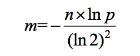
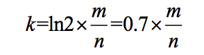
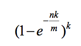

# 哈希函数

一个哈希函数形如：`out=hash(in)`。其具有以下特征：

- 哈希函数的输入 in 范围时无穷的，输出 out 往往是一个很大的数值，但范围是有限的，那么不同的输入可能得到同样的输出，这一现象叫做**哈希碰撞**；

- 哈希函数不具有随机性，即对于同样的输入在任何时候都能得到一样的输出；

- 哈希函数的输出结果是**离散且均匀**的，即使输入十分接近。

  怎么理解均匀性，假设一组数量较多的随机样本输出的结果分布在数轴上，那么我们用固定长度的范围去框数轴上的数，在不同位置框住的数的个数是近似的。

## 哈希表

哈希表基于哈希函数实现，其存储了一组键值对，可以让我们用常数时间通过 key 从哈希表里找到 value。

哈希表经典实现是桶加链表的方式。

桶一般用数组实现，一开始有确定的长度，桶的每个位置对应着一个单链表（用来应对哈希冲突问题）。

在向哈希表里存放元素的过程如下：

- 对于任意一个 key，会先用哈希函数取得哈希值，并模上桶的长度，得到该 key 在桶上的位置；

- 得到位置后创建一个链表节点，将该节点连接到链表的尾部。

从哈希表里用 key 获得 value 的步骤如下：

- 获得 key 的哈希值，取模得到 key 在桶中的位置；
- 遍历链表，取得和当前 key 相同的 value，没有则返回 null。


可以看出在查询时某个位置的链表长度过长，会影响到单次查询的效率。

因此当链表长度到达某个限制或者哈希表中的元素数量到达某个上限后，需要将哈希表进行扩容，一般会将哈希表桶的长度变为原 2 倍。桶扩容时需要重新将 key 哈希值取模，放到对应位置的链表上。


桶的某个位置的链表长度过长时，我们可以使用红黑树优化，减少单次查询的常数时间。

## 布隆过滤器

布隆过滤器可以用来解决海量数据的过滤问题，其用若干位来表示数据是否存在，因此其很节省空间。

比如我有 100 亿个黑名单 url，每当一个 url 来到时需要判断这个 url 是否在 url 内。

使用布隆过滤器的做法是：

- 申请一个长为 m 的位数组；
- 将黑名单里的每个 url 用 k 个不同的哈希函数求得该 url 的哈希值，用得到的哈希值与 m 取模，这样我们可以得到 k 个位置，并将这些位置标 1；
- 当一个 url 来到时，用同样的哈希函数求得哈希值，取模后从位数组中拿出对应位置的值，如果值全为 1 则表示该 url 在黑名单中，如果有一个不为 1 则表明不在黑名单中。

布隆过滤器一定存在失误率，这个失误率用上面的例子讲就是对于在黑名单里的 url 一定不会判断错，对于不在黑名单里的 url 其有一定的失误率判断其为黑名单里的 url。

### 布隆过滤器的三个公式

从上面可以看出，在使用布隆过滤器的时候，我们有两个重要的参数需要确定。

一个是位数组的长度 m，一个是哈希函数的个数 k。

样本数量 n 和失误率 p 则有业务场景确定。


布隆过滤器的失误率和位数组的长度有关，如果 m 很小失误率就越高，m 越大，失误率越低，但占用的空间就越多。

那么在实际使用的过程中，我们一般知道样本的数量和需要的失误率，根据这两个量可以计算出 m 的大小（向上取整），计算公式如下：



当有了 m 后，我们可以使用下面公式计算 k 的值（向上取整）：



得到了计算后的 m 和 k 后，我们可以适当的修正 m 和 k，向上取整就是一种修正，然后用修正的值代入下面公式，计算出实际的失误率：



在实际使用布隆过滤器，我们对其关键的两个参数 m 和 k 的指定步骤如下：

- 根据业务需求的样本数量和容忍的失误率带入公式一，计算出位数组长度 m（向上取整）；

- 根据位数组长度 m 和样本量计算出哈希函数个数 k（向上取整）；

- 因为求 m 和 k 都有类似于向上取整的修正操作，因此将计算出的 m、k 和 n 带入公式三计算出实际的失误率，看结果是否复合预期。

  

这里还有一个问题，计算出 k 后，我们有那么多的哈希函数可以用吗？

实质上我用两个不同的哈希函数，就可以组合出任意个哈希函数来使用。

比如我们有两个哈希函数 hash1 和 hash2，我们需要 13 个哈希函数，那么我们可以这么组合：

```
h1 = hash1 + hash2
h2 = 2 * hash1 + hash2
h3 = 3 * hash1 + hash2 
...
h13 = 13 * hash1 + hash2
```

### 使用场景

这里总结一下布隆过滤器的使用场景。

1. 使用 Redis，在某种情况下，可能会出现缓存穿透（大量请求访问时，Redis 没有命中数据，导致请求绕过了 Redis 缓存，直接去访问数据库了，数据库难以承受大量的请求）。
   这时候就可以使用布隆过滤器来解决，请求到来时，先用布隆过滤器判断数据是否有效，布隆过滤器可以判断元素一定不存在和可能存在，对于一定不存在的数据，则可以直接丢弃请求。对可能存在的请求，再去访问 Redis 获取数据，Redis 没有时，再去访问数据库。
2. 过滤：邮箱的垃圾邮件过滤、黑名单；
3. 去重：URL 去重。

## 一致性哈希

业务上我们有分布式的需求，来应对高负载和低容错的业务场景。

比如我们在存储数据时，如果数据量特别大，单个数据库容易出现性能上的瓶颈，这时候我们就需要分库。

分库简单来说，我们有多个数据库，存储数据的时候会通过分片键将数据存放到不同的库里。

一种常用的分片方法是求数据的哈希值，并通过模运算将其存放到对应的数据库中。**分片优劣的衡量标准于是否能够把整体的数据均匀的分布到各个节点上，如果选则哈希分片，需要结合业务考虑怎么使用哈希函数让分片仅可能的均匀**。

现在有个问题是，如果我们一开始有 3 个数据库，后序随着业务的增长发现需要增加 1 个，这个时候我们需要对存量数据重新求哈希值取模，存在数据迁移的过程。

一致性哈希解决的就是在增删节点后，怎么样减少数据的迁移。


### 哈希环

哈希函数的返回值的范围想象成一个顺时针分布的环。

使用能够表示机器信息比如 IP 地址或 MAC 地址，求哈希值，将其投放到这个环上；

然后对于要存放的数据，计算出其哈希值，顺时针移动，将数据存放到第一个遇到的机器上。

比如一开始我们有 A、B、C 三台机器在环上如下分布：

```
        A                                    A
       / \                                  / \
      /   \       --增加机器 D-->           /    \
     /     \                             /       \
    C-------B                           C----D----B 
```

哈希值在 A~B 之间的数据存放到 B 上，B~C 之间的数据存放到 C 上，C~A 之间的数据会存放到 A 上；

然后我们增加一台机器 D，比如在 C 和 B 之间，我们仅仅需要将 B~D 范围内原本在 C 机器上的数据迁移至 D 即可；

如果 D 机器下线了，我们在将 B~D 范围的数据迁移至 C 即可；

可以看出增加或减少机器，数据不需要全部迁移。


> 数据来了，怎么顺时针找机器？
>
> 比如三台机器的对应的哈希值位 2、1002、3010，将这三个数值从小到大放到数组中；然后来了一个数据哈希值为 78，顺时针找机器的过程就变成了在数组中找大于 78 的最左侧节点（大于 78 的最小值），这一过程可以使用二分法，所以能很快找到。

### 虚拟节点

上述描述的方案虽然可以减少数据量的迁移，但经通过少数节点的 IP 和 MAC 地址做哈希，其在哈希环上的分布很容易不均匀。那么怎么让机器的哈希值均匀分环，而且在增加或减少机器时，也能够保持这种均分性？

虚拟节点技术，利用哈希函数离散均匀的特性。

给机器 A 分配 1000 个虚拟节点（可以用字符串表示比如 a1~a1000）；

给机器 B 分配 1000 个虚拟节点（可以用字符串表示比如 b1~b1000）；

给机器 C 分配 1000 个虚拟节点（可以用字符串表示比如 c1~c1000）；

然后不在用机器的 IP 或 MAC 地址求哈希值在环中占位置，而是用虚拟节点的哈希值去环上占位置，然后数据同样按顺时针第一个相遇原则决定自己在那台机器上，比如第一个遇到了 c99，那么该数据就应该存放到机器 C 上。当给每个节点虚拟出多个节点后，利用哈希函数的均匀性，便可以让 A、B、C 三台机器均匀使用环上的位置。

然后新增机器 D，同样地也给其分配 1000 个虚拟节点（可以用字符串表示比如 d1~d1000），然后用这 1000 个虚拟节点的哈希值去环上占位置。

此时 D 的虚拟节点会均匀地从 A、B、C 三个机器各拿出近似 1/12 的数据，然后将这 1/4 的数据迁移到 D 机器上。

使用虚拟节点的技术，增大样本量，充分利用了哈希函数的均匀性，解决了均匀分配的问题。
