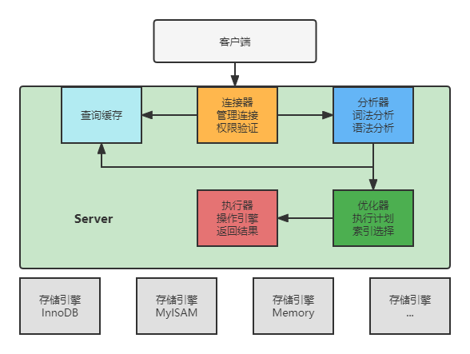

# MySQL 基础架构

[01 | 基础架构：一条SQL查询语句是如何执行的？ (geekbang.org)](https://time.geekbang.org/column/article/68319)

考虑一个问题，一条查询语句是怎么执行的？


## MySQL 架构



MySQL 总体上分成两个部分，Server 层和引擎层。

Server 层包括连接器、分析器、优化器、执行器，涵盖了 MySQL 大多数服务功能。

引擎层负责数据的存储和提取、是插件式的，不同的存储引擎公用 Server 层。支持 InnoDB、MyISAM、Memory 等多个存储引擎。

### 连接器

连接命令一般为：

```
mysql -h 127.0.0.1 -P3306 -u root -p
```


连接正式建立前会进行权限校验工作，一旦连接建立好后，权限的修改并不会影响到当前的连接，但会在下次建立连接时生效。

连接完成后，如果你没有后续的动作，这个连接就处于空闲状态，你可以在 `show processlist;` 命令中看到它。

客户端如果太长时间没动静，连接器就会自动将它断开。这个时间是由参数 wait_timeout 控制的，默认值是 8 小时。如果在连接断开后，客户端再次发送请求的话，就会受到一个错误提醒：Lost connection to MySQL server during query。意味着只能重连，执行请求。


> 长连接和短连接
>
> 数据库里面，长连接是指连接成功后，如果客户端持续有请求，则一直使用同一个连接。短连接则是指每次执行完很少的几次查询就断开连接，下次查询再重新建立一个。
>
> 建立连接的过程通常是比较复杂的，所以我建议你在使用中要尽量减少建立连接的动作，也就是尽量使用长连接。
>
> 但是连接过程中创建的临时内存是管理在连接对象里面的，这些资源会在连接断开时才释放。所以长连接长时间运行可能会导致内存越用越大，这个问题有两种解决办法：
>
> - 定期断开长连接。使用一段时间，或者程序里面判断执行过一个占用内存的大查询后，断开连接，之后要查询再重连。
> - 如果你用的是 MySQL 5.7 或更新版本，可以在每次执行一个比较大的操作后，通过执行 `mysql_reset_connection` 来重新初始化连接资源。这个过程不需要重连和重新做权限验证，但是会将连接恢复到刚刚创建完时的状态。

### 查询缓存

连接建立好后就可以去查询数据了。正式查库之前会先查询缓存，通过当前查询语句去看缓存中是否已经有了查询结果，如果有直接返回。如果语句不在查询缓存中，就会继续后面的执行阶段。执行完成后，执行结果会被存入查询缓存中。

> 但是大多数情况下我会建议你不要使用查询缓存，为什么呢？
>
> 查询缓存的失效非常频繁，只要有对一个表的更新，这个表上所有的查询缓存都会被清空。所以更新特别频繁时，缓存的命中率很低。但对于相对静态的表（比如系统配置表），查询缓存是有收益的。
>
> MySQL 提供了 SQL 语句粒度的查询缓存控制，比如如果需要查询缓存，可以使用下面 SQL：
>
> ```sql
> select SQL_CACHE * from T where ID=10;
> ```
>
> 但是需要注意查询缓存这块功能在 MySQL 8.0 版本被删除了。

### 分析器

对 SQL 文本进行解析，包括词法分析和语法分析两个部分。

词法分析：分析 SQL 语句的含义，比如这是一个查询 SQL，还是一个更新语句。

语法分析：分析 SQL 语句是否合法。如果你的语句不对，就会收到 You have an error in your SQL syntax 的错误提醒。

> 如果 SQL 语句中查询了表中没有的字段，这个步骤也可以分析出来。

### 优化器

优化器用来生成执行计划，优化索引。主要是用来提高查询效率。

比如当有多个索引时，优化器选择最优的哪个，多个表连接查询时，优化器会调整为最优的连接顺序。

经过优化后，生成执行计划，就正式开始执行了。

### 执行器

执行前，先判断用户有没有操作表的权限，如果有，打开表执行 SQL。打开表的时候，执行器就会根据表的引擎定义，去使用这个引擎提供的接口。

比如对于这个 SQL：

```sql
select * from T where ID=10;
```

执行器执行流程为：

- 调用 InnoDB 引擎接口取这个表的第一行，判断 ID 值是不是 10，如果不是则跳过，如果是则将这行存在结果集中。
- 调用引擎接口取“下一行”，重复相同的判断逻辑，直到取到这个表的最后一行。
- 执行器将上述遍历过程中所有满足条件的行组成的记录集作为结果集返回给客户端。

你会在数据库的慢查询日志中看到一个 `rows_examined` 的字段，表示这个语句执行过程中扫描了多少行。这个值就是在执行器每次调用引擎获取数据行的时候累加的。在有些场景下，执行器调用一次，在引擎内部则扫描了多行，因此**引擎扫描行数跟 rows_examined 并不是完全相同的**。


