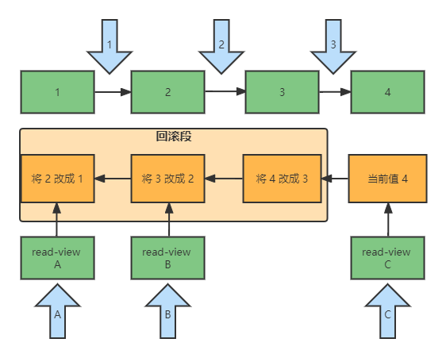

# MySQL 事务

数据库事务是对数据库系统读写操作的更高一层抽象，代表了一个单位的数据库操作。事务将对多个数据对象的多个读写操作视为一个整体，一个操作单位，对外具有 ACID 四个特性。

- Atomicity：原子性，一个事务被视为一个不可分割的最小操作单位，一次事务中的操作要么全部成功，要么全部失败。 

- Consistency：一致性，跨表、跨行、跨事务，数据库始终保持一致状态，数据库总是从一个一致性的状态转换到另外一个一致性的状态。 

- Isolation:：隔离性，可见性，一个事务的写操作不会影响到另一个事务的**读操作**，包含 4 种隔离级别。 

- Durability：持久性，事务提交成功后，不会丢数据，如电源故障, 系统崩溃。

事务这个概念在数据库系统和用户之间提供了一层抽象，用户仅通过事务这一概念就可以享受 ACID 四个特性，而不需要自己去处理复杂的正确性需求。总的来说，要满足正确性这一需求时十分复杂的，数据库系统封装了这种复杂性，并对外提供事务这一种抽象来使得用户不用独自面都这种复杂性，用户只要选择相信和熟悉并使用这层抽象变可以做到正确性。

## 事务的隔离级别

- 读未提交（READ UNCOMMITTED）：一个事务还没提交时，它做的变更就能被别的事务看到。

  脏读：读未提交意味着一个可以读取到事务为提交的数据，当事务发生回滚，上次读取到的数据就是脏数据。

  锁：不加锁。

- 读已提交（READ COMMITTED）：一个事务提交之后，它做的变更才会被其他事务看到。

  不可重复读：此种隔离级别下一个事务中前后两次读取数据可能因为另外一个事务对该数据进行修改操作而出现不一致的情况。比如事务 A 在运行过程中读了两次 ID=1 的记录，在这两次期间如果有事务 B 修改了 ID=1 这行记录，导致事务 A 前后两次读取的数据不一致。

  锁：使用写锁，不使用读锁。

- 可重复读（REPEATABLE READ）：一个事务执行过程中看到的数据，总是跟这个事务在启动时看到的数据是一致的。当然在可重复读隔离级别下，未提交变更对其他事务也是不可见的，是 `InnoDB` 默认的隔离级别。

  幻读：幻读是指，在一个事务中两个完全相同的范围查询得到了不同的结果集，但对于 MySQL 来说，一个事务读取不到另一个事务对数据的修改，但却可以去更新它，并且可以查询到刚才更新的数据。比如事务 A 在运行过程中读取了两次 ID=1 这行记录，ID=1 这行记录不存在。但在事务 A 运行期间，如果事务 B 新增了一行 ID=1 的记录，虽然一因为不可重复读，事务 A 读不到事务 B 的新增结果，但却可以更新，且更新后就可以读取到这行记录了。

  锁：使用读写锁，不使用范围锁。

- 串行化（SERIALIZABLE）：事务串行执行。

  最严格的级别，事务串行执行，使用全部的锁，资源消耗最大。

举个例子，对于事务 A 和事务 B，其操作时序如下：

| 事务 A                 | 事务 B       |
| ---------------------- | ------------ |
| 启动事务，查询得到值 1 | 启动事务     |
|                        | 查询得到值 1 |
|                        | 将 1 改成 2  |
| 查询得到值 V1          |              |
|                        | 提交事务 B   |
| 查询得到值 V2          |              |
| 提交事务 A             |              |
| 查询得到值 V3          |              |

- 若隔离级别是“读未提交”， 则 V1 的值就是 2。这时候事务 B 虽然还没有提交，但是结果已经被 A 看到了。因此，V2、V3 也都是 2。

- 若隔离级别是“读提交”，则 V1 是 1，V2 的值是 2。事务 B 的更新在提交后才能被 A 看到。所以， V3 的值也是 2。

- 若隔离级别是“可重复读”，则 V1、V2 是 1，V3 是 2。之所以 V2 还是 1，遵循的就是这个要求：事务在执行期间看到的数据前后必须是一致的。

- 若隔离级别是“串行化”，则在事务 B 执行“将 1 改成 2”的时候，会被锁住。直到事务 A 提交后，事务 B 才可以继续执行。所以从 A 的角度看， V1、V2 值是 1，V3 的值是 2。

**在实现上，数据库里面会创建一个视图（创建对应时刻最新数据的快照），访问的时候以视图的逻辑结果为准，这个视图叫做一致性视图。**在“可重复读”隔离级别下，这个视图是在事务启动时创建的，整个事务存在期间都用这个视图。在“读提交”隔离级别下，这个视图是在每个 SQL 语句开始执行的时候创建的。这里需要注意的是，“读未提交”隔离级别下直接返回记录上的最新值，没有视图概念；而“串行化”隔离级别下直接用加锁的方式来避免并行访问。

> 我们可以看到在不同的隔离级别下，数据库行为是有所不同的。Oracle 数据库的默认隔离级别其实就是“读提交”，因此对于一些从 Oracle 迁移到 MySQL 的应用，为保证数据库隔离级别的一致，你一定要记得将 MySQL 的隔离级别设置为“读提交”。
>
> 配置的方式是，将启动参数 transaction-isolation 的值设置成 READ-COMMITTED。你可以用 show variables 来查看当前的值。

## 事务隔离级别的实现（MVCC）

在 MySQL 中，实际上每条记录在更新的时候都会同时记录一条回滚操作。那么通过最新值和回滚操作，都可以得到前面状态的值。

比如先有 1、2、3 三个事务，起始字段的值为 1，然后事务 1 将 1 改为了 2，事务 2 将 2 改为了 3，事务 3 将 3 改为了 4。然后在事务 1 之前启动事务 A，得到 read-view A，在事务 2 之前启动事务 B，得到 read-view B，在事务 3 提交之后启动事务 C，得到 read-view C。整个过程的流程图如下所示：



如图中看到的，在视图 A、B、C 里面，这一个记录的值分别是 1、2、4。也就是说，**同一条记录在系统中可以存在多个版本，这就是数据库的多版本并发控制（MVCC）**。对于 read-view A，要得到 1，就必须将当前值依次执行图中所有的回滚操作得到。

> 注：MVCC 是一种机制，这里是通过回滚段实现的，还有其他实现方式。

如果一个事务很长时间没有提交的话，回滚段可能会变得很长。比如上述图中，如果事务 A 久久没有提交，如果后序继续修改字段值，那么就会继续在回滚段上添加回滚操作。这就会导致大量占用存储空间。

那么回滚段上的数据什么时候删除呢？

回滚段不会一直保存，当没有比回滚日志更早的读视图（读视图在事务开启时创建）的时候，这个数据不会再有谁驱使它回滚了，这个回滚日志也就失去了用武之地，**可以删除了**。比如上述图中，如果事务 A 提交了，那么 “将 2 改成 1” 这条记录就可以删除了。但如果 A 没有提交，而 B 提交了，B 对应的回滚记录是不能删除的。

所以在业务中尽量不要使用长事务，长事务意味着系统里面会存在很老的事务视图。由于这些事务随时可能访问数据库里面的任何数据，所以这个事务提交之前，数据库里面它可能用到的回滚记录都必须保留，这就会导致大量占用存储空间。除了对回滚段的影响，长事务还占用锁资源，也可能拖垮整个库。

> 事务的启动方式。
>
> 1. 显式启动事务语句， begin 或 start transaction。配套的提交语句是 commit，回滚语句是 rollback。
> 2. set autocommit=0，这个命令会将这个线程的自动提交关掉。意味着如果你只执行一个 select 语句，这个事务就启动了，而且并不会自动提交。这个事务持续存在直到你主动执行 commit 或 rollback 语句，或者断开连接。
>
> 建议在 set autocommit=1, 通过显式语句的方式来启动事务。
>
> 你可以在 information_schema 库的 innodb_trx 这个表中查询长事务，比如下面这个语句，用于查找持续时间超过 60s 的事务。
>
> ```sql
> select * from information_schema.innodb_trx where TIME_TO_SEC(timediff(now(), trx_started))>60
> ```

> 如何避免长事务对业务的影响？
> 长事务有什么影响，为什么？
> 长事务容易造成回滚段不断增长，回滚段记录着事务中对数据每次修改的反向操作和修改后该数据的读视图，回滚段过长会占用大量存储空间，长事务还占用着锁资源，也可能拖垮整个数据库。
> 如何避免？
>
> 首先从应用端来看：
>
> - 确认是否使用了 set autocommit=0。这个确认工作可以在测试环境中开展，把 MySQL 的 general_log 开起来，然后随便跑一个业务逻辑，通过 `general_log` 的日志来确认。一般框架如果会设置这个值，也就会提供参数来控制行为，你的目标就是把它改成 1。
> - 确认是否有不必要的只读事务。有些框架会习惯不管什么语句先用 begin/commit 框起来。我见过有些是业务并没有这个需要，但是也把好几个 select 语句放到了事务中。这种只读事务可以去掉。
> - 业务连接数据库的时候，根据业务本身的预估，通过 SET MAX_EXECUTION_TIME 命令，来控制每个语句执行的最长时间，避免单个语句意外执行太长时间。
>
> 其次，从数据库端来看：
>
> - 监控 information_schema.Innodb_trx 表，设置长事务阈值，超过就报警 / 或者 kill；
> - Percona 的 pt-kill 这个工具不错，推荐使用；
> - 在业务功能测试阶段要求输出所有的 general_log，分析日志行为提前发现问题；
> - 如果使用的是 MySQL 5.6 或者更新版本，把 innodb_undo_tablespaces 设置成 2（或更大的值）。如果真的出现大事务导致回滚段过大，这样设置后清理起来更方便。

## MVCC 的实现

[08 | 事务到底是隔离的还是不隔离的？ (geekbang.org)](https://time.geekbang.org/column/article/70562)

考虑下面执行 `SQL`：

| 事务 A                                      | 事务 B                                      | 事务 C                         |
| ------------------------------------------- | ------------------------------------------- | ------------------------------ |
| start transaction with consistent snapshot; |                                             |                                |
|                                             | start transaction with consistent snapshot; |                                |
|                                             |                                             | update t set k=k+1 where id=1; |
|                                             | update t set k=k+1 where id=1;              |                                |
|                                             | select k from t where id=1;                 |                                |
|                                             | commit;                                     |                                |
| select k from t where id=1;                 |                                             |                                |
| commit;                                     |                                             |                                |

如果上述 k 的起始值为 1，事务的隔离级别为 RR，那么事务 A 和事务 B 运行的 select 的输出结果是多少？

答案是 1 和 3，事务 A 输出 1 好理解，因为隔离级别为 RR，事务 A 会再启动过程中创建一致性视图，在事务运行过程中通过视图保证读的结果是一致的。为什么事务 B 看到的结果是 3 呢，这种现象叫做**幻读**，带着这个问题，下面来看下 MVCC 的实现原理。


> begin/start transaction 命令并不是一个事务的起点，在执行到它们之后的第一个操作 InnoDB 表的语句，事务才真正启动。如果你想要马上启动一个事务，可以使用 start transaction with consistent snapshot 这个命令。
>
> 这就导致第一种启动方式，一致性视图是在执行第一个快照读语句时创建的；第二种启动方式，一致性视图是在执行 start transaction with consistent snapshot 时就创建了。
>
> 
>
> 在 MySQL 里，有两个“视图”的概念：
>
> - 一个是 view。它是一个用查询语句定义的虚拟表，在调用的时候执行查询语句并生成结果。创建视图的语法是 create view … ，而它的查询方法与表一样。
> - 另一个是 InnoDB 在实现 MVCC 时用到的一致性读视图，即 consistent read view，用于支持 RC（Read Committed，读提交）和 RR（Repeatable Read，可重复读）隔离级别的实现。

### 快照在 MVCC 里是怎么工作的

在可重复读隔离级别下，事务在启动的时候就“拍了个快照”，注意，**这个快照是基于整库的**。

有个疑问，如果一个库有 100G，那么我启动一个事务，MySQL 是不是要为了这个快照拷贝 100G 的数据出来？

实际上，我们并不需要拷贝出这 100G 的数据，快照的实现原理如下：

InnoDB 里面每个事务有一个唯一的事务 ID，叫作 transaction id。它是在事务开始的时候向 InnoDB 的事务系统申请的，是按申请顺序严格递增的。

而每行数据也都是有多个版本的。每次事务更新数据的时候，都会生成一个新的数据版本，并且把 transaction id 赋值给这个数据版本的事务 ID，记为 row trx_id。同时，旧的数据版本要保留，并且在新的数据版本中，能够有信息可以直接拿到它。也就是说，数据表中的一行记录，其实可能有多个版本（row），每个版本有自己的 row trx_id。如下图所示：


图中虚线框里是同一行数据的 4 个版本，当前最新版本是 V4，k 的值是 22，它是被 transaction id 为 25 的事务更新的，因此它的 row trx_id 也是 25。

图中的虚线箭头代表 undo log，而 V1、V2、V3 并不是物理上真实存在的，而是每次需要的时候根据当前版本和 undo log 计算出来的。比如，需要 V2 的时候，就是通过 V4 依次执行 U3、U2 算出来。

按照可重复读的定义，一个事务启动的时候，能够看到所有已经提交的事务结果。但是之后，这个事务执行期间，其他事务的更新对它不可见。因此，一个事务只需要在启动的时候声明说，“以我启动的时刻为准，如果一个数据版本是在我启动之前生成的，就认；如果是我启动以后才生成的，我就不认，往前找可以认的版本。

实现上 InnoDB 为，为每个事务构造了一个数组，用来保存这个事务启动瞬间，当前正在“活跃”的所有事务 ID（“活跃”指的就是，启动了但还没提交）。数组里面事务 ID 的最小值记为低水位，当前系统里面已经创建过的事务 ID 的最大值加 1 记为高水位。

举个例子，在为 9 号事务创建数组（一致性视图）时，假设当前已经创建了 `1,2,3,4,5,6,7,8,10,11` 这些事务。其中 `1,2,3,4,6,7,10` 已经完成，`5,11` 事务还未提交。

根据上面定义一致性视图的低水位为 5，高水位为 12，`{5,11}` 就是 9 号事务存放的数组。

- 把小于 5 和当前事务 9 记为绿色，表示 9 号事务创建时已经提交了事务和当前事务；
- 把大于等于 12 的事务记录为红色，表示 9 号事务创建时还未创建的事务；
- 把大于等于 5 小于 11 的标记为黄色，表示 9 号事务创建时，还未提交的事务的**可能范围**。

在某个时刻，对于某行记录，其对应的 row trx_id 记录为 C，对于 9 号事务，可见规则如下：

- 如果 `C<5` 或 `C=9`，即绿色范围，表明 9 号事务之前事务就已经已经提交，可见；
- 如果 `C>=12`，即红色范围，表明该数据在 9 号事务创建视图之后创建，不可见；
- 如果 `5<C<12`，即黄色范围，这时候要判断 C 是否在 9 号事务对应的数组里。比如 11 在数组中，11 这个版本的数据在 9 号事务创建数组时还没提交，因此不可见；8 这个版本的数据不在上述数组中，表明在 9 号事务创建数组时已经提交了，因此是可见的。

之所以要创建一个数组记录正在执行的事务 ID，而不是直接通过事务 ID 的高水位和低水位范围去判断，是因为虽然能够保证 ID 小的事务一定先创建，但不能保证其一定先完成。


// TODO ... 看专栏里的图。

事务的可重复读的能力是怎么实现的？

**可重复读的核心就是一致性读（consistent read），读取事务开启前一致的值；而事务更新数据的时候，只能用当前读。如果当前的记录的行锁被其他事务占用的话，就需要进入锁等待**。

> 一致性读：事务开启前创建一致性视图，后序在查询数据的时候读的结果需和视图可见值一致。
>
> 当前读：更新数据都是先读后写的，而这个读，只能读当前版本的值，称为“当前读”（current read）。

而读提交的逻辑和可重复读的逻辑类似，它们最主要的区别是：

- 在可重复读隔离级别下，只需要在事务开始的时候创建一致性视图，之后事务里的其他查询都共用这个一致性视图；
- 在读提交隔离级别下，每一个语句执行前都会重新算出一个新的视图。


下面也是一个幻读的例子，在工作中可能会遇到：

```sql
CREATE TABLE `t` (
  `id` int(11) NOT NULL,
  `c` int(11) DEFAULT NULL,
  PRIMARY KEY (`id`)
) ENGINE=InnoDB;
insert into t(id, c) values(1,1),(2,2),(3,3),(4,4);
```

事务 A 执行：

```sql
begin;
select * from t;
-- 等待事务 B 后执行
update t set k=0 where k=c;
select * from t;
```

事务 B 执行（自动提交）：

```sql
update t set k=0 where k=c;
```

事务 A 执行后发现两次的读取结果都是一样的，update 语句就和没执行一样？

这是因为事务 A 更新语句执行时读到了事务 B 的更新结果，所以在按照当前过滤条件已经匹配不上了，所以没有一行更新成功，回滚段上不会增加内容，因此其读到了还剩事务开启是的结果。


