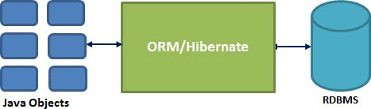

# Mybatis 的介绍和基本使用

Mybatis 的介绍和基本使用。

## 数据库操作框架的历程

### 		JDBC

[Introduction to JDBC | Baeldung](https://www.baeldung.com/java-jdbc)

JDBC（Java Data Base Connection，Java 数据库连接）是一种用于执行 SQL 语句的 Java API，可以为多种关系数据库提供统一访问，由一组用 Java 语言编写的类和接口组成。JDBC 提供了一种基准，据此可以构建更高级的工具和接口，使数据库开发人员能够编写数据库应用程序。

- 优点：运行期：快捷、高效
- 缺点：编辑期：代码量大、繁琐异常处理、不支持数据库跨平台


### Hibernate

Hibernate 是由 Gavin King 于 2001 年创建的开放源代码的对象关系框架。它强大且高效的构建具有关系对象持久性和查询服务的 Java 应用程序。

Hibernate 将 Java 类映射到数据库表中，从 Java 数据类型中映射到 SQL 数据类型中，并把开发人员从 95% 的公共数据持续性编程工作中解放出来。

Hibernate 是传统 Java 对象和数据库服务器之间的桥梁，用来处理基于 O/R 映射机制和模式的那些对象。



Hibernate 优势：

- Hibernate 使用 XML 文件来处理映射 Java 类到数据库表格中，并且不用编写任何代码。
- 为在数据库中直接储存和检索 Java 对象提供简单的 APIs。
- 如果在数据库中或任何其它表格中出现变化，那么仅需要改变 XML 文件属性。
- 抽象不熟悉的 SQL 类型，并为我们提供工作中所熟悉的 Java 对象。
- Hibernate 不需要应用程序服务器来操作。
- 操控你数据库中对象复杂的关联。
- 最小化与访问数据库的智能提取策略。
- 提供简单的数据询问。

Hibernate 劣势：

- Hibernate 的完全封装导致无法使用数据的一些功能。
- Hibernate 的缓存问题。
- Hibernate 对于代码的耦合度太高。
- Hibernate 寻找 bug 困难。
- Hibernate 批量数据操作需要大量的内存空间而且执行过程中需要的对象太多。


### JdbcTemplate

 JdbcTemplate 针对数据查询提供了多个重载的模板方法，你可以根据需要选用不同的模板方法。如果你的查询很简单，仅仅是传入相应 SQL 或者相关参数，然后取得一个单一的结果，那么你可以选择如下一组便利的模板方法。

优点：运行期：高效、内嵌 Spring 框架中、支持基于 AOP 的声明式事务；

缺点：必须于 Spring 框架结合在一起使用、不支持数据库跨平台、默认没有缓存。

## Mybatis

[mybatis – MyBatis 3](https://mybatis.org/mybatis-3/zh/index.html)

MyBatis 是一款优秀的持久层框架，它支持自定义 SQL、存储过程以及高级映射。MyBatis 免除了几乎所有的 JDBC 代码以及设置参数和获取结果集的工作。MyBatis 可以通过简单的 XML 或注解来配置和映射原始类型、接口和 Java POJO（Plain Old Java Objects，普通老式 Java 对象）为数据库中的记录。

优点：

- 与 JDBC 相比，减少了 50% 的代码量；
- 最简单的持久化框架，简单易学；
- SQL 代码从程序代码中彻底分离出来，可以重用；
- 提供 XML 标签，支持编写动态 SQL；
- 提供映射标签，支持对象与数据库的 ORM 字段关系映射。

缺点：

- SQL 语句编写工作量大，熟练度要高；
- 数据库移植性比较差，如果需要切换数据库的话，SQL 语句会有很大的差异。

### 第一个 Mybatis 项目


### 配置文件详解

[mybatis – MyBatis 3 | 配置](https://mybatis.org/mybatis-3/zh/configuration.html)

Mybatis 配置：

mybatis-config.xml

```xml
<?xml version="1.0" encoding="UTF-8" ?>
<!DOCTYPE configuration
        PUBLIC "-//mybatis.org//DTD Config 3.0//EN"
        "http://mybatis.org/dtd/mybatis-3-config.dtd">
<configuration>
    <!--引入外部配置文件，类似于Spring中的property-placeholder
    resource:从类路径引入
    url:从磁盘路径或者网络路径引入
    -->
    <properties resource="db.properties"></properties>
    <!--用来控制mybatis运行时的行为，是mybatis中的重要配置-->
    <settings>
        <!--设置列名映射的时候是否是驼峰标识-->
        <setting name="mapUnderscoreToCamelCase" value="true"/>
    </settings>
    <!--typeAliases表示为我们引用的实体类起别名，默认情况下我们需要写类的完全限定名
    如果在此处做了配置，那么可以直接写类的名称,在type中配置上类的完全限定名，在使用的时候可以忽略大小写
    还可以通过alias属性来表示类的别名
    -->
    <typeAliases>
<!--        <typeAlias type="com.mashibing.bean.Emp" alias="Emp"></typeAlias>-->
        <!--如果需要引用多个类，那么给每一个类起别名肯定会很麻烦，因此可以指定对应的包名，那么默认用的是类名-->
        <package name="com.mashibing.bean"/>
    </typeAliases>
    <!--
    在实际的开发过程中，我们可能分为开发环境，生产环境，测试环境等等，每个环境的配置可以是不一样的
    environment就用来表示不同环境的细节配置，每一个环境中都需要一个事务管理器以及数据源的配置
    我们在后续的项目开发中几乎都是使用spring中配置的数据源和事务管理器来配置，此处不需要研究
    -->
    <!--default:用来选择需要的环境-->
    <environments default="development">
        <!--id:表示不同环境的名称-->
        <environment id="development">
            <transactionManager type="JDBC"/>
            <!--配置数据库连接-->
            <dataSource type="POOLED">
                <!--使用${}来引入外部变量-->
                <property name="driver" value="${driverClassname}"/>
                <property name="url" value="${url}"/>
                <property name="username" value="${username}"/>
                <property name="password" value="${password}"/>
            </dataSource>
        </environment>
    </environments>
    <!--
    在不同的数据库中，可能sql语句的写法是不一样的，为了增强移植性，可以提供不同数据库的操作实现
    在编写不同的sql语句的时候，可以指定databaseId属性来标识当前sql语句可以运行在哪个数据库中
    -->
    <databaseIdProvider type="DB_VENDOR">
        <property name="MySQL" value="mysql"/>
        <property name="SQL Server" value="sqlserver"/>
        <property name="Oracle" value="orcl"/>
    </databaseIdProvider>
    
    <!--将sql的映射文件适用mappers进行映射-->
    <mappers>
        <!--
        指定具体的不同的配置文件
        class:直接引入接口的全类名，可以将xml文件放在dao的同级目录下，并且设置相同的文件名称，同时可以使用注解的方式来进行相关的配置
        url:可以从磁盘或者网络路径查找sql映射文件
        resource:在类路径下寻找sql映射文件
        -->
<!--        <mapper resource="EmpDao.xml"/>
        <mapper resource="UserDao.xml"/>
        <mapper class="com.mashibing.dao.EmpDaoAnnotation"></mapper>-->
        <!--
        当包含多个配置文件或者配置类的时候，可以使用批量注册的功能，也就是引入对应的包，而不是具体的配置文件或者类
        但是需要注意的是，
        1、如果使用的配置文件的形式，必须要将配置文件跟dao类放在一起，这样才能找到对应的配置文件.
            如果是maven的项目的话，还需要添加以下配置，原因是maven在编译的文件的时候只会编译java文件
                <build>
                    <resources>
                        <resource>
                            <directory>src/main/java</directory>
                        <includes>
                            <include>**/*.xml</include>
                        </includes>
                    </resource>
                    </resources>
                </build>

        2、将配置文件在resources资源路径下创建跟dao相同的包名
        -->
        <package name="com.mashibing.dao"/>
    </mappers>
</configuration>
```

### MyBatis 插件

[深入理解 MyBatis 插件开发 - 风一样的码农 - 博客园 (cnblogs.com)](https://www.cnblogs.com/chenpi/p/10498921.html)

支持拦截的方法：

- Executor：update、query、commit、rollback；
- ParameterHandler：getParameterObject、setParameters；
- ResultSetHandler：handleResultSets、handleOutputParameters；
- StatementHandler：prepare、parameterize、batch、update、query。

基于 JDK 动态代理，在创建上述对象时，如果有对应的插件，会去创建上述对象的动态代理对象。这样在 MyBatis 整体的执行流程中，使用到这些对象时就可以走增强处理逻辑。

比如在创建 `Executor` 会根据拦截链去创建动态代理对象：

```java
public Executor newExecutor(Transaction transaction, ExecutorType executorType) {
    executorType = executorType == null ? defaultExecutorType : executorType;
    executorType = executorType == null ? ExecutorType.SIMPLE : executorType;
    Executor executor;
    if (ExecutorType.BATCH == executorType) {
        executor = new BatchExecutor(this, transaction);
    } else if (ExecutorType.REUSE == executorType) {
        executor = new ReuseExecutor(this, transaction);
    } else {
        executor = new SimpleExecutor(this, transaction);
    }
    if (cacheEnabled) {
        executor = new CachingExecutor(executor);
    }
    executor = (Executor) interceptorChain.pluginAll(executor);
    return executor;
}
```

`InterceptorChain#pluginAll`

```java
public Object pluginAll(Object target) {
    for (Interceptor interceptor : interceptors) {
        target = interceptor.plugin(target);
    }
    return target;
}
```

`Interceptor#plugin`

```java
default Object plugin(Object target) {
    return Plugin.wrap(target, this);
}
```

`Plugin#wrap`

```java
public static Object wrap(Object target, Interceptor interceptor) {
    Map<Class<?>, Set<Method>> signatureMap = getSignatureMap(interceptor);
    Class<?> type = target.getClass();
    Class<?>[] interfaces = getAllInterfaces(type, signatureMap);
    if (interfaces.length > 0) {
        return Proxy.newProxyInstance(
            type.getClassLoader(),
            interfaces,
            new Plugin(target, interceptor, signatureMap));
    }
    return target;
}
```

分页插件：

[GitHub - pagehelper/Mybatis-PageHelper: Mybatis通用分页插件](https://github.com/pagehelper/Mybatis-PageHelper)

### MyBatis 自定义类型转换

比如将 Oracle 数据库的几何字段和 `JGeometry` 对象进行转换。

```java
@MappedTypes({JGeometry.class})
@MappedJdbcTypes(value = {JdbcType.STRUCT})
public class JGeometryTypeHandler implements TypeHandler<JGeometry> {

    @Override
    public void setParameter(PreparedStatement preparedStatement, int i, JGeometry jGeometry,
                             JdbcType jdbcType) throws SQLException {
        DruidPooledConnection druidPooledConnection = (DruidPooledConnection) preparedStatement.getConnection();
        OracleConnection connection = druidPooledConnection.unwrap(OracleConnection.class);
        OracleStruct dbObject = null;
        if (jGeometry != null) {
            dbObject = (OracleStruct) JGeometry.storeJS(jGeometry, connection);
        }
        preparedStatement.setObject(i, dbObject);
    }

    @Override
    public JGeometry getResult(ResultSet resultSet, String s) throws SQLException {
        OracleStruct st = (OracleStruct) resultSet.getObject(s);
        if (st != null) {
            return JGeometry.loadJS(st);
        }
        return null;
    }

    @Override
    public JGeometry getResult(ResultSet resultSet, int i) throws SQLException {
        OracleStruct st = (OracleStruct) resultSet.getObject(i);
        if (st != null) {
            return JGeometry.loadJS(st);
        }
        return null;
    }

    @Override
    public JGeometry getResult(CallableStatement callableStatement, int i) throws SQLException {
        OracleStruct st = (OracleStruct) callableStatement.getObject(i);
        if (st != null) {
            return JGeometry.loadJS(st);
        }
        return null;
    }
}
```

### MyBatis 批量操作

[MyBatis 批量插入数据的 3 种方法！ - 掘金 (juejin.cn)](https://juejin.cn/post/7016691244973686820)

### MyBatis 缓存

MyBatis 使用到了两种缓存：本地缓存（local cache）和二级缓存（second level cache）。

每当一个新 session 被创建，MyBatis 就会创建一个与之相关联的本地缓存。任何在 session 执行过的查询结果都会被保存在本地缓存中，所以，当再次执行参数相同的相同查询时，就不需要实际查询数据库了。本地缓存将会在做出修改、事务提交或回滚，以及关闭 session 时清空。

默认情况下，本地缓存数据的生命周期等同于整个 session 的周期。由于缓存会被用来解决循环引用问题和加快重复嵌套查询的速度，所以无法将其完全禁用。但是你可以通过设置 `localCacheScope=STATEMENT` 来只在语句执行时使用缓存。

注意，如果 `localCacheScope` 被设置为 SESSION，对于某个对象，MyBatis 将返回在本地缓存中唯一对象的引用。对返回的对象（例如 list）做出的任何修改将会影响本地缓存的内容，进而将会影响到在本次 session 中从缓存返回的值。因此，不要对 MyBatis 所返回的对象作出更改，以防后患。

你可以随时调用以下方法来清空本地缓存：

```
void clearCache()
```

[聊聊MyBatis缓存机制 - 美团技术团队 (meituan.com)](https://tech.meituan.com/2018/01/19/mybatis-cache.html)
