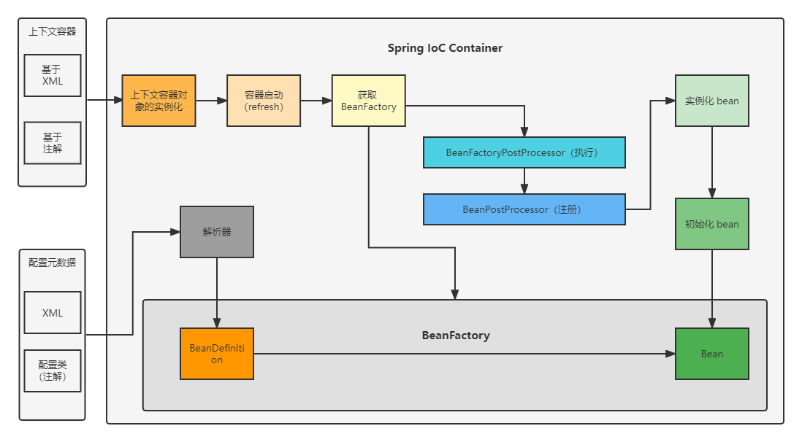
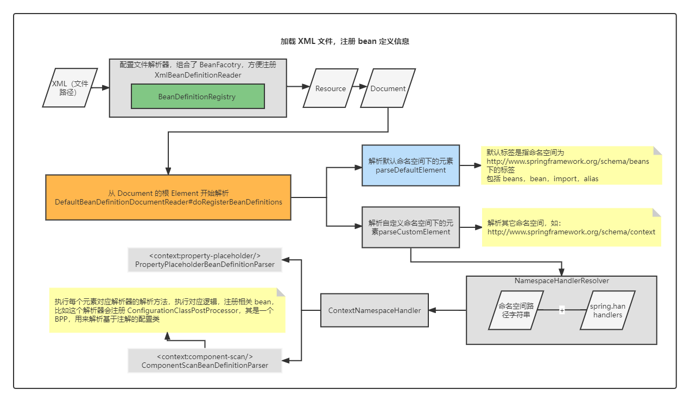
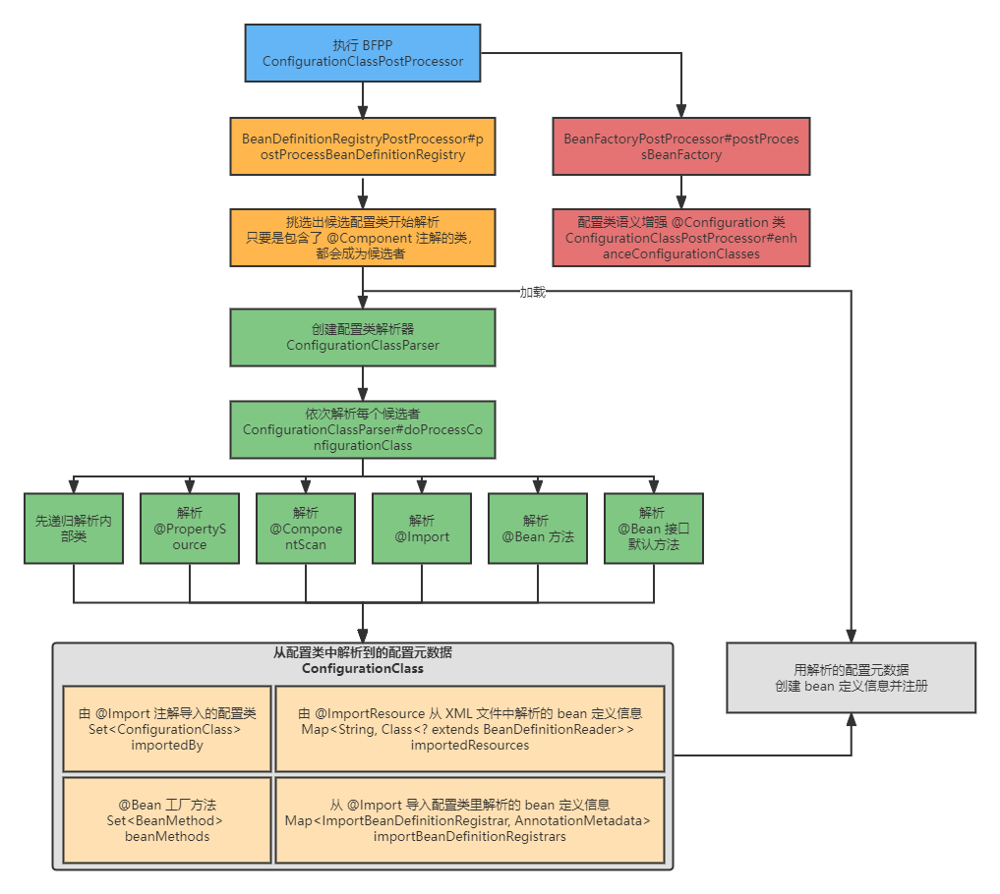
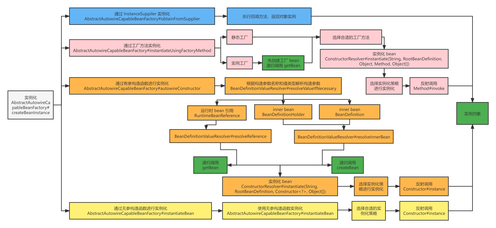
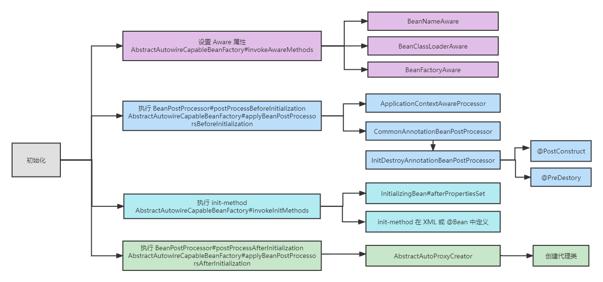

# Spring IoC 容器启动流程解析

Spring IoC 容器主要用来管理 bean，其工作视图如下：


如上图所示，通过配置元数据和应用程序类作为输入，在创建和初始化 `ApplicationContext` 之后，成为 Spring 容器管理的 bean，这样就拥有了一个完全配置和可执行的系统或应用程序。

Spring 容器启动时涉及到了两组重要的对象，一个是 bean 定义信息，一个是 bean，可以说容器启动的各个环节都是围绕着这两组对象进行（不是在用这些对象，就是在获得这些对象）。下面将沿着这个思路解析 Spring 容器启动流程。

## 两个上下文容器

从配置元数据的获取方式出发，主要有两类上下文，其类名为：

- `ClassPathXmlApplicationContext`；
- `AnnotationConfigWebApplicationContext`；

其都是 Spring 上下文容器，不同的是其获取 bean 配置元数据的源头和方式不同。

> 除了这两个上下文容器，还有其他上下文容器，比如 `WebApplicationContext`，支持更加场景化的应用。

其作为 Spring 容器启动的入口，是程序启动的地方，也是我们看源码，解析流程的入口。

下面是 Spring IoC 容器一个逻辑视图：



## 1.上下文容器实例化

首先来看 `ClassPathXmlApplicationContext` 的实例化过程。

一般来讲我们会通过下面的代码来创建 `ClassPathXmlApplicationContext`：

```java
public static void main(String[] args) {
    ClassPathXmlApplicationContext ac = new ClassPathXmlApplicationContext("classpath:refresh.xml");
}
```

这里看一下 new 的这个过程发生了什么。代码如下：

```java
public ClassPathXmlApplicationContext(
    String[] configLocations, boolean refresh, @Nullable ApplicationContext parent)
    throws BeansException {

    super(parent);
    setConfigLocations(configLocations);
    if (refresh) {
        refresh();
    }
}
```

这里主要执行了三个步骤：

- 调用父类构造方法，进行一些初始化操作，其中包括创建资源路径解析器（`resourcePatternResolver`），类型为：`PathMatchingResourcePatternResolver`。

- 设置 XML 文件路径，并对配置文件中的占位符号进行解析。

  > 比如文件名为 `refreash-${test}.xml`，解析后会将 `${test}` 替换为对应配置变量的值。

- 启动（刷新）容器。


创建 `AnnotationConfigApplicationContext`。

一般来讲我们会通过下面代码来创建 `AnnotationConfigApplicationContext`，传入的参数一般为配置类（声明了 `@Configuration` 的类）的 Class 对象：

```java
public static void main(String[] args) {
    AnnotationConfigApplicationContext ac = new AnnotationConfigApplicationContext(AppConfig.class);
}
```

构造函数如下：

```java
public AnnotationConfigApplicationContext(Class<?>... componentClasses) {
    this();
    register(componentClasses);
    refresh();
}
```

主要包含三个步骤：

- 调用默认构造函数，构造函数做了三件事情：

  - 调用父类无参构造方法创建一个 `BeanFactory`（`DefaultLisableBeanFactory`），这里创建的 `BeanFactroy` 紧接着下面注册配置类的时候需要使用。

  - 设置两个和解析配置元数据相关的属性：

    `ClassPathBeanDefinitionScanner`，用来扫描类路径下的 bean 定义（基于注解声明）。默认情况下扫描的注解包括：`@Component`、`@Repository`、`@Service`、`@Controller`。并将扫描的 bean 注册到 `BeanFactory` 中。

    `AnnotatedBeanDefinitionReader`，是 `ClassPathBeanDefinitionScanner` 的替代方案，作用类似。	

  - 在创建 `AnnotatedBeanDefinitionReader` 对象时会调用 `AnnotationConfigUtils#registerAnnotationConfigProcessors` 注册一些内部 bean。

    > 关于 `AnnotationConfigUtils`  更多说明见附录。

- 注册配置类（也可以是一个 `@Component` 修饰的类），调用 `AnnotatedBeanDefinitionReader` 的 register 方法进行注册。

- 启动（刷新）容器。

## 启动（刷新）容器

上述两个上下文实例化过程中最终都会调用 `AbstractApplicationContext#refresh` 方法，就是 Spring IoC 容器启动的核心流程。代码如下：

```java
public void refresh() throws BeansException, IllegalStateException {
    synchronized (this.startupShutdownMonitor) {
        StartupStep contextRefresh = this.applicationStartup.start("spring.context.refresh");

        // Prepare this context for refreshing.
        prepareRefresh();

        // Tell the subclass to refresh the internal bean factory.
        ConfigurableListableBeanFactory beanFactory = obtainFreshBeanFactory();

        // Prepare the bean factory for use in this context.
        prepareBeanFactory(beanFactory);
        try {
            // Allows post-processing of the bean factory in context subclasses.
            postProcessBeanFactory(beanFactory);

            StartupStep beanPostProcess = this.applicationStartup.start("spring.context.beans.post-process");
            // Invoke factory processors registered as beans in the context.
            invokeBeanFactoryPostProcessors(beanFactory);

            // Register bean processors that intercept bean creation.
            registerBeanPostProcessors(beanFactory);
            beanPostProcess.end();

            // Initialize message source for this context.
            initMessageSource();

            // Initialize event multicaster for this context.
            initApplicationEventMulticaster();

            // Initialize other special beans in specific context subclasses.
            onRefresh();

            // Check for listener beans and register them.
            registerListeners();

            // Instantiate all remaining (non-lazy-init) singletons.
            finishBeanFactoryInitialization(beanFactory);

            // Last step: publish corresponding event.
            finishRefresh();
        } catch (BeansException ex) {
            // Destroy already created singletons to avoid dangling resources.
            destroyBeans();

            // Reset 'active' flag.
            cancelRefresh(ex);

            // Propagate exception to caller.
            throw ex;
        } finally {
            // Reset common introspection caches in Spring's core, since we
            // might not ever need metadata for singleton beans anymore...
            resetCommonCaches();
            contextRefresh.end();
        }
    }
}
```

下面简要说明下上述各个步骤，会对其中重要的环节单独提取出来解析：

1. 容器刷新前的准备工作，包括：
   - 设置容器的启动时间；
   - 设置活跃状态为 true；
   - 设置关闭状态为 false；
   - 获取 `Environment` 对象，并加载当前系统的属性值到 `Environment` 对象中，校验必须的属性（容器运行过程中需要使用的属性）是否存在；
   - 准备监听器和事件的集合对象，默认为空的集合。
2. 获取 `BeanFactory`，没有则创建 `DefaultLisableBeanFactory`，基于注解和基于 XML 文件在这里的行为不同，具体在下面介绍。
3. 准备 `BeanFactory`，这一步主要是给上一步获得的 `BeanFactory` 设置上一些属性，包括：
   - 设置 `ClassLoader`；
   - 注册 `ApplicationContextAwareProcessor`（用来给 bean 设置 aware 属性）；
   - 设置需要忽略自动装配的接口类型 `ConfigurableListableBeanFactory#ignoreDependencyInterface`；
   - 设置一些自动装备的应选择的实例类型 `ConfigurableListableBeanFactory#registerResolvableDependency`；
   - 注册 `ApplicationListenerDetector`；
   - 探测 `LoadTimeWeaver`；
   - 册一些和环境相关的 bean。
4. `BeanFactory` 的后置处理，主要是为了预留位置，留个子类实现扩展；
5. 注册并执行 `BeanFactoryPostProcessor`，从已经注册的 bean 中查找 `BFPP` 定义信息实例化并一个一个执行，执行按照一定的顺序，执行期间可能会产生新的 BFPP。具体在下面介绍。
6. 注册 `BeanPostProcessor`，不执行；

7. 初始化消息源，支持国际化；
8. 初始化事件多播器；
9. 留个子类实现扩展，用来初始化一些特殊的 bean；
10. 注册监听器；
11. 创建 bean，分为实例化和初始化两个步骤进行，是这些步骤里最复杂也是最关键的步骤，具体在下面介绍。
12. 完成上下文刷新工作，发布事件；
13. 如果出现异常，销毁已经创建的 bean；
14. 取消刷新，重置激活状态；
15. 重置一些反射元数据的缓存，特别是 `ReflectionUtils` 、`AnnotationUtils` 、`ResolvableType`和 `CachedIntrospectionResults` 缓存。

## 获取 `BeanFactory`

这里获取一个 `BeanFactory`（如果没有就创建一个），类型为  `DefaultLisableBeanFactory`。其维护在上下文内部，用来存放 bean 定义信息和 bean。在创建容器的时候会往往会伴随着配置元数据的解析工作。

如果是 `ClassPathXmlApplicationContext`，在这个步骤会去加载配置元数据，过程如下：



XML 文件中的元素分为两类，一类在默认命名空间，一类在其他名空间下。

默认命名空间为 http://www.springframework.org/schema/beans，其下的元素如 `<beans/>`、`<bean/>`、`<alias/>`、`<import/>` 直接调用方法进行解析。如果是其他命名空间，如 http://www.springframework.org/schema/context，则需要先通过命名空间处理器解析器根据空间路径结合 spring.handlers 文件创建处理器，再用处理器中注册的元素解析器对对应元素进行解析。

解析器里面存放该元素对应的解析逻辑，比如 `<context:annotation-config>` 这个元素解析器会开启对注解类扫描的支持，注册 `ConfigurationClassPostProcessor`，用来解析配置类。

> 拓展，Spring 在解析 XML 文件创建构建 Document 的时候使用 SAX 的方式构建的。
>
> SAX 和 DOM？
>
> [SAX - 维基百科，自由的百科全书 (wikipedia.org)](https://zh.wikipedia.org/wiki/SAX)
>
> Simple API for XML（SAX）是个循序访问 XML 的解析器 API。
>
> 基于事件驱动，并像流读取器那样工作。具体来讲，由用户定义回调函数，解析时，发生对应事件就会被调用。SAX 事件包括：
>
> - XML 文字节点 <!-- (Text nodes) -->
> - XML 元素节点 <!-- (Element nodes) -->
> - XML 处理指令 <!-- (Processing Instructions) -->
> - XML 注释 <!-- (Comments) -->
>
> 事件在遇到上述任一 XML 特性的开头和结尾出发。SAX 运行时单向的，没办法再中途往回解析，除非重头开始。
>
> 优点：
>
> - 基于事件驱动，解析文件的一部分，可以在完成目标后退出解析，速度快；
>
> 缺点：
>
> - 无法处理需要整个 XML 文档的需求，单向解析，无法回退；
> - 修改文档数据不方便。
>
> 
>
> DOM 是另外一种 XML 文档解析方式。
>
> 会将整个 XML 文件全部解析成一颗文档树，通过树节点访问文档的任意部分。
>
> 优点：
>
> - 整个树都在内存中，方便对数中任意节点进行修改；
>
> 缺点：
>
> - 占用内存大，速度慢。
>
> **SAX 和 DOM 不是相互排斥的，记住这点很重要。您可以使用 DOM 来创建 SAX 事件流，也可以使用 SAX 来创建 DOM 树。事实上，用于创建 DOM 树的大多数解析器实际上都使用 SAX 来完成这个任务！**


如果是 `AnnotationConfigApplicationContext`，这一步骤并不会创建 `BeanFactory`，其创建和配置类的注册在实例化过程就已完成。对于配置类中定义元数据的解析则在执行 `BFPP` 的环节，`ConfigurationClassPostProcessor` 里实现，其执行流程如下：



## 执行 `BeanFactoryPostProcessor`

挑选出前面步骤注册的 `BeanFactoryPostProcessor` 定义信息，进行实例化并且执行其后置处理逻辑。关于 `BeanFactoryPostProcessor` 的介绍见附录，这里说明下整个实例化和执行的过程。

主要实现逻辑在 `PostProcessorRegistrationDelegate.invokeBeanFactoryPostProcessors` 实现，方法较长，这里说明下整体的执行流程。

分成两组，首先执行 `BeanDefinitionRegistryPostProcessors`，再执行 `BeanFactoryPostProcessors`。

每组的后置处理器中，优先执行实现了 `PriorityOrdered` 接口的，再执行实现了 `Ordered` 接口的，最后执行其他的。

执行 `BeanDefinitionRegistryPostProcessors` 可能会产生新的 `BFPP`，因此每次执行前都需要在从 `BeanFactory` 查找一次有哪些需要执行。

`BeanDefinitionRegistryPostProcessor` 同时也是 `BeanFactoryPostProcessor`，因此在执行完前者的后置逻辑后，还需要加入待执行的 `BFPP` 列表，继续执行 `BFPP` 的后置处理逻辑。

## 注册 `BeanPostProcessor`

挑选出前面步骤注册的 `BeanPostProcessor`  定义信息，进行创建并注册，但后置处理逻辑在后序创建 bean 的过程才执行。

主要实现逻辑在 `PostProcessorRegistrationDelegate.registerBeanPostProcessors` 。先创建实现了 `PriorityOrdered` 接口的，再创建实现了 `Ordered` 接口的，最后创建其他的。

## 创建 bean

前面的环节都可以看做是为了这一步骤所做的准备工作，比如注册好 bean 定义信息，实例化好 `BeanPostProcessor` 。然后根据注册的 bean 的名称一个一个创建。由于 bean 直接会存在各种形式的依赖，在创建某个 bean 的途中会创建依赖的 bean，因此这一部分的工作整体上是一个递归的过程。

创建的主方法为，`DefaultListableBeanFactory#preInstantiateSingletons`，这里的主要逻辑就是拿出要创建的 bean 名称，获取对应的 bean 定义信息，再调用 `getBean` 方法进行创建。并且特殊处理了 `FactoryBean`。主要代码如下：

```java
public void preInstantiateSingletons() throws BeansException {
    // Iterate over a copy to allow for init methods which in turn register new bean definitions.
    // While this may not be part of the regular factory bootstrap, it does otherwise work fine.
    List<String> beanNames = new ArrayList<>(this.beanDefinitionNames);
    // Trigger initialization of all non-lazy singleton beans...
    for (String beanName : beanNames) {
        RootBeanDefinition bd = getMergedLocalBeanDefinition(beanName);
        if (!bd.isAbstract() && bd.isSingleton() && !bd.isLazyInit()) {
            if (isFactoryBean(beanName)) {
                Object bean = getBean(FACTORY_BEAN_PREFIX + beanName);
                if (bean instanceof FactoryBean) {
                    FactoryBean<?> factory = (FactoryBean<?>) bean;
                    boolean isEagerInit;
                    if (System.getSecurityManager() != null && factory instanceof SmartFactoryBean) {
                        isEagerInit = AccessController.doPrivileged(
                            (PrivilegedAction<Boolean>) ((SmartFactoryBean<?>) factory)::isEagerInit,
                            getAccessControlContext());
                    }
                    else {
                        isEagerInit = (factory instanceof SmartFactoryBean &&
                                       ((SmartFactoryBean<?>) factory).isEagerInit());
                    }
                    if (isEagerInit) {
                        getBean(beanName);
                    }
                }
            }
            else {
                getBean(beanName);
            }
        }
    }
    // ... 省略部分代码
}
```

> 为什么是 `getBean` 呢？
>
> 之所以调用 `getBean` 创建 bean，是英文创建前需要先从容器缓存中去，如果有了则不用再创建，如果没有进行创建，并加入缓存。所以在 IoC 运行的过程中，每次需要创建新的 bean，大多数都会从 `getBean` 方法开始。

创建 bean 的整体流程如下所示：


### 实例化前处理

实例化前主要做了三件事情。

一是解析当前 bean 的 Class 对象，便于后续实例化。

二是处理方法覆盖，主要对需要进行方法覆盖的 bean 进行标记，后序在实例化 bean 的时候会创建增强类，用指定的方法覆盖原本 bean 的方法。方法覆盖主要为了解决单例 bean 依赖原型 bean 的问题。

三是处理 `InstantiationAwareBeanPostProcessor`，执行一些实例化前的后置处理。查看这个后置处理器的实现类可以发现，这一环节主要为了做一些和自动代理有关的前置处理工作，比如 `AbstractAutoProxyCreator`。这一步骤是有机会直接返回初始化好的对象，会跳过下面的初始化步骤。

### 实例化 bean

实例化 bean 调用的方法为 `AbstractAutowireCapableBeanFactory#createBeanInstance`。这里实例化大多是通过调用反射 API 获得实例对象，比如通过工厂方法、带参数构造函数、缺省构造参数。包含一种 `InstanceSuppiler` 基于回调方法的方式进行实例化。

实例化过程中对于依赖的 bean，如果没有创建则要进行创建过程。比如如果是实例工厂方法，要先确保包含该方法的 bean 先被创建，通过构造参数实例化时，需要保证构造参数 bean 已经创建过了。

实例化过程如下图所示：



### 初始化前处理

处理 bean 定义信息，标记使用了某些注解的 bean，为后续属性填充做准备。

处理的注解包括：

- `CommonAnnotationBeanPostProcessor` `@Resource`  `@PostConstruct` `@PreDestroy`
- `AutowiredAnnotationBeanPostProcessor` `@Autowired` `@Value`


初始化前做的另外一件事情是，将获取提前暴露 bean 引用的方法加入三级缓存，用来解决循环依赖（包括代理类）。加入缓存的方法和获取引用的方法分别为：

`DefaultSingletonBeanRegistry#addSingletonFactory`

`AbstractAutowireCapableBeanFactory#getEarlyBeanReference`

### 初始化 bean 

在得到一个 bean 实例后，剩下的工作就是给 bean 填充属性，生成代理类等动作。这一环节的主要流程为：

- 填充属性，调用方法为 `AbstractAutowireCapableBeanFactory#populateBean`，填充属性环节如果发现依赖 bean 不存在，要递归调用 `getBean` 方法进行调用。
- 设置 Aware 属性；
- 执行 BeanPostProcessor 的 before 方法；
- 执行 init-method；
- 执行 BeanPostProcessor 的 after 方法；

如下图所示：



### 解决循环依赖

Spring 中的循环依赖是指，Spring 容器管理的两个或两个以上的 bean 存在相互依赖的情况。比如 A 和 B 相互依赖，容器在创建 A 的对象的时候，会去填充 B 属性。如果 B 实例没有则需要创建，而创建 B 的过程中又会去填充 A 属性，需要创建 A，如此边形成了一个环。

解决办法：

如果依赖注入时基于 Setter 方法，那么 Spring 容器会对通过**提前暴露**的方式对循环依赖进行处理。如果依赖注入是基于构造函数，循环依赖的问题无法解决。

提前暴露具体来讲，Spring bean 创建分为两个大的步骤，实例化和初始化。Spring 容器创建 bean 的过程中可以选择在实例化后初始化前就提前暴露出去，这样后续依赖其的 bean 可以直接获取到然后填充属性。如此便将上述的环打破了，最后递归回来对提前暴露的 bean 进行初始化，这样所有的 bean 都创建完成。

为什么构造方法注入无法使用上述策略来解决循环依赖。

上述的解决办法，需要 bean 完成对应的实例化，如果通过构造方法注入且存循环依赖的情况，实例化这一步骤就存在环了。因此构造函数注入的循环依赖无法解决，因为没有办法实例化，也就不能提前暴露。


为什么需要三级缓存？

如果循环依赖对象不需要代理增强的话，二级缓存就够了，增加代理对象后需要增加三级缓存。

下面代码是在 bean 实例化后，将获取当前对象提前暴露的引用放到三级缓存中。

```java
// 三级缓存中放入的回调方法
protected Object getEarlyBeanReference(String beanName, RootBeanDefinition mbd, Object bean) {
    Object exposedObject = bean;
    if (!mbd.isSynthetic() && hasInstantiationAwareBeanPostProcessors()) {
        for (SmartInstantiationAwareBeanPostProcessor bp : getBeanPostProcessorCache().smartInstantiationAware) {
            exposedObject = bp.getEarlyBeanReference(exposedObject, beanName);
        }
    }
    return exposedObject;
}
```

后序其被其他 bean 依赖注入时，从三级缓存中获取提前暴露 bean 的引用，并通过 `SmartInstantiationAwareBeanPostProcessor` 提前获取增强依赖 bean。

一般情况下，bean 实例的 `AOP` 增强处理是在 `BPP`（`AbstractAutoProxyCreator`） 的 after 方法中执行的，

总的来说，如果两个 bean 相互依赖，且都需要被 `AOP` 增强，这种情况下，三级缓存保证了增强类里面依赖注入的也是增强类。


单个 bean 创建简要流程为：开始创建，实例化，提前暴露引用加入三级缓存，填充属性，代理增强，返回 bean（加入缓存）。

如果有两个需要代理增强且存在循环依赖的 bean 的创建过程如下：

1. 创建 A，实例化 A，提前暴露引用加入三级缓存；
2. 填充属性 B，开始递归调用；
3. 创建 B，实例化 B，提前暴露引用加入三级缓存；
4. 填充属性 A，从三级缓存中获取到提前暴露引用（且代理增强），代理增强 B，返回 bean（加入缓存）；
5. 回到第二步递归调用出，属性 B 设置完毕，代理增强 A，返回 bean（加入缓存）。

可以看出最终都会返回 A 和 B 的代理增强 bean，且设置的依赖属性也是被增强过的。

## 销毁 bean

销毁 bean 不属于容器的启动步骤，为了完整性，这里也进行说明。

销毁 bean 执行顺序为，`@PreDestory`、`DisposableBean#destroy` 、`destory-method`。

## 附录（关键类）

### `DefaultLisableBeanFactory`

`DefaultLisableBeanFactory` 是 Spring 提供的基本的 `BeanFactory` 实现。其实现了诸多接口，包含了 `BeanFatory` 绝多数能力。 其中一个为`ConfigurableListableBeanFactory`。从名称可以看出来这个 `BeanFactory` 具有批量查找和配置 `BeanFactory` 的能力。

### `BeanDefinition`

`BeanDefinition` 包含了 bean 的一些信息，以支持 bean 的实例化和初始化。

其有几个常用的实现类：

- `GenericBeanDefinition` ：

  一般都会使用 `GenericBeanDefinition` 类来注册用户可见的 bean 定义，比如：

  ```java
  public static void main(String[] args) {
      // 1. 通过 BeanDefinitionBuilder 创建 BeanDefinition
      BeanDefinitionBuilder beanDefinitionBuilder = BeanDefinitionBuilder.genericBeanDefinition(User.class);
      beanDefinitionBuilder
          .addPropertyValue("id", 1)
          .addPropertyValue("name", "Simon")
          .addPropertyValue("age", 11);
      GenericBeanDefinition beanDefinition = (GenericBeanDefinition) beanDefinitionBuilder.getBeanDefinition();
  
      // 2. 通过 GenericBeanDefinition 的派生类创建 BeanDefinition
      GenericBeanDefinition genericBeanDefinition = new GenericBeanDefinition();
      genericBeanDefinition.setBeanClass(User.class);
  
      MutablePropertyValues mutablePropertyValues = new MutablePropertyValues();
      mutablePropertyValues
          .add("id", 1)
          .add("name", "Simon")
          .add("age", 11);
      genericBeanDefinition.setPropertyValues(mutablePropertyValues);
  }
  ```

- `RootBeanDefinition`：

  一般我们在自定义 `BeanDefiniton` 是都会选择使用 `GenericBeanDefinition`，但 Spring 容器在创建 bean 时会调用 `AbstractBeanFactory#getMergedBeanDefinition` 来讲父子 bean 定义信息合并为 `RootBeanDefinition` 进行使用。

- `AnnotatedGenericBeanDefinition`：

  通过注解生成的 bean 定义信息，比如注解扫描过程中注册的 bean 定义信息就属于该类型。

### `BeanFactoryPostProcessor`

`BeanFactoryPostProcessor` 是 Spring IoC 容器一个重要的扩展点，用来定制 bean 定义信息。其规格如下：

```java
@FunctionalInterface
public interface BeanFactoryPostProcessor {

	/**
	 * Modify the application context's internal bean factory after its standard
	 * initialization. All bean definitions will have been loaded, but no beans
	 * will have been instantiated yet. This allows for overriding or adding
	 * properties even to eager-initializing beans.
	 * @param beanFactory the bean factory used by the application context
	 * @throws org.springframework.beans.BeansException in case of errors
	 */
	void postProcessBeanFactory(ConfigurableListableBeanFactory beanFactory) throws BeansException;
}
```

上述的接口表明了这个后置处理器用来对创建好得多 BeanFactory 做一些个性化的处理。这时候 bean 往往还没有初始化，因此其也可以对 bean 定义信息做一些定制化修改工作。

典型的一个实现为：`PropertySourcesPlaceholderConfigurer` ，其可以用来替换 bean 定义是值中的占位符，将占位符中的变量替换为实际的值。常用来解析一些敏感信息或根环境有关的属性配置。

`BeanFactoryPostProcessor` 有一个子接口 `BeanDefinitionRegistryPostProcessor`，定义如下：

```java
public interface BeanDefinitionRegistryPostProcessor extends BeanFactoryPostProcessor {

	/**
	 * Modify the application context's internal bean definition registry after its
	 * standard initialization. All regular bean definitions will have been loaded,
	 * but no beans will have been instantiated yet. This allows for adding further
	 * bean definitions before the next post-processing phase kicks in.
	 * @param registry the bean definition registry used by the application context
	 * @throws org.springframework.beans.BeansException in case of errors
	 */
	void postProcessBeanDefinitionRegistry(BeanDefinitionRegistry registry) throws BeansException;
}
```

允许在常规  `BeanFactoryPostProcessor` 检测开始之前进一步注册 bean 定义信息。特别地，`BeanDefinitionRegistryPostProcessor` 可以注册进一步的 bean 定义，这些定义反过来定义 `BeanFactoryPostProcessor` 实例。

下面会提到的 `ConfigurationClassPostProcessor` 就是其的一个实现。

### `BeanPostProcessor`

`BeanPostProcessor` 作为对 bean 实例的扩展点，规格如下：

```java
public interface BeanPostProcessor {

	/**
	 * Apply this {@code BeanPostProcessor} to the given new bean instance <i>before</i> any bean
	 * initialization callbacks (like InitializingBean's {@code afterPropertiesSet}
	 * or a custom init-method). The bean will already be populated with property values.
	 * The returned bean instance may be a wrapper around the original.
	 * <p>The default implementation returns the given {@code bean} as-is.
	 * @param bean the new bean instance
	 * @param beanName the name of the bean
	 * @return the bean instance to use, either the original or a wrapped one;
	 * if {@code null}, no subsequent BeanPostProcessors will be invoked
	 * @throws org.springframework.beans.BeansException in case of errors
	 * @see org.springframework.beans.factory.InitializingBean#afterPropertiesSet
	 */
	@Nullable
	default Object postProcessBeforeInitialization(Object bean, String beanName) throws BeansException {
		return bean;
	}

	/**
	 * Apply this {@code BeanPostProcessor} to the given new bean instance <i>after</i> any bean
	 * initialization callbacks (like InitializingBean's {@code afterPropertiesSet}
	 * or a custom init-method). The bean will already be populated with property values.
	 * The returned bean instance may be a wrapper around the original.
	 * <p>In case of a FactoryBean, this callback will be invoked for both the FactoryBean
	 * instance and the objects created by the FactoryBean (as of Spring 2.0). The
	 * post-processor can decide whether to apply to either the FactoryBean or created
	 * objects or both through corresponding {@code bean instanceof FactoryBean} checks.
	 * <p>This callback will also be invoked after a short-circuiting triggered by a
	 * {@link InstantiationAwareBeanPostProcessor#postProcessBeforeInstantiation} method,
	 * in contrast to all other {@code BeanPostProcessor} callbacks.
	 * <p>The default implementation returns the given {@code bean} as-is.
	 * @param bean the new bean instance
	 * @param beanName the name of the bean
	 * @return the bean instance to use, either the original or a wrapped one;
	 * if {@code null}, no subsequent BeanPostProcessors will be invoked
	 * @throws org.springframework.beans.BeansException in case of errors
	 * @see org.springframework.beans.factory.InitializingBean#afterPropertiesSet
	 * @see org.springframework.beans.factory.FactoryBean
	 */
	@Nullable
	default Object postProcessAfterInitialization(Object bean, String beanName) throws BeansException {
		return bean;
	}
}
```

从接口规格可以看出，`BeanPostProcessor` 是在 bean 实例化前和实例化完成后回调执行的。具体来讲对于容器创建的每个 bean 实例，后置处理器在调用容器初始化方法（如 `InitializingBean#afterPropertiesSet`）之前和初始化完成后会从容器获得一个回调。

其也有一个子类接口 `InstantiationAwareBeanPostProcessor`，定义如下：

```java
public interface InstantiationAwareBeanPostProcessor extends BeanPostProcessor {

	@Nullable
	default Object postProcessBeforeInstantiation(Class<?> beanClass, String beanName) throws BeansException {
		return null;
	}

	default boolean postProcessAfterInstantiation(Object bean, String beanName) throws BeansException {
		return true;
	}
}
```

其可以用来在 bean 实例化前后获得回调。常用来处理 AOP 相关的内容，让 bean 有机会跳过后序的初始化步骤直接返回。典型的实现可看 `AbstractAutoProxyCreator`。

### `AnnotationConfigUtils`

`AnnotationConfigUtils` 是一个和基于注解上下文容器的工具类，其关键方法为：`AnnotationConfigUtils#registerAnnotationConfigProcessors`，用来注册一些和注解处理相关的类到到当前 `BeanFactory`。

和注解相关的容器启动流程总会调用该工具方法注册一些 `PostProcessor` 类。

注册的类包括：

- `ConfigurationClassPostProcessor`

  其为一个 `BeanDefinitionRegistryPostProcessor`，也是 `BeanFactoryPostProcessor`。用来解析配置类。更多信息见附录。

- `AutowiredAnnotationBeanPostProcessor`

  检查并处理带有 `@Autowired` 和 `@Value` 注解的 bean。

- `CommonAnnotationBeanPostProcessor`

  检查并处理 `@Resource`、`@PostConstruce`、`@PreDestory` 注解。

- `EventListenerMethodProcessor`

  将 `EventListener` 方法注册为单独的 `ApplicationListener` 实例。

- `PersistenceAnnotationBeanPostProcessor`

  用来支持 JPA。

### `ConfigurationClassPostProcessor`

`ConfigurationClassPostProcessor` 为一个 `BeanDefinitionRegistryPostProcessor`，也是 `BeanFactoryPostProcessor`。

基于注解注册 bean 都离不开这个后置处理器。

主要作用如下：

- 解析配置类，将配置类上声明的 bean 进行注册。

  解析的逻辑在 `postProcessBeanDefinitionRegistry` 方法内实现，解析注解包括：`@PropertySource`、`@ComponentScan`、`@Import`、`@ImportResource` 、`@Bean` （包括在接口上默认 `@ Bean` 方法）。根据注解的语义进行对应的处理。

- 为配置类生成代理 Class，以支持 Java Config 语义，即支持 `@Bean` 方法相互调用注入依赖。

  在 `postProcessBeanFactory` 中的 `enhanceConfigurationClasses` 中实现。增强逻辑可看 `ConfigurationClassEnhancer`。

  
