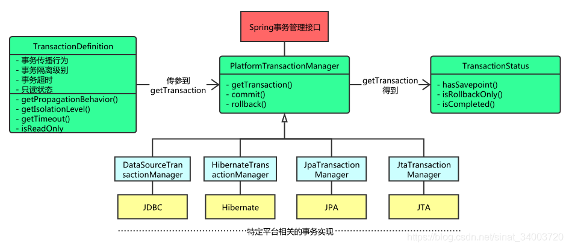

# Spring 事务管理

Spring 为事务管理提供了一致的抽象：

- 为不同的事物 API 提供了一致的编程模型，比如 Java Transaction API (JTA)、JDBC、Hibernate,、Java Persistence API (JPA)；
- 支持声明式事务；
- 提供了更为简洁的编程式事务 API；
- 和 Spring Data 抽象完美契合；

下面这种图展示了这种抽象：



> 图片来自：https://mp.weixin.qq.com/s/WGRKzztqgbX-REjwrlSUJA


Spring 事务管理是对 Spring IoC 容器和 Spring AOP 的一次应用，尤其体现了 Spring AOP 的编程优势。关于 Spring 事务管理流程解析会从前置准备、创建代理对象、执行流程三个方面进行。

## 前置准备

前置准备从怎么使用 Spring 事务管理出发，看开启了 Spring 事务管理后，Spring IoC 容器在运行过程中注册了哪些和事务相关的 bean，其是在什么实际注册的，有什么样的作用。

这里从基于 XML 和基于注解使用事务两个方面来解析。

### 功能开启

首先我们需要映入 Spring 事务管理和对应数据访问平台的事务管理 SPI 实现（假设我们使用 JDBC 来访问数据库）：

```xml
<dependency>
    <groupId>org.springframework</groupId>
    <artifactId>spring-tx</artifactId>
</dependency>

<dependency>
    <groupId>org.springframework</groupId>
    <artifactId>spring-jdbc</artifactId>
</dependency>
```

#### 基于 XML

如果是基于 XML，接下来我们需要定义数据源、对应平台的事务管理器、事务作用的切面等信息。

```xml
<?xml version="1.0" encoding="UTF-8"?>
<beans xmlns="http://www.springframework.org/schema/beans"
       xmlns:xsi="http://www.w3.org/2001/XMLSchema-instance"
       xmlns:context="http://www.springframework.org/schema/context"
       xmlns:aop="http://www.springframework.org/schema/aop" xmlns:tx="http://www.springframework.org/schema/tx"
       xsi:schemaLocation="http://www.springframework.org/schema/beans http://www.springframework.org/schema/beans/spring-beans.xsd http://www.springframework.org/schema/context https://www.springframework.org/schema/context/spring-context.xsd http://www.springframework.org/schema/aop https://www.springframework.org/schema/aop/spring-aop.xsd http://www.springframework.org/schema/tx http://www.springframework.org/schema/tx/spring-tx.xsd">

    <context:property-placeholder location="classpath:db.properties"/>

    <bean id="bookService" class="learn.spring.tx.xml.service.BookService">
        <property name="bookDao" ref="bookDao"></property>
    </bean>
    <bean id="bookDao" class="learn.spring.tx.xml.dao.BookDao">
        <property name="jdbcTemplate" ref="jdbcTemplate"></property>
    </bean>

    <bean id="dataSource" class="com.alibaba.druid.pool.DruidDataSource">
        <property name="username" value="${jdbc.username}"></property>
        <property name="password" value="${jdbc.password}"></property>
        <property name="url" value="${jdbc.url}"></property>
        <property name="driverClassName" value="${jdbc.driverClassName}"></property>
    </bean>
    <bean id="jdbcTemplate" class="org.springframework.jdbc.core.JdbcTemplate">
        <constructor-arg name="dataSource" ref="dataSource"></constructor-arg>
    </bean>
    <bean id="transactionManager" class="org.springframework.jdbc.datasource.DataSourceTransactionManager">
        <property name="dataSource" ref="dataSource"></property>
    </bean>

    <tx:advice id="myAdvice" transaction-manager="transactionManager">
        <tx:attributes>
            <tx:method name="checkout" propagation="REQUIRED"/>
            <tx:method name="updateStock" propagation="REQUIRES_NEW"/>
        </tx:attributes>
    </tx:advice>
    
    <aop:config>
        <aop:pointcut id="txPoint" expression="execution(* learn.spring.tx.xml.*.*.*(..))"/>
        <aop:advisor advice-ref="myAdvice" pointcut-ref="txPoint"></aop:advisor>
    </aop:config>
</beans>
```

对应的启动入口为：

```java
public static void main(String[] args) {
    ClassPathXmlApplicationContext ac = new ClassPathXmlApplicationContext("classpath:tx-jdbc.xml");
    final BookService bookService = ac.getBean("bookService", BookService.class);
    System.out.println(bookService);
}
```

同样，在容器启动过程的获取 `BeanFactory` 环节，我们去看 XML 文件的解析过程。主要看和事务相关的元素的解析器时什么，各做了什么样的工作。

首先事务命名空间对应的处理器为 `TxNamespaceHandler`。`<tx:advice/>` 对应的解析器为 `TxAdviceBeanDefinitionParser`。

注册 `myAdvice`，对应类型为 `TransactionInterceptor`。从名字可以看出来其应该和 AOP 结合，作为通知链的一员。

处理 `aop` 相关元素时，会注册一个 `org.springframework.aop.support.DefaultBeanFactoryPointcutAdvisor#0`，类型为 `DefaultBeanFactoryPointcutAdvisor`。其内部有两个属性，一个是 pointcut，一个是 `adviceBeanName`，`adviceBeanName` 的值为 `myAdvice`。其指向了事务拦截器。

其实例化则要推迟到创建动态代理对象时，查找通知类时进行。

### 基于注解

```java
@Configuration
@PropertySource("classpath:db.properties")
@EnableTransactionManagement
public class TransactionConfig {

    @Value("${jdbc.driverClassName}")
    private String driverClassname;
    @Value("${jdbc.url}")
    private String url;
    @Value("${jdbc.username}")
    private String username;
    @Value("${jdbc.password}")
    private String password;

    @Bean
    public DataSource dataSource() {
        DruidDataSource data = new DruidDataSource();
        data.setDriverClassName(driverClassname);
        data.setUrl(url);
        data.setUsername(username);
        data.setPassword(password);
        return data;
    }

    @Bean
    public JdbcTemplate jdbcTemplate(DataSource dataSource) {
        return new JdbcTemplate(dataSource);
    }

    @Bean
    public BookDao bookDao() {
        return new BookDao();
    }

    @Bean
    public BookService bookService() {
        bookDao();
        return new BookService();
    }

    @Bean
    public PlatformTransactionManager transactionManager(DataSource dataSource) {
        return new DataSourceTransactionManager(dataSource);
    }
}
```

```java
public class AnnotationTxExample {

    public static void main(String[] args) {
        AnnotationConfigApplicationContext applicationContext = new AnnotationConfigApplicationContext();
        applicationContext.register(TransactionConfig.class);
        applicationContext.refresh();

        System.out.println(applicationContext.getBean("bookService", BookService.class));
    }
}
```

启动后在执行 BFPP 阶段，通过 `ConfigurationClassPostProcessor` 对配置类进行解析。

这里声明的 `@EnableTransactionManagement` 注解，里面会导入一个 `TransactionManagementConfigurationSelector` 。

其会扫描到两个配置类 `ProxyTransactionManagementConfiguration ` 和 `AutoProxyRegistrar`。

`AutoProxyRegistrar` 用来检查实例方法上是否有事务注解，并放入缓存。

`ProxyTransactionManagementConfiguration`  则定义了 4 个 bean 分别为：

- `BeanFactoryTransactionAttributeSourceAdvisor`  AOP 增强器事务通知器
- `TransactionInterceptor`  事务方法拦截器
- `TransactionAttributeSource` 用来解析事务注解属性
- `TransactionalEventListenerFactory` 事务时间监听工厂

## 创建代理对象

创建代理对象的过程和 Spring AOP 创建代理对象的过程相同。

## 执行过程

`TransactionInterceptor` 会作为一个通知类，在事务方法调用是执行，进入事务管理。

```java
public Object invoke(MethodInvocation invocation) throws Throwable {
    // Work out the target class: may be {@code null}.
    // The TransactionAttributeSource should be passed the target class
    // as well as the method, which may be from an interface.
    Class<?> targetClass = (invocation.getThis() != null ? AopUtils.getTargetClass(invocation.getThis()) : null);

    // Adapt to TransactionAspectSupport's invokeWithinTransaction...
    return invokeWithinTransaction(invocation.getMethod(), targetClass, new CoroutinesInvocationCallback() {
        @Override
        @Nullable
        public Object proceedWithInvocation() throws Throwable {
            return invocation.proceed();
        }
        @Override
        public Object getTarget() {
            return invocation.getThis();
        }
        @Override
        public Object[] getArguments() {
            return invocation.getArguments();
        }
    });
}
```

核心的管理逻辑在 `TransactionAspectSupport` 里实现。

```java
protected Object invokeWithinTransaction(Method method, @Nullable Class<?> targetClass,
                                         final InvocationCallback invocation) throws Throwable {
    
    // ....
    
    PlatformTransactionManager ptm = asPlatformTransactionManager(tm);
    final String joinpointIdentification = methodIdentification(method, targetClass, txAttr);

    if (txAttr == null || !(ptm instanceof CallbackPreferringPlatformTransactionManager)) {
        // Standard transaction demarcation with getTransaction and commit/rollback calls.
        TransactionInfo txInfo = createTransactionIfNecessary(ptm, txAttr, joinpointIdentification);

        Object retVal;
        try {
            // This is an around advice: Invoke the next interceptor in the chain.
            // This will normally result in a target object being invoked.
            retVal = invocation.proceedWithInvocation();
        }
        catch (Throwable ex) {
            // target invocation exception
            completeTransactionAfterThrowing(txInfo, ex);
            throw ex;
        }
        finally {
            cleanupTransactionInfo(txInfo);
        }

        if (retVal != null && vavrPresent && VavrDelegate.isVavrTry(retVal)) {
            // Set rollback-only in case of Vavr failure matching our rollback rules...
            TransactionStatus status = txInfo.getTransactionStatus();
            if (status != null && txAttr != null) {
                retVal = VavrDelegate.evaluateTryFailure(retVal, txAttr, status);
            }
        }

        commitTransactionAfterReturning(txInfo);
        return retVal;
    }
	// ....
}
```

上面方法展示了事务管理的核心流程，主要包括：

- 方法执行前创建事务；
- 执行方法；
- 出现异常，执行回滚；
- 最终清除事务信息。

// TODO ...


## Spring 事务的传播特性

事务传播特性是指事务方法级联调用时，事务的行为。

Spring 一共定义了 7 种传播特性（位于 `Propagation`），根据内层方法是否使用外层方法事务，可分为三大类：

- 使用同一个事务：
  - REQUIRED：表示当前方法需要事务，如果存在事务就使用现有事务，否则创建事务；
  - SUPPORTS：表示当前方法支持事务，如果存在事务就使用，否则不使用事务；
  - MANDATORY：表示强制使用外层方法事务，如果存在事务就使用，否则抛出异常。
- 使用不同的事务：
  - REQUIRES_NEW：表示当前方法需要新的事务，如果存在事务则挂起，然后新建事务；
  - NOT_SUPPORTED：表示当前方法不需要事务，有则挂起；
  - NEVER：表示当前方法不需要事务，有则抛出异常。

- 使用具有父子关系的事务：

  - NESTED：表示内嵌事务，外层事务的异常会触发内嵌事务的回滚，内嵌事务的异常不会触发外层事务回滚。

    - 如果当前存在事务，它将会成为父级事务的一个子事务，但方法结束后并没有提交，只有等父事务结束才提交；

    - 如果当前没有事务，则新建事务；

    - 如果它异常，父级可以捕获它的异常而不进行回滚，正常提交；

    - 但如果父级异常，它必然回滚，这就是和 `REQUIRES_NEW` 的区别。


NESTED 基于 Savepoint 机制实现。

[Savepoint - 维基百科，自由的百科全书 (wikipedia.org)](https://zh.wikipedia.org/wiki/Savepoint)

```sql
set autocommit = 0;
start transaction;
update book_stock set stock=stock-1 where id = 2;
savepoint p1;
update book_stock set stock=stock-1 where id = 2;
rollback to p1;
commit;
```

savepoint 可以设置（内层）事务回滚的位置。


外层事务：REQUIRED

内层事务：REQUIRED

内外层方法使用用一个事务，都正常执行，外层提交事务。

因为使用的是同一个事务，内外层任意一个方法发生异常，都会回滚。**内层方法发生异常，外层方法即使捕获处理了异常，同样也会回滚**。


外层事务：REQUIRED

内层事务：NESTED

内外层方法使用同一个事务，只不过内层方法使用非是子事务。内层方法发生异常，回滚至 Savepoint，外层方法如果捕获处理了内层异常，继续执行，且外层事务可以正常提交。

外层方法发生异常，内层方法正常执行，因为是用一个事务会一起回滚。


外层事务：REQUIRED

内层事务：REQUIRED_NEW

内外层方法使用不同的事务。内层方法发生异常，进行回滚。外层方法捕获异常后继续执行，不受内层方法影响。

内层方法正常，外层方法异常，因为是不同的事务，内层方法不受外层方法的影响，可以正常提交。


