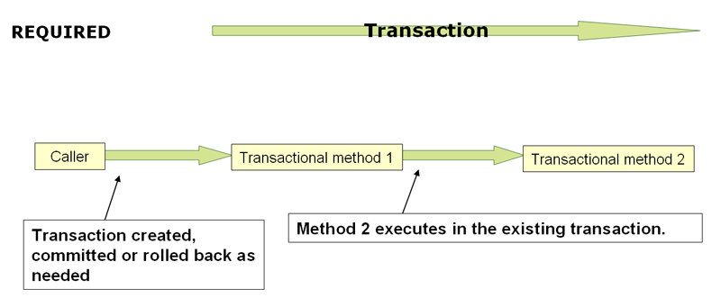

# Spring 事物管理

[Data Access (spring.io)](https://docs.spring.io/spring-framework/docs/current/reference/html/data-access.html#transaction)

Spring 为事务管理提供了一直的抽象：

- 为不同的事物 API 提供了一致的编程模型，比如 Java Transaction API (JTA)、JDBC、Hibernate,、Java Persistence API (JPA)；
- 支持声明式事务；
- 提供了更为简洁的编程式事务 API；
- 和 Spring Data 抽象完美契合；

## Spring 事务模型优点

一般来讲，Jave EE 开发者在事务管理上面有两个选择：全局事务或本地事务，都具有一定的局限性。

### 全局事务

全局事务可以管理多个事务资源（transaction resource），通常为为关系型数据库和消息队列。应用服务（application server）通过 JTA 来管理全局事务，但 JTA 比较重，而且设计上需要和 JNDI 配合使用。

EJB CMT 提供了一种全局事务的方案，但也有者诸多缺陷。TODO ...

### 本地事务

本地事务作用于特定的资源，比如在一个 JDBC 连接内的事务。本地事务便于使用但有一个明显的缺陷就是不能跨多个事务资源工作。比如，使用 JDBC 连接管理事务的代码不能在 JTA 事务中运行。这是因为应用服务（application server）不参与事务管理，因此无法确保跨多个资源的正确性。另外一个缺点是本地事务会侵入编程模型。

> 值得注意的是大多数应用程序都是使用单个事务资源，即使用本地事务。

### Spring 一致的事务模型

Spring 解决了全局和本地事务的缺点。它允许应用程序开发人员在任何环境中使用一致的编程模型。您只需编写一次代码，就可以从不同环境中的不同事务管理策略中获益。Spring 框架同时提供了声明式事务管理和编程式事务管理。大多数用户喜欢声明性事务管理，我们在大多数情况下建议使用这种方式。

通过编程事务管理，开发人员可以使用 Spring Framework 事务抽象，该抽象可以运行在任何底层事务基础结构上。比如一开始使用的是本地事务，后面如果需要使用全局事务，在 Spring 事务模型下，只需要通过配置一些 bean 定义，而不用修改代码。

## Spring 事务模型

Spring 事务抽象的关键是事务策略的概念。事务策略由 `TransactionManager` 定义，特别是 `org.springframework.transaction.PlatformTransactionManager` 和  `org.springframework.transaction.ReactiveTransactionManager`。前者用来管理命令式事务，后者用来管理声明式事务。

`PlatformTransactionManager` 定义如下：

```java
public interface PlatformTransactionManager extends TransactionManager {

    TransactionStatus getTransaction(TransactionDefinition definition) throws TransactionException;

    void commit(TransactionStatus status) throws TransactionException;

    void rollback(TransactionStatus status) throws TransactionException;
}
```

`PlatformTransactionManager` 主要作为一个服务提供接口（SPI）来使用。`PlatformTransactionManager`  的实现不需要和 JNDI 绑定，其可以和其它任何在 Spring IoC 容器的 Bean 一样去定义。

`PlatformTransactionManager`  接口抛出的 `TransactionException` 是一个运行时异常。事务基础设施故障往往是致命的，并且难以预测和修复，这也是为什么使用运行时异常的原因。开发人员可以有选择性地捕获并处理这些异常。

`GetTransaction` 方法根据  `TransactionDefinition` 返回 `TransactionStatus` 对象。其用来获取一个事务，如果没有则创建，有则返回现有事务。和 Java EE 上下文一样，`TransactionStatus` 和执行线程相关联。


`ReactiveTransactionManager` 定义如下：

```java
public interface ReactiveTransactionManager extends TransactionManager {

    Mono<ReactiveTransaction> getReactiveTransaction(TransactionDefinition definition) throws TransactionException;

    Mono<Void> commit(ReactiveTransaction status) throws TransactionException;

    Mono<Void> rollback(ReactiveTransaction status) throws TransactionException;
}
```

其也主要作为一个服务提供接口（SPI）来使用。


`TransactionDefinition` 定义如下：

```java
public interface TransactionDefinition {

	default int getPropagationBehavior() {
		return PROPAGATION_REQUIRED;
	}

	default int getIsolationLevel() {
		return ISOLATION_DEFAULT;
	}

	default int getTimeout() {
		return TIMEOUT_DEFAULT;
	}

	default boolean isReadOnly() {
		return false;
	}

	@Nullable
	default String getName() {
		return null;
	}

	/**
	 * Return an unmodifiable {@code TransactionDefinition} with defaults.
	 * <p>For customization purposes, use the modifiable
	 * {@link org.springframework.transaction.support.DefaultTransactionDefinition}
	 * instead.
	 * @since 5.2
	 */
	static TransactionDefinition withDefaults() {
		return StaticTransactionDefinition.INSTANCE;
	}
}
```

- `Propagation`：事务传播机制，通常，事务范围内的所有代码都在该事务中运行。但是，如果在事务上下文已经存在时运行事务方法，则可以指定该行为。例如，代码可以继续在现有事务中运行（常见情况），或者可以挂起现有事务并创建新事务。
- `Isolation`：事务隔离级别，控制此事务与其他事务的工作隔离的程度。例如，此事务是否可以看到来自其他事务的未提交写操作？
- `Timeout`：事务超时时间，此事务在超时并由底层事务基础结构自动回滚之前运行多长时间。
- `Read-only status`：事务只读状态。当代码读取但不修改数据时，可以使用只读事务。在某些情况下，只读事务可能是一种有用的优化，例如在使用 Hibernate 时

> 事务的传播机制和隔离级别是两个重要的概念，对于理解 Spring 事务解决方案必不可少。

`TransactionStatus`  定义如下：

```java
public interface TransactionStatus extends TransactionExecution, SavepointManager, Flushable {

    @Override
    boolean isNewTransaction();

    boolean hasSavepoint();

    @Override
    void setRollbackOnly();

    @Override
    boolean isRollbackOnly();

    void flush();

    @Override
    boolean isCompleted();
}
```

`TransactionStatus` 接口为事务代码控制事务执行和查询事务状态提供了一种简单的方法，且是通用的。


无论您选择 Spring 中的声明式事务管理还是编程式事务管理，定义正确的 `TransactionManager` 实现都是绝对必要的。通常通过依赖引入该接口的实现（基于 SPI 机制进行扩展）。

TransactionManager 实现通常需要了解其工作环境: JDBC、 JTA、 Hibernate 等，比如下面定义 `PlatformTransactionManager`  作用于 JDBC 上。

首先需要定义一个 JDBC 数据源（数据源会被事务管理器引用）：

```xml
<bean id="dataSource" class="org.apache.commons.dbcp.BasicDataSource" destroy-method="close">
    <property name="driverClassName" value="${jdbc.driverClassName}" />
    <property name="url" value="${jdbc.url}" />
    <property name="username" value="${jdbc.username}" />
    <property name="password" value="${jdbc.password}" />
</bean>
```

然后引入依赖（包含了作用于 JDBC 上的 `PlatformTransactionManager`  的实现）：

```xml
<dependency>
    <groupId>org.springframework</groupId>
    <artifactId>spring-jdbc</artifactId>
</dependency>
```

定义 `PlatformTransactionManager`  bean：

```xml
<bean id="txManager" class="org.springframework.jdbc.datasource.DataSourceTransactionManager">
    <property name="dataSource" ref="dataSource"/>
</bean>
```


如果在 JavaEE 容器中使用 JTA，那么将使用通过 JNDI 获得的容器 `DataSource`，以及 Spring 的 `JtaTransactionManager`。比如：

```xml
<?xml version="1.0" encoding="UTF-8"?>
<beans xmlns="http://www.springframework.org/schema/beans"
    xmlns:xsi="http://www.w3.org/2001/XMLSchema-instance"
    xmlns:jee="http://www.springframework.org/schema/jee"
    xsi:schemaLocation="
        http://www.springframework.org/schema/beans
        https://www.springframework.org/schema/beans/spring-beans.xsd
        http://www.springframework.org/schema/jee
        https://www.springframework.org/schema/jee/spring-jee.xsd">

    <jee:jndi-lookup id="dataSource" jndi-name="jdbc/jpetstore"/>

    <bean id="txManager" class="org.springframework.transaction.jta.JtaTransactionManager" />
</beans>
```

> 如果使用 JTA，不管使用什么数据访问技术，不管是 JDBC、 Hibernate JPA 还是其他支持的技术，事务管理器定义都应该是相同的这是因为 JTA 事务是全局事务，而可以注册任何事务资源。

### Hibernate 事务设置

我们可以选择使用 `Hibernate` 作为本地事务的执行平台。

先引入 `Hibernate` 对 `PlatformTransactionManager`  的实现依赖。

```xml
<dependency>
    <groupId>org.hibernate</groupId>
    <artifactId>hibernate-core</artifactId>
</dependency>
<dependency>
    <groupId>org.springframework</groupId>
    <artifactId>spring-orm</artifactId>
</dependency>
```

hibernate-core 包含了 hibernate 核心依赖，spring-orm 提供了和 hibernate 相关集成 API。

定义事务管理 bean（数据源可见上述 JDBC 数据源定义）：

```xml
<bean id="sessionFactory" class="org.springframework.orm.hibernate5.LocalSessionFactoryBean">
    <property name="dataSource" ref="dataSource"/>
    <property name="mappingResources">
        <list>
            <value>org/springframework/samples/petclinic/hibernate/petclinic.hbm.xml</value>
        </list>
    </property>
    <property name="hibernateProperties">
        <value>
            hibernate.dialect=${hibernate.dialect}
        </value>
    </property>
</bean>

<bean id="txManager" class="org.springframework.orm.hibernate5.HibernateTransactionManager">
    <property name="sessionFactory" ref="sessionFactory"/>
</bean>
```

正如 `DataSourceTransactionManager` 需要对 `DataSource` 的引用一样，`HibernateTransactionManager` 也需要对 `SessionFactory` 的引用，`SessionFactory` 包含了对数据源的引用。


如果使用 Hibernate 和 JavaEE 容器管理的 JTA 事务，则应该使用与前面 JTA 示例中的 JDBC 相同的 JtaTransactionManager，如下面的示例所示。此外，建议通过事务协调器和可能的连接释放模式配置让 Hibernate 了解 JTA：

```xml
<bean id="sessionFactory" class="org.springframework.orm.hibernate5.LocalSessionFactoryBean">
    <property name="dataSource" ref="dataSource"/>
    <property name="mappingResources">
        <list>
            <value>org/springframework/samples/petclinic/hibernate/petclinic.hbm.xml</value>
        </list>
    </property>
    <property name="hibernateProperties">
        <value>
            hibernate.dialect=${hibernate.dialect}
            hibernate.transaction.coordinator_class=jta
            hibernate.connection.handling_mode=DELAYED_ACQUISITION_AND_RELEASE_AFTER_STATEMENT
        </value>
    </property>
</bean>

<bean id="txManager" class="org.springframework.transaction.jta.JtaTransactionManager"/>
```

或者将 `JtaTransactionManager` 传递到 `LocalSessionFactoryBean` 中，以执行相同的默认值:

```xml
<bean id="sessionFactory" class="org.springframework.orm.hibernate5.LocalSessionFactoryBean">
    <property name="dataSource" ref="dataSource"/>
    <property name="mappingResources">
        <list>
            <value>org/springframework/samples/petclinic/hibernate/petclinic.hbm.xml</value>
        </list>
    </property>
    <property name="hibernateProperties">
        <value>
            hibernate.dialect=${hibernate.dialect}
        </value>
    </property>
    <property name="jtaTransactionManager" ref="txManager"/>
</bean>

<bean id="txManager" class="org.springframework.transaction.jta.JtaTransactionManager"/>
```

## 同步资源与事务

这里的资源可以简单理解为用来获取数据资源，比如上述的 JDBC `DataSource` 和 Hibernate `SessionFactory`。

上面已经介绍了怎么将资源和不同的事务管理器连接起来，这里将说明应用程序代码（通过使用持久性 API，如 JDBC、 Hibernate 或 JPA，直接或间接地）如何确保正确地创建、重用和清理这些资源。

### 高层次同步方法

首选的方法是使用 Spring 的最高级别的基于模板的持久化集成 API，或者使用本机 ORM API 和支持事务的工厂 bean 或代理来管理本机资源工厂。这些事务感知解决方案在内部处理资源的创建、重用、事务同步和异常映射。用户数据访问代码可以不必处理这些任务。

一般情况下，您可以使用本机 ORM API，或者使用 `JdbcTemplate` 采用模板方法进行 JDBC 访问。

### 低层次同步方法

诸如 `DataSourceUtils` (用于 JDBC)、 `EntityManagerFactoryUtils` （用于 JPA）、 `SessionFactoryUtils`（用于 Hibernate）这些较低层次的 API 来管理资源。

比如：

```java
Connection conn = DataSourceUtils.getConnection(dataSource);
```

不需要使用传统的 JDBC 编程行为，直接使用 `DataSourceUtils` 从数据源中获取一个连接。如果现有的事务已经有一个与之同步（链接）的连接，则返回该实例。否则，该方法调用将触发新连接的创建，该连接（可选）与任何现有事务同步，并可用于同一事务中的后续重用。

这些 API 在 Spring 容器之外也可以工作。

### `TransactionAwareDataSourceProxy`

`TransactionAwareDataSourceProxy` 存在于很底层，是对目标 `DataSource` 的代理，该代理包装目标 `DataSource` 以添加 Spring 管理的事务的感知。在这方面，它类似于 JavaEE 服务器提供的事务性 JNDI `DataSource`。

除非必须调用现有代码并传递标准 JDBC `DataSource` 接口实现，否则几乎不需要使用此类。

## 声明式事务

Spring 框架的声明性事务管理是通过 Spring AOP 实现的。

Spring 框架的声明性事务管理类似于 EJB CMT，可以指定事务行为到单个方法级别。具体上来说，在方法上声明一个 `@Transactional` 注解。

这里面有个重要的属性（概念）——回滚规则（rull back rules）。它们允许您指定哪些异常（和可抛出异常）应该导致自动回滚。此选项的显著优点是业务对象不依赖于事务基础结构，就可以实现回滚。

### 声明式事务的实现

关于 Spring 框架的声明性事务支持，需要掌握的最重要的概念是，这种支持是通过 AOP 代理启用的，事务通知是由元数据（目前基于 XML 或注释）驱动的。AOP 与事务元数据的组合产生了一个 AOP 代理，它使用 `TransactionInterceptor` 与适当的 `TransactionManager` 一起驱动方法调用事务。

Spring 框架的 `TransactionInterceptor` 为命令式和响应式编程式模型提供事务管理。事务管理风格影响需要哪个事务管理器。

> `@Transactional` 通常使用 `PlatformTransactionManager` 管理的线程绑定事务，将事务公开给当前执行线程内的所有数据访问操作。注意: 这不会传播到方法中新启动的线程。
>
> 由 `ReactiveTransactionManager` 管理的反应事务使用反应器上下文而不是线程本地属性。因此，所有参与的数据访问操作都需要在相同的反应器上下文中在相同的反应管道中执行。

下图显示了在事务代理上调用方法的概念视图：


### 声明式事务示例

创建业务接口与对应实现：

```java
public interface FooService {

    Foo getFoo(String fooName);

    Foo getFoo(String fooName, String barName);

    void insertFoo(Foo foo);

    void updateFoo(Foo foo);
}
```

```java
public class DefaultFooService implements FooService {

    @Override
    public Foo getFoo(String fooName) {
        // ...
    }

    @Override
    public Foo getFoo(String fooName, String barName) {
        // ...
    }

    @Override
    public void insertFoo(Foo foo) {
        // ...
    }

    @Override
    public void updateFoo(Foo foo) {
        // ...
    }
}
```

假设 `FooService` 接口的前两个方法 `getFoo(String)` 和 `getFoo(String，String)` 必须在具有只读语义的事务上下文中运行，而其他方法 `inserttFoo(Foo)`和 `updateFoo(Foo)` 必须在具有读写语义的事务上下文中运行。以下几段将详细解释下列配置：

```xml
<!-- from the file 'context.xml' -->
<?xml version="1.0" encoding="UTF-8"?>
<beans xmlns="http://www.springframework.org/schema/beans"
    xmlns:xsi="http://www.w3.org/2001/XMLSchema-instance"
    xmlns:aop="http://www.springframework.org/schema/aop"
    xmlns:tx="http://www.springframework.org/schema/tx"
    xsi:schemaLocation="
        http://www.springframework.org/schema/beans
        https://www.springframework.org/schema/beans/spring-beans.xsd
        http://www.springframework.org/schema/tx
        https://www.springframework.org/schema/tx/spring-tx.xsd
        http://www.springframework.org/schema/aop
        https://www.springframework.org/schema/aop/spring-aop.xsd">

    <!-- this is the service object that we want to make transactional -->
    <bean id="fooService" class="x.y.service.DefaultFooService"/>

    <!-- the transactional advice (what 'happens'; see the <aop:advisor/> bean below) -->
    <tx:advice id="txAdvice" transaction-manager="txManager">
        <!-- the transactional semantics... -->
        <tx:attributes>
            <!-- all methods starting with 'get' are read-only -->
            <tx:method name="get*" read-only="true"/>
            <!-- other methods use the default transaction settings (see below) -->
            <tx:method name="*"/>
        </tx:attributes>
    </tx:advice>

    <!-- ensure that the above transactional advice runs for any execution
        of an operation defined by the FooService interface -->
    <aop:config>
        <aop:pointcut id="fooServiceOperation" expression="execution(* x.y.service.FooService.*(..))"/>
        <aop:advisor advice-ref="txAdvice" pointcut-ref="fooServiceOperation"/>
    </aop:config>

    <!-- don't forget the DataSource -->
    <bean id="dataSource" class="org.apache.commons.dbcp.BasicDataSource" destroy-method="close">
        <property name="driverClassName" value="oracle.jdbc.driver.OracleDriver"/>
        <property name="url" value="jdbc:oracle:thin:@rj-t42:1521:elvis"/>
        <property name="username" value="scott"/>
        <property name="password" value="tiger"/>
    </bean>

    <!-- similarly, don't forget the TransactionManager -->
    <bean id="txManager" class="org.springframework.jdbc.datasource.DataSourceTransactionManager">
        <property name="dataSource" ref="dataSource"/>
    </bean>
</beans>
```

事务的语义被封装在了 `<tx:advice/>` 中，比如这里定义为所有以 get 开头的方法都将在只读事务的上下文中运行，所有其他方法都将使用默认的事务语义运行。还需要标记的事务管理器属性设置为将要驱动事务的 `TransactionManager` bean 的名称。


`<aop: config/>`  则定义了事务通知可以在合适的时机和位置执行。

一个常见的需求是使整个服务层成为事务性的，下面是对应事务配置：

```java
<aop:config>
    <aop:pointcut id="fooServiceMethods" expression="execution(* x.y.service.*.*(..))"/>
    <aop:advisor advice-ref="txAdvice" pointcut-ref="fooServiceMethods"/>
</aop:config>
```

```java
public final class Boot {

    public static void main(final String[] args) throws Exception {
        ApplicationContext ctx = new ClassPathXmlApplicationContext("context.xml");
        FooService fooService = ctx.getBean(FooService.class);
        fooService.insertFoo(new Foo());
    }
}
```

### 响应式事务示例

要使用响应事务管理，代码必须使用响应类型。

```java
public interface FooService {

    Flux<Foo> getFoo(String fooName);

    Publisher<Foo> getFoo(String fooName, String barName);

    Mono<Void> insertFoo(Foo foo);

    Mono<Void> updateFoo(Foo foo);
}
```

```java
public class DefaultFooService implements FooService {

    @Override
    public Flux<Foo> getFoo(String fooName) {
        // ...
    }

    @Override
    public Publisher<Foo> getFoo(String fooName, String barName) {
        // ...
    }

    @Override
    public Mono<Void> insertFoo(Foo foo) {
        // ...
    }

    @Override
    public Mono<Void> updateFoo(Foo foo) {
        // ...
    }
}
```

命令式事务管理和反应式事务管理对于事务边界和事务属性定义具有相同的语义，直接主要区别在于后者的延迟性质。`TransactionInterceptor` 用事务操作符装饰返回的反应类型，以开始并清理事务。因此，调用事务反应方法将实际的事务管理推迟到激活反应类型处理的订阅类型。

反应性事务管理的另一个方面与数据转义有关，这是编程模型的自然结果。

命令式事务的方法返回值在方法成功终止时从事务方法返回，这样部分计算的结果不会逃脱方法闭包。反应事务方法返回一个反应包装类型，该类型表示一个计算序列，并承诺开始并完成计算。发布服务器可以在事务正在进行但未必已完成的情况下发出数据。因此，依赖于成功完成整个事务的方法需要确保调用代码中的完成和缓冲结果。

### 声明式事务回滚

这里主要将在 XML 文件里怎么配置事务回滚规则。

推荐做法是，指明一个异常，表示在该异常抛出时，Spring Framework 的事务基础结构代码在调用堆栈时获任何未处理的 `Exception`，并确定是否将事务标记为回滚，并进行回滚操作。

> **Rollback rules** 回滚规则
>
> 回滚规则确定在引发给定异常时是否应回滚事务，这些规则基于模式。模式可以是异常类型的完全限定类名或完全限定类名的子字符串（必须是 Throwable 的子类) ，目前不支持通配符。
>
> 可以通过 `rollback-for` 和 `no-rollback-for` 属性在 XML 中配置回滚规则，这些属性允许将模式指定为字符串

下面的 XML 片段演示如何通过 `rollback-for` 属性提供异常模式来配置已检查的特定于应用程序的 Exception 类型的回滚:

```xml
<tx:advice id="txAdvice" transaction-manager="txManager">
    <tx:attributes>
    <tx:method name="get*" read-only="true" rollback-for="NoProductInStockException"/>
    <tx:method name="*"/>
    </tx:attributes>
</tx:advice>
```

在以下配置的情况下，除了 `InstrumentNotFoundException` 之外的任何异常都会导致相应事务的回滚：

```xml
<tx:advice id="txAdvice">
    <tx:attributes>
    <tx:method name="*" rollback-for="Throwable" no-rollback-for="InstrumentNotFoundException"/>
    </tx:attributes>
</tx:advice>
```

### 为不同的 bean 配置不同的事务语义

如果不同的 bean 需要使用不同的事务配置，可以通过定义不同的 `< aop: advisor/>` 元素来实现这一点，这些元素具有不同的切入点和 `advisory-ref` 属性值。比如：

```xml
<?xml version="1.0" encoding="UTF-8"?>
<beans xmlns="http://www.springframework.org/schema/beans"
    xmlns:xsi="http://www.w3.org/2001/XMLSchema-instance"
    xmlns:aop="http://www.springframework.org/schema/aop"
    xmlns:tx="http://www.springframework.org/schema/tx"
    xsi:schemaLocation="
        http://www.springframework.org/schema/beans
        https://www.springframework.org/schema/beans/spring-beans.xsd
        http://www.springframework.org/schema/tx
        https://www.springframework.org/schema/tx/spring-tx.xsd
        http://www.springframework.org/schema/aop
        https://www.springframework.org/schema/aop/spring-aop.xsd">

    <!-- this bean will be transactional (see the 'defaultServiceOperation' pointcut) -->
    <bean id="fooService" class="x.y.service.DefaultFooService"/>

    <!-- this bean will also be transactional, but with totally different transactional settings -->
    <bean id="anotherFooService" class="x.y.service.ddl.DefaultDdlManager"/>
    
    <aop:config>
        <aop:pointcut id="defaultServiceOperation"
                expression="execution(* x.y.service.*Service.*(..))"/>
        <aop:pointcut id="noTxServiceOperation"
                expression="execution(* x.y.service.ddl.DefaultDdlManager.*(..))"/>

        <aop:advisor pointcut-ref="defaultServiceOperation" advice-ref="defaultTxAdvice"/>
        <aop:advisor pointcut-ref="noTxServiceOperation" advice-ref="noTxAdvice"/>
    </aop:config>
    
    <tx:advice id="defaultTxAdvice">
        <tx:attributes>
            <tx:method name="get*" read-only="true"/>
            <tx:method name="*"/>
        </tx:attributes>
    </tx:advice>

    <tx:advice id="noTxAdvice">
        <tx:attributes>
            <tx:method name="*" propagation="NEVER"/>
        </tx:attributes>
    </tx:advice>
</beans>
```

### `<tx:advice/> 元素配置`

[Data Access (spring.io)](https://docs.spring.io/spring-framework/docs/current/reference/html/data-access.html#transaction-declarative-txadvice-settings)

### 使用 `@Transactional`

使用注解的方式来配置事务，这也是最常用的方式。

```java
// the service class that we want to make transactional
@Transactional
public class DefaultFooService implements FooService {

    @Override
    public Foo getFoo(String fooName) {
        // ...
    }

    @Override
    public Foo getFoo(String fooName, String barName) {
        // ...
    }

    @Override
    public void insertFoo(Foo foo) {
        // ...
    }

    @Override
    public void updateFoo(Foo foo) {
        // ...
    }
}
```

当像上面这样的 POJO 类在 Spring 上下文中定义为 bean 时，可以通过 `@Configuration` 类中的 `@EnableTransactionManagement` 来开启基于注解的事务管理。

> 方法可见性与 `@Transactional`。
>
> 当使用具有 Spring 标准配置的事务性代理时，应该只对具有**公共**可见性的方法应用 `@Transactional` 注释。如果使用 `@Transactional` 注释对受保护的、私有的或包可见的方法进行注释，则不会引发错误，但是注释方法不会显示已配置的事务设置。
>
> 如果需要对非公共方同样生效，可以考虑使用 AOP 编程。
>
> 当在 `@Configuration` 类中使用 `@EnableTransactionManagement` 时，也可以通过注册自定义 `TransactionAttributeSource` bean (如下面的示例所示) ，使受保护或包可见的方法成为基于类的代理的事务性方法。但是请注意，基于接口的代理中的事务方法必须始终是公共的，并且必须在代理接口中定义。
>
> ```java
> @Bean
> TransactionAttributeSource transactionAttributeSource() {
>     // 设置 false 开启对 protected 和 default 方法的支持。
>     return new AnnotationTransactionAttributeSource(false);
> }
> ```

可以将 `@Transactional` 注释应用于接口定义、接口上的方法、类定义或类上的方法。

> Spring 团队建议在类上使用 `@Transactional`  而不是在接口上。
>
> `@Transactional` 也可以在接口上使用，但是这仅限于你使用的是基于接口的动态代理。在 Java 中注解是不会被继承的，如果使用的是基于类的动态代理，`@Transactional` 注解的作用就失效了。

> 基于代理模式的行为（这一点在 AOP 章节详细说过）。目标对象内部方法之间的平级调用时是不会经过代理类走增强逻辑的。也就是说调用一个没有声明 `@Transactional` 的方法，方法内部调用了一个声明了 `@Transactional` 方法，不会触发事务逻辑。
>
> 如果想方法自调也包含事务，在 `<tx:annotation-driven/>` 中可以将模式调整为 `aspectj`。
>
> 或者使用 `AopContext.currentProxy() ` 获取当前对象的代理对象，在进行方法调用，但这种做法对代码具有侵入性。

#### `<tx:annotation-driven/>` 元素配置

`transaction-manager`：要使用的事务管理器的名称，注解没有次属性，对应可使用的类为 `TransactionManagementConfigurer`。

`mode`：默认为 proxy，遵循代理语义。如果想方法自调也包含事务，可以将模式调整 `aspectj`。

`proxy-target-class`：仅适用于代理模式。控制为使用 `@Transactional` 注释注释的类创建何种类型的事务代理。如果代理-目标类属性设置为 true，则创建基于类的代理。如果为 false 或者省略了该属性，则创建标准的基于 JDK 接口的代理。

`order`：定义应用于带有 `@Transactional` 注释的 bean 的事务通知的顺序。

> `@EnableTransactionManagement` 还有 `<tx:annotation-driven/>` 只能在和定义它们的相同应用程序上下文中找带有 `@Transactional`  的 bean。
>
> 这意味着，如果将注释驱动的配置放在 `WebApplicationContext`，对于一个 `DispatcherServlet`，它只检查 controller 上的 `@Transactional`  而不是 service。

`@Transactional` 注解遵循最近优先的原则，比如在类上和方法上同时声明，方法上的配置生效。比如：

```java
@Transactional(readOnly = true)
public class DefaultFooService implements FooService {

    public Foo getFoo(String fooName) {
        // ...
    }

    // these settings have precedence for this method
    @Transactional(readOnly = false, propagation = Propagation.REQUIRES_NEW)
    public void updateFoo(Foo foo) {
        // ...
    }
}
```

#### `@Transactional` 配置

`@Transactional` 注解是指定接口、类或方法必须具有事务语义的元数据。默认的 `@Transactional` 设置如下：

- 传播策略为 PROPAGATION _ REQUIRED（`propagation=PROPAGATION_REQUIRED`）；
- 隔离级别为 ISOLATION _ DEFAULT（`isolation=ISOLATION_DEFAULT`）；
- 事务是读写的（`readOnly=false`）；
- 事务超时默认为基础事务系统的默认超时（`timeout`，默认为 -1），如果不支持超时，则为零；
- 任何 `RuntimeException` 或 `Error` 都会触发回滚，而检验式 `Exception` 不会触发回滚。

#### 多事务管理

大多数 Spring 应用程序只需要一个事务管理器，但在某些情况下，可能需要在一个应用程序中使用多个独立的事务管理器。

可以使用 `@Transactional` 注释的 value 或 `transactionManager` 属性选择性地指定要使用的 `TransactionManager` 的标识。

比如：

```java
public class TransactionalService {

    @Transactional("order")
    public void setSomething(String name) { ... }

    @Transactional("account")
    public void doSomething() { ... }

    @Transactional("reactive-account")
    public Mono<Void> doSomethingReactive() { ... }
}
```

```xml
<tx:annotation-driven/>

<bean id="transactionManager1" class="org.springframework.jdbc.datasource.DataSourceTransactionManager">
    ...
    <qualifier value="order"/>
</bean>

<bean id="transactionManager2" class="org.springframework.jdbc.datasource.DataSourceTransactionManager">
    ...
    <qualifier value="account"/>
</bean>

<bean id="transactionManager3" class="org.springframework.data.r2dbc.connectionfactory.R2dbcTransactionManager">
    ...
    <qualifier value="reactive-account"/>
</bean>
```

#### 自定义组合注解

如果 `@Transactional`  的某些配置在代码中很常用，为了简化配置，可以使用组合了 `@Transactional`  的自定义注解。比如：

```java
@Target({ElementType.METHOD, ElementType.TYPE})
@Retention(RetentionPolicy.RUNTIME)
@Transactional(transactionManager = "order", label = "causal-consistency")
public @interface OrderTx {
}

@Target({ElementType.METHOD, ElementType.TYPE})
@Retention(RetentionPolicy.RUNTIME)
@Transactional(transactionManager = "account", label = "retryable")
public @interface AccountTx {
}
```

然后在使用时：

```java
public class TransactionalService {

    @OrderTx
    public void setSomething(String name) {
        // ...
    }

    @AccountTx
    public void doSomething() {
        // ...
    }
}
```

### 事务传播机制

在 Spring 管理的事务中，要注意物理事务和逻辑事务之间的区别，以及传播设置如何应用于这种区别。

#### PROPAGATION_REQUIRED



`REQUIRED` 仅支持当前事务，如果当前没有事务，则新建事务，如果当前存在事务，则加入当前事务。

#### PROPAGATION_REQUIRES_NEW


`REQUIRES_NEW`，新建事务，如果当前存在事务，则把当前事务挂起。

这个方法会独立提交事务，不受调用者的事务影响，父级异常，它也是正常提交

#### PROPAGATION_NESTED

- 如果当前存在事务，它将会成为父级事务的一个子事务，方法结束后并没有提交，只有等父事务结束才提交；
- 如果当前没有事务，则新建事务；
- 如果它异常，父级可以捕获它的异常而不进行回滚，正常提交；
- 但如果父级异常，它必然回滚，这就是和 `REQUIRES_NEW` 的区别。

### 为事务方法添加通知

假如我们希望在运行事务时添加一些基本分析建议。如何实现这一点。

比如下面将统计每次方法在事务调用的各个阶段耗时，可以使用下面切面：

```java
public class SimpleProfiler implements Ordered {

    private int order;

    // allows us to control the ordering of advice
    public int getOrder() {
        return this.order;
    }

    public void setOrder(int order) {
        this.order = order;
    }

    // this method is the around advice
    public Object profile(ProceedingJoinPoint call) throws Throwable {
        Object returnValue;
        StopWatch clock = new StopWatch(getClass().getName());
        try {
            clock.start(call.toShortString());
            returnValue = call.proceed();
        } finally {
            clock.stop();
            System.out.println(clock.prettyPrint());
        }
        return returnValue;
    }
}
```

```xml
<?xml version="1.0" encoding="UTF-8"?>
<beans xmlns="http://www.springframework.org/schema/beans"
    xmlns:xsi="http://www.w3.org/2001/XMLSchema-instance"
    xmlns:aop="http://www.springframework.org/schema/aop"
    xmlns:tx="http://www.springframework.org/schema/tx"
    xsi:schemaLocation="
        http://www.springframework.org/schema/beans
        https://www.springframework.org/schema/beans/spring-beans.xsd
        http://www.springframework.org/schema/tx
        https://www.springframework.org/schema/tx/spring-tx.xsd
        http://www.springframework.org/schema/aop
        https://www.springframework.org/schema/aop/spring-aop.xsd">

    <bean id="fooService" class="x.y.service.DefaultFooService"/>

    <!-- this is the aspect -->
    <bean id="profiler" class="x.y.SimpleProfiler">
        <!-- run before the transactional advice (hence the lower order number) -->
        <property name="order" value="1"/>
    </bean>

    <tx:annotation-driven transaction-manager="txManager" order="200"/>

    <aop:config>
            <!-- this advice runs around the transactional advice -->
            <aop:aspect id="profilingAspect" ref="profiler">
                <aop:pointcut id="serviceMethodWithReturnValue"
                        expression="execution(!void x.y..*Service.*(..))"/>
                <aop:around method="profile" pointcut-ref="serviceMethodWithReturnValue"/>
            </aop:aspect>
    </aop:config>

    <bean id="dataSource" class="org.apache.commons.dbcp.BasicDataSource" destroy-method="close">
        <property name="driverClassName" value="oracle.jdbc.driver.OracleDriver"/>
        <property name="url" value="jdbc:oracle:thin:@rj-t42:1521:elvis"/>
        <property name="username" value="scott"/>
        <property name="password" value="tiger"/>
    </bean>

    <bean id="txManager" class="org.springframework.jdbc.datasource.DataSourceTransactionManager">
        <property name="dataSource" ref="dataSource"/>
    </bean>
</beans>
```

## 编程式事务

Spring 框架提供了两种编程事务管理方法，它们使用：

- TransactionTemplate 或 TransactionalOperator。
- 直接实现 TransactionManager。

// TODO ... [Data Access (spring.io)](https://docs.spring.io/spring-framework/docs/current/reference/html/data-access.html#transaction-programmatic)


## 事务绑定事件

在 Spring 4.2 中，事件的侦听器可以绑定到事务的某个阶段。典型的示例是在事务成功完成时处理事件。

使用 `@TransactionalEventListener`。这样做时，默认情况下侦听器绑定到事务的提交阶段。

```java
public class MyComponent {

    @TransactionalEventListener
    public void handleOrderCreatedEvent(CreationEvent<Order> creationEvent) {
        // ...
    }
}
```

`@TransactionalEventListener` 注解有一个阶段属性，该属性允许您自定义监听器应该绑定到的事务阶段。有效的阶段包括 BEFORE _ COMMIT、 AFTER _ COMMIT（默认）、 AFTER _ ROLLBACK 以及聚合事务完成（提交或回滚）的 AFTER _ COMPLETION。

> `@TransactionalEventListener` 只能处理 `PlatformTransactionManager` 管理的线程绑定事务。由 `ReactiveTransactionManager` 管理的反应事务使用反应器上下文而不是线程本地属性，因此从事件侦听器的角度来看，它不能参与兼容的活动事务。