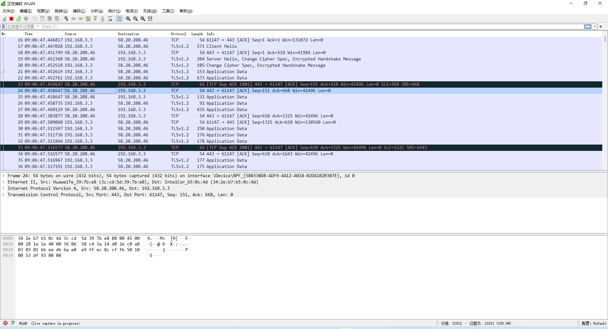

# Wireshark 初步使用

Wireshark 是世界重要网络协议分析器，它让您在微观级别看到网络上发生了什么，可以有效的帮助我们来学习网络协议或者定位一些网络上的问题。

## Windows 上安装 Wireshark

官网地址：[Wireshark](https://www.wireshark.org)

## 初步使用

安装好 Wireshark 后，启动 Wireshark，会出现网卡选择界面，这里根据本地网络的使用情况来选择，选择后 Wireshark 就会去捕获经过这个网卡的协议包，比如这里选择 WLAN。

### Wireshark 操作界面

选择网卡，开始捕获包后，就会进入以下界面。

这个界面是我们使用 Wireshark 分析网络协议的主要界面，从上到下依次为：

- 头部：显示正在捕获的网卡名称，如：正在捕获 WLAN；
- 菜单栏：包括文件、编辑、视图等选项，用来控制和设置 Wireshark 的一些行为；
- 工具栏：用来控制捕获分组这一行为，比如停止捕获、开始捕获等，和菜单栏的部分选项功能相同，相当于这些选项的快捷按钮；
- 过滤器输入框：使用过滤规则来过滤我们想要查看的协议包，比如我们输入 http（协议名，小写），下面的列表区就只会显示协议类型为 http 的数据包；
- 分组列表：显示捕获到的数据包，每个数据包包含编号，时间戳，源地址，目标地址，协议，长度，以及数据包信息；
  - 时间戳表示包的捕获时间，有多种显示格式，具体在菜单栏的**视图 -> 时间显示格式**里面调整，默认为据开始捕获经过的时间（单位，秒）。

- 分组详情：在分组列表选择指定的分组后，就会出现分组详情，展示这个分组的详细信息；
  - Frame：物理层的数据帧概况；
  - Ethernet II：数据链路层以太网帧头部信息；
  - Internet Protocol Version 4：IP 协议头部信息；
  - Transmission Control Protocol：TCP 协议头部信息；
  - ...... 其他协议，如 Hypertext Transfer Protocol，HTTP 协议信息。
- 分组字节流：在分组详情中选择某个协议后，就会在分组字节流对话框中展示分组的原始字节数据；
- 尾部：显示捕获分组的一些概况，比如已捕获到的分组数量。

### 显示过滤器

从上面界面可以看出，分组列表中展示了诸多分组，有时我们需要定位到我们关心的分组，这时候我们可以在过滤器输入过滤表达式进行过滤，详细的过滤器和过滤表达式在菜单栏的**分析 -> 显示过滤器和显示过滤规则**里面查看和设置。我们可以在过滤器输入框里输入过滤器表达式，在分组列表里过滤展示我们关心的分组。

常用显示过滤器语法如下：

- 比较运算符：`==`，`!=`，`>`，`>=`，`<`，`<=`，和编程语言中比较运算符类似，用来设置分组过滤条件的值的范围；
- 逻辑运算符：`&&`，`||`，`!`，和编程语言中的关系运算符类似，用来组合多个分组过滤条件；
- 协议过滤：协议名，要小写，过滤出指定协议类型的分组；
- IP 过滤：根据 IP 协议的内容进行过滤；
  - `ip.addr == 192.0.2.1`：过滤出源地址或目的地址为 `192.0.2.1` 的分组列表；
  - `ip.src == 192.0.2.1`：过滤出源地址为 `192.0.2.1` 的分组列表；
  - `ip.dst==192.0.2.1`：过滤出目的地址为 `192.0.2.1` 的分组列表；
- TCP 端口过滤：根据 TCP 协议的内容进行过滤；
  - `tcp.port == 80`：过滤出源主机或者目的主机端口为 80 的分组列表；
  - `tcp.srcport == 80`：过滤出源主机端口为 80 的分组列表；
  - `tcp.dstport == 80`：过滤出源目的主机端口为 80 的分组列表；
- HTTP 过滤：使用 HTTP 协议的内容进行过滤，如过滤出 GET 类型的 HTTP 请求，` http.request.method == "GET"`；
- 分组内容过滤：使用分组内容中的关键字进行过滤，如 `data contains "hello"`，过滤出 data 数据包中包含 "hello" 内容的数据流。

## 总结

### 参考链接

- [Wireshark抓包新手使用教程 - 锅边糊 - 博客园 (cnblogs.com)](https://www.cnblogs.com/linyfeng/p/9496126.html)