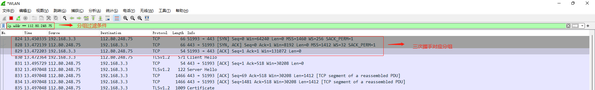
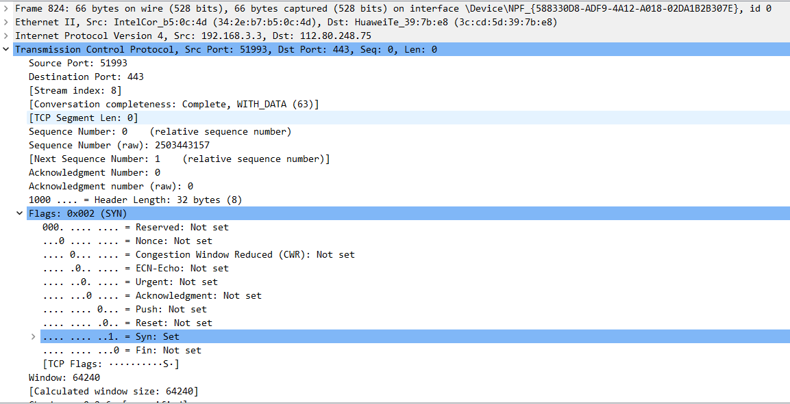
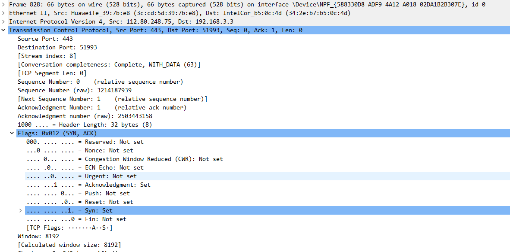
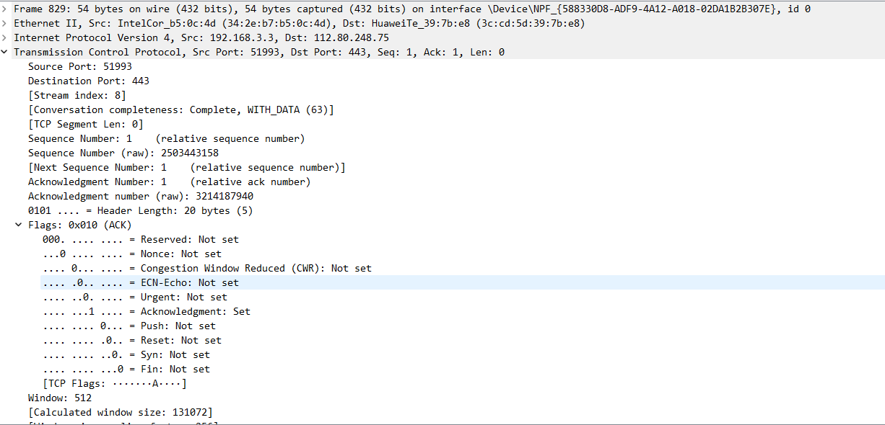

# 使用 Wireshark 观察 TCP 三次握手

Wireshark 是一个强大的网络协议分析器，我们可以使用它来查看 TCP 在建立连接的三次握手的详细信息。

## 抓取 TCP 三次握手分组

这里假设你已经安装了 Wireshark，捕获分组的操作如下：

1. 打开 Wireshark，选择合适的网卡进入捕获界面；
2. 使用浏览器访问你想访问的网址，如 www.baidu.com；
3. `ping www.baidu.com`，这一步是为了获取访问网站的 IP 地址，好用来作为下一步使用的分组过滤的条件；
4. 在 Wireshark 过滤器中输入 `ip.addr == 上一步获取到的 IP`，过滤出我们需要查看的分组（一般前三个分组就是对应 TCP 的三次握手）。

经过上述步骤，捕获到的分组如下所示：

## 分析分组

分析上述捕获到的分组。

### 第一次握手

第一次握手客户端会向服务端发送一个 SYN 包，对应上图分组列表的第一行，其分组详情如下所示：

我们可以在分组详情里看到一些关键信息：

- 源端口和目标端口，即上述的 Source Port 和 Destination Port，分别为 51993 和 443；
- 相对序列号和原始序列号，即上述的 Sequence Number 和 Sequence Number (raw)；
  - 这里的相对序列号为 0，表示客户端还没有发送数据；
  - 这里的原始序列号为 2503443157，表示客户端为这个连接请求设定随机数 A 作为序列号；

- 相对确认号和原始确认号，即上述的 Acknowledgment Number 和 Acknowledgment Number (raw)；
  - 这里的相对确认号为 0，表示还没有接收到来自服务端的数据；
  - 这里的原始确认号为 0，也表示客户端还没有接收到数据。
- TCP 标识，这里只有 SYN 有 Set（`SYN=1`），表示这是一个 SYN 包，用来请求建立连接。

### 第二次握手

第二次握手服务端会向客户端发送一个 SYN/ACK 包，其分组详情如下所示：

从上述分组详情我们可以得到以下信息：

- 源端口和目标端口，即上述的 Source Port 和 Destination Port，分别为 443 和 51993；
- 相对序列号和原始序列号，即上述的 Sequence Number 和 Sequence Number (raw)；
  - 这里的相对序列号为 0，表示服务端还没有发送数据；
  - 这里的原始序列号为 3214187939，表示服务端为这个连接请求设定随机数 B 作为序列号；

- 相对确认号和原始确认号，即上述的 Acknowledgment Number 和 Acknowledgment Number (raw)；
  - 这里的相对确认号为 1，表示服务端当前接受到数据字节数，虽然客户端没有发送任何有效数据，确认号还是被加 1，但并不会计算有效数据长度中；
  - 这里原始序列号为 2503443158，即为第一次握手生成的随机序列 `A + 1`，表示服务端期望客户端发送的下个数据从 `A + 1` 开始；

- 这里的 TCP 标识为 SYN 和 ACK（`SYN=1, ACK=1`），表示服务端接受了来自客户端的连接请求，但需要客户端在发送一个应答包。

### 第三次握手

第三次握手，客户端会向服务端发送一个 ACK 包，分组详情如下所示：

从上述分组详情我们可以看到以下信息：

- 源端口和目标端口，即上述的 Source Port 和 Destination Port，分别为 51993 和 443；

- 相对序列号和原始序列号，即上述的 Sequence Number 和 Sequence Number (raw)；
  - 这里的相对序列号为 1，表示客户端已经发送 1 个数据（虽然客户还没有发送过有效数据）；
  - 这里的原始序列号为 2503443158，表示客户端发送数据的起始序列号，和第二次握手服务端的原始确认号相等；
- 相对确认号和原始确认号，即上述的 Acknowledgment Number 和 Acknowledgment Number (raw)；
  - 这里的相对确认号为 1，表示客户端成功接收的数据字节数，虽然服务端没有发送任何有效数据，确认号还是被加 1，但并不会对有效数据的计数产生影响；
  - 这里的原始确认号为 3214187940，即为第二次握手服务端产生的随机序列号 `B + 1`，表示客户端期望服务端发送的数据从 `B + 1` 开始；
- TCP 标识，这里只有 ACK 有 Set（`ACK=1`），表示这是一个 ACK 包，用来确认连接请求。

## 总结

这里使用 Wireshark 捕获 TCP 分组，并且展示了 TCP 三次分组的分组详情，比较直观的看到了 TCP 三次握手的过程。

### 参考链接

- [Wireshark抓包新手使用教程 - 锅边糊 - 博客园 (cnblogs.com)](https://www.cnblogs.com/linyfeng/p/9496126.html)