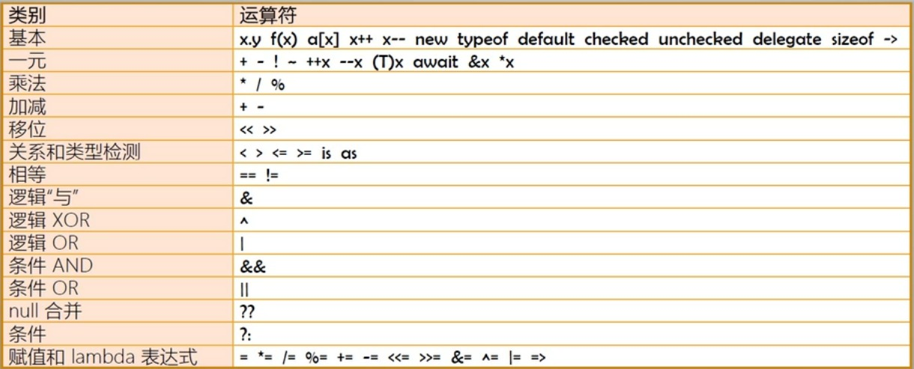

# 操作符

操作符用来操作数据，被操作符操作的数据叫做操作数（Operand）。



操作符优先级：

从上往下优先级降低。

同级运算符大多数都是从左往右，但赋值相关操作符是从右往左。

## 操作符的本质

可以说，操作符就是固定操作类型相关联的一套基本算法的简记法。

## 基本操作符

### 属性访问操作符

x.y

### 方法调用操作符

f(x)

### 集合元素访问操作符

a[x]

```c#
// 数组
int[] arr1 = new int[1];
int[] arr2 = new int[]{1, 2, 3};
int[] arr3 = {1, 2, 3};
int a = arr1[0];

// 字典
Dictionary<string, int> dic = new Dictionary<string, int>();
dic.Add("a", 1);
dic.Add("b", 2);

Console.WriteLine(dic["a"]);
```


### 递增/递减操作符

++/--


### 对象实例创建操作符

new

```c#
// 隐式类型变量 var，一旦确定不能更改
var x = 100;
x = "100";  // oops


// 匿名类型初始化
var obj = new {Name = "A", Age = 34};
Console.WriteLine(obj.Name);
Console.WriteLine(obj.GetType().Name); // <>f_AnonymousType0'2
```

```c#
class Student
{
    public void Report
    {
        Console.WriteLine("I'm a student.");
    }
}

Class CsStudent: Student
{
    // 子类隐藏父类方法
    new public void Report
    {
        Console.WriteLine("I'm a CS student.");
    }
}
```


### 查看类型的内部结构

typeof

```c#
Type t = typeof(int);
Console.WriteLine(t.NameSpace);
```


### 获取类型默认值

default

```c#
int x = default(int); // 0 结构体类型
Form myForm = default(Form); // null 引用类型
Level l = default(Level); // 默认值为 0 的枚举，如果没有就为 0

enum Level
{
    Low = 1,
    Mid = 0,
    High = 2
}
```


### 检查值在内存中是否溢出

checked、unchecked

```c#
uint x = uint.MaxValue; // uint 32 位无符号整数
uint z = checked(x + 1); // 0，溢出了
uint y = checked(x + 1); // 运行会抛出运行时异常（OverflowException），结合 try-catch

// 上下文语句块
checked
{
    
}
```


### 声明匿名方法

delegate（被 Lambda 表达式取代）

```c#
this.Button.Click += delegate(object sender, RouteEventArgs e)
{
    this.Buttion.Text = "Hello World!";
}

this.Button.Click = (sender, e) =>
{
    this.Buttion.Text = "Hello World!";
}
```


### 获取结构体类型实例占用的字节数

sizeof

可以获取自定义结果体的字节数，但需要放到**非安全的上下文环境**中。

```c#
int x = sizeof(decimal);

unsafe
{
    int x = sizeof(Student);
}

struct Student
{
    int ID;
    long Score;
}
```


### 指针访问

->（只能操作结构体类型，不能操作引用类型）

```c#
namespace UnsafeExample
{
    internal class Program
    {
        static void Main(string[] args)
        {
            unsafe
            {
                Student stu;
                stu.ID = 10;
                stu.Score = 60;
                Student* sptr = &stu;

                sptr->Score = 100;
                (*sptr).ID = 1;
                Console.WriteLine(stu.ID);
                Console.WriteLine(stu.Score);
            }
        }
    }

    struct Student
    {
        public int ID;
        public long Score ;
    }
}

```


## 一元操作符

操作数个数为 1。


### 取地址和取引用

取地址符号（&x）和取引用符号（*x），非安全上下文：

```c#
unsafe
{
    Student stu;
    stu.ID = 1;
    stu.Score = 99;
    
    Student* pStu = &stu;
    //pStu->Score = 100;
    (*pStu).Score = 100;
    Console.WriteLine(stu.Score);
}
```


### 按位取反（按位取反再加 1）

```c#
int x = 12345678;
int y = ~x;

string xStr = Convert.ToString(x, 2).PadLeft(32, "0");
string yStr = Convert.ToString(y, 2).PadLeft(32, "0");
```


### 类型转换

隐式类型转换

- 不丢失精度的类型转换，比如 int -> long；

- 子类向父类转换；

- 装箱

  ```c#
  int x = 100;
  
  // 装箱（栈到堆）
  object y = x;
  // 拆箱（堆到栈）
  int z = (int)y;
  ```

  


显示类型转换

- 有可能丢失进度的转换，即 cast；

- 拆箱；

  ```c#
  int x = 100;
  
  // 装箱（栈到堆）
  object y = x;
  // 拆箱（堆到栈）
  int z = (int)y;
  ```

- 使用 Convert 类；

  ```c#
  namespace ConversionExample
  {
      internal class Program
      {
          static void Main(string[] args)
          {
              string str1 = Console.ReadLine();
              string str2 = Console.ReadLine();
  
              int x = Convert.ToInt32(str1); 
              int y = Convert.ToInt32(str2);
  
              Console.WriteLine(x + y);
          }
      }
  }
  ```

- ToString 方法与各项数据类型的 Parse/TryParse 方法。

自定义类型转换


显示类型转换

```c#
namespace ConversionExample
{
    internal class Program
    {
        static void Main(string[] args)
        {
            Stone s = new Stone();
            s.Age = 5000;

            Monkey wukong = (Monkey)s;
            Console.WriteLine(wukong.Age);
        }
    }

    class Stone
    {
        public int Age;

        public static explicit operator Monkey(Stone stone)
        {
            Monkey m = new Monkey();
            m.Age = stone.Age / 500;
            return m;
        }
    }

    class Monkey
    {
        public int Age;
    }
}
```

隐式类型转换

```c#
namespace ConversionExample
{
    internal class Program
    {
        static void Main(string[] args)
        {
            Stone s = new Stone();
            s.Age = 5000;

            Monkey wukong = s;
            Console.WriteLine(wukong.Age);
        }
    }

    class Stone
    {
        public int Age;

        public static implicit operator Monkey(Stone stone)
        {
            Monkey m = new Monkey();
            m.Age = stone.Age / 500;
            return m;
        }
    }

    class Monkey
    {
        public int Age;
    }
}
```


### 关系和类型检测

```c#
// 检测实例类型
Teacher t = new Teacher();
var x = t is Teacher; // True

Teacher t = null;
var x = t is Teacher; // False
```


```c#
object o = new Teacher();

Teacher t = o as Teacher;
if (t != null) {
    t.Teach();
}

if (o is Teacher) {
    Teacher t = (Teacher) o;
    o.Teach();
}
```

### null 合并操作符

```c#
int x;
x = null; // 编译报错

Nullable<int> x = null;
x = 100;

int? x = null;
x = 100;

int? x = null;
int y =x ?? 1; 
```


