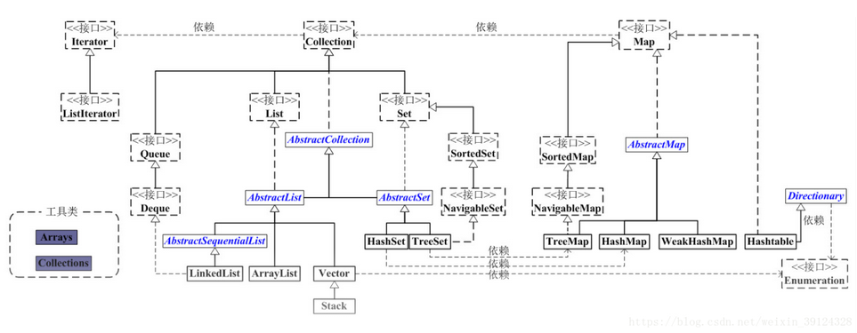
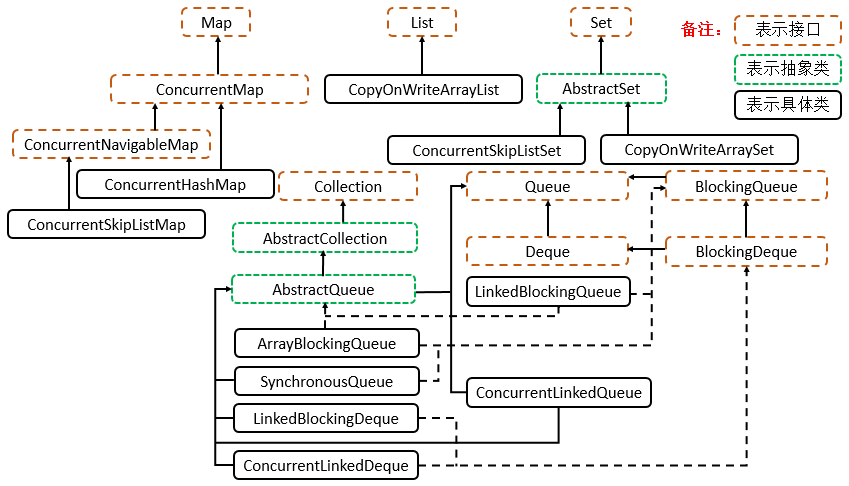
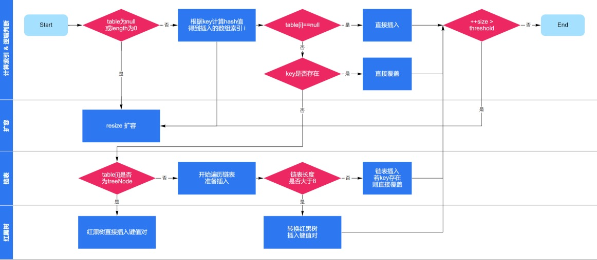

# Java 集合类

Java 的集合类可以分成两个大类，一个是  `Collection` 接口，主要用于存放单一元素；另一个是`Map` 接口，主要用于存放键值对。

对于`Collection` 接口，下面又有三个主要的子接口：`List`、`Set` 和  `Queue`。`Set` 表示无序的，元素不可重复的集合，`List` 代表有序的，元素可以重复的集合，`Queue` 代表先入先出的队列。

整体的类图如下所示：



## 集合与线程安全

`java.util` 包下的集合类大部分是线程不安全的，比如我们长使用的 `HashMap`、`ArrayList`、`HashSet` 等。虽然不是线程安全的，但是它性能好。如果需要使用线程安全的集合，可以使用 `Collections` 工具类提供哦的 `synchronizedXxx()` 方法，将这些集合包装成线程安全的集合。比如：

```java
public static void main(String[] args) {
    List<String> list = new ArrayList<>();
    List<String> syncList = Collections.synchronizedList(list);
}
```

`java.util` 包下也有线程安全的集合类，例如 `Vector`、`HashTable`，但是因为性能较差，现在很少使用。所以即便是需要使用线程安全的集合类，也建议将线程不安全的集合类包装成现在安全的集合类方式，而不是直接使用这些古老的 API。

从 Java 5 开始，`java.util.concurrent` 包下提供了大量的支持高并发访问的集合类，它们既能有着良好的访问性能，同时也是线程安全的。它们的特征如下：

- 以 `Concurrent` 开头的集合类：

  以 `Concurrent` 开头的集合类代表了支持并发访问的集合，它们可以支持多个线程并发写入访问，这些写入操作都是线程安全的，但读取操作不必锁定。以 `Concurrent` 开头的集合类采用了更加复杂的策略来保证不会锁住整个集合，因此并发写入时具有好的性能。

- 以 `CopyOnWrite` 开头的集合：

  以 `CopyOnWrite` 开头的集合采用写时复制的策略。当线程对此类集合执行读取操作时，线程将会读取集合本身，无序加锁和阻塞。当线程对此类集合执行写操作时，集合会在底层复制一份新的数据，接下来对新的数据执行写入操作，由于对集合的写入操作都是对副本的操作，所以它是线程安全的。副本写入完成后，再原子地替换旧的数据。



## `ArrayList` 和 `LinkedList`

`ArrayList` 和 `LinkedList` 代表了计算机底层两大基本数据结构数组和链表。具体来讲，`ArrayList` 通过对象数组来存放数据，`LinkedList` 则通过双向链表来存放数据。

`ArrayList` 采用数组存储，所以插入和删除元素的时间复杂度受元素位置的影响。 比如：执行`add(E e)`方法的时候， `ArrayList` 会默认在将指定的元素追加到此列表的末尾，这种情况时间复杂度就是 `O(1)`。但是如果要在指定位置 i 插入和删除元素的话（`add(int index, E element)`）时间复杂度就为 `O(n)`。因为需要移动数据。

`LinkedList` 采用链表存储，所以，如果是在头尾插入或者删除元素不受元素位置的影响（`add(E e)`、`addFirst(E e)`、`addLast(E e)`、`removeFirst()` 、 `removeLast()`），时间复杂度为 `O(1)`，如果是要在指定位置 `i` 插入和删除元素的话（`add(int index, E element)`，`remove(Object o)`）， 时间复杂度为 `O(n)` ，因为需要先移动到指定位置再插入。

`LinkedList` 采用链表存储，所以，如果是在头尾插入或者删除元素不受元素位置的影响（`add(E e)`、`addFirst(E e)`、`addLast(E e)`、`removeFirst()` 、 `removeLast()`），时间复杂度为 `O(1)`，如果是要在指定位置 `i` 插入和删除元素的话（`add(int index, E element)`，`remove(Object o)`），时间复杂度为 `O(n)` ，因为需要先移动到指定位置再插入。

### `ArrayList` 的扩容机制

以下代码来自为 JDK 11。

主动扩容，程序发现列表快满了时，主动调用该方法进行扩容：

```java
public void ensureCapacity(int minCapacity) {
    if (minCapacity > elementData.length
        && !(elementData == DEFAULTCAPACITY_EMPTY_ELEMENTDATA
             && minCapacity <= DEFAULT_CAPACITY)) {
        modCount++;
        grow(minCapacity);
    }
}
```

自动扩容，添加元素时发现存放数据的数组已经满了时（`size == elementData.length`），自动扩容，扩容为原来的 1.5 倍，代码如下：

```java
public boolean add(E e) {
    modCount++;
    add(e, elementData, size);
    return true;
}

private void add(E e, Object[] elementData, int s) {
    if (s == elementData.length)
        elementData = grow();
    elementData[s] = e;
    size = s + 1;
}

private Object[] grow() {
    return grow(size + 1);
}

private Object[] grow(int minCapacity) {
    return elementData = Arrays.copyOf(elementData,
                                       newCapacity(minCapacity));
}

// 获取新的数组容量，为原来同类的 1.5 倍
private int newCapacity(int minCapacity) {
    // overflow-conscious code
    int oldCapacity = elementData.length;
    int newCapacity = oldCapacity + (oldCapacity >> 1);
    if (newCapacity - minCapacity <= 0) {
        if (elementData == DEFAULTCAPACITY_EMPTY_ELEMENTDATA)
            return Math.max(DEFAULT_CAPACITY, minCapacity);
        if (minCapacity < 0) // overflow
            throw new OutOfMemoryError();
        return minCapacity;
    }
    return (newCapacity - MAX_ARRAY_SIZE <= 0)
        ? newCapacity
        : hugeCapacity(minCapacity);
}
```

## Set

Set 具有无序不重复的特性，常用来去重。

- `HashSet`、`LinkedHashSet` 和 `TreeSet` 都是 `Set` 接口的实现类，都能保证元素唯一，并且都不是线程安全的。
- `HashSet`、`LinkedHashSet` 和 `TreeSet` 的主要区别在于底层数据结构不同。`HashSet` 的底层数据结构是哈希表（基于 `HashMap` 实现）。`LinkedHashSet` 的底层数据结构是链表和哈希表，元素的插入和取出顺序满足 FIFO。`TreeSet` 底层数据结构是红黑树，元素是有序的，排序的方式有自然排序和定制排序。
- 底层数据结构不同又导致这三者的应用场景不同。`HashSet` 用于不需要保证元素插入和取出顺序的场景，`LinkedHashSet` 用于保证元素的插入和取出顺序满足 FIFO 的场景，`TreeSet` 用于支持对元素自定义排序规则的场景。

##  Queue

Queue 操作接口可以按照**操作失败**是否抛出异常分成两大类：

| `Queue` 接口 | 抛出异常  | 返回特殊值 |
| ------------ | --------- | ---------- |
| 插入队尾     | add(E e)  | offer(E e) |
| 删除队首     | remove()  | poll()     |
| 查询队首元素 | element() | peek()     |

`Deque` 是双端队列，在队列的两端均可以插入或删除元素，可以当做栈来使用（只在一端操作即可）。

| `Deque` 接口 | 抛出异常      | 返回特殊值      |
| ------------ | ------------- | --------------- |
| 插入队首     | addFirst(E e) | offerFirst(E e) |
| 插入队尾     | addLast(E e)  | offerLast(E e)  |
| 删除队首     | removeFirst() | pollFirst()     |
| 删除队尾     | removeLast()  | pollLast()      |
| 查询队首元素 | getFirst()    | peekFirst()     |
| 查询队尾元素 | getLast()     | peekLast()      |

`LinkedList`  实现了 `Deque` 接口，因此其可以当做双端队列使用。

### `PriorityQueue`

优先级队列，即堆结构，默认小根堆。

- `PriorityQueue` 利用了二叉堆的数据结构来实现的，底层使用可变长的数组来存储数据。
- `PriorityQueue` 通过堆元素的上浮和下沉，实现了在 `O(logN)` 的时间复杂度内插入元素和删除堆顶元素。

## Map

Map 是广义 Java 集合框架中的另外一部分，`HashMap` 作为框架中使用频率最高的类型之一。`Hashtable`、`HashMap`、`TreeMap` 都是最常见的一些 Map 实现，是以键值对的形式存储和操作数据的容器类型。

### `HashTable`、`HashMap`、`LinkedHashMap`、`TreeMap` 区别

- `Hashtable` 是早期 Java 类库提供的一个哈希表实现，本身是同步的，不支持 null 键和 null 值。由于同步导致的性能开销，所以已经很少被推荐使用。
- `HashMap` 是应用更加广泛的哈希表实现，行为上大致上与 `HashTable` 一致，主要区别在于 `HashMap` 不是同步的。通常情况下，`HashMap` 进行 put 或者 get 操作，可以达到常数时间的性能，所以它是绝大部分利用键值对存取场景的首选。`HashMap` 支持 null 键和 null 值。
- `LinkedHashMap` 做到了顺序性，其通过内部维护一个运行于所有条目的双向链表保证了遍历时遍历顺序和元素插入属性相同，而 `HashMap` 做不到这一点，其遍历顺序和插入由哈希函数的哈希值决定，和插入顺序不同。`LinkedHashMap` 支持 null 键和 null 值。`LinkedHashMap` 可以用来实现 `LRU` 算法。
- `TreeMap` 则是基于红黑树实现的有序表结构。和 `HashMap` 不同，它的 get、put、remove 之类操作都是 `O(logN)` 的时间复杂度，具体顺序可以由指定的 `Comparator` 来决定，或者根据键的自然顺序来判断。此外 `TreeMap` 作为有序表，还提供了 `ceilingKey`（大于最小）、`floorKey`（小于最大）、`firstKey`、`lastKey` 等快速检索 key 的方法。`TreeMap` 的 value 可以为 null，其 key 需要用来作为比较器的入参，不能为 null。

### `HashMap`  

### HashMap 内部的结构

HashMap 的内部结构可以看作是桶加链表（树）的复合结构，如下图所示：


数组被分为一个个桶（bucket），通过哈希值决定了键值对在这个数组的寻址；哈希值相同的键值对（哈希冲突），则以链表形式存储，这里需要注意的是，如果链表大小超过阈值（`TREEIFY_THRESHOLD`, 8），图中的链表就会被改造为树形结构。

### put

`HashMap` 中的 put 方法如下所示：

```java
public V put(K key, V value) {
    return putVal(hash(key), key, value, false, true);
}
```

```java
final V putVal(int hash, K key, V value, boolean onlyIfAbsent,
               boolean evict) {
    Node<K,V>[] tab; Node<K,V> p; int n, i;
    if ((tab = table) == null || (n = tab.length) == 0)
        n = (tab = resize()).length;
    if ((p = tab[i = (n - 1) & hash]) == null)
        tab[i] = newNode(hash, key, value, null);
    else {
        Node<K,V> e; K k;
        if (p.hash == hash &&
            ((k = p.key) == key || (key != null && key.equals(k))))
            e = p;
        else if (p instanceof TreeNode)
            e = ((TreeNode<K,V>)p).putTreeVal(this, tab, hash, key, value);
        else {
            for (int binCount = 0; ; ++binCount) {
                if ((e = p.next) == null) {
                    p.next = newNode(hash, key, value, null);
                    if (binCount >= TREEIFY_THRESHOLD - 1) // -1 for 1st
                        treeifyBin(tab, hash);
                    break;
                }
                if (e.hash == hash &&
                    ((k = e.key) == key || (key != null && key.equals(k))))
                    break;
                p = e;
            }
        }
        if (e != null) { // existing mapping for key
            V oldValue = e.value;
            if (!onlyIfAbsent || oldValue == null)
                e.value = value;
            afterNodeAccess(e);
            return oldValue;
        }
    }
    ++modCount;
    if (++size > threshold)
        resize();
    afterNodeInsertion(evict);
    return null;
}
```



从上述代码我们可以看出：

- 在放置元素前，需要计算 key 的 hash，计算的方法会在下面提到；

- **`HashMap` 的桶是延迟初始化的**，在放置元素时，如果桶为 null，则会调用 `resize()` 方法进行初始化，除此之外，`resize()` 方法还负责给桶扩容，扩容条件是：

  ```java
  if (++size > threshold)
      resize();
  ```

  即，当 `Map` 中元素个数大于桶的 threshold 时就会扩容，扩容的方法我们会在下面提及；

- 当 bin 的数量（链表的长度）大于 `TREEIFY_THRESHOLD`（默认为 8）时，就会产生树化改造，改造的代码会在下面提及。

### 计算下标

在防止元素到通之前，会先计算 key 在数组下标的位置，在 `HashMap` 中，其计算 hash 值的方法如下所示：

```java
static final int hash(Object key) {
    int h;
    return (key == null) ? 0 : (h = key.hashCode()) ^ (h >>> 16);
}
```

```java
i = (n - 1) & hash
```

计算下标的方法可以总结为以下几个步骤：

1. 获得对象（key）的 `hashCode`（用 int 存储，32 位）；

2. `hashCode` 无符号左移 16 位得 h ；

3. 将原 `hashCode` 和上一步计算的 h 按为异或得 hash；

4. 将 capacity 减一按位于 hash 得该 key 在桶中的下标。

> 注：步骤 2 和 3 其实是将 key 的原 hashCode 的高 16 位不变，低 16 位和高 16 位进行异或运算，如下图所示：
>
> 为什么这里需要将高位数据移位到低位进行异或运算呢？
>
> 这种方式能避免只取低位进行计算的结果，通常我们的 n 都不会很大，如果直接拿 `hashCode` 和 n 做按位与运算，其实高位的 `hashCode` 的值是没有参与进来的，这样将自己的高位与低于异或，其实是混合了高低位，变相了保留了高位的信息，以此来加大低位的随机性，减少 hash 冲突。

**计算下标有个优化，高位右移和低位异或，让高位参与进 `hashCode` 的计算，增大随机性，使得计算的下标分布更加均匀，减少哈希冲突**。

### resize

当元素个数大于桶容量（默认 16） * 负载因子（默认 0.75）时，会进行扩容。

resize 方法的部分代码如下所示：

```java
final Node<K,V>[] resize() {
    Node<K,V>[] oldTab = table;
    int oldCap = (oldTab == null) ? 0 : oldTab.length;
    int oldThr = threshold;
    int newCap, newThr = 0;
    if (oldCap > 0) {
        if (oldCap >= MAXIMUM_CAPACITY) {
            threshold = Integer.MAX_VALUE;
            return oldTab;
        }
        else if ((newCap = oldCap << 1) < MAXIMUM_CAPACITY &&
                 oldCap >= DEFAULT_INITIAL_CAPACITY)
            newThr = oldThr << 1; // double threshold
    }
    else if (oldThr > 0) // initial capacity was placed in threshold
        newCap = oldThr;
    else {               // zero initial threshold signifies using defaults
        newCap = DEFAULT_INITIAL_CAPACITY;
        newThr = (int)(DEFAULT_LOAD_FACTOR * DEFAULT_INITIAL_CAPACITY);
    }
    if (newThr == 0) {
        float ft = (float)newCap * loadFactor;
        newThr = (newCap < MAXIMUM_CAPACITY && ft < (float)MAXIMUM_CAPACITY ?
                  (int)ft : Integer.MAX_VALUE);
    }
    threshold = newThr;
    @SuppressWarnings({"rawtypes","unchecked"})
    Node<K,V>[] newTab = (Node<K,V>[])new Node[newCap];
    table = newTab;
	// 将老的数组中的元素重新放置到新的数组
    // ...
    return newTab;
}
```

依据 resize 源码，我们可以归纳为：

- threshold 等于负载因子（默认为 0.75）乘容量（桶的大小，总是 2 的整数幂），如果构建 `HashMap` 的时候没有指定它们，那么就是依据相应的默认值；

- threshold  通常是以倍数进行调整 （`newThr = oldThr << 1`），这个和容量扩容是一致的；

- 扩容后，需要将老的数组中的元素重新放置到新的数组，这是扩容的一个主要开销来源。

  > 扩容是 `HashMap` 开销的主要来源，因为需要将已将防止好的元素，全部重新计算 hash，再重新放置到扩容后的数组，当元素个数比较多时，这个过程时比较耗时的。
  >
  > 但是这里有个优化的地方，就是每次容量是以 2 为倍数进行扩容的，这意味这在重新计算 hash 值的时候，**元素的位置要么还在以前的位置，要么就是原来的位置加上上次桶的容量，这取决于新增的位是 0 还是 1**，使用位运算代替了取模运算，提高效率，如：
  >
  > ```
  > n - 1   0000 0000 0000 0000 0000 0000 0000 1111           0000 0000 0000 0000 0000 0000 0001 1111
  > hash    1111 1111 1111 1111 0000 1111 0000 0101    -->    1111 1111 1111 1111 0000 1111 0000 0101
  > hash    1111 1111 1111 1111 0000 1111 0001 0101           1111 1111 1111 1111 0000 1111 0001 0101 
  > ```

## fail-fast

在用迭代器遍历一个集合对象时，如果遍历过程中对集合对象的内容进行了修改（增加、删除、修改），则会抛出 `ConcurrentModificationException`。如下：

```java
public class FailFastExample {

    public static void main(String[] args) {
        List<String> list = new ArrayList<>();
        list.add("A");
        list.add("B");
        list.add("C");
        for (String s : list) {
            // list.add("D");
            list.remove(s);
        }
    }
}
```

具体原理是，在容器内部维护了一个  `modCount` 变量，具体在 AbstractList 中，如下所示：

```java
public abstract class AbstractList<E> extends AbstractCollection<E> implements List<E> {

    protected AbstractList() {}
    
    protected transient int modCount = 0;
    
    public E next() {
        checkForComodification();
        try {
            int i = cursor;
            E next = get(i);
            lastRet = i;
            cursor = i + 1;
            return next;
        } catch (IndexOutOfBoundsException e) {
            checkForComodification();
            throw new NoSuchElementException();
        }
    }
    
    final void checkForComodification() {
        if (modCount != expectedModCount)
            throw new ConcurrentModificationException();
    }
    
    public void set(E e) {
        if (lastRet < 0)
            throw new IllegalStateException();
        checkForComodification();

        try {
            ArrayList.this.set(lastRet, e);
        } catch (IndexOutOfBoundsException ex) {
            throw new ConcurrentModificationException();
        }
    }

    public void add(E e) {
        checkForComodification();

        try {
            int i = cursor;
            ArrayList.this.add(i, e);
            cursor = i + 1;
            lastRet = -1;
            expectedModCount = modCount;
        } catch (IndexOutOfBoundsException ex) {
            throw new ConcurrentModificationException();
        }
    }
}
```

每当我们调用修改列表的方法时，`modCount` 就会执行加一操作，并且在迭代器（`Itr`，是 `AbstractList` 的一个内部类）内部维护了一个 `expectedModCount` 变量，初始值和当前的 `modCount` 值一致，代码如下所示：

```java
 private class Itr implements Iterator<E> {
     int expectedModCount = modCount;
 }
```

如果我们在使用迭代器遍历列表的过程中，调用了列表的修改方法，会导致 `modCount` 的值执行了加一操作，但 Itr 里的 `expectedModCount` 不会改变，这样遍历途（调用上述代码的 next 方法）中通过调用 `checkForComodification` 方法就会抛出异常。

fail-fast 是一种让错误今早暴露初来的思想，以避免后续不可预计的行为，Java 中的集合都符合迭代时 fail-fast 行为。

此外列表的迭代器还为我们提供了 remove 和 add 方法，调用此方法时会在修改增加或删除元素时刷新  `expectedModCount` 的值，这样在迭代时就不会抛出 `ConcurrentModificationException`异常，如：

```java
public class FailFastExample {

    public static void main(String[] args) {
        List<String> list = new ArrayList<>();
        list.add("A");
        list.add("B");
        list.add("C");
        final Iterator<String> iterator = list.iterator();
        while (iterator.hasNext()) {
            iterator.remove();
        }
    }
}
```

