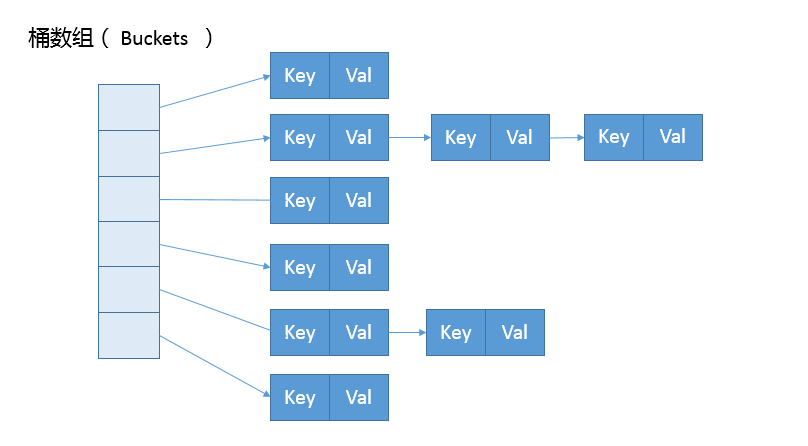
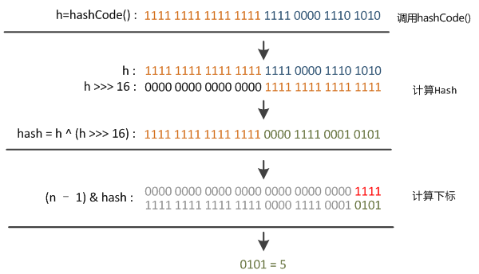

# HashTable、HashMap、LinkedHashMap、TreeMap 区别

Map 是广义 Java 集合框架中的另外一部分，`HashMap` 作为框架中使用频率最高的类型之一。`Hashtable`、`HashMap`、`TreeMap` 都是最常见的一些 Map 实现，是以键值对的形式存储和操作数据的容器类型。

- `Hashtable` 是早期 Java 类库提供的一个哈希表实现，本身是同步的，不支持 null 键和 null 值。由于同步导致的性能开销，所以已经很少被推荐使用。

- `HashMap` 是应用更加广泛的哈希表实现，行为上大致上与 `HashTable` 一致，主要区别在于 `HashMap` 不是同步的。通常情况下，`HashMap` 进行 put 或者 get 操作，可以达到常数时间的性能，所以它是绝大部分利用键值对存取场景的首选。

  `HashMap` 支持 null 键和 null 值。

- `LinkedHashMap` 做到了顺序性，其通过内部维护一个运行于所有条目的双向链表保证了遍历时遍历顺序和元素插入属性相同，而 HashMap 做不到这一点，其遍历顺序和插入由哈希函数的哈希值决定，和插入顺序不同。

  `LinkedHashMap` 支持 null 键和 null 值。

- `TreeMap` 则是基于红黑树实现的有序表结构。和 `HashMap` 不同，它的 get、put、remove 之类操作都是 `O(logN)` 的时间复杂度，具体顺序可以由指定的 `Comparator` 来决定，或者根据键的自然顺序来判断。

  `TreeMap` 的 value 可以为 null，其 key 需要用来作为比较器的入参，不能为 null。

## 基本约定

`HashMap` 的性能表现非常依赖于哈希码的有效性，请务必掌握 `hashCode` 和 `equals` 的一些基本约定，比如：

- `equals` 相等，`hashCode` 一定要相等，反之 `equals` 不等，`hashCode` 也要不等；
- 重写了 `hashCode` 也要重写 `equals`；
- `hashCode` 需要保持一致性，状态改变返回的哈希值仍然要一致；
- `equals` 性质：
  - 自反性（reflexive），对于任何非空引用 x，`x.equals(x)==true` 应恒成立；
  - 对称性（symmetric），对于两个非空引用 x 和 y，`x.euqals(y)==true` 当且仅当 `y.euqals(x)==true`；
  - 传递性（transitive），简单地讲，`x equals y` , `y equals z`，则 `x equals z` 成立；
  - 一致性（consistent），如果两个非空对象 x,y 没有发生变化，则反复调用 `x.euqals(y)` 所返回的结果应一致；
  - 对于任何非空引用 x，`x.equals(null)==false` 恒成立。

## 顺序性

`LinkedHashMap` 和 `TreeMap` 都可以保证集合里的元素是有顺序的，但这两者的顺序概念完全不同。

### LinkedHashMap 访问顺序性

`LinkedHashMap` 通常提供的是遍历顺序符合插入顺序（最早写入的排列在最前面），它的实现是通过为条键值对维护一个双向链表，来记录数据写入顺序。

其实，Java 中的 `LinkedHashMap` 不光可以记录写入的顺序，还可以记录其他访问顺序，所谓的 put、get、compute 等，都算作“访问”，要想实现这一点，我们在创建 `Map` 时需要指定 `accessOrder` 为 true，如下所示：

```java
public static void main(String[] args) {
    Map<String, String> linkedHashMap = new LinkedHashMap(3, 0.75f, true);
    linkedHashMap.put("a", "A");
    linkedHashMap.put("c", "C");
    linkedHashMap.put("b", "B");
    // {a=A, c=C, b=B}
    log.info("LinkedHashMap: {}", linkedHashMap);
    linkedHashMap.get("a");
    // {c=C, b=B, a=A}
    log.info("LinkedHashMap: {}", linkedHashMap);
}
```

这种行为适用于一些特定应用场景，例如，我们构建一个空间占用敏感的资源池，希望可以自动将最不常被访问的对象释放掉，这就可以利用 `LinkedHashMap` 提供的机制来实现，参考下面的示例：

```java
@Slf4j
public class LinkedHashMapExample {

    public static void main(String[] args) {
        LinkedHashMap<String, String> accessOrderedMap = new LinkedHashMap(16, 0.75F, true) {
            @Override
            protected boolean removeEldestEntry(Map.Entry eldest) {
                // 实现自定义删除策略，否则行为就和普遍 Map 没有区别
                return size() > 3;
            }
        };
        accessOrderedMap.put("Project1", "Valhalla");
        accessOrderedMap.put("Project2", "Panama");
        accessOrderedMap.put("Project3", "Loom");
        accessOrderedMap.forEach((k, v) -> {
            log.info(k + ":" + v);
        });
        accessOrderedMap.get("Project2");
        accessOrderedMap.get("Project2");
        accessOrderedMap.get("Project3");

        log.info("Iterate over should be not affected:");
        for (Map.Entry<String, String> entry : accessOrderedMap.entrySet()) {
            log.info(entry.getKey() + ":" + entry.getValue());
            if (Objects.equals("Project2", entry.getKey())) {
                break;
            }
        }
        accessOrderedMap.forEach((k, v) -> {
            log.info(k + ":" + v);
        });
        accessOrderedMap.put("Project4", "Mission Control");
        log.info("Oldest entry should be removed:");
        accessOrderedMap.forEach((k, v) -> {
            log.info(k + ":" + v);
        });
    }
}
```

> 注：使用迭代器遍历不会影响到 `LinkedHashMap` 这种访问顺序性。

### TreeMap 自然顺序

`TreeMap` 是 Java 中有序表的实现，有序表是指表中所有数据元素的数值以递增或递减方式有序排列，是数据元素的**数值的有序性**，而和元素存储的先后顺序无关。TreeMap 的顺序是由键的顺序关系决定的，通过 `Comparator` 或 `Comparable`（自然顺序）来决定。

## HashMap 源码

### HashMap 内部的结构

HashMap 的内部结构可以看作是桶加链表（树）的复合结构，如下图所示：



数组被分为一个个桶（bucket），通过哈希值决定了键值对在这个数组的寻址；哈希值相同的键值对（哈希冲突），则以链表形式存储，这里需要注意的是，如果链表大小超过阈值（`TREEIFY_THRESHOLD`, 8），图中的链表就会被改造为树形结构。

### put

`HashMap` 中的 put 方法如下所示：

```java
public V put(K key, V value) {
    return putVal(hash(key), key, value, false, true);
}
```

```java
final V putVal(int hash, K key, V value, boolean onlyIfAbsent,
               boolean evict) {
    Node<K,V>[] tab; Node<K,V> p; int n, i;
    if ((tab = table) == null || (n = tab.length) == 0)
        n = (tab = resize()).length;
    if ((p = tab[i = (n - 1) & hash]) == null)
        tab[i] = newNode(hash, key, value, null);
    else {
        Node<K,V> e; K k;
        if (p.hash == hash &&
            ((k = p.key) == key || (key != null && key.equals(k))))
            e = p;
        else if (p instanceof TreeNode)
            e = ((TreeNode<K,V>)p).putTreeVal(this, tab, hash, key, value);
        else {
            for (int binCount = 0; ; ++binCount) {
                if ((e = p.next) == null) {
                    p.next = newNode(hash, key, value, null);
                    if (binCount >= TREEIFY_THRESHOLD - 1) // -1 for 1st
                        treeifyBin(tab, hash);
                    break;
                }
                if (e.hash == hash &&
                    ((k = e.key) == key || (key != null && key.equals(k))))
                    break;
                p = e;
            }
        }
        if (e != null) { // existing mapping for key
            V oldValue = e.value;
            if (!onlyIfAbsent || oldValue == null)
                e.value = value;
            afterNodeAccess(e);
            return oldValue;
        }
    }
    ++modCount;
    if (++size > threshold)
        resize();
    afterNodeInsertion(evict);
    return null;
}
```

从上述代码我们可以看出：

- 在放置元素前，需要计算 key 的 hash，计算的方法会在下面提到；

- `HashMap` 的桶是延迟初始化的，在放置元素时，如果桶为 null，则会调用 `resize()` 方法进行初始化，除此之外，`resize()` 方法还负责给桶扩容，扩容条件是：

  ```java
  if (++size > threshold)
      resize();
  ```

  即，当 `Map` 中元素个数大于桶的 threshold 时就会扩容，扩容的方法我们会在下面提及；

- 当 bin 的数量（链表的长度）大于 `TREEIFY_THRESHOLD`（默认为 8）时，就会产生树化改造，改造的代码会在下面提及。

### 计算下标

在防止元素到通之前，会先计算 key 在数组下标的位置，在 HashMap 中，其计算 hash 值的方法如下所示：

```java
static final int hash(Object key) {
    int h;
    return (key == null) ? 0 : (h = key.hashCode()) ^ (h >>> 16);
}
```

```java
i = (n - 1) & hash
```

计算下标的方法可以总结为以下几个步骤：

1. 获得对象（key）的 `hashCode`（用 int 存储，32 位）；

2. `hashCode` 无符号左移 16 位得 h ；

4. 将原 `hashCode` 和上一步计算的 h 按为异或得 hash；

5. 将 capacity 减一按位于 hash 得该 key 在桶中的下标。

> 注：步骤 2 和 3 其实是将 key 的原 hashCode 的高 16 位不变，低 16 位和高 16 位进行异或运算，如下图所示：
>
> 为什么这里需要将高位数据移位到低位进行异或运算呢？
>
> 这种方式能避免只取低位进行计算的结果，通常我们的 n 都不会很大，如果直接拿 hashCode 和 n 做按位与运算，其实高位的 hashCode 的值是没有参与进来的，这样将自己的高位与低于异或，其实是混合了高低位，变相了保留了高位的信息，以此来加大低位的随机性，减少 hash 冲突。

### resize

resize 方法的部分代码如下所示：

```java
final Node<K,V>[] resize() {
    Node<K,V>[] oldTab = table;
    int oldCap = (oldTab == null) ? 0 : oldTab.length;
    int oldThr = threshold;
    int newCap, newThr = 0;
    if (oldCap > 0) {
        if (oldCap >= MAXIMUM_CAPACITY) {
            threshold = Integer.MAX_VALUE;
            return oldTab;
        }
        else if ((newCap = oldCap << 1) < MAXIMUM_CAPACITY &&
                 oldCap >= DEFAULT_INITIAL_CAPACITY)
            newThr = oldThr << 1; // double threshold
    }
    else if (oldThr > 0) // initial capacity was placed in threshold
        newCap = oldThr;
    else {               // zero initial threshold signifies using defaults
        newCap = DEFAULT_INITIAL_CAPACITY;
        newThr = (int)(DEFAULT_LOAD_FACTOR * DEFAULT_INITIAL_CAPACITY);
    }
    if (newThr == 0) {
        float ft = (float)newCap * loadFactor;
        newThr = (newCap < MAXIMUM_CAPACITY && ft < (float)MAXIMUM_CAPACITY ?
                  (int)ft : Integer.MAX_VALUE);
    }
    threshold = newThr;
    @SuppressWarnings({"rawtypes","unchecked"})
    Node<K,V>[] newTab = (Node<K,V>[])new Node[newCap];
    table = newTab;
	// 将老的数组中的元素重新放置到新的数组
    // ...
    return newTab;
}
```

依据 resize 源码，我们可以归纳为：

- threshold 等于负载因子乘容量（桶的大小，总是 2 的整数幂），如果构建 `HashMap` 的时候没有指定它们，那么就是依据相应的默认值；

- threshold  通常是以倍数进行调整 （`newThr = oldThr << 1`），这个和容量扩容是一致的；

- 扩容后，需要将老的数组中的元素重新放置到新的数组，这是扩容的一个主要开销来源。

  > 扩容是 HashMap 开销的主要来源，因为需要将已将防止好的元素，全部重新计算 hash，再重新放置到扩容后的数组，当元素个数比较多时，这个过程时比较耗时的。
  >
  > 但是这里有个优化的地方，就是每次容量是以 2 为倍数进行扩容的，这意味这在重新计算 hash 值的时候，元素的位置要么还在以前的位置，要么就是原来的位置加上上次桶的容量，这取决于新增的位是 0 还是 1，如：
  >
  > ```
  > n - 1   0000 0000 0000 0000 0000 0000 0000 1111           0000 0000 0000 0000 0000 0000 0001 1111
  > hash    1111 1111 1111 1111 0000 1111 0000 0101    -->    1111 1111 1111 1111 0000 1111 0000 0101
  > hash    1111 1111 1111 1111 0000 1111 0001 0101           1111 1111 1111 1111 0000 1111 0001 0101 
  > ```

## 总结

`HashMap` 是我们常用的集合类，其内部的数据结构可以看作是`数组+链表（红黑树）`复合结构。

`HashMap` 的原理是，放置元素时通过计算 key 的 hash 值，再将 hash 值映射到数组的指定位置，读取元素时根据 key 的 hash 值，从数组的指定位置获取元素，所以在不考虑哈希冲突的情况下（不同的 key 计算的 hash 值是一样的）我们从 `HashMap` 中读取某个 key 的时间复杂度为 `O(1)`。

当发生 hash 冲突时，冲突的元素会使用链表存储，所以在极端情况下，所有的 key 都发生了冲突，此时读取某个元素的时间复杂度就为 `O(N)`，这时候就会影响到数据的读取效率。在 JDK 8 以后，当链表长度大于某个阈值（默认为 8）时会进行树化改造，将冲突的元素改用红黑树存储，此时读取数据效率为 `O(logN)`。

`HashMap` 中并不是直接使用 key 的 `hashCode` 计算元素所在数组下标，而是通过将 `hashCode` 高 16 位不变，低 16 位和高 16 位按位异或的方式得到的值来计算下标。这样做的好处是，因为在实际计算下标的时候使用桶的容量和 hash 值按位与的方式计算的，而桶的容量往往比较小，这样一来高位的数值不会参与到计算中来，而高位和地位按位异或等于是混合了高位的信息，以此来加大低位的随机性。


和 Java 中的 list 一样，`HashMap` 也有扩容机制，但 `HashMap` 并不是在元素个数大于容量（桶的长度）是发生扩容，而是大于一个阈值的时候就会发生扩容。

这个阈值是根据容量和负载因子（默认为 0.75）计算出来的（容量 * **负载因子**），并且我们在初始化的时候可以指定容量和负载因子。负载因子对于 `HashMap` 来将是一个很重要的参数，但如果没有特别需求，不要轻易进行更改，因为 JDK 自身的默认负载因子是非常符合通用场景的需求的，果确实需要调整，建议不要设置超过 0.75 的数值，因为会显著增加冲突，降低 `HashMap` 的性能，但也不能使用太小的负载因子，如果使用太小的负载因子，按照上面的公式，预设容量值也进行调整，否则可能会导致更加频繁的扩容，增加无谓的开销，本身访问性能也会受影响。


扩容是 `HashMap` 性能消耗的主要来源，因为需要重新计算以前元素的下标，放置到扩容后的桶中。这里有个优化的地方就是，`HashMap` 每次扩容会扩大为原来容量的 2 倍，并且在初始化容量时 JDK 也会为我们调整容量为 2 的整数幂，这样做的好处因为在扩容的时候，以前的元素的下标位置要么不变，要么时加上扩容前的容量，这取决于新增的位是 0 还是 1。

以上笔记总结自极客时间《Java核心技术面试精讲》专栏：

- [第9讲 | 对比Hashtable、HashMap、TreeMap有什么不同？ (geekbang.org)](https://time.geekbang.org/column/article/8053)


