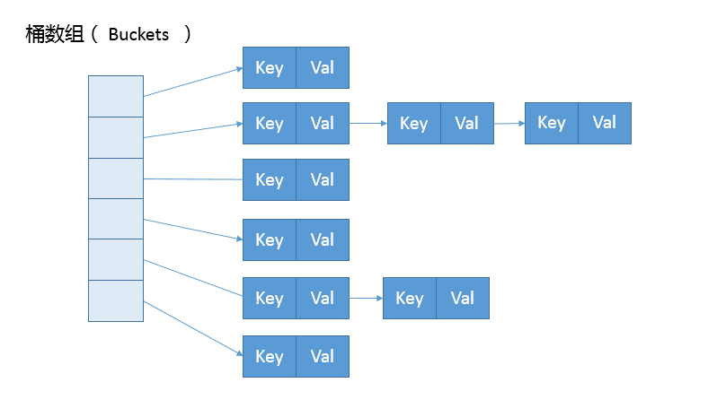
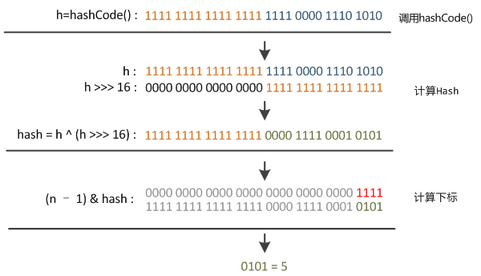

# HashTable、HashMap、TreeMap 区别

Map 是广义 Java 集合框架中的另外一部分，`HashMap` 作为框架中使用频率最高的类型之一。`Hashtable`、`HashMap`、`TreeMap` 都是最常见的一些 Map 实现，是以键值对的形式存储和操作数据的容器类型。

- `Hashtable` 是早期 Java 类库提供的一个哈希表实现，本身是同步的，不支持 null 键和 null 值，由于同步导致的性能开销，所以已经很少被推荐使用；
- `HashMap` 是应用更加广泛的哈希表实现，行为上大致上与 `HashTable` 一致，主要区别在于 `HashMap` 不是同步的，支持 null 键和 null 值等。通常情况下，`HashMap` 进行 put 或者 get 操作，可以达到常数时间的性能，所以它是绝大部分利用键值对存取场景的首选；
- `TreeMap` 则是基于红黑树的一种提供顺序访问的 `Map`，和 `HashMap` 不同，它的 get、put、remove 之类操作都是 `O(logN)` 的时间复杂度，具体顺序可以由指定的 `Comparator` 来决定，或者根据键的自然顺序来判断。

## 基本约定

`HashMap` 的性能表现非常依赖于哈希码的有效性，请务必掌握 `hashCode` 和 `equals` 的一些基本约定，比如：

- `equals` 相等，`hashCode` 一定要相等，反之 `equals` 不等，`hashCode` 也要不等；
- 重写了 `hashCode` 也要重写 `equals`；
- `hashCode` 需要保持一致性，状态改变返回的哈希值仍然要一致；
- `equals` 性质：
  - 自反性（reflexive），对于任何非空引用 x，`x.equals(x)==true` 应恒成立；
  - 对称性（symmetric），对于两个非空引用 x 和 y，`x.euqals(y)==true` 当且仅当 `y.euqals(x)==true`；
  - 传递性（transitive），简单地讲，`x equals y` , `y equals z`，则 `x equals z` 成立；
  - 一致性（consistent），如果两个非空对象 x,y 没有发生变化，则反复调用 `x.euqals(y)` 所返回的结果应一致；
  - 对于任何非空引用 x，`x.equals(null)==false` 恒成立。

## 顺序性

`LinkedHashMap` 和 `TreeMap` 都可以保证集合里的元素是有顺序的，但这两者的顺序概念完全不同。

### LinkedHashMap 访问顺序性

`LinkedHashMap` 通常提供的是遍历顺序符合插入顺序（最早写入的排列在最前面），它的实现是通过为条键值对维护一个双向链表，来记录数据写入顺序。

其实，Java 中的 `LinkedHashMap` 不光可以记录写入的顺序，还可以记录其他访问顺序，所谓的 put、get、compute 等，都算作“访问”，要想实现这一点，我们在创建 `Map` 时需要指定 `accessOrder` 为 true，如下所示：

```java
public static void main(String[] args) {
    Map<String, String> linkedHashMap = new LinkedHashMap(3, 0.75f, true);
    linkedHashMap.put("a", "A");
    linkedHashMap.put("c", "C");
    linkedHashMap.put("b", "B");
    // {a=A, c=C, b=B}
    log.info("LinkedHashMap: {}", linkedHashMap);
    linkedHashMap.get("a");
    // {c=C, b=B, a=A}
    log.info("LinkedHashMap: {}", linkedHashMap);
}
```

这种行为适用于一些特定应用场景，例如，我们构建一个空间占用敏感的资源池，希望可以自动将最不常被访问的对象释放掉，这就可以利用 `LinkedHashMap` 提供的机制来实现，参考下面的示例：

```java
@Slf4j
public class LinkedHashMapExample {

    public static void main(String[] args) {
        LinkedHashMap<String, String> accessOrderedMap = new LinkedHashMap(16, 0.75F, true) {
            @Override
            protected boolean removeEldestEntry(Map.Entry eldest) {
                // 实现自定义删除策略，否则行为就和普遍 Map 没有区别
                return size() > 3;
            }
        };
        accessOrderedMap.put("Project1", "Valhalla");
        accessOrderedMap.put("Project2", "Panama");
        accessOrderedMap.put("Project3", "Loom");
        accessOrderedMap.forEach((k, v) -> {
            log.info(k + ":" + v);
        });
        accessOrderedMap.get("Project2");
        accessOrderedMap.get("Project2");
        accessOrderedMap.get("Project3");

        log.info("Iterate over should be not affected:");
        for (Map.Entry<String, String> entry : accessOrderedMap.entrySet()) {
            log.info(entry.getKey() + ":" + entry.getValue());
            if (Objects.equals("Project2", entry.getKey())) {
                break;
            }
        }
        accessOrderedMap.forEach((k, v) -> {
            log.info(k + ":" + v);
        });
        accessOrderedMap.put("Project4", "Mission Control");
        log.info("Oldest entry should be removed:");
        accessOrderedMap.forEach((k, v) -> {
            log.info(k + ":" + v);
        });
    }
}
```

> 注：使用迭代器遍历不会影响到 `LinkedHashMap` 这种访问顺序性。

### TreeMap 自然顺序

`TreeMap` 是 Java 中有序表的实现，有序表是指表中所有数据元素的数值以递增或递减方式有序排列，是数据元素的**数值的有序性**，而和元素存储的先后顺序无关。TreeMap 的顺序是由键的顺序关系决定的，通过 `Comparator` 或 `Comparable`（自然顺序）来决定。

## HashMap 源码

### HashMap 内部的结构

HashMap 的内部结构可以看作是桶加链表（树）的复合结构，如下图所示：



数组被分为一个个桶（bucket），通过哈希值决定了键值对在这个数组的寻址；哈希值相同的键值对（哈希冲突），则以链表形式存储，这里需要注意的是，如果链表大小超过阈值（`TREEIFY_THRESHOLD`, 8），图中的链表就会被改造为树形结构。

### put

`HashMap` 中的 put 方法如下所示：

```java
public V put(K key, V value) {
    return putVal(hash(key), key, value, false, true);
}
```

```java
final V putVal(int hash, K key, V value, boolean onlyIfAbsent,
               boolean evict) {
    Node<K,V>[] tab; Node<K,V> p; int n, i;
    if ((tab = table) == null || (n = tab.length) == 0)
        n = (tab = resize()).length;
    if ((p = tab[i = (n - 1) & hash]) == null)
        tab[i] = newNode(hash, key, value, null);
    else {
        Node<K,V> e; K k;
        if (p.hash == hash &&
            ((k = p.key) == key || (key != null && key.equals(k))))
            e = p;
        else if (p instanceof TreeNode)
            e = ((TreeNode<K,V>)p).putTreeVal(this, tab, hash, key, value);
        else {
            for (int binCount = 0; ; ++binCount) {
                if ((e = p.next) == null) {
                    p.next = newNode(hash, key, value, null);
                    if (binCount >= TREEIFY_THRESHOLD - 1) // -1 for 1st
                        treeifyBin(tab, hash);
                    break;
                }
                if (e.hash == hash &&
                    ((k = e.key) == key || (key != null && key.equals(k))))
                    break;
                p = e;
            }
        }
        if (e != null) { // existing mapping for key
            V oldValue = e.value;
            if (!onlyIfAbsent || oldValue == null)
                e.value = value;
            afterNodeAccess(e);
            return oldValue;
        }
    }
    ++modCount;
    if (++size > threshold)
        resize();
    afterNodeInsertion(evict);
    return null;
}
```

从上述代码我们可以看出：

- 在放置元素前，需要计算 key 的 hash，计算的方法会在下面提到；

- `HashMap` 的桶是延迟初始化的，在放置元素时，如果桶为 null，则会调用 `resize()` 方法进行初始化，除此之外，`resize()` 方法还负责给桶扩容，扩容条件是：

  ```java
  if (++size > threshold)
      resize();
  ```

  即，当 `Map` 中元素个数大于桶的 threshold 时就会扩容，扩容的方法我们会在下面提及；

- 当 bin 的数量（链表的长度）大于 `TREEIFY_THRESHOLD`（默认为 8）时，就会产生树化改造，改造的代码会在下面提及。

### 计算下标

在防止元素到通之前，会先计算 key 在数组下标的位置，在 HashMap 中，其计算 hash 值的方法如下所示：

```java
static final int hash(Object key) {
    int h;
    return (key == null) ? 0 : (h = key.hashCode()) ^ (h >>> 16);
}
```

```java
i = (n - 1) & hash
```

计算下标的方法可以总结为以下几个步骤：

1. 获得对象（key）的 `hashCode`（用 int 存储，32 位）；

2. `hashCode` 无符号左移 16 位得 h ；

4. 将原 `hashCode` 和上一步计算的 h 按为异或得 hash；

5. 将 capacity 减一按位于 hash 得该 key 在桶中的下标。

> 注：步骤 2 和 3 其实是将 key 的原 hashCode 的高 16 位不变，低 16 位和高 16 位进行异或运算，如下图所示：
>
> 为什么这里需要将高位数据移位到低位进行异或运算呢？
>
> 这种方式能避免只取低位进行计算的结果，通常我们的 n 都不会很大，如果直接拿 hashCode 和 n 做按位与运算，其实高位的 hashCode 的值是没有参与进来的，这样将自己的高位与低于异或，其实是混合了高低位，变相了保留了高位的信息，以此来加大低位的随机性，减少 hash 冲突。

### resize

resize 方法的部分代码如下所示：

```java
final Node<K,V>[] resize() {
    Node<K,V>[] oldTab = table;
    int oldCap = (oldTab == null) ? 0 : oldTab.length;
    int oldThr = threshold;
    int newCap, newThr = 0;
    if (oldCap > 0) {
        if (oldCap >= MAXIMUM_CAPACITY) {
            threshold = Integer.MAX_VALUE;
            return oldTab;
        }
        else if ((newCap = oldCap << 1) < MAXIMUM_CAPACITY &&
                 oldCap >= DEFAULT_INITIAL_CAPACITY)
            newThr = oldThr << 1; // double threshold
    }
    else if (oldThr > 0) // initial capacity was placed in threshold
        newCap = oldThr;
    else {               // zero initial threshold signifies using defaults
        newCap = DEFAULT_INITIAL_CAPACITY;
        newThr = (int)(DEFAULT_LOAD_FACTOR * DEFAULT_INITIAL_CAPACITY);
    }
    if (newThr == 0) {
        float ft = (float)newCap * loadFactor;
        newThr = (newCap < MAXIMUM_CAPACITY && ft < (float)MAXIMUM_CAPACITY ?
                  (int)ft : Integer.MAX_VALUE);
    }
    threshold = newThr;
    @SuppressWarnings({"rawtypes","unchecked"})
    Node<K,V>[] newTab = (Node<K,V>[])new Node[newCap];
    table = newTab;
	// 将老的数组中的元素重新放置到新的数组
    // ...
    return newTab;
}
```

依据 resize 源码，我们可以归纳为：

- threshold 等于负载因子乘容量（桶的大小，总是 2 的整数幂），如果构建 `HashMap` 的时候没有指定它们，那么就是依据相应的默认值；

- threshold  通常是以倍数进行调整 （`newThr = oldThr << 1`），这个和容量扩容是一致的；

- 扩容后，需要将老的数组中的元素重新放置到新的数组，这是扩容的一个主要开销来源。

  > 扩容是 HashMap 开销的主要来源，因为需要将已将防止好的元素，全部重新计算 hash，再重新放置到扩容后的数组，当元素个数比较多时，这个过程时比较耗时的。
  >
  > 但是这里有个优化的地方，就是每次容量是以 2 为倍数进行扩容的，这意味这在重新计算 hash 值的时候，元素的位置要么还在以前的位置，要么就是原来的位置加上上次桶的容量，这取决于新增的位是 0 还是 1，如：
  >
  > ```
  > n - 1   0000 0000 0000 0000 0000 0000 0000 1111           0000 0000 0000 0000 0000 0000 0001 1111
  > hash    1111 1111 1111 1111 0000 1111 0000 0101    -->    1111 1111 1111 1111 0000 1111 0000 0101
  > hash    1111 1111 1111 1111 0000 1111 0001 0101           1111 1111 1111 1111 0000 1111 0001 0101 
  > ```

## 总结

`HashMap` 是我们常用的集合类，其内部的数据结构可以看作是`数组+链表（红黑树）`复合结构。

`HashMap` 的原理是，放置元素时通过计算 key 的 hash 值，再将 hash 值映射到数组的指定位置，读取元素时根据 key 的 hash 值，从数组的指定位置获取元素，所以在不考虑哈希冲突的情况下（不同的 key 计算的 hash 值是一样的）我们从 `HashMap` 中读取某个 key 的时间复杂度为 `O(1)`。

当发生 hash 冲突时，冲突的元素会使用链表存储，所以在极端情况下，所有的 key 都发生了冲突，此时读取某个元素的时间复杂度就为 `O(N)`，这时候就会影响到数据的读取效率。在 JDK 8 以后，当链表长度大于某个阈值（默认为 8）时会进行树化改造，将冲突的元素改用红黑树存储，此时读取数据效率为 `O(logN)`。

`HashMap` 中并不是直接使用 key 的 `hashCode` 计算元素所在数组下标，而是通过将 `hashCode` 高 16 位不变，低 16 位和高 16 位按位异或的方式得到的值来计算下标。这样做的好处是，因为在实际计算下标的时候使用桶的容量和 hash 值按位与的方式计算的，而桶的容量往往比较小，这样一来高位的数值不会参与到计算中来，而高位和地位按位异或等于是混合了高位的信息，以此来加大低位的随机性。


和 Java 中的 list 一样，`HashMap` 也有扩容机制，但 `HashMap` 并不是在元素个数大于容量（桶的长度）是发生扩容，而是大于一个阈值的时候就会发生扩容。

这个阈值是根据容量和负载因子（默认为 0.75）计算出来的（容量 * **负载因子**），并且我们在初始化的时候可以指定容量和负载因子。负载因子对于 `HashMap` 来将是一个很重要的参数，但如果没有特别需求，不要轻易进行更改，因为 JDK 自身的默认负载因子是非常符合通用场景的需求的，果确实需要调整，建议不要设置超过 0.75 的数值，因为会显著增加冲突，降低 `HashMap` 的性能，但也不能使用太小的负载因子，如果使用太小的负载因子，按照上面的公式，预设容量值也进行调整，否则可能会导致更加频繁的扩容，增加无谓的开销，本身访问性能也会受影响。


扩容是 `HashMap` 性能消耗的主要来源，因为需要重新计算以前元素的下标，放置到扩容后的桶中。这里有个优化的地方就是，`HashMap` 每次扩容会扩大为原来容量的 2 倍，并且在初始化容量时 JDK 也会为我们调整容量为 2 的整数幂，这样做的好处因为在扩容的时候，以前的元素的下标位置要么不变，要么时加上扩容前的容量，这取决于新增的位是 0 还是 1。

以上笔记总结自极客时间《Java核心技术面试精讲》专栏：

- [第9讲 | 对比Hashtable、HashMap、TreeMap有什么不同？ (geekbang.org)](https://time.geekbang.org/column/article/8053)


