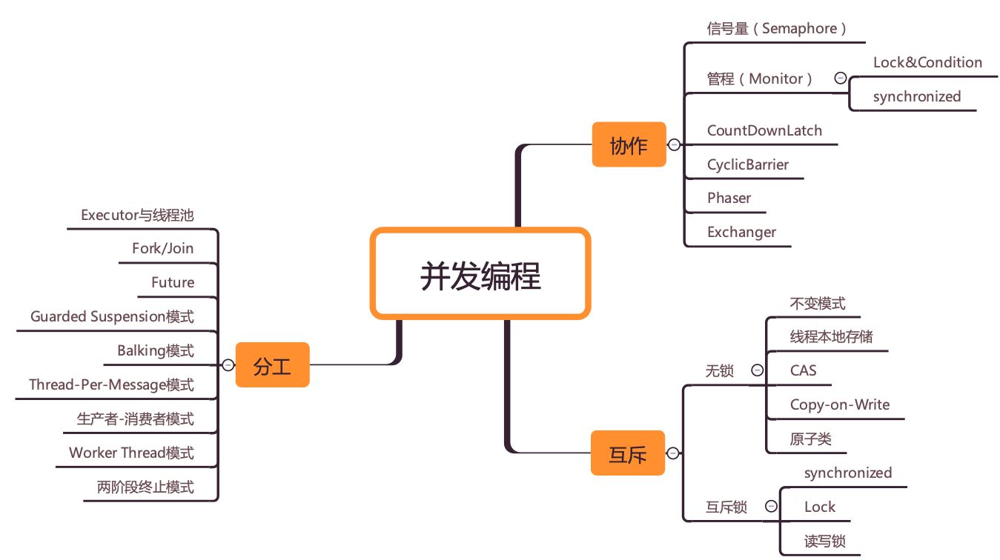

# 并发编程核心问题

源自于：[学习攻略 | 如何才能学好并发编程？ (geekbang.org)](https://time.geekbang.org/column/article/83267)

如果说并发编程最终的目的是提高任务的执行效率的话，其关注的核心问题可抽象为**分工**、**同步**和**互斥**。其中任务的分工是提高任务执行效率的前提，同步和互斥是不同任务安全有效执行的保障。

## 分工

分工可以简单理解为将一个任务更具某个维度拆分为不同的子任务，不同的子任务可以交给不同的角色执行。通过拆分，让更多的资源被调度起来，从而缩短了任务完成时间。不过我们还需要知道考虑到任务的复杂性，分工这件事或许本身就不容易；并且通过[阿姆达尔定律](https://zh.wikipedia.org/zh-hans/%E9%98%BF%E5%A7%86%E8%BE%BE%E5%B0%94%E5%AE%9A%E5%BE%8B)，我们也可以得知并不能通过无限地拆分任务来使任务的执行效率无限提高。

在并发编程领域，任务会分解到不同的线程去执行。

## 同步

分好工之后，就是具体执行了。在项目执行过程中，任务之间是有依赖的，一个任务的执行或许会依赖其他任务的执行结果，这个就是靠沟通协作了，这是一项很重要的工作。

在并发编程领域里的同步，主要指的就是线程间的沟通协作。

## 互斥

分工、同步主要强调的是性能，但并发程序里还有一部分是关于正确性的，用专业术语叫**线程安全**。

[线程安全](https://zh.wikipedia.org/wiki/%E7%BA%BF%E7%A8%8B%E5%AE%89%E5%85%A8)在维基百科中的描述为：线程安全是程式设计中的术语，指某个函数、函数库在多执行绪环境中被调用时，能够正确地处理多个线程之间的共享变量，使程序功能正确完成。

所谓互斥，指的是同一时刻，只允许一个线程访问共享变量。实现互斥的核心技术就是锁，但是锁可能存在性能问题，除此之外，还有一些其他的方案，原理是不共享变量或者变量只允许读。

## 总结

如果我们总结使用到的关于并发编程技术，可以发现它们都解决了分工、同步或互斥三个问题中一个或多个问题。

> 
>  图片来源自于极客时间专栏**《Java并发编程实践》**第一讲内容。