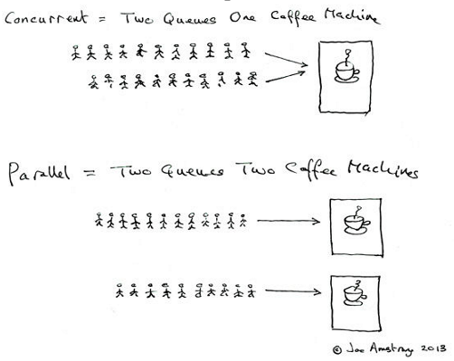

# 并发与并行

**并发**是指操作系统调度多线程时，将 CPU 运行时间划分成若干个时间段，再将时间段分配给各个线程执行。这样以来，在一个时间段内，多个线程就可以分时切换执行。

**并行**是指多个线程同时被不同的 CPU 调度执行，是真正意义上的同时。

Erlang 之父 Joe Armstrong 用一张5岁小孩都能看懂的图解释了并发与并行的区别：

## 总结

### 参考链接

- [并发与并行的区别是什么？ - 知乎 (zhihu.com)](https://www.zhihu.com/question/33515481)

