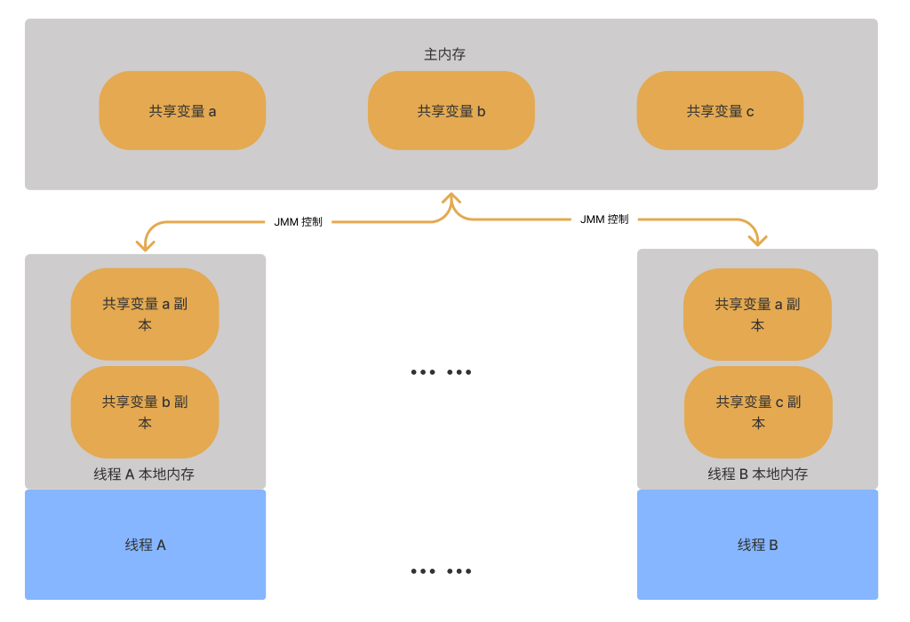
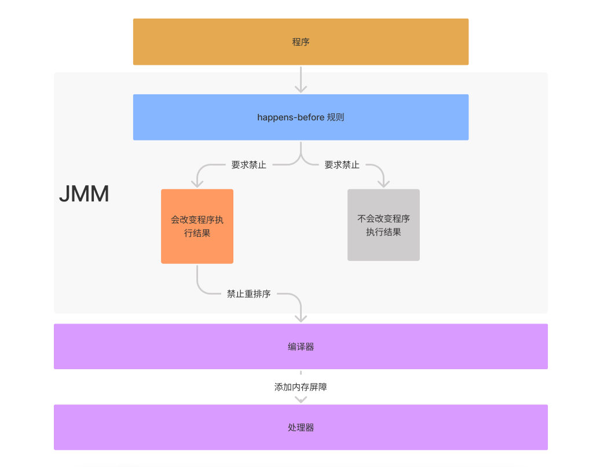

# Java 内存模型

**Java 内存模型（JMM, Java Memory Model）**是 Java 语言规范的一部分，原文地址为：[Chapter 17. Threads and Locks (oracle.com)](https://docs.oracle.com/javase/specs/jls/se15/html/jls-17.html)。

Java 中的线程用 Thread 对象表示，用户创建线程的唯一方法就是创建对象的实例。这样以来 Java 中的每个线程都和 Thread 的一个对象实例关联，当我们通过对象实例调用 `start()` 方法时，将会启动一个线程。

Java 内存模型用来明确了**多线程程序的语义**，它规定了那些值被更新时，其他线程可以通过读取共享内存来看到更新后的值。 

## 同步（synchronization）

Java 编程语言提供了多种线程间通信机制，这些方式中最基本的是同步，Java 中的同步（**synchronized**）是使用**管程**实现的。

具体来讲，在 Java 中每个加锁的对象都绑定着一个管程，线程访问加锁对象，就是去拥有一个管程的过程。**线程可以持有或者释放对象上的锁，但同时只能由一个线程能够持有对象上的锁，当一个线程去获取一个被其他线程占有的锁时，这个线程会被阻塞，直到其他线程释放了锁才有机会获取到锁并继续执行**。利用这样的互斥锁机制，我们就可以实现多个线程间的同步。


在 Java 中我们使用 **`synchronized`** 关键字来实现锁机制，控制多个线程对临界区的同步访问（或者叫保护临界区的共享资源），如下代码所示：

```java
/**
 * synchronized 关键字的使用，锁竞争。
 * <p>
 * 非静态方法使用 synchronized 修饰，相当于 synchronized(this)。
 * 静态方法使用 synchronized 修饰，相当于 synchronized(SynchronizedLock.class)。
 *
 * @see <a href="https://www.raychase.net/698">四火的唠叨.Java 多线程发展历史</a>
 */
@Slf4j
public class SynchronizedLock {

    private static final Object lock = new Object();

    /**
     * lock on an object
     */
    public void objectBlock() {
        synchronized (lock) {
            log.info("object block");
            sleep(2000);
        }
    }

    /**
     * lock on dynamic method，use this as lock.
     */
    public synchronized void dynamicMethod() {
        log.info("dynamic method");
        sleep(2000);
    }

    /**
     * lock on this
     */
    public void thisBlock() {
        synchronized (this) {
            log.info("this block");
            sleep(2000);
        }
    }

    /**
     * lock on static method，use SynchronizedLock.class as lock.
     */
    public static synchronized void staticMethod() {
        log.info("static method");
        sleep(2000);
    }

    /**
     * lock on the class
     */
    public void classBlock() {
        synchronized (SynchronizedLock.class) {
            log.info("static block");
            sleep(2000);
        }
    }

    private static void sleep(long millis) {
        try {
            Thread.sleep(millis);
        } catch (InterruptedException e) {
            e.printStackTrace();
        }
    }

    public static void main(String[] args) {
        SynchronizedLock lock = new SynchronizedLock();

        // object lock test
        new Thread(lock::dynamicMethod).start();
        // 可重入
        new Thread(lock::thisBlock).start();

        new Thread(lock::objectBlock).start();

        sleep(3000);
        System.out.println();

        // class lock test
        new Thread(SynchronizedLock::staticMethod).start();
        new Thread(lock::classBlock).start();
    }
}
```

`sychronized` 具有以下特征：

- Java 中的锁是基于对象的，每一个对象都可以作为一把锁，比如 一个 Object 对象、this 指向的当前对象或者一个 Class 对象等，锁的状态存放在**对象头**中；
- `synchronized` 可以使用对象来当作锁，并且使用代码块包裹一段代码，这段被包裹的代码就是临界区；
- `synchronized` 可以用在实例方法或静态方法上，此时方法内部的代码就是临界区；
- `synchrinized` 用在实例方法上会使用 this 作为锁对象，用在静态方法上，会使用 Class 对象作为锁对象；
- 当一个线程执行到 `synchronized` 的临界代码时，自动地执行加锁操作，当线程执行完临界区的代码正常退出，或者执行过程中出现错误异常退出时，会自动的执行解锁操作。
- `synchronized` 具有可重入性，即一次执行流程中，同一个线程可以不用阻塞，再次获得同一把对象锁。

## 等待队列和通知

在 Java 中每个加锁的对象都绑定着一个管程，我们知道管程拥有一个入口等待队列和内部若干个条件等待队列（**`synchronized` 内部只有一个条件等待队列**），其都存放的都是工作线程。

当一个对象被创建时，它默认的条件等待队列是空的，我们可以通过 `Object#wait`  将一个工作线程放入管程内部的条件等待队列，通过 `Object#notify`和 `Object#notifyAll` 来从等待队列中唤醒一个或多个工作线程。

在条件等待队列里的工作线程也会受到**线程中断**的影响，退出等待。

### 等待

当一个工作线程获取到锁开始执行临界区的代码，执行到 `Object#wait` 方法时，线程保留当前的上下文环境并进入管程内部的等待队列中，进入等待队列的线程将不被调度并进入休眠状态直到下面几种情况发生：

- 当有线程调用了锁对象的 `Object#notify` 方法；
- 当有线程调用了锁对象的 `Object#notifyAll` 方法；
- 当有线程调用了等待线程的 `Thread#interrupt` 方法；
- 当线程到达了指定的等待时间。

这时候等待线程将从该锁对象的等待队列中退出，重新开始竞争锁，竞争到锁后继续从调用 `Object#wait` 之后的代码开始执行。

> 注意：`Object#wait` 方法必须发生管程的内部，也就是说从编码上来讲，你只有在 `synchronized` 语句内部才调用 `Object#wait` 方法，否则将会抛出一个 
>`IllegalMonitorStateException` 异常。

### 通知

当一个线程在管程内部调用了 `Object#notify` 方法时，此时会选择一个在等待队列的工作线程退出线程（但无法保证选择等待队列中的那个线程），重新竞争锁。当调用了 `Object#notityAll` 方法，会从等待集合选择所有线程退出。

> 注意：`Object#notify`方法必须发生管程的内部，也就是说从编码上来讲，你只有在 `synchronized` 语句内部才调用 `Object#notify` 方法，否则将会抛出一个 `IllegalMonitorStateException` 异常。

### 中断

线程中断是为了让线程退出当前的执行环境，对于一个正在运行的线程，线程的退出应该是安全的，结果是可预期的。Java 中的中断是通过中断标志位来实现，运行中的状态可以主动去判断中断标志为来决定自己是否退出。

#### 设置中断

我们可以通过调用 `Thread#interrupt` 方法使线程产生中断（准确来讲是修改线程的中断标志为 true，比如，当我们在一个线程 t 中调用了线程 u 的中断方法，会设置线程 u 的中断标志为 true）。

#### 判断中断

我们可以通过调用 `Thread.isInterrupted` 方法来判断某个线程是否被中断；或者通过 `Thread#interrupted` 静态方法来判断当前线程是否被中断，并且会清除中断的标志。

#### 响应中断

我们已经知道，调用线程的 `Thread#interrupt` 方法修改线程的中断标志为 true。对于一个正在运行的线程，可以主动判断中断标志位退出当前执行环境，也就是说是否退出由当前执行的线程来决定，如果当前运行的线程没有响应中断，则会继续运行下去，如下所示：

```java
private static void interrupt() throws InterruptedException {
    Thread t = new Thread(() -> {
        while(true) {
            final Thread thread = Thread.currentThread();
            final boolean interrupted = thread.isInterrupted();
            System.out.println(thread.getName() + " is running, interrupted: " + interrupted);
            if (interrupted) {
                // 主动决定是否退出
                // break;
            }
        }
    });
    t.start();
    t.interrupt();
    t.join();
}
```

但对于一个在等待或者睡眠的线程而言，此时的线程是没有办法主动响应中断的，此时就需要提供一种机制使得线程在这种情况下可以响应中断。

对于那些会让线程等待或阻塞的方法（`Object#wait`、`Thread#join`、`Thread#sleep`），在方法声名时会有 `InterruptedException` 异常，当线程被中断时，会停止等待或阻塞，抛出异常，并**清除中断状态**。

```java
private static void interrupt() throws InterruptedException {
    Thread t = new Thread(() -> {
        try {
            // 线程中断时抛出 InterruptedException
            Thread.sleep(10000);
        } catch (InterruptedException e) {
            e.printStackTrace();
        }
    });
    t.start();
    t.interrupt();
    t.join();
}
```

等待队列中线程的中断更加特殊一点，若线程在管程内部的等待队列中，调用该线程的中断方法会使得该线程从等待队列退出，并且在该线程重新竞争到锁执行代码时，会抛 `InterruptException` 异常，同时清除自己的中断状态，而**不是立即抛出中断异常**。

```java
private static void interrupt() throws InterruptedException {
    final Object lock = new Object();
    Thread t = new Thread(() -> {
        synchronized (lock) {
            System.out.println("Thread 1 start.");
            try {
                lock.wait();
            } catch (InterruptedException e) {
                System.out.println("Thread 1 interrupted.");
                e.printStackTrace();
            }
        }
    });
    Thread t2 = new Thread(() -> {
        synchronized (lock) {
            System.out.println("Thread 2 start.");
            try {
                Thread.sleep(10000);
            } catch (InterruptedException e) {
                e.printStackTrace();
            }
            System.out.println("Thread 2 end.");
        }
    });
    t.start();
    Thread.sleep(2000);
    t2.start();
    Thread.sleep(2000);
    //Thread 2 结束，Thread 1 重新获取到锁时再抛出中断异常退出，而不是立即抛出异常退出	
    System.out.println("Interrupt Thead 1.");
    t.interrupt();
    t.join();
    t2.join();
}
```

## Sleep and Yield

`Thread#sleep` 方法使当前正在执行的线程在指定的持续时间内休眠（暂时停止执行），**线程不会失去任何监视器的所有权（不会释放锁）**。

`Thread#yield` 方法使当前线程让掉 CPU 的时间片，从运行中变成就绪状态，并重新竞争 CPU 的调度权。

需要注意的是 `Thread#sleep` 方法和 `Thread#yield` 方法都没有同步语义，编译器不必在调用 `Thread#sleep` 或 `Thread#yield` 之前将缓存在寄存器中的值刷新到共享内存中，也不必在调用 `Thread#sleep` 或 `Thread#yield` 后重新运行后加重新从内存加载值到寄存器中，如：

```java
public class Sleep {

    private boolean done;

    public void sleep() {
        while (!this.done) {
            System.out.println("Thread is running.");
            try {
                Thread.sleep(1000);
            } catch (InterruptedException e) {
                e.printStackTrace();
            }
        }
    }

    public static void main(String[] args) {
        Sleep sleep = new Sleep();
        sleep.sleep();
        sleep.done = true;
    }
}
```

如上述代码所示，编译器只读取 `this.done` 字段一次，并在每次执行循环时重用缓存的值（不会再次从内存中读取），这意味着循环永远不会终止，即使另一个线程更改了 `this.done` 的值。

## Java Memory Model

### Java 内存模型抽象

Java 中可以被多个线程共享的内存叫做共享内存或者堆内存，线程之间可以通过共享内存来进行通信。

Java 中，所有的实例字段、静态字段和数组元素都存放在堆内存中，局部变量、函数参数和异常处理器的参数不会再线程之间共享，它们不会有线程可见性问题，也不受 Java 内存模型的影响。


Java 线程之间的通信由 JMM 控制，它规定了共享变量被更新时，其他线程何时可以可见。从抽象的角度看，JMM 定义了线程和主内存之间的抽象关系：线程之间的共享变量存储在主内存中，每个线程都有一个私有的本地内存，本地内存存放了该线程读写共享变量的副本。

> 注意：这里的**线程本地内存**是 JMM 抽象的一个概念，并不真实存在，实际上它涵盖了 CPU 寄存器，CPU 多级缓存，WC 缓冲区等其他硬件和编译器的优化。

Java 内存模型抽象示意图如下：



如上图所示，线程 A 如果修改了共享变量 a 副本的值，需要在某些时刻将修改的值写回主内存中，线程 B 从主内存重新加载共享变量 a 的值到本地内存中，这样以来就达到了线程 A 和线程 B 通信的效果。

### 重排序

**即时编译器的优化可能将原本字段访问的执行顺序打乱**。若在单线程情况下，由于 **as-if-serial** 的保证，我们无需担心因为执行的顺序的重排序而导致结果的不可预期。

> **as-if-serial** 的语义指：不管怎么重新排序（编译器和处理器为了提高程序执行效率），**单线程**中程序的执行结果是一致的，否则就不允许重排序（数据存在依赖性，即重排单线程下两个操作的执行顺序，程序的执行结果就会改变）。
>
> 编译器、runtime 和处理器都必须遵循 as-if-serial 语义。
>
> 下面是一个重排序的例子：
>
> ```java
> int b=0;
> 
> public void method() {
> for (..) {
>  // Code without b.
>  b = 1;
>  // Code without b.
> }
> }
> ```
>
> 如上述代码所示，对 b 的赋值时与循环无关的，即时编译器很有可能将其移出循环之前，并且不会影响到程序的最终运行结果。

**as-if-serial 虽然可以保证单线程下程序结果的最终一致，但无法保证在多线程情况下程序结果的最终结果一致**，我们看下面一个例子：

```java
public class MemoryModel {

    private int a = 0;
    private int b = 0;

    public void method1() {
        int r2 = a;
        b = 1;
    }

    public void method2() {
        int r1 = b;
        a = 1;
    }
}
```

试想一下 (r1, r2) 可能有哪几种情况： 

- 若 method1 先执行，method2 后执行，此时的 (r1, r2) 为 (1, 0)；
- 若 method2 先执行，method1 后执行，此时的 (r1, r2) 为 (0, 1)；
- 若在并发条件下，method1 和 method2 分别同时执行到 `int r2 = a` 和 `int r1 = b`，此时的 (r1, r2) 为 (0, 0)。

假如上述代码 method1 方法中 `int r2 = a` 和 `b=1` 进行了重排，代码如下所示：

```java
public void method1() {
    b = 1;
    int r2 = a;
}
```

此时 (r1, r2) 可能的情况如下：

- 若 method1 先执行，method2 后执行，此时的 (r1, r2) 为 (1, 0)；
- 若 method2 先执行，method1 后执行，此时的 (r1, r2) 为 (0, 1)；

- 若在并发条件下，method1 执行到 `b=1` ，method2 执行完毕，此时的 (r1, r2) 为 (1, 1)。

可见，单线程情况下经过指令重排后结果和重排前是一致的，但在多线程情况下，因为数据的共享，出现的结果会不一致的情况。

### Happens-before Order

在 JMM 中，如果一个操作对另一个操作内存可见，那么这两个操作之间必须要存在 happens-before 关系。有了 happens-before 规则，应用程序开发者能够轻易地表达不同线程的操作之间的内存可见性。

> 这里的操作可以用一个四元组 `(t, k, v, u)` 来表示，其中：
>
> - t 表示执行该操作的线程；
> - k 表示操作的种类，比如读写变量，获取释放锁等；
> - v 表示线程操作涉及的变量；
> - u 表示该操作的唯一标识，即每次操作具有唯一性。
>
> 这里的操作既可以在线程发生在线程内部，也可以发生在线程之间。

常见的 happens-before 规则如下：

1. **程序顺序规则**：单个线程中的每个操作，happens-before 该线程中任意后续的操作；
2. **监视器锁规则**：监视器解锁操作 happens-before 之后（这里指时钟顺序先后）对同一把锁的加锁操作；
3. **volatile 变量规则**：volatile 变量的写操作 happens-before 之后（这里指时钟顺序先后）对同一字段的读操作；
4. **线程启动规则**：线程的启动操作 happens-before 该线程的第一个操作；
5. **线程中断规则**：线程对其他线程的中断操作 happens-before 被中断线程所收到的中断事件；
6. **线程 Join 规则**：一个线程中所有的操作 happens-before 其他线程调用该线程 `Thread#join` 方法的返回结果；
7. **对象初始化规则**：任何对象的默认初始化 happens-before 任何对该对象实例的其他操作（默认写入除外）。
8. **传递性规则**：happens-before 关系还具备传递性，即如果 `X happens-before Y`，`Y happens-before Z`，那么 `X happens-before Z`。

> 注意：两个操作之间具有 happens-before 关系，并不意味着前一个操作要在后一个操作之前执行。happens-before 仅仅要求前一个操作对后一个操作可见且前一个操作按顺序排在第二个操作之前。

有了 happens-before 规则之后，我们就可以利用这些规则去解决即时编译重排序的问题，还是那个例子：

```java
public class MemoryModel {

    private int a = 0;
    private int b = 0;

    public void method1() {
        int r2 = a;
        b = 1;
    }

    public void method2() {
        int r1 = b;
        a = 1;
    }
}
```

我们已经讨论了 `(r1, r2)` 的结果可能为 `(1, 0)`、`(0, 1)`、`(0, 0)`，考虑到即时编译的重排序还可能有 `(1, 1)` 这种情况，但出现这种情况是我们预期之外的，我们可以利用 volatile 来避免这种结果的出现：

```java
public class MemoryModel {

    private int a = 0;
    private volatile int b = 0;

    public void method1() {
        int r2 = a;
        b = 1;
    }

    public void method2() {
        int r1 = b;
        a = 1;
    }
}
```

根据线程内部的 happens-before 规则，我们可以知道  `int r2 = a` happens-before `b = 1`，`int r1 = b` happens before `a = 1`；

根据 volatile 变量的 happens-before 规则，我们知道线程间操作 `b = 1` happens-before `int r1 = b`；

最后根据 happens-before 规则的传递性，我们可以得到 `int r2 = a` happens-before `a = 1`。

### volatile

**volatile 变量自身具有以下特征**：

- 可见性：对于一个 volatile 变量的读，总能看到任意线程对这个 volatile 变量**最后的写**；

- 原子性：对 volatile 变量单个读写操作具有原子性，但类似于 a++ 这种复合操作不具有原子性。

  > 注：这里 volatile 原子性更多的是指对 double 和 long 单次操作的原子性（就 Java 内存模型而言，对于非 volatile 修饰的 double 和 long 变量的**写入操作**不是原子的，其在写入时分两次单独写入，每次写入 32 位）。

**volatile 内存的语义**：

- 当写一个 volatile 变量时，JMM 会把该线程对应本地内存的共享变量刷新到主内存中；
- 当读一个 volatile 变量时，JMM 会把线程对应本地内存置为无效，线程将从主内存获取共享变量。

**volatile 内存语义的实现**：

volatile 通过使用内存屏障禁止重排序来实现内存语义。

对于编译器而言，它会针对每一个 happens-before 关系，向正在编译的目标方法中插入相应的读读（LoadLoad）、读写（LoadStore）、写读（StoreLoad）以及写写（StoreStore）内存屏障来限制编译器的重排序操作。

对于处理器而言，即时编译器会根据具体的底层体系架构，将这些内存屏障替换成具体的 CPU 指令，这些 CPU 指令会导致缓存的刷新操作。

> 注：以我们日常接触的 X86_64 架构来说，读读、读写以及写写内存屏障是空操作（no-op），因为处理器本身就不允许这些情况下指令重排，只有写读内存屏障会被替换成具体指令。对于写读内存屏障，HotSpot 所选取的具体指令是 `lock add DWORD PTR [rsp],0x0`，而非 `mfence`，该具体指令的效果，可以简单理解为**强制刷新处理器的写缓存到主内存中，并将无效化其他处理器所持有的、指向同一内存地址的缓存行**。
>
> 也就是说，在 X86_64 平台上，只有 volatile 字段的写操作会强制刷新缓存，当写操作频繁时，这种刷新操作就会变得频繁而严重影响程序的性能，因此 volatile 变量适合用在读多写少的场景下。

插入的内存屏障如下所示：

<table>
   <tr>
      <td>内存屏障</td>
      <td>第二个操作</td>
      <td></td>
      <td></td>
      <td></td>
   </tr>
   <tr>
      <td>第一个操作</td>
      <td>Normal Load</td>
      <td>Normal Store</td>
      <td>Volatile Load MonitorEnter</td>
      <td>Volatile Store MonitorExit</td>
   </tr>
   <tr>
      <td>Normal Load</td>
      <td></td>
      <td></td>
      <td></td>
      <td>LoadStore</td>
   </tr>
   <tr>
      <td>Normal Store</td>
      <td></td>
      <td></td>
      <td></td>
      <td>StoreStore</td>
   </tr>
   <tr>
      <td>Volatile Load MonitorEnter</td>
      <td>LoadLoad</td>
      <td>LoadStore</td>
      <td>LoadLoad</td>
      <td>LoadStore</td>
   </tr>
   <tr>
      <td>Volatile Store MonitorExit</td>
      <td></td>
      <td></td>
      <td>StoreLoad</td>
      <td>StoreStore</td>
   </tr>
</table>

如上述表格所示：

- 在 volatile 读之后一定会有屏障，且屏障的类型针对后面的读写操作分别为 LoadLoad 和 LoadStore；
- 在 volatile 写之前一定会有屏障，且屏障的类型针对前面的读写操作分别为 LoadStore 和 StoreStore；
- 在 volatile 写和紧接着 volatile 读操作之间有 StoreLoad 屏障。


> 注：特别的，如果一个变量被 final 修饰，在 final 变量的写和读操作之间需要添加 StoreStore 屏障，如：
>
> ```
> x.finalField = v; 
> StoreStore; 
> sharedRef = x;
> ```

如下面代码：

```java
class X {
  int a, b;
  volatile int v, u;
  void f() {
    int i, j;
   
    i = a; // load a
    j = b; // load b
    i = v; // load v
   		   // 		LoadLoad
    j = u; // load u
   		   // 		LoadStore
    a = i; // store a
    b = j; // store b
   		   // 		StoreStore
    v = i; // store v
   		   // 		StoreStore
    u = j; // store u
   		   // 		StoreLoad
    i = u; // load u
   		   // 		LoadLoad
   		   // 		LoadStore
    j = b; // load b
    a = i; // store a
  }
}
```

### 锁（JUC 下的 Lock）

Java 并发编程的同步机制是通过锁来实现的。锁除了让临界区互斥外，还可以让释放锁的线程向获取同一把锁的线程发送消息。

**锁的内存语义**：

- 当一个线程释放锁时，JMM 会把该线程本地内存中的共享变量刷新到主内存中。

- 当一个线程获取锁时，JMM 会把该线程对应本地内存的值无效化，重新冲主内存中加载新的值。

**锁内存语义的实现**：

// ReentrantLock 实现

// AQS TODO ...

### final 

**final 字段的语义：**

final 实例字段涉及新建对象的发布问题。**当一个对象包含 final 实例字段时，我们希望在使用对象任意实例时，其中的 final 字段已经被正确的初始化了**。

新建对象的安全发布（safe publication）问题不仅仅包括 final 实例字段的可见性，还包括其他实例字段的可见性。当发布一个已初始化的对象时，我们希望所有已初始化的实例字段对其他线程可见。否则，其他线程可能见到一个仅部分初始化的新建对象，从而造成程序错误。

**final 字段语义的实现**：

JMM 规定在构造函数内部对一个引用变量的写入，与随后在构造函数外将构造出的对象赋值给一个共享变量，这两个操作不能重排序。因此即时编译器会在构造函数内 final 字段的写操作后插入一个写写屏障（SotreStore）。

> 注：在 X86_64 平台上，写写屏障是空操作。

如果 final 字段为引用类型：

在一个构造函数内对一个 final 引用对象**内部属性**的写入，与随后在构造函数外把构造出的对象赋值给一个引用变量，这两个操作不能重排序。

在 final 读操作时，初次读包含 final 变量的对象引用和读改引用的 final 变量，JMM 禁止处理器重排序这两个操作。编译器会在读 final 变量操作之前添加读读屏障（LoadLoad）。

### JMM 设计意图

从 JMM 设计者的角度来说，需要考虑两个关键因素：

- 程序员对内存模型的使用。程序员希望内存模型易于使用，易于编程。
- 编译器和处理器对内存模型的实现。编译器和处理器希望内存模型对他们的约束越少越好，这样它们就可以做更多的性能优化。

由于这两个因素是互相矛盾的，因此 JMM 在设计时需要找到一个平衡点。JMM 具体是怎么做的呢？

JMM 对于会改变程序允许结果的重排序，JMM 要求编译器和处理器必须禁止这种重排序；对于不会影响到程序运行结果的排序，编译器和处理器不做要求。

下面是 JMM 设计示意图：



如上图所示：

- JMM 向程序员提供 happens-before 规则来满足程序对内存可见性的需求。

- JMM 对编译器和处理器的约束尽量少，其遵循一个基本原则：只要不改变程序的运行结果（指的是单线程程序和正确同步的多线程程序），编译器和处理器可以重排序来优化程序执行效率。

  有时候从 happens-before 规则语义出发，是需要禁止重排序的，但 JMM 会根据实际的编译代码进行优化，去掉一些禁止重排的操作，比如：即时编译后的 `synchronized (new Object()) {}`，可能等同于空操作，JMM 不要求编译器为这样的代码添加内存屏障，不要求处理器强制刷新缓存。

### JMM 内存可见性保证

Java 程序的内存可见性保证按照程序类型可以分为以下三类：

- 单线程程序，单线程的程序不会出现可见性问题，编译器、runtime 和处理器会共同确保单线程程序的执行结果和该程序在顺序一致性模型中的执行结果相同；
- 正确同步的多线程程序，正确同步的多线程程序的执行结果和该程序在顺序一致性模型中的执行结果相同，这是 JMM 关注的重点，JMM 通过限制编译器和处理器重排序来为程序员提供内存可见性保证；
- 未同步或错误同步的多线程程序，JMM 为它们提供了最小安全保障，线程执行取到的值要么是之前某个线程写入的值，要么是默认值。

### double 和 long 的原子性

就 Java 内存模型而言，对于非 volatile 修饰的 double 和 long 变量的**写入操作**不是原子的。double 和 long 长度为 8 个字节（64 位），其在写入时分两次单独写入，每次写入 32 位。这可能导致线程从一次写入中看到了 64 位中的前 32 位，而从另一次写入中看到了另 32 位的情况。

对 volatile 修饰的 double 和 long 变量的写入和读取操作始终是原子的。

对引用的写入和读取操作始终是原子的，无论引用是作为 32 位还是 64 位实现的。

鼓励将 double 和 long 变量声名为 volatile，避免程序可能出现不可预期的结果，减少编码的心智负担。

## 总结

### 参考链接

1. [Java内存模型 (geekbang.org)](https://time.geekbang.org/column/article/13484).

2. [深入理解Java内存模型 - InfoQ](https://www.infoq.cn/minibook/java_memory_model).

   

   