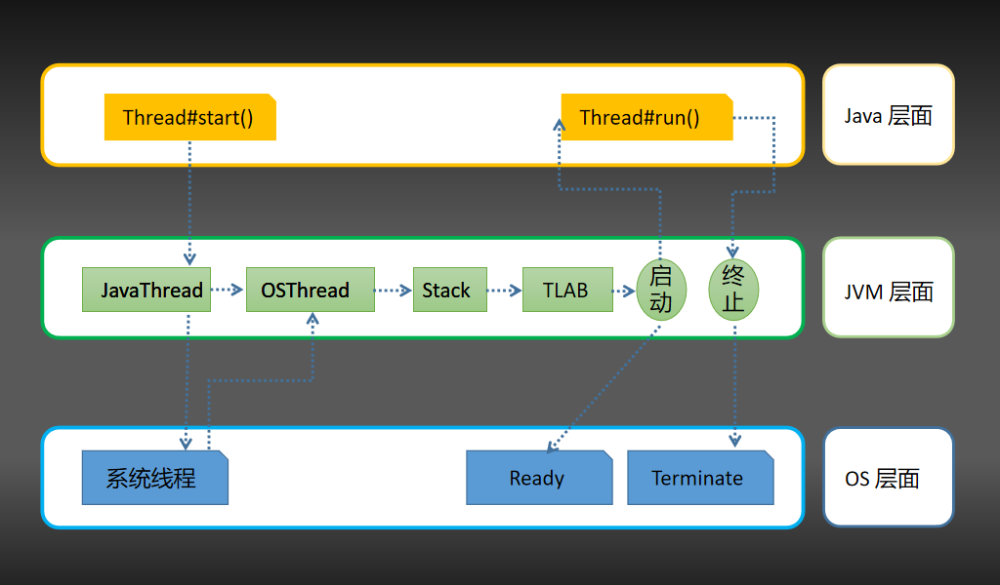
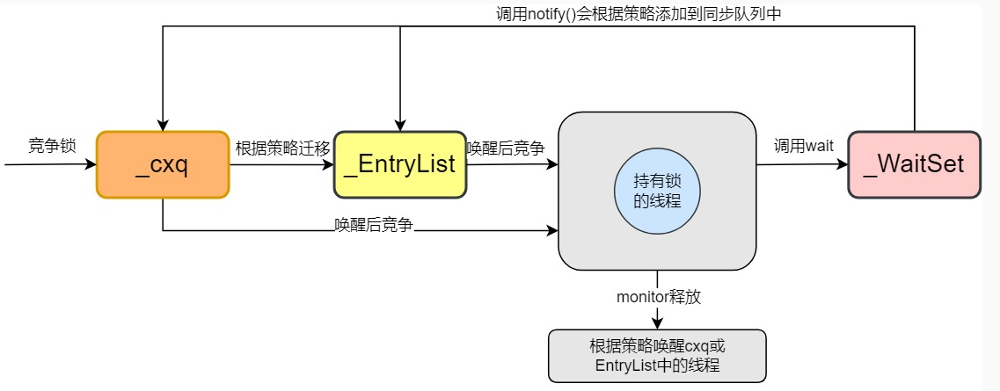
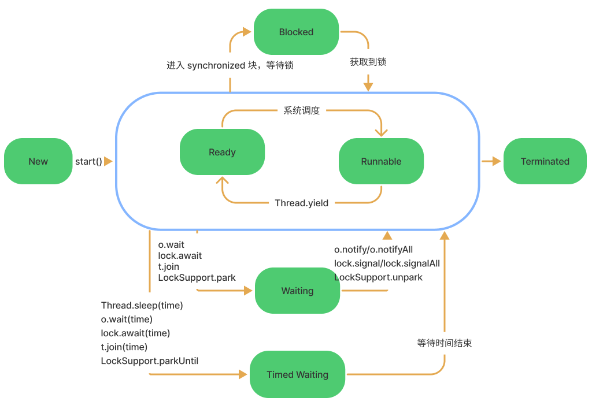

# Thread

Java 中的线程用 Thread 对象表示，用户创建线程的唯一方法就是创建对象的实例。这样以来 Java 中的每个线程都和 Thread 的一个对象实例关联，当我们通过对象实例调用 `start()` 方法时，将会启动一个线程。

## 线程创建

### 继承 Thread 类

同过继承 Thread 类，在实现 run 方法里书写线程执行逻辑。

```java
class PrimeThread extends Thread {

    int startValue;

    public PrimeThread(int startValue) {
        this.startValue = startValue;
    }

    @Override
    public void run() {
        int minPrime = computeMinPrime(startValue);
    }
    
    private int computeMinPrime(int startValue) {
        // 给定一个起始值，计算大于它的最小素数...
    }

    // 使用时
    public static void main(String[] args) {
        int startValue = 143;

        PrimeThread primeThread = new PrimeThread(startValue);
        primeThread.start();
    }
}
```

### 实现 Runnable 接口

通过实现 Runnable 接口，在实现 run 方法里书写线程执行逻辑。

```java
@Slf4j
class PrimeRun implements Runnable {

    int startValue;

    public PrimeRun(int startValue) {
        this.startValue = startValue;
    }

    @Override
    public void run() {
        int minPrime = computeMinPrime(startValue);
    }

    private int computeMinPrime(int num) {
		// 给定一个起始值，计算大于它的最小素数...
    }

    // 使用时
    public static void main(String[] args) {
        int startValue = 143;

        PrimeRun task = new PrimeRun(startValue);
        new Thread(task).start();
    }
}
```

### 实现 Callable 接口

实现 Callable 接口，并用 `FutureTask` 包装，创建一个异步执行任务的线程。

```java
@Slf4j
class PrimeCall implements Callable<Integer> {

    int startValue;

    public PrimeCall(int startValue) {
        this.startValue = startValue;
    }

    @Override
    public Integer call() throws Exception {
        int minPrime = computeMinPrime(startValue);
        return minPrime;
    }
    
    private int computeMinPrime(int num) {
       // 给定一个起始值，计算大于它的最小素数...
    }
    
    // 使用时
    public static void main(String[] args) {
        int startValue = 143;
        
        PrimeCall primeCall = new PrimeCall(startValue);
        FutureTask<Integer> futureTask = new FutureTask(primeCall);
        new Thread(futureTask).start();

        try {
            // 调用 get 方法同步等待执行结果
            Integer minPrime = futureTask.get(); // 149
        } catch (InterruptedException | ExecutionException e) {
            e.printStackTrace();
        }
    }
}
```

### Thread 创建过程



## Thread 状态

线程状态枚举：

```java
public enum State {  
    NEW,
    RUNNABLE,
    BLOCKED,
    WAITING,
    TIMED_WAITING,
    TERMINATED;
}
```

### NEW

```java
Thread t = new Thread();  
```

这个时候，线程 t 就处于新建状态，但他还不是“线程”。

### RUNNABLE

然后调用 start 方法：

```java
t.start();
```

调用 start 后，会执行一个 native 方法创建内核线程，以 linux 为例：

```java
private native void start0();

// 最后走到这
hotspot/src/os/linux/vm/os_linux.cpp  
pthread_create(...);  
```

这时候才有一个真正的线程创建出来，并即刻开始运行。

这个内核线程与线程 t 进行一对一映射。这时候 t 具备运行能力，进入 RUNNABLE 状态。 RUNNABLE 可以细分为 READY 和 RUNNING，两者的区别只是是否等待到了资源并开始运行。

处于 RUNNABLE 且未运行的线程，会进入一个就绪队列中，等待操作系统的调度。处于就绪队列的线程都在等待资源，这个资源可以是 cpu 的时间片、也可以是系统的 IO。 JVM 并不关心 READY 和 RUNNING 这两种状态，毕竟上述的枚举类都不对 RUNNABLE 进行细分。

### TERMINATED

当一个线程执行完毕（或者调用已经不建议的 stop 方法），线程的状态就变为 TERMINATED。进入TERMINATED后，线程的状态不可逆，无法再复活。

### 关于 BLOCKED、WAITING、TIMED_WAITING

BLOCKED、WAITING、TIMED_WAITING 都是带有同步语义的状态。

wait 方法的底层实现：

通过 object 获得 ObjectMonitor，将 Thread 封装成 ObjectWaiter 对象，然后 `addWaiter` 将它插入 `waitSet` 中，进入 waiting 或 timed_waiting 状态。最后释放锁，并通过底层的 `park` 方法挂起线程；

notify 方法的底层实现：

通过 object 获得 ObjectMonitor，调用 ObjectMonitor 的 `notify` 方法。这个 notify 最后会走到 `ObjectMonitor::DequeueWaiter` 方法，获取 `waitSet` 列表中的第一个 ObjectWaiter 节点。并根据不同的策略，将取出来的 ObjectWaite r节点，加入到 `EntryList `或 `cxq` 中。 `notifyAll `的实现类似于 `notify`，主要差别在多了个 for 循环。

`notify `和 `notifyAll` 并不会立即释放所占有的 ObjectMonitor 对象，其真正释放 ObjectMonitor 的时间点是在执行 `monitorexit` 指令。

一旦释放 `ObjectMonitor` 对象了，`entryList` 和 `cxq` 中的 ObjectWaiter 节点会依据 `QMode` 所配置的策略，通过 ExitEpilog 方法唤醒取出来的 ObjectWaiter 节点。被唤醒的线程，继续参与 monitor 的竞争。若竞争失败，重新进入 BLOCKED 状态，再回顾一下 monitor 的核心结构。



join、sleep、park

```java
public final synchronized void join(long millis) throws InterruptedException {  
    ...
  if (millis == 0) {
    while (isAlive()) {
      wait(0);
    }
  } else {
    while (isAlive()) {
      long delay = millis - now;
      if (delay <= 0) {
        break;
      }
      wait(delay);
      now = System.currentTimeMillis() - base;
    }
  }
}
```

`Thread.join` 的本质仍然是  `wait()` 方法。在使用 `join` 时，JVM会帮我们隐式调用 `notify`，因此我们不需要主动 `notify` 唤醒主线程。


`Thread.sleep` 在 jvm 层面上是调用 thread 中 `SleepEvent` 对象的 `park()` 方法实现阻塞线程，在此过程中会通过判断时间戳来决定线程的睡眠时间是否达到了指定的毫秒。

`park`、`unpark `方法也与同步语义无关。每个线程都与一个许可（permit）关联。`unpark` 函数为线程提供 permit，线程调用 `park` 函数则等待并消耗 permit。


下面是 Java Thread 状态转换图：




如上图所示，有以下操作可以改变线程状态：

- `Thread.start()`，线程进入准备状态，等待 CPU 的调度，而不是立即进入运行状态；

- `Thread.yield()`，当前线程放弃获取的 CPU 时间片，但**不释放锁**，由运行状态变为就绪状态，让 OS 再次选择线程调度；

- `Thread.sleep(long millis)`，当前程进入 TIMED_WAITING 状态，但**不释放锁**，指定时间后线程自动苏醒进入就绪状态；

- `t.join()/t.join(long millis)`，当前线程里调用其它线程的 join 方法，当前线程进入 WAITING/TIMED_WAITING 状态，**并且不会释放持有锁**，其它线程执行完毕退出时或者到达指定时间，唤醒当前线程进入就绪状态；

- `o.wait()/o.wait(times)`，在 synchronized 代码内部调用锁对象的 wait 方法，当前线程**释放锁**，进入等待队列；使用 `obj.notify()/obj.notifyAll()` 方法唤醒线程或者到时间自动唤醒，线程唤醒后从等待队列中出队，重新去竞争锁。

  > 注：`o.notify()` 唤醒在此对象监视器内等待队列中的任意一个线程，`o.notifyAll()` 唤醒在此对象监视器内等待队列中的所有线程。

- `LockSupport.park()`/`LockSupport.parkUntil(deadline)`，当前线程进入等待或超时等待状态，线程**不释放锁**；使用 `LockSupport.unpark(thread)` 方法可唤醒等待的线程。

```java
@Slfj
public class ThreadState {

    public static void main(String[] args) throws InterruptedException {
        // 线程的 NEW RUNNABLE TERMINATED 状态
        state1();
        // 线程的 WAITING TIMED_WAITING 状态
        state2();
        // 线程的 BLOCKED 状态
        state3();
        // JUC 下的锁，线程处于 WAITING 而不是 BLOCKED 状态
        state4();
        // await / signal
        state5();
        // System.in.read()
        state6();
    }

    private static void state1() throws InterruptedException {
        Thread t = new Thread(() -> {
            // RUNNABLE
            log.info("[{}] [{}]", 2, Thread.currentThread().getState());
        });
        t.setName("test");

        // NEW
        log.info("[{}] [{}]", 1, t.getState());
        t.start();
        t.join();
        // TERMINATED
        log.info("[{}] [{}]", 3, t.getState());
    }

    private static void state2() {
        Thread t = new Thread(() -> {
            LockSupport.park();
            log.info("{} continues to run.", Thread.currentThread().getName());
            sleepSeconds(2);
        });
        t.setName("test");
        t.start();

        sleepSeconds(1);
        // WAITING
        log.info("[{}] [{}]", 4, t.getState());

        LockSupport.unpark(t);
        sleepSeconds(1);
        // TIMED_WAITING
        log.info("[{}] [{}]", 5, t.getState());
    }

    private static void state3() {
        final Object lock = new Object();
        new Thread(() -> {
            synchronized (lock) {
                sleepSeconds(4);
            }
        }).start();


        Thread t = new Thread(() -> {
            synchronized (lock) {
                log.info("{} get lock.", Thread.currentThread().getName());
            }
        });
        t.setName("test");
        sleepSeconds(1);
        t.start();
        sleepSeconds(1);
        log.info("[{}] [{}]", 6, t.getState());
    }

    private static void state4() {
        final Lock lock = new ReentrantLock();
        new Thread(() -> {
            lock.lock();
            sleepSeconds(4);
            lock.unlock();
        }).start();

        Thread t = new Thread(() -> {
            lock.lock();
            log.info("{} get lock.", Thread.currentThread().getName());
            lock.unlock();
        });

        t.setName("test");
        sleepSeconds(1);
        t.start();
        sleepSeconds(1);
        // WAITING
        log.info("[{}] [{}]", 7, t.getState());
    }

    private static void state5() {
        final Lock lock = new ReentrantLock();
        Condition condition = lock.newCondition();
        Thread t = new Thread(() -> {
            lock.lock();
            try {
                // 进入等待队列，释放锁
                condition.await();
            } catch (InterruptedException e) {
                e.printStackTrace();
            }
            lock.unlock();
        });
        t.setName("test");
        t.start();
        sleepSeconds(1);
        // WAITING
        log.info("[{}] [{}]", 8, t.getState());
        lock.lock();
        condition.signalAll();
        lock.unlock();
        // RUNNABLE
        log.info("[{}] [{}]", 9, Thread.currentThread().getState());
        sleepSeconds(1);
        // TERMINATED
        log.info("[{}] [{}]", 10, t.getState());
    }

    private static void state6() {
        Thread t = new Thread(() -> {
            try {
                System.in.read();
            } catch (IOException e) {
                e.printStackTrace();
            }
        });
        t.setName("test");
        t.start();
        sleepSeconds(1);
        // RUNNABLE
        log.info("[{}] [{}]", 11, t.getState());
    }

    static void sleepSeconds(int second) {
        try {
            TimeUnit.SECONDS.sleep(second);
        } catch (InterruptedException e) {
            e.printStackTrace();
        }
    }
}
```


> 使用 socket 时，调用 accept，read 等阻塞方法时，线程处于什么状态？
>
> Java 线程处于 RUNNABLE 状态，OS 线程处于 WAITING 状态。因为在 JVM 层面，等待 CPU 时间片和等待 IO 资源是等价的。

## 总结

.JVM 线程状态不代表内核线程状态；

BLOCKED 的线程一定处于 entryList 或 cxq 中，而处于 WAITING 和 TIMED WAITING 的线程，可能是由于执行了 sleep 或 park 进入该状态，不一定在 waitSet中。也就是说，处于 BLOCKED 状态的线程一定是与同步相关。由这可延伸出，调用 jdk 的 lock 并获取不到锁的线程，进入的是 WAITING 或 TIMED_WAITING 状态，而不是 BLOCKED 状态。


