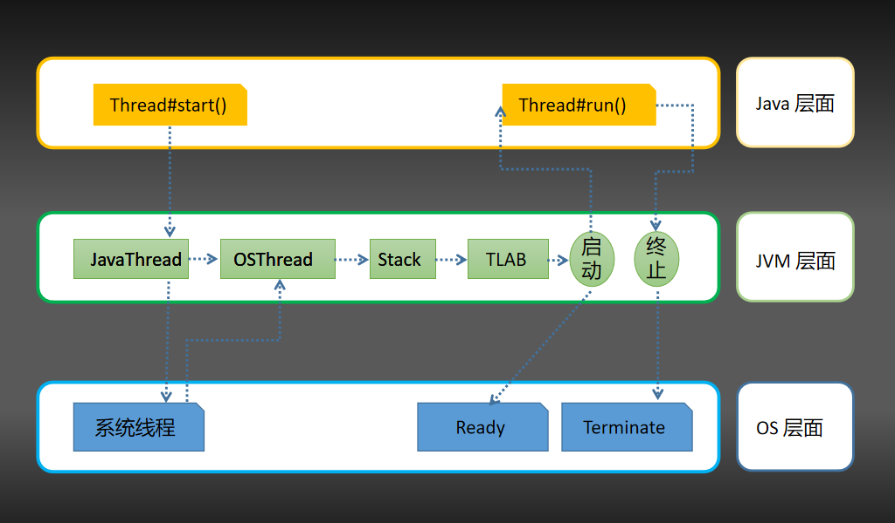
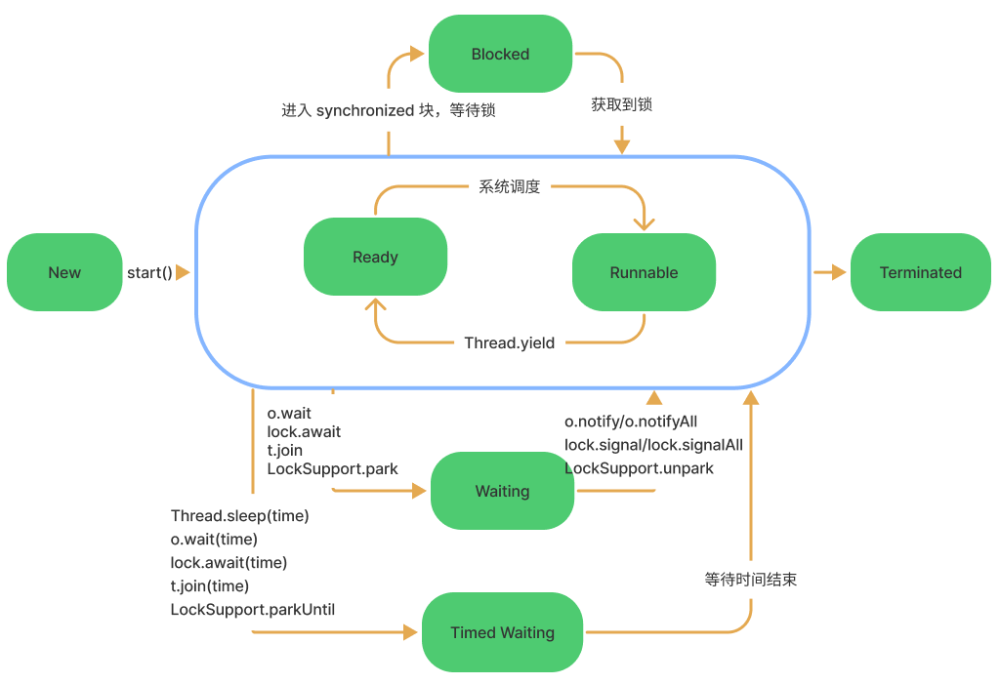

# Thread

Java 中的线程用 Thread 对象表示，用户创建线程的唯一方法就是创建对象的实例。这样以来 Java 中的每个线程都和 Thread 的一个对象实例关联，当我们通过对象实例调用 `start()` 方法时，将会启动一个线程。

## 线程创建

### 继承 Thread 类

同过继承 Thread 类，在实现 run 方法里书写线程执行逻辑。

```java
class PrimeThread extends Thread {

    int startValue;

    public PrimeThread(int startValue) {
        this.startValue = startValue;
    }

    @Override
    public void run() {
        int minPrime = computeMinPrime(startValue);
    }
    
    private int computeMinPrime(int startValue) {
        // 给定一个起始值，计算大于它的最小素数...
    }

    // 使用时
    public static void main(String[] args) {
        int startValue = 143;

        PrimeThread primeThread = new PrimeThread(startValue);
        primeThread.start();
    }
}
```

### 实现 Runnable 接口

通过实现 Runnable 接口，在实现 run 方法里书写线程执行逻辑。

```java
@Slf4j
class PrimeRun implements Runnable {

    int startValue;

    public PrimeRun(int startValue) {
        this.startValue = startValue;
    }

    @Override
    public void run() {
        int minPrime = computeMinPrime(startValue);
    }

    private int computeMinPrime(int num) {
		// 给定一个起始值，计算大于它的最小素数...
    }

    // 使用时
    public static void main(String[] args) {
        int startValue = 143;

        PrimeRun task = new PrimeRun(startValue);
        new Thread(task).start();
    }
}
```

### 实现 Callable 接口

实现 Callable 接口，并用 FutureTask 包装，创建一个异步执行任务的线程。

```java
@Slf4j
class PrimeCall implements Callable<Integer> {

    int startValue;

    public PrimeCall(int startValue) {
        this.startValue = startValue;
    }

    @Override
    public Integer call() throws Exception {
        int minPrime = computeMinPrime(startValue);
        return minPrime;
    }
    
    private int computeMinPrime(int num) {
       // 给定一个起始值，计算大于它的最小素数...
    }
    
    // 使用时
    public static void main(String[] args) {
        int startValue = 143;
        
        PrimeCall primeCall = new PrimeCall(startValue);
        FutureTask<Integer> futureTask = new FutureTask(primeCall);
        new Thread(futureTask).start();

        try {
            // 调用 get 方法同步等待执行结果
            Integer minPrime = futureTask.get(); // 149
        } catch (InterruptedException | ExecutionException e) {
            e.printStackTrace();
        }
    }
}
```

### Thread 创建过程



## Thread 状态



如上图所示，有以下操作可以改变线程状态：

- `Thread.start()`，线程进入准备状态，等待 CPU 的调度，而不是立即进入运行状态；

- `Thread.yield()`，当前线程放弃获取的 CPU 时间片，但**不释放锁**，由运行状态变为就绪状态，让 OS 再次选择线程调度；

- `Thread.sleep(long millis)`，当前程进入 TIMED_WAITING 状态，但**不释放锁**，指定时间后线程自动苏醒进入就绪状态；

- `t.join()/t.join(long millis)`，当前线程里调用其它线程的 join 方法，当前线程进入 WAITING/TIMED_WAITING 状态，**并且不会释放持有锁**，其它线程执行完毕退出时或者到达指定时间，唤醒当前线程进入就绪状态；

- `o.wait()/o.wait(times)`，在 synchronized 代码内部调用锁对象的 wait 方法，当前线程**释放锁**，进入等待队列；使用`obj.notify()/obj.notifyAll()` 方法唤醒线程或者到时间自动唤醒，线程唤醒后从等待队列中出队，重新去竞争锁。

  > 注：o.notify() 唤醒在此对象监视器内等待队列中的任意一个线程，o.notifyAll() 唤醒在此对象监视器内等待队列中的所有线程。

- LockSupport.park()/LockSupport.parkUntil(deadline)，当前线程进入等待或超时等待状态，线程**不释放锁**；使用 LockSupport.unpark(thread) 方法可唤醒等待的线程。

```java
@Slfj
public class ThreadState {

    public static void main(String[] args) throws InterruptedException {
        // 线程的 NEW RUNNABLE TERMINATED 状态
        state1();
        // 线程的 WAITING TIMED_WAITING 状态
        state2();
        // 线程的 BLOCKED 状态
        state3();
        // JUC 下的锁，线程处于 WAITING 而不是 BLOCKED 状态
        state4();
        // await / signal
        state5();
        // System.in.read()
        state6();
    }

    private static void state1() throws InterruptedException {
        Thread t = new Thread(() -> {
            // RUNNABLE
            log.info("[{}] [{}]", 2, Thread.currentThread().getState());
        });
        t.setName("test");

        // NEW
        log.info("[{}] [{}]", 1, t.getState());
        t.start();
        t.join();
        // TERMINATED
        log.info("[{}] [{}]", 3, t.getState());
    }

    private static void state2() {
        Thread t = new Thread(() -> {
            LockSupport.park();
            log.info("{} continues to run.", Thread.currentThread().getName());
            sleepSeconds(2);
        });
        t.setName("test");
        t.start();

        sleepSeconds(1);
        // WAITING
        log.info("[{}] [{}]", 4, t.getState());

        LockSupport.unpark(t);
        sleepSeconds(1);
        // TIMED_WAITING
        log.info("[{}] [{}]", 5, t.getState());
    }

    private static void state3() {
        final Object lock = new Object();
        new Thread(() -> {
            synchronized (lock) {
                sleepSeconds(4);
            }
        }).start();


        Thread t = new Thread(() -> {
            synchronized (lock) {
                log.info("{} get lock.", Thread.currentThread().getName());
            }
        });
        t.setName("test");
        sleepSeconds(1);
        t.start();
        sleepSeconds(1);
        log.info("[{}] [{}]", 6, t.getState());
    }

    private static void state4() {
        final Lock lock = new ReentrantLock();
        new Thread(() -> {
            lock.lock();
            sleepSeconds(4);
            lock.unlock();
        }).start();

        Thread t = new Thread(() -> {
            lock.lock();
            log.info("{} get lock.", Thread.currentThread().getName());
            lock.unlock();
        });

        t.setName("test");
        sleepSeconds(1);
        t.start();
        sleepSeconds(1);
        // WAITING
        log.info("[{}] [{}]", 7, t.getState());
    }

    private static void state5() {
        final Lock lock = new ReentrantLock();
        Condition condition = lock.newCondition();
        Thread t = new Thread(() -> {
            lock.lock();
            try {
                // 进入等待队列，释放锁
                condition.await();
            } catch (InterruptedException e) {
                e.printStackTrace();
            }
            lock.unlock();
        });
        t.setName("test");
        t.start();
        sleepSeconds(1);
        // WAITING
        log.info("[{}] [{}]", 8, t.getState());
        lock.lock();
        condition.signalAll();
        lock.unlock();
        // RUNNABLE
        log.info("[{}] [{}]", 9, Thread.currentThread().getState());
        sleepSeconds(1);
        // TERMINATED
        log.info("[{}] [{}]", 10, t.getState());
    }

    private static void state6() {
        Thread t = new Thread(() -> {
            try {
                System.in.read();
            } catch (IOException e) {
                e.printStackTrace();
            }
        });
        t.setName("test");
        t.start();
        sleepSeconds(1);
        // RUNNABLE
        log.info("[{}] [{}]", 11, t.getState());
    }

    static void sleepSeconds(int second) {
        try {
            TimeUnit.SECONDS.sleep(second);
        } catch (InterruptedException e) {
            e.printStackTrace();
        }
    }
}
```


