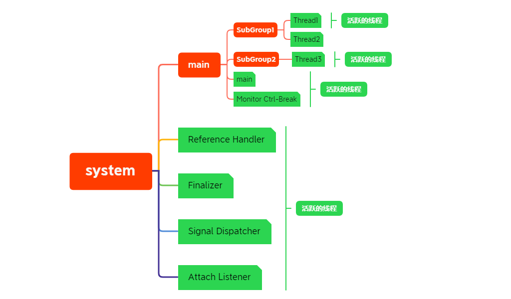

# 线程组

线程组简单来说是线程的集合，线程组是一个树状结构，线程组的出现是为了更好的统一管理部分线程，但更好的选择是使用线程池来自动帮助我们管理工作线程。

## 线程组与线程的优先级

如果某个线程优先级大于线程所在**线程组的最大优先级**，那么该线程的优先级将会失效，取而代之的是线程组的最大优先级。

> 注：在 Thread 类中有个 priority 属性，类型为 int，其表示线程优先级，最小为 1，最大为 10，默认为 5，数字越大优先级越高，通常，高优先级的线程将会比低优先级的线程有更高的几率得到执行。Java 中的线程和系统线程一一对应，线程的优先级也会映射到系统层面，除非特别需要，否则不要使用，避免线程饥饿。

## 线程组结构

线程组是一个树状结构，我们可以通过 `Thread#getThreadGroup` 方法获取线程所在组的信息，代码如下代码所示：

```java
@Slf4j
public class ThreadGroupTutorial {

    public static void main(String[] args) {
        ThreadGroup mainThreadGroup = Thread.currentThread().getThreadGroup();
        ThreadGroup systemThreadGroup = mainThreadGroup.getParent();
        log.info("MainThreadGroup's name is {}", mainThreadGroup.getName()); // main
        log.info("MainThreadGroup's parent name is {}", systemThreadGroup.getName()); // system
        ThreadGroup subGroup1 = new ThreadGroup("subGroup1");
        ThreadGroup subGroup2 = new ThreadGroup(subGroup1, "subGroup2");
        log.info("SubGroup1' parent name is {}", subGroup1.getParent().getName()); // main
        log.info("SubGroup2's parent name is {}", subGroup2.getParent().getName()); // subGroup1

        Thread t1 = new Thread(subGroup1, new ThreadInGroup(), "Thread1");
        Thread t2 = new Thread(subGroup1, new ThreadInGroup(), "Thread2");
        Thread t3 = new Thread(subGroup2, new ThreadInGroup(), "Thread3");
        t1.start();
        t2.start();
        t3.start();
        // 打印线程组相关信息
        systemThreadGroup.list();
        mainThreadGroup.list();
        subGroup1.list();
        subGroup2.list();
        // 当前线程组和子线程组活跃的线程数量
        log.info("ActiveCount : {}", systemThreadGroup.activeCount());
        // 当前线程组和子线程组活跃的线程组的数量
        log.info("ActiveGroupCount : {}", systemThreadGroup.activeGroupCount());
    }

    static class ThreadInGroup implements Runnable {
        @Override
        public void run() {
            try {
                Thread.sleep(1000);
            } catch (InterruptedException e) {
                e.printStackTrace();
            }
        }
    }
}
```

上述代码线程组结构，可用下面图表示：



## 为什么不推荐使用线程组

ThreadGroup 类，可以把线程归属到某一个线程组中，线程组中可以有线程对象， 也可以有线程组，组中还可以有线程，这样的组织结构有点类似于树的形式。 为什么不推荐使用？因为使用有很多的安全隐患吧，没有具体追究，推荐使用线程池来管理线程。