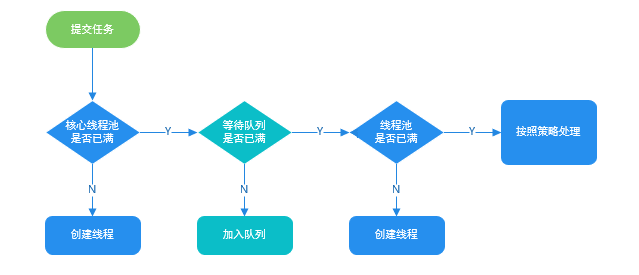

# 线程池

线程是一个重量级的对象，应该避免频繁创建和销毁。

为此，我们可以使用线程池来管理线程，使用线程池有以下好处：

- 降低资源消耗：创建和销毁线程需要消耗系统资源，线程池可以避免线程的频繁创建。
- 提高响应速度：任务到达时，无需等待线程创建即可立即执行。
- 控制并发数量：线程池可以控制并发数量，并发数量过多可能消耗过的的系统资源，严重情况下可能导致系统崩溃。
- 统一管理线程：线程池可以对线程进行统一的分配、调优和监控。

## Executor

线程池的顶层接口为 Executor，代码如下所示：

```java
public interface Executor {

    /**
     * Executes the given command at some time in the future.  The command
     * may execute in a new thread, in a pooled thread, or in the calling
     * thread, at the discretion of the {@code Executor} implementation.
     *
     * @param command the runnable task
     * @throws RejectedExecutionException if this task cannot be
     * accepted for execution
     * @throws NullPointerException if command is null
     */
    void execute(Runnable command);
}
```

从顶层的接口我们可以看出，用户在使用线程池只需要提交执行的任务即可，不需要关心线程的创建和任务的调度，而具体的线程创建和任务调度执行，由线程池内部实现。

线程池内部实现了任务的调度和线程的管理，任务管理充当生产者角色，控制任务的流转；线程管理部分充当消费者角色，工作线程被统一的维护在线程池内，根据创建线程池时设置好的参数，随着任务的不断提交动态地创建和销毁工作线程。

## 任务

执行任务需要实现的 **`Runnable` 接口** 或 **`Callable` 接口**。**`Runnable`  接口**或  **`Callable`  接口** 实现类都可以被  **`ThreadPoolExecutor`**  或 **`ScheduledThreadPoolExecutor`** 执行。

异步计算的结果(`Future`)

**`Future`**  接口以及  `Future`  接口的实现类  **`FutureTask`**  类都可以代表异步计算的结果。

当我们把 **`Runnable` 接口** 或 **`Callable` 接口** 的实现类提交给 **`ThreadPoolExecutor`** 或 **`ScheduledThreadPoolExecutor`** 执行。（调用 `submit()` 方法时会返回一个 **`FutureTask`** 对象）。

Executor 框架的使用流程：

- 主线程首先要创建实现 `Runnable` 或者 `Callable` 接口的任务对象。
- 把创建完成的实现 `Runnable`/`Callable`接口的 对象直接交给 `ExecutorService` 执行：
  - `ExecutorService.execute(Runnable command)`，执行不需要返回值的任务；
  - `ExecutorService.submit(Runnable task)`，提交有返回值为空的任务；
  - `ExecutorService.submit(Callable <T> task)`，提交有返回值为空的任务；
- `ExecutorService.submit` 将返回一个实现 `Future` 接口的对象，可以调用 `Future.get` 方法获取函数的执行结果。由于 `FutureTask` 实现了  `Runnable`，我们也可以创建 `FutureTask`，然后直接交给 `ExecutorService.execute` 执行。
- 最后，主线程可以执行 `Future.get()` 方法来等待任务执行完成。主线程也可以执行 `Future.cancel(boolean mayInterruptIfRunning)`来取消此任务的执行。

## `ThreadPoolExecutor` 

`ThreadPoolExecutor` 是线程池的一种实现，也是我们最常用的，其包含全部参数的构造器如下所示：

```java
public ThreadPoolExecutor(int corePoolSize,
                          int maximumPoolSize,
                          long keepAliveTime,
                          TimeUnit unit,
                          BlockingQueue<Runnable> workQueue,
                          ThreadFactory threadFactory,
                          RejectedExecutionHandler handler) {
    if (corePoolSize < 0 ||
        maximumPoolSize <= 0 ||
        maximumPoolSize < corePoolSize ||
        keepAliveTime < 0)
        throw new IllegalArgumentException();
    if (workQueue == null || threadFactory == null || handler == null)
        throw new NullPointerException();
    this.corePoolSize = corePoolSize;
    this.maximumPoolSize = maximumPoolSize;
    this.workQueue = workQueue;
    this.keepAliveTime = unit.toNanos(keepAliveTime);
    this.threadFactory = threadFactory;
    this.handler = handler;
}
```

这些参数的含义如下所示：

- `int corePoolSize` 核心线程数最大值

  线程池中有两类线程，核心线程和非核心线程。核心线程默认情况下会一直存在于线程池中，即使这个核心线程没有运作，而非核心线程如果长时间的闲置，就会被销毁。

- `int maximumPoolSize` 线程总数最大值

  该值等于核心线程数量 + 非核心线程数量。

  > corePoolSize 和 maximumPoolSize 设置相同值时会发生什么？
  > corePoolSize 和 maximumPoolSize 相等，意味着线程池只会创建核心线程，没有非核心线程。
  > 核心线程和非核心线程只是逻辑上的概念，对线程池来说都是工作线程，都作为当前线程池的工作线程数来进行调整，并没有使用额外的状态区分。

- `long keepAliveTime` 非核心线程闲置时间

  非核心线程如果处于闲置状态超过该值，就会被销毁，如果设置 `allowCoreThreadTimeOut(true)`，则会也作用于核心线程。

- `TimeUnit unit` 非核心线程闲置时间的单位； 

- `BlockingQueue workQueue` 阻塞队列

  用来存放用户执行 `execute(Runnable)` 方法提交的任务，线程池中常用的阻塞队列有：

  - `LinkedBlockingQueue` 链式阻塞队列，底层数据结构是链表，默认大小是 `Integer.MAX_VALUE`，也可以指定大小。
  - `ArrayBlockingQueue` 数组阻塞队列，底层数据结构是数组，需要指定队列的大小。
  - `SynchronousQueue` 同步队列，容量为 0，每个 put 操作必须等待一个 take 操作，反之亦然。

- `ThreadFactory threadFactory` 创建线程的工厂

  创建线程的工厂 ，用于批量创建线程，统一在创建线程时设置一些参数，如是否守护线程、线程的优先级等，如果不指定，会新建一个默认的线程工厂。

- `RejectedExecutionHandler handler` 拒绝处理策略

  当用户提交任务的速度超过线程池的处理能力的时候，会采用拒绝策略应对新提交的任务，线程池为我们提供了以下四种拒绝策略：

  - `ThreadPoolExecutor.AbortPolicy`：丢弃任务并抛出 `RejectedExecutionException` 异常，是线程池默认拒绝策略；
  - `ThreadPoolExecutor.DiscardPolicy`：丢弃新来的任务，但是不抛出异常；
  - `ThreadPoolExecutor.DiscardOldestPolicy`：丢弃队列头部（最旧的）的任务，然后重新尝试执行程序（如果再次失败，重复此过程）；
  - `ThreadPoolExecutor.CallerRunsPolicy`：由提交任务的线程来处理最新任务。

  用户也可以自定义拒绝策略，需要实现 `RejectedExecutionHandler` 接口，该接口如下所示：

  ```java
  public interface RejectedExecutionHandler {
  
      /**
       * Method that may be invoked by a {@link ThreadPoolExecutor} when
       * {@link ThreadPoolExecutor#execute execute} cannot accept a
       * task.  This may occur when no more threads or queue slots are
       * available because their bounds would be exceeded, or upon
       * shutdown of the Executor.
       *
       * <p>In the absence of other alternatives, the method may throw
       * an unchecked {@link RejectedExecutionException}, which will be
       * propagated to the caller of {@code execute}.
       *
       * @param r the runnable task requested to be executed
       * @param executor the executor attempting to execute this task
       * @throws RejectedExecutionException if there is no remedy
       */
      void rejectedExecution(Runnable r, ThreadPoolExecutor executor);
  }
  ```

## 任务管理

线程池的任务管理用来控制任务流传，包括任务提交、缓冲任务、获取任务和拒绝任务。

### 任务提交

任务调度主要通过 `ThreadPoolExecutor.execute` 方法实现，源代码如下所示：

```java
public void execute(Runnable command) {
    if (command == null)
        throw new NullPointerException();
   /*
    * Proceed in 3 steps:
    *
    * 1. If fewer than corePoolSize threads are running, try to
    * start a new thread with the given command as its first
    * task.  The call to addWorker atomically checks runState and
    * workerCount, and so prevents false alarms that would add
    * threads when it shouldn't, by returning false.
    *
    * 2. If a task can be successfully queued, then we still need
    * to double-check whether we should have added a thread
    * (because existing ones died since last checking) or that
    * the pool shut down since entry into this method. So we
    * recheck state and if necessary roll back the enqueuing if
    * stopped, or start a new thread if there are none.
    *
    * 3. If we cannot queue task, then we try to add a new
    * thread.  If it fails, we know we are shut down or saturated
    * and so reject the task.
    */
    int c = ctl.get();
    if (workerCountOf(c) < corePoolSize) {
        if (addWorker(command, true))
            return;
        c = ctl.get();
    }
    if (isRunning(c) && workQueue.offer(command)) {
        int recheck = ctl.get();
        if (! isRunning(recheck) && remove(command))
            reject(command);
        else if (workerCountOf(recheck) == 0)
            addWorker(null, false);
    }
    else if (!addWorker(command, false))
        reject(command);
}
```

上述代码的逻辑可分为以下几个步骤：

1. 如果 `workerCount < corePoolSize`，此时会尝试启动一个新的核心线程去执行这个任务；
2. 如果 `workerCount >= corePoolSize`，且线程池内的阻塞队列未满，则将任务添加到该阻塞队列中；
   1. 将任务成功添加到阻塞队列后，还需要再次检查当前线程池的状态是否能执行提交的任务，如果不可以，将任务从任务队列移除并拒绝任务；
   2. 如果线程池状态正常，并且线程池中无工作线程，创建一个工作线程；
3. 如果 `workerCount >= corePoolSize && workerCount < maximumPoolSize`，且线程池内的阻塞队列已满，则创建并启动一个线程来执行新提交的任务；
4. 如果 `workerCount >= maximumPoolSize`，并且线程池内的阻塞队列已满, 则根据拒绝策略来处理该任务。

> 从上述流程中我们也可以看到一个任务被拒绝的时机：
>
> 当任务提交后，阻塞队列已满，并且线程池创建的线程数达到 `maximumPoolSize` 则执行任务拒绝策略；
>
> 此外，如果任务提交到任务队列后，线程池关闭，也会将队列中的任务移除并执行拒绝策略。

上述过程可以用下面图表示：



### 任务缓冲

任务缓冲是线程池管理任务的核心部分，任务缓冲主要通过阻塞队列（`BlockingQueue`）来实现。来不及执行的任务会放到阻塞队列中等待线程管理模块调度执行，从而达到了任务缓冲的目的，当一个线程执行完回去阻塞队列里获取任务，从而达到了线程复用的目的。

缓冲队列的特性也间接影响着线程池的运行特征。

### 获取任务

线程池任务申请主要通过 `ThreadPoolExecutor#getTask` 方法实现，**这里的任务申请是指线程管理模块去阻塞队列申请可执行任务，而不是指在创建线程时直接由新创建的线程直接执行提交的任务**，源代码如下所示：

```java
private Runnable getTask() {
    boolean timedOut = false; // Did the last poll() time out?

    for (;;) {
        int c = ctl.get();

        // Check if queue empty only if necessary.
        if (runStateAtLeast(c, SHUTDOWN)
            && (runStateAtLeast(c, STOP) || workQueue.isEmpty())) {
            decrementWorkerCount();
            return null;
        }

        int wc = workerCountOf(c);

        // Are workers subject to culling?
        boolean timed = allowCoreThreadTimeOut || wc > corePoolSize;

        if ((wc > maximumPoolSize || (timed && timedOut))
            && (wc > 1 || workQueue.isEmpty())) {
            if (compareAndDecrementWorkerCount(c))
                return null;
            continue;
        }

        try {
            Runnable r = timed ?
                workQueue.poll(keepAliveTime, TimeUnit.NANOSECONDS) :
            workQueue.take();
            if (r != null)
                return r;
            timedOut = true;
        } catch (InterruptedException retry) {
            timedOut = false;
        }
    }
}
```

### 拒绝任务

任务拒绝保护线程池，避免被过多的任务压垮，当线程池中工作线程数量大于 `maximumPoolSize` 且任务缓冲队列已满时，若有新的任务被提交就会触发拒绝策略。拒绝任务的代码如下所示：

```java
final void reject(Runnable command) {
    handler.rejectedExecution(command, this);
}
```

这里的 handler 就是在创建线程池是用户指定的拒绝策略。

## 线程管理

除了任务管理外，线程池实现了对工作线程的管理。其实抛开任务管理不谈，线程池和其他对象池规格类似，主要就是增加池中的资源和回收池中的资源。

### Worker

线程池定义了一个私有的内部类 Worker 用来管理线程，部分代码如下所示：

```java
private final class Worker extends AbstractQueuedSynchronizer implements Runnable {
    // Worker 持有的线程
    final Thread thread;
    // 初始化的任务，可以为 null
    Runnable firstTask;
    // 每个线程完成任务计数器
    volatile long completedTasks;
}
```

从上述代码可以看出，Worker 作为线程池内部的工作线程，其主要有两个属性 `thread` 和 `firstTask`。

`thread` 是用来执行任务的实际线程，`firstTask` 是初始化任务，在创建 worker 时，如果指定了 firstTask，那么线程就会在启后立即执行这个任务；如果这个值是 null，那么就需要从阻塞队列中获取任务去执行。

### 增加 Worker

增加线程是通过线程池中的 `addWorker` 方法，该方法的功能就是增加一个线程，并使它运行，最后返回是否成功这个结果。该方法有 `firstTask`、`core`  两个参数。`firstTask` 参数用于指定新增 Worker 的初始化任务，该参数可以为空；core 参数为 true 表示当前的 Worker 作为核心线程增加，false 则表示作为非核心线程增加。

`addWorker` 方法代码如下所示：

```java
private boolean addWorker(Runnable firstTask, boolean core) {
    retry:
    for (;;) {
        int c = ctl.get();
        int rs = runStateOf(c);

        // Check if queue empty only if necessary.
        if (rs >= SHUTDOWN &&
            ! (rs == SHUTDOWN &&
               firstTask == null &&
               ! workQueue.isEmpty()))
            return false;

        for (;;) {
            int wc = workerCountOf(c);
            if (wc >= CAPACITY ||
                wc >= (core ? corePoolSize : maximumPoolSize))
                return false;
            if (compareAndIncrementWorkerCount(c))
                break retry;
            c = ctl.get();  // Re-read ctl
            if (runStateOf(c) != rs)
                continue retry;
            // else CAS failed due to workerCount change; retry inner loop
        }
    }

    boolean workerStarted = false;
    boolean workerAdded = false;
    Worker w = null;
    try {
        w = new Worker(firstTask);
        final Thread t = w.thread;
        if (t != null) {
            final ReentrantLock mainLock = this.mainLock;
            mainLock.lock();
            try {
                // Recheck while holding lock.
                // Back out on ThreadFactory failure or if
                // shut down before lock acquired.
                int rs = runStateOf(ctl.get());

                if (rs < SHUTDOWN ||
                    (rs == SHUTDOWN && firstTask == null)) {
                    if (t.isAlive()) // precheck that t is startable
                        throw new IllegalThreadStateException();
                    workers.add(w);
                    int s = workers.size();
                    if (s > largestPoolSize)
                        largestPoolSize = s;
                    workerAdded = true;
                }
            } finally {
                mainLock.unlock();
            }
            if (workerAdded) {
                t.start();
                workerStarted = true;
            }
        }
    } finally {
        if (! workerStarted)
            addWorkerFailed(w);
    }
    return workerStarted;
}
```

### 回收 Worker 

线程池中线程的销毁依赖 JVM 自动的回收，线程池做的工作是根据当前线程池的状态维护一定数量的线程引用，防止这部分线程被 JVM 回收，当线程池决定哪些线程需要回收时，只需要将其引用消除即可。Worker 被创建出来后，就会不断地进行轮询获取任务去执行，核心线程可以无限等待获取任务，非核心线程要限时获取任务。当 Worker 无法获取到任务，也就是获取的任务为空时，循环会结束，Worker 会主动消除自身在线程池内的引用。

```java
try {
  while (task != null || (task = getTask()) != null) {
    // 执行任务
  }
} finally {
  processWorkerExit(w, completedAbruptly); // 获取不到任务时，主动回收自己
}
```

Worker 具体回收是由 `ThreadPoolExecutor#processWorkerExit` 方法执行的，代码如下：

```java
private void processWorkerExit(Worker w, boolean completedAbruptly) {
    if (completedAbruptly) // If abrupt, then workerCount wasn't adjusted
        decrementWorkerCount();

    final ReentrantLock mainLock = this.mainLock;
    mainLock.lock();
    try {
        completedTaskCount += w.completedTasks;
        workers.remove(w);
    } finally {
        mainLock.unlock();
    }

    tryTerminate();

    int c = ctl.get();
    if (runStateLessThan(c, STOP)) {
        if (!completedAbruptly) {
            int min = allowCoreThreadTimeOut ? 0 : corePoolSize;
            if (min == 0 && ! workQueue.isEmpty())
                min = 1;
            if (workerCountOf(c) >= min)
                return; // replacement not needed
        }
        addWorker(null, false);
    }
}
```

### 执行任务

Worker 创建后，由 Worker 内的 thread 来执行用户提交的任务，Worker 本身实现了 Runnable 接口，其内部的 run 方法最终委托给了 `ThreadPoolExecutor#runWorker` 方法。

Worker 类中的 run 方法和其构造函数：

```java
 private final class Worker extends AbstractQueuedSynchronizer implements Runnable{
     /**
         * This class will never be serialized, but we provide a
         * serialVersionUID to suppress a javac warning.
         */
     private static final long serialVersionUID = 6138294804551838833L;

     /** Thread this worker is running in.  Null if factory fails. */
     final Thread thread;
     /** Initial task to run.  Possibly null. */
     Runnable firstTask;
     /** Per-thread task counter */
     volatile long completedTasks;

     // TODO: switch to AbstractQueuedLongSynchronizer and move
     // completedTasks into the lock word.

     /**
         * Creates with given first task and thread from ThreadFactory.
         * @param firstTask the first task (null if none)
         */
     Worker(Runnable firstTask) {
         setState(-1); // inhibit interrupts until runWorker
         this.firstTask = firstTask;
         this.thread = getThreadFactory().newThread(this);
     }

     /** Delegates main run loop to outer runWorker. */
     public void run() {
         runWorker(this);
     }
 }
```

`ThreadPoolExecutor#runWorker` 主要逻辑是获取任务并调用提交任务的 run 方法，代码如下所示：

```java
final void runWorker(Worker w) {
    Thread wt = Thread.currentThread();
    Runnable task = w.firstTask;
    w.firstTask = null;
    w.unlock(); // allow interrupts
    boolean completedAbruptly = true;
    try {
        while (task != null || (task = getTask()) != null) {
            w.lock();
            // If pool is stopping, ensure thread is interrupted;
            // if not, ensure thread is not interrupted.  This
            // requires a recheck in second case to deal with
            // shutdownNow race while clearing interrupt
            if ((runStateAtLeast(ctl.get(), STOP) ||
                 (Thread.interrupted() &&
                  runStateAtLeast(ctl.get(), STOP))) &&
                !wt.isInterrupted())
                wt.interrupt();
            try {
                beforeExecute(wt, task);
                Throwable thrown = null;
                try {
                    task.run();
                } catch (RuntimeException x) {
                    thrown = x; throw x;
                } catch (Error x) {
                    thrown = x; throw x;
                } catch (Throwable x) {
                    thrown = x; throw new Error(x);
                } finally {
                    afterExecute(task, thrown);
                }
            } finally {
                task = null;
                w.completedTasks++;
                w.unlock();
            }
        }
        completedAbruptly = false;
    } finally {
        processWorkerExit(w, completedAbruptly);
    }
}
```

## 线程池创建

JUC 提供的 `Executors` 工具类，提供了几种创建线程池的方法，常用的如下所示：

- `Executors.newFixedThreadPool`

  ```java
  public static ExecutorService newFixedThreadPool(int nThreads) {
          return new ThreadPoolExecutor(nThreads, nThreads,
                                        0L, TimeUnit.MILLISECONDS,
                                        new LinkedBlockingQueue<Runnable>());
  }
  ```

  创建一个线程数量固定的线程池（核心线程数量和总线程数量相等，所以只创建核心线程，不创建非核心线程），任务队列为 `LinkedBlockingQueue` ，默认大小为 `Integer.MAX_VALUE`。

  固定线程数量意味着，在任何时候，最多有 `nThreads` 个线程同时处理任务。如果池中的线程在执行过程中因失败而终止，则在执行后续任务时，会创建一个新的线程取代它。 除此之外，该线程池中的线程将一直存在，直到它被明确地 **shutdown** 。

  对于提交到该线程池中的任务，执行流程是这样的：

  - 对于最开始提交的任务，创建线程并执行，直到创建线程达到指定数量；
  - 当线程池中的线程达到指定数量后：
    - 对于线程，当核心线程都创建完毕并执行完任务后，都会去阻塞队列获取任务，若获取到任务则执行，没有获取到任务则阻塞等待有新的任务；
    - 对于任务，此时用户提交的任务直接入队，如果队列已满，则执行拒绝策略。

- `Executors.newSingleThreadExecutor`

  ```java
  public static ExecutorService newSingleThreadExecutor() {
      return new FinalizableDelegatedExecutorService
          (new ThreadPoolExecutor(1, 1,
                                  0L, TimeUnit.MILLISECONDS,
                                  new LinkedBlockingQueue<Runnable>()));
  }
  ```

  创建一个线程池，它使用单个工作线程在无界队列中运行。
  
  如果这个单线程在关闭之前由于执行失败而终止，如果需要执行后续任务，一个新线程将取代它。保证任务按顺序执行，并且不会超过一个任务处于活动状态在任何给定的时间。 
  
  和 `newFixedThreadPool(1) ` 等效。
  
- `Executors.newCachedThreadPool`

  ```java
  public static ExecutorService newCachedThreadPool() {
      return new ThreadPoolExecutor(0, Integer.MAX_VALUE,
                                    60L, TimeUnit.SECONDS,
                                    new SynchronousQueue<Runnable>());
  }
  ```

  创建一个线程池，用户每提交一个任务，会创建一个新的线程或从以前创建并且在有效期内未被回收中选择一个线程去执行任务。当需要执行很多**短时间**的任务时，线程复用率比较高时，可以使用该线程池。

  该线程池可以指定线程的存活时间，默认是 60 秒，即 60 秒内未使用的线程将被终止并从线程池中移除。

  该线程池使用的任务阻塞队列为 `SynchronousQueue`，这是一个容量为 0 的阻塞队列，每个 put 操作必须等待一个 take 操作，反之亦然。

  > CachedThreadPool 和 FixedThreadPool 区别？
  > 1. CachedThreadPool 只有非核心线程，FixedThreadPool 只拥有核心线程；
  > 2. 没有任务的情况下，CachedThreadPool 在获取任务的时非核心线程会被回收，而 FixedThreadPool 的所有核心线程都会被阻塞在任务缓冲队列，等待任务的提交。所以没有任务的情况下，CachedThreadPool 比 FixedThreadPool 更加节省资源。
  > 3. 都几乎不会触发拒绝策略，但是原理不同。FixedThreadPool 是因为阻塞队列可以很大，CachedThreadPool 是因为线程池中的线程数量可以很大。


- `Executors.newScheduledThreadPool`

  创建一个线程池，可用来定时执行任务。
  
  ```java
  public static ScheduledExecutorService newScheduledThreadPool(int corePoolSize) {
      return new ScheduledThreadPoolExecutor(corePoolSize);
  }
  
  //ScheduledThreadPoolExecutor():
  public ScheduledThreadPoolExecutor(int corePoolSize) {
      super(corePoolSize, Integer.MAX_VALUE,
            DEFAULT_KEEPALIVE_MILLIS, MILLISECONDS,
            new DelayedWorkQueue());
  }
  ```
  
  如每隔一秒执行一次任务：
  
  ```java
  public class ScheduledThreadPoolTutorial {
  
      public static void main(String[] args) {
          ScheduledExecutorService scheduledExecutorService = Executors.newSingleThreadScheduledExecutor();
          // 每隔一秒执行一次 
          scheduledExecutorService.scheduleAtFixedRate(ScheduledThreadPoolTutorial::doSomething, 0, 1, TimeUnit.SECONDS);
      }
  
      private static void doSomething() {
          System.out.println("Do something.");
      }
  }
  ```
  

## 查看线程运行状态

线程池本身提供了一些查看内部状态的 API，比如：

```java
public static void printThreadPoolStatus(ThreadPoolExecutor threadPool) {
    ScheduledExecutorService scheduledExecutorService = new ScheduledThreadPoolExecutor(1, createThreadFactory("print-images/thread-pool-status", false));
    scheduledExecutorService.scheduleAtFixedRate(() -> {
        log.info("=========================");
        log.info("ThreadPool Size: [{}]", threadPool.getPoolSize());
        log.info("Active Threads: {}", threadPool.getActiveCount());
        log.info("Number of Tasks : {}", threadPool.getCompletedTaskCount());
        log.info("Number of Tasks in Queue: {}", threadPool.getQueue().size());
        log.info("=========================");
    }, 0, 1, TimeUnit.SECONDS);
}
```

## 线程使用事项

### Executors 创建线程池的弊端

- **FixedThreadPool 和 SingleThreadExecutor** ： 允许请求的队列长度为 Integer.MAX_VALUE ，可能堆积大量的请求，从而导致 OOM。
- **CachedThreadPool 和 ScheduledThreadPool** ： 允许创建的线程数量为 Integer.MAX_VALUE ，可能会创建大量线程，从而导致 OOM。

所以建议使用 ThreadPoolExecutor 去创建线程池，避免 OOM。

自己定义阻塞队列来避免 OOM，具体可查看：[这个队列的思路是真的好，现在它是我简历上的亮点了 - 掘金 (juejin.cn)](https://juejin.cn/post/7105968458851942414)

使用线程池我们应该注意什么？

Executors 返回线程池对象的弊端如下：

- **FixedThreadPool 和 SingleThreadExecutor** ： 允许请求的队列长度为 Integer.MAX_VALUE ，可能堆积大量的请求，从而导致 OOM。
- **CachedThreadPool 和 ScheduledThreadPool** ： 允许创建的线程数量为 Integer.MAX_VALUE ，可能会创建大量线程，从而导致 OOM。

所以建议使用 ThreadPoolExecutor 去创建线程池，避免 OOM。

自己定义阻塞队列来避免 OOM，具体可查看：[这个队列的思路是真的好，现在它是我简历上的亮点了 - 掘金 (juejin.cn)](https://juejin.cn/post/7105968458851942414)

### 自定义拒绝策略

使用有界队列，当任务过多时，线程池会触发执行拒绝策略，默认情况下，线程池拒绝任务并抛出 RejectedExecutionException 运行时异常，对于运行时异常编译器并不强制 catch 它，所以开发人员很容易忽略。因此默认拒绝策略要慎重使用。如果线程池处理的任务非常重要，建议自定义自己的拒绝策略；并且在实际工作中，自定义的拒绝策略往往和降级策略配合使用。

### 多线程异常处理

使用线程池，还要注意异常处理的问题，例如通过 ThreadPoolExecutor 对象的 execute() 方法提交任务时，如果任务在执行的过程中出现运行时异常，会导致执行任务的线程终止。最致命的是任务虽然异常了，但是你却获取不到任何通知，这会让你误以为任务都执行得很正常。虽然线程池提供了很多用于异常处理的方法，但是最稳妥和简单的方案还是捕获所有异常并按需处理，你可以参考下面的示例代码：

```java
try {
    //业务逻辑
} catch (RuntimeException x) {
    //按需处理
} catch (Throwable x) {
    //按需处理
} 
```

### 线程池线程大小确定

- **CPU 密集型任务（N+1）：** 这种任务消耗的主要是 CPU 资源，可以将线程数设置为 N（CPU 核心数）+1，比 CPU 核心数多出来的一个线程是为了防止线程偶发的缺页中断，或者其它原因导致的任务暂停而带来的影响。一旦任务暂停，CPU 就会处于空闲状态，而在这种情况下多出来的一个线程就可以充分利用 CPU 的空闲时间。
- **I/O 密集型任务（2N）：** 这种任务应用起来，系统会用大部分的时间来处理 I/O 交互，而线程在处理 I/O 的时间段内不会占用 CPU 来处理，这时就可以将 CPU 交出给其它线程使用。因此在 I/O 密集型任务的应用中，我们可以多配置一些线程，具体的计算方法是 2N。

### 不同任务使用不同的线程池

具有父子关系的任务，使用同一个线程池导致死锁。

子任务放在缓冲队列中，而父任务在运行但需要等待子任务执行结束的结果，如果此时父任务将线程池中的线程用完了，子任务将永远得不到执行，因此产生永久阻塞。

## 总结

### 参考连接

- [Java线程池实现原理及其在美团业务中的实践 - 美团技术团队 (meituan.com)](https://tech.meituan.com/2020/04/02/java-pooling-pratice-in-meituan.html)

- [Java 线程池详解 | JavaGuide](https://javaguide.cn/java/concurrent/java-thread-pool-summary.html#_4-2-线程池原理分析)
