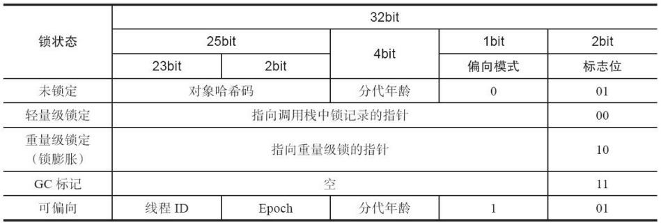
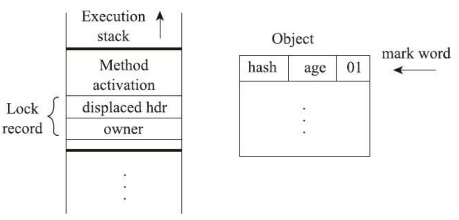
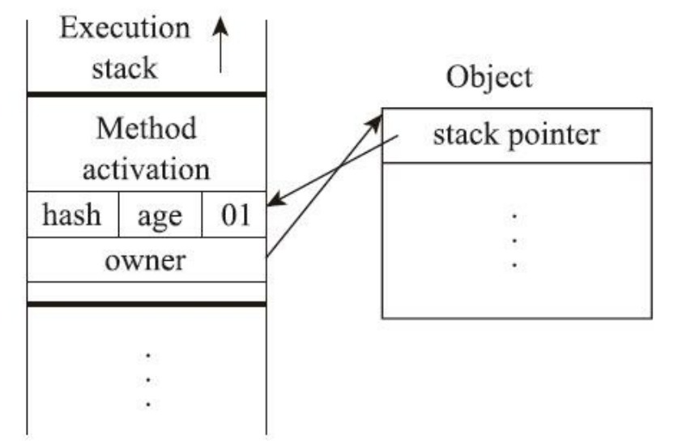
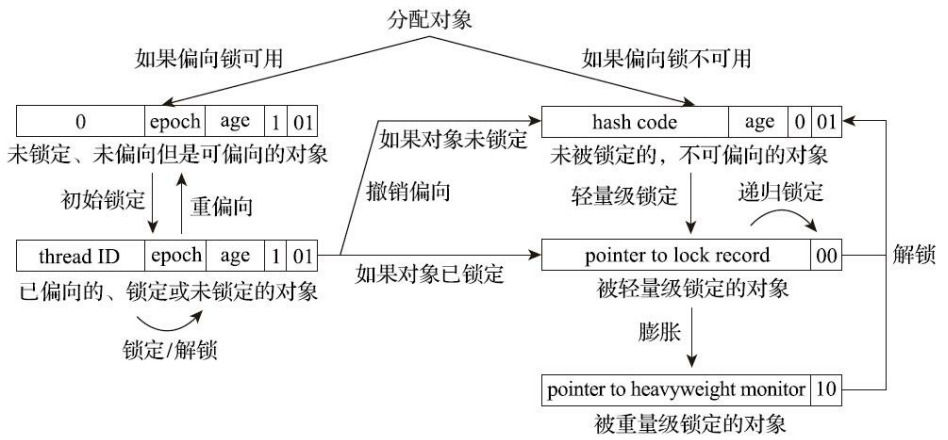

# 锁的正确使用姿势

并发大师 Doug Lea《Java 并发编程：设计原则与模式》一书中，推荐的三个用锁的最佳实践，它们分别是：

1. 永远只在更新对象的成员变量时加锁；
2. 永远只在访问可变的成员变量时加锁；
3. 永远不在调用其他对象的方法时加锁。

除此之外，我们知道锁可以保护临界区的共享资源，实现并发条件下，对临界区代码的串行执行。从保护共享资源的角度来讲，使用锁的时候有以下几点需要注意：

- 锁的过度使用可能导致串行化的范围过大，进而影响程序效率，这样就不能够发挥多线程的优势了，因此在使用锁时我们需要对于保护的资源进行精细化管理，使用不同的锁来分别保护相关的资源，降低锁的粒度，减少锁的持有时间；

- 减少锁的持有时间，除了降低锁的粒度外，对于超时的操作，尽量不要放到锁中执行；

- 对于锁保护的资源要能全部覆盖，如下面这个例子：

  ```java
  // 账户
  class Account {
    private int balance;
    // 转账
    synchronized void transfer(Account target, int amt){
      if (this.balance > amt) {
        this.balance -= amt;
        target.balance += amt;
      }
    } 
  }
  ```

  如上述代码，转账方法只能保护到本对象实例的 balance，对于 target.balance 是保护不上的。这是因为每个账户转账方法使用本身对象实例（this）作为锁，这意味着不可能存在同时有多个线程都会操作到同一个 target.balance，如果 target 这个账户是被多个线程共享的，就存在线程安全问题。这时候让不同线程能够用到同一把锁，就可以解决上述问题，如下：

  ```java
  // 账户
  class Account {
    private int balance;
    // 转账
    void transfer(Account target, int amt){
      synchronized(Account.class) {
        if (this.balance > amt) {
          this.balance -= amt;
          target.balance += amt;
        }
      }
    } 
  }
  ```

  这时候，所有的线程都已 `Account.class` 作为锁，实现了对 this.balance 和 target.balance 的同步访问。

  > 注：但就转账业务来将，将整个转账串行化处理是不合理的。

  更好的优化方式如下所示：

  ```java
  // 账户
  class Account {
    private int balance;
    // 转账
    void transfer(Account target, int amt){
      // 锁定转出账户
      synchronized(this) {              
        // 锁定转入账户
        synchronized(target) {           
          if (this.balance > amt) {
            this.balance -= amt;
            target.balance += amt;
          }
        }
      }
    } 
  }
  ```

  相对于 `Account.class` 对象，以实例对象作为锁粒度更小，但上述优化有死锁风险。

## 死锁

死锁是一种典型的线程活跃性问题，所谓活跃性问题是指线程在执行某个操作时因为某种原因而无法继续执行下去。

只有以下这四个条件都发生时才会出现死锁：

1. **互斥**，共享资源 X 和 Y 只能被一个线程占用；
2. **占有且等待**，线程 T1 已经取得共享资源 X，在等待共享资源 Y 的时候，不释放共享资源 X；
3. **不可抢占**，其他线程不能强行抢占线程 T1 占有的资源；
4. **循环等待**，线程 T1 等待线程 T2 占有的资源，线程 T2 等待线程 T1 占有的资源，就是循环等待。

预防死锁也是从这四个条件入手：

**破坏占有且等待**：从理论上来讲，只要一次性申请完所有的资源，就可以破坏这个条件，那上面的例子举例，可以增加一个账本管理员，负责给转账业务分配转账和入账资源：

```java
// 账本管理员
class Allocator {
  private List<Object> als = new ArrayList<>();
  // 一次性申请所有资源
  synchronized boolean apply (
    Object from, Object to){
    if(als.contains(from) || als.contains(to)){
      return false;  
    } else {
      als.add(from);
      als.add(to);  
    }
    return true;
  }
  // 归还资源
  synchronized void free(Object from, Object to){
    als.remove(from);
    als.remove(to);
  }
}

class Account {
  // actr应该为单例
  private Allocator actr;
  private int balance;
  // 转账
  void transfer(Account target, int amt) {
    // 一次性申请转出账户和转入账户，直到成功
    while(!actr.apply(this, target));
    try{
      // 锁定转出账户
      synchronized(this){              
        // 锁定转入账户
        synchronized(target){           
          if (this.balance > amt){
            this.balance -= amt;
            target.balance += amt;
          }
        }
      }
    } finally {
      actr.free(this, target)
    }
  } 
}
```

**破坏不可抢占条件**：就是让资源持有者主动释放资源，这一点 synchronized 做不到，JUC 下的 Lock 可以做到。

**破坏循环等待条件**：破坏这个条件，需要对资源进行排序，然后按序申请资源。

```java
// 账户
class Account {
  private int id;
  private int balance;
  // 转账
  void transfer(Account target, int amt) {
    Account left = this        
    Account right = target;    
    if (this.id > target.id) { 
      left = target;           
      right = this;            
    }                          
    // 锁定序号小的账户
    synchronized(left) {
      // 锁定序号大的账户
      synchronized(right){ 
        if (this.balance > amt){
          this.balance -= amt;
          target.balance += amt;
        }
      }
    }
  } 
}
```

## 活跃性问题

线程的活跃性除了死锁以外，还有活锁和饥饿这两类问题。

### 活锁

活锁和死锁不同的时，死锁会有两个或以上的线程等待锁的释放而处于阻塞状态，而活锁下的线程没有发生阻塞，但任然存在执行不下去的情况。举个例子，现实生活中路人甲从左手边出门，路人乙从右手边进门，两人为了不相撞，互相谦让，路人甲让路走右手边，路人乙也让路走左手边如此往复，这样路人甲进不了门，而路人乙也出不了门。现实生活中解决这种问题，很简单，只要有一个人谦让以下不动就行，可是如果这种情况发生在编程世界了，就有可能会一直没完没了地“谦让”下去，成为没有发生阻塞但依然执行不下去的“活锁”。

解决“活锁”的方案很简单，谦让时，尝试等待一个随机的时间就可以了。例如上面的那个例子，路人甲走左手边发现前面有人，并不是立刻换到右手边，而是等待一个随机的时间后，再换到右手边；同样，路人乙也不是立刻切换路线，也是等待一个随机的时间再切换。由于路人甲和路人乙等待的时间是随机的，所以同时相撞后再次相撞的概率就很低了。“等待一个随机时间”的方案虽然很简单，却非常有效，Raft 这样知名的分布式一致性算法中也用到了它。

### 饥饿

所谓“饥饿”指的是线程因无法访问所需资源而无法执行下去的情况。如果线程优先级“不均”，在 CPU 繁忙的情况下，优先级低的线程得到执行的机会很小，就可能发生线程“饥饿”；持有锁的线程，如果执行的时间过长，也可能导致“饥饿”问题。

解决“饥饿”问题的方案很简单，有三种方案：一是保证资源充足，二是公平地分配资源，三就是避免持有锁的线程长时间执行。

## 锁优化

### 自旋锁与自适应自旋

互斥同步对性能最大的影响是阻塞的实现，挂起线程和恢 复线程的操作都需要转入内核态中完成，这些操作给Java虚拟机的并发性能带来了很大的压力。同 时，虚拟机的开发团队也注意到在许多应用上，共享数据的锁定状态只会持续很短的一段时间，为了这段时间去挂起和恢复线程并不值得。

所以，如果物理机器有一个以上的处理器或者处理器核心，能让两个或以上的线程同时并行执行，我们 就可以让后面请求锁的那个线程“稍等一会”，但不放弃处理器的执行时间，看看持有锁的线程是否很 快就会释放锁。为了让线程等待，我们只须让线程执行一个忙循环（自旋），这项技术就是所谓的自 旋锁。

自旋锁在 JDK 1.4.2中就已经引入，只不过默认是关闭的，可以使用 `-XX:+UseSpinning` 参数来开 启，在 JDK 6中就已经改为默认开启了。自旋等待不能代替阻塞，且先不说对处理器数量的要求，自 旋等待本身虽然避免了线程切换的开销，但它是要占用处理器时间的，所以如果锁被占用的时间很 短，自旋等待的效果就会非常好，反之如果锁被占用的时间很长，那么自旋的线程只会白白消耗处理 器资源，而不会做任何有价值的工作，这就会带来性能的浪费。因此自旋等待的时间必须有一定的限 度，如果自旋超过了限定的次数仍然没有成功获得锁，就应当使用传统的方式去挂起线程。自旋次数的默认值是十次，用户也可以使用参数 `-XX:PreBlockSpin` 来自行更改。

不过无论是默认值还是用户指定的自旋次数，对整个Java虚拟机中所有的锁来说都是相同的。在 JDK 6中对自旋锁的优化，引入了自适应的自旋。自适应意味着自旋的时间不再是固定的了，而是由 前一次在同一个锁上的自旋时间及锁的拥有者的状态来决定的。如果在同一个锁对象上，自旋等待刚 刚成功获得过锁，并且持有锁的线程正在运行中，那么虚拟机就会认为这次自旋也很有可能再次成 功，进而允许自旋等待持续相对更长的时间。相反，如果对于某个锁，自 旋很少成功获得过锁，那在以后要获取这个锁时将有可能直接省略掉自旋过程，以避免浪费处理器资源。

### 锁消除

锁消除是指虚拟机即时编译器在运行时，对一些代码要求同步，但是对被检测到不可能存在共享 数据竞争的锁进行消除。锁消除的主要判定依据来源于逃逸分析的数据支持，如果判断到一段代码中，在堆上的所有数据都不会逃逸出去被其他线程访问到，那就可 以把它们当作栈上数据对待，认为它们是线程私有的，同步加锁自然就无须再进行。


我们也知道，由于 String 是一个不可变的类，对字符串的连接操作总是通过生成新的 String 对象来 进行的，因此 Javac 编译器会对 String 连接做自动优化。在JDK 5 之前，字符串加法会转化为 StringBuffer 对象的连续 append 操作，在 JDK 5及以后的版本中，会转化为 StringBuilder 对象的连续 append 操作。


比如下述代码：

```java
public String concatString(String s1, String s2, String s3) {
    return s1 + s2 + s3;
}
```

在 JDK 5 以前会被优化为：

```java
public String concatString(String s1, String s2, String s3) {
    StringBuffer sb = new StringBuffer();
    sb.append(s1);
    sb.append(s2);
    sb.append(s3);
    return sb.toString();
}
```

可以发现，`StringBuffer`  操作的变量都是线程私有的，其他线程无法访问到它，所以这里虽然有锁，但是可以被安全地消除掉。在解释执行时这里仍然会加锁，但在经过服务端编译器的即时编译之后，这段代码就会忽略所有的同步措施而直接执行。

### 锁粗化

原则上，我们在编写代码的时候，总是推荐将同步块的作用范围限制得尽量小——只在共享数据 的实际作用域中才进行同步，这样是为了使得需要同步的操作数量尽可能变少，即使存在锁竞争，等待锁的线程也能尽可能快地拿到锁。

大多数情况下，上面的原则都是正确的，但是如果一系列的连续操作都对同一个对象反复加锁和 解锁，甚至加锁操作是出现在循环体之中的，那即使没有线程竞争，频繁地进行互斥同步操作也会导致不必要的性能损耗。

比如上述 `StringBuffer` 操作就是如此，如果虚拟机探测到有这样一串零碎的操作 都对同一个对象加锁，将会把加锁同步的范围扩展（粗化）到整个操作序列的外部，以减少加锁的频率。

### 轻量级锁

轻量级是相对于使用操作系统互斥量来实现的传统锁而言的，因此传统的锁机制就被称为“重量级”锁。不过，需要强调一点，轻量级锁并不是用来代替重量级锁的，**它设计的初衷是在没有多线程竞争的前提下，减少传统的重量级锁使用操作系统互斥量产生的性能消耗**。

轻量级锁依赖对象头上锁的状态：




轻量级锁工作过程如下：

- 在代码即将进入同步块的时候，如果此同步对象没有被锁定（锁标志位为“01”状态），虚拟机首先将在当前线程的栈帧中建立一个名为锁记录（Lock Record）的空间，用于存储锁对象目前的 Mark Word 的拷贝。

  

- 然后，虚拟机将使用 CAS 操作尝试把对象的 Mark Word 更新为指向 Lock Record 的指针，并将Lock Record 里的 owner 指针指向对象的 Mark Word。

- 如果这个更新动作成功了，即代表该线程拥有了这个对象的锁，并且对象 Mark Word 的锁标志位（Mark Word 的最后两个比特）将转变为“00”，表示此对象处于轻量级锁定状态，这时候线程堆栈与对象头的状态如下所示：

  

- 如果这个更新操作失败了，那就意味着至少存在一条线程与当前线程竞争获取该对象的锁。虚拟机首先会检查对象的 Mark Word 是否指向当前线程的栈帧，如果是，说明当前线程已经拥有了这个对象的锁，那直接进入同步块继续执行就可以了，否则就说明这个锁对象已经被其他线程抢占了。如果出现两个以上的线程争用同一个锁的情况，那轻量级锁就不再有效，必须要膨胀为重量级锁，锁标志的状态值变为“10”，此时 Mark Word 中存储的就是指向重量级锁（互斥量）的指针，后面等待锁的线程也必须进入阻塞状态。
- 上面描述的是轻量级锁的加锁过程，它的解锁过程也同样是通过 CAS 操作来进行的，如果对象的 Mark Word 仍然指向线程的锁记录，那就用 CAS 操作把对象当前的 Mark Word 和线程中复制的 Displaced Mark Word 替换回来。假如能够成功替换，那整个同步过程就顺利完成了；如果替换失败，则说明有其他线程尝试过获取该锁，就要在释放锁的同时，唤醒被挂起的线程。

轻量级锁能提升程序同步性能的依据是“对于绝大部分的锁，在整个同步周期内都是不存在竞争 的”这一经验法则。如果没有竞争，轻量级锁便通过 CAS 操作成功避免了使用互斥量的开销；但如果确 实存在锁竞争，除了互斥量的本身开销外，还额外发生了 CAS 操作的开销。因此在有竞争的情况下，轻量级锁反而会比传统的重量级锁更慢。

### 偏向锁

**偏向锁是指一段同步代码一直被一个线程所访问，那么该线程会自动获取锁，降低获取锁的代价**。

在大多数情况下，锁总是由同一线程多次获得，不存在多线程竞争，所以出现了偏向锁。其目标就是在只有一个线程执行同步代码块时能够提高性能。

但偏向锁的撤销却是一个比较重的操作，如果撤销操作带来的损耗超超过了偏向锁带来的收益，那么偏向锁则失去了意义。


偏向锁流程：

当一个线程访问同步代码块并获取锁时，会在 Mark Word 里存储锁偏向的线程 ID。在线程进入和退出同步块时不再通过 CAS 操作来加锁和解锁，而是检测 Mark Word 里是否存储着指向当前线程的偏向锁。引入偏向锁是为了在无多线程竞争的情况下尽量减少不必要的轻量级锁执行路径，因为轻量级锁的获取及释放依赖多次 CAS 原子指令，而偏向锁只需要在置换 ThreadID 的时候依赖一次 CAS 原子指令即可。

偏向锁只有遇到其他线程尝试竞争偏向锁时，持有偏向锁的线程才会释放锁，线程不会主动释放偏向锁。偏向锁的撤销，需要等待全局安全点（在这个时间点上没有字节码正在执行），它会首先暂停拥有偏向锁的线程，判断锁对象是否处于被锁定状态。撤销偏向锁后恢复到无锁（标志位为“01”）或轻量级锁（标志位为“00”）的状态。


有的同学可能会问了，对象一开始不是无锁状态吗，为什么上述偏向锁逻辑没有判断**无锁状态的锁对象**（001）？

**只有匿名偏向的对象才能进入偏向锁模式**。偏向锁是延时初始化的，默认是 4000ms。初始化后会将所有加载的 Klass 的 prototype header 修改为匿名偏向样式。当创建一个对象时，会通过 Klass 的 prototype_header 来初始化该对象的对象头。简单的说，偏向锁初始化结束后，后续所有对象的对象头都为**匿名偏向**样式，在此之前创建的对象则为**无锁状态**。而对于无锁状态的锁对象，如果有竞争，会直接进入到轻量级锁。这也是为什么 JVM 启动前4秒对象会直接进入到轻量级锁的原因。

为什么需要延迟初始化？

JVM 启动时必不可免会有大量 sync 的操作，而偏向锁并不是都有利。如果开启了偏向锁，会发生大量锁撤销和锁升级操作，大大降低 JVM 启动效率。

因此，我们可以明确地说，**只有锁对象处于匿名偏向状态，线程才能拿到到我们通常意义上的偏向锁。而处于无锁状态的锁对象，只能进入到轻量级锁状态**。


偏向锁在 JDK 6 及以后的 JVM 里是默认启用的。可以通过 JVM 参数关闭偏向锁：`-XX:-UseBiasedLocking=false`，关闭之后程序默认会进入轻量级锁状态。

`匿名偏向状态`：锁对象 mark word 标志位为101，且存储的 `Thread ID` 为空时的状态（即锁对象为偏向锁，且没有线程偏向于这个锁对象）。

`prototype_header`：JVM 中的每个类有一个类似 `mark word` 的 `prototype_header`，用来标记该class的 `epoch` 和偏向开关等信息。

`Atomic::cmpxchg_ptr`：CAS 函数。这个方法有三个参数，依次为 `exchange_value`、`dest`、`compare_value`。如果 dest 的值为 `compare_value` 则更新为`exchange_value`，并返回 `compare_value`。否则，不更新并返回**实际原值**。




###  重量级锁

升级为重量级锁时，锁标志的状态值变为“10”，此时 Mark Word 中存储的是指向重量级锁的指针，此时等待锁的线程都会进入阻塞状态。

重量级锁通过对象内部的监视器（monitor）实现，其依赖于底层操作系统的 `Mutex Lock` 实现，需要额外的用户态到内核态切换的开销。

## 总结

在并发编程过程中，正确的使用锁十分重要，因为编码不当会导致线程相互持有对方的锁并等待导致死锁。死锁是一种很严重的线程活跃性问题，我们更加死锁的产生条件并可以通过破坏这些条件来解决死锁问题。

除了死锁外，活锁和饥饿这两种线程活跃性问题同样需要我们关注。活锁时，线程虽然不会像死锁一样处于阻塞状态，但是会因为相互“谦让”导致程序也无法继续执行，解决活锁的方法的办法很简单，就是线程在”谦让“时等待一个随机时间就好；线程饥饿往往是因为线程优先级不同导致高优先级的线程一直获取的执行机会，而低优先级的线程却迟迟等不到机会执行，这也是有的地方建议我们除非必要情况下不要给线程设置优先级，此外线程饥饿是因为低优先级的线程得不到可执行的资源，如果我们能够保证资源是充足的，也可以有效的避免线程饥饿问题。

拓展阅读：[Java 锁与线程的那些事 (youzan.com)](https://tech.youzan.com/javasuo-yu-xian-cheng-de-na-xie-shi/)

以上内容总结于极客时间《Java并发编程实践》：

- [03 | 互斥锁（上）：解决原子性问题 (geekbang.org)](https://time.geekbang.org/column/article/84344)
- [04 | 互斥锁（下）：如何用一把锁保护多个资源？ (geekbang.org)](https://time.geekbang.org/column/article/84601)
- [05 | 一不小心就死锁了，怎么办？ (geekbang.org)](https://time.geekbang.org/column/article/85001)
- [不可不说的 Java “锁”事 - 美团技术团队 (meituan.com)](https://tech.meituan.com/2018/11/15/java-lock.html)
